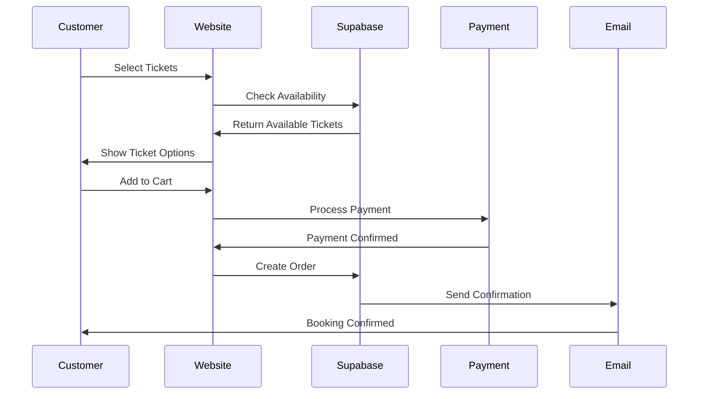

# 004 - EventOS Core Features

**Purpose:** Core MVP features, logic, and code explanations that form the foundation of the EventOS platform.

---

## 🎯 **Core Feature Overview**

EventOS MVP focuses on four essential features that provide immediate value to event organizers:

1. **Event Creation Wizard** - Streamlined 6-step event setup
2. **Real-time Dashboard** - Live event management interface
3. **Booking Management** - Automated ticket sales and attendee management
4. **Analytics & Reporting** - Data-driven insights and performance tracking

---

## 🧙‍♂️ **Event Creation Wizard**

### **Purpose**
Enable event organizers to create professional events in under 5 minutes with AI-powered content generation and smart defaults.

### **Implementation Steps**

#### **Step 1: Event Basics**
```typescript
// src/features/events/components/EventBasics.tsx
interface EventBasics {
  title: string;
  description: string;
  eventType: 'conference' | 'workshop' | 'networking' | 'webinar';
  category: string;
  tags: string[];
}

const EventBasics = () => {
  const { data, updateData } = useEventWizard();
  
  return (
    <div className="space-y-6">
      <Input
        label="Event Title"
        value={data.title}
        onChange={(value) => updateData({ title: value })}
        placeholder="Enter your event title"
      />
      
      <Textarea
        label="Description"
        value={data.description}
        onChange={(value) => updateData({ description: value })}
        placeholder="Describe your event"
      />
      
      <Select
        label="Event Type"
        value={data.eventType}
        onValueChange={(value) => updateData({ eventType: value })}
        options={EVENT_TYPES}
      />
    </div>
  );
};
```

#### **Step 2: Date & Time**
```typescript
// src/features/events/components/EventSchedule.tsx
interface EventSchedule {
  startDate: Date;
  endDate: Date;
  timezone: string;
  isRecurring: boolean;
  recurringPattern?: RecurringPattern;
}

const EventSchedule = () => {
  const { data, updateData } = useEventWizard();
  
  return (
    <div className="grid grid-cols-2 gap-4">
      <DatePicker
        label="Start Date"
        value={data.startDate}
        onChange={(date) => updateData({ startDate: date })}
      />
      
      <TimePicker
        label="Start Time"
        value={data.startTime}
        onChange={(time) => updateData({ startTime: time })}
      />
      
      <TimezoneSelect
        value={data.timezone}
        onChange={(tz) => updateData({ timezone: tz })}
      />
    </div>
  );
};
```

#### **Step 3: Venue Selection**
```typescript
// src/features/events/components/VenueSelection.tsx
const VenueSelection = () => {
  const { data, updateData } = useEventWizard();
  const { data: venues } = useVenues();
  
  return (
    <div className="space-y-4">
      <RadioGroup
        value={data.venueType}
        onValueChange={(type) => updateData({ venueType: type })}
      >
        <RadioGroupItem value="physical">Physical Venue</RadioGroupItem>
        <RadioGroupItem value="virtual">Virtual Event</RadioGroupItem>
        <RadioGroupItem value="hybrid">Hybrid Event</RadioGroupItem>
      </RadioGroup>
      
      {data.venueType === 'physical' && (
        <Select
          label="Select Venue"
          value={data.venueId}
          onValueChange={(id) => updateData({ venueId: id })}
          options={venues.map(v => ({ value: v.id, label: v.name }))}
        />
      )}
    </div>
  );
};
```

### **AI-Powered Content Generation**
```typescript
// src/features/events/hooks/useEventContentGeneration.ts
export const useEventContentGeneration = () => {
  const generateContent = async (eventData: Partial<Event>) => {
    const prompt = `
      Generate event content for:
      Title: ${eventData.title}
      Type: ${eventData.eventType}
      Description: ${eventData.description}
      
      Generate:
      1. Compelling event description
      2. Key talking points
      3. Target audience
      4. Marketing copy
    `;
    
    const response = await fetch('/api/generate-content', {
      method: 'POST',
      body: JSON.stringify({ prompt })
    });
    
    return response.json();
  };
  
  return { generateContent };
};
```

---

## 📊 **Real-time Dashboard**

### **Purpose**
Provide event organizers with a live, real-time view of their events, bookings, and performance metrics.

### **Dashboard Components**

#### **Main Stats Cards**
```typescript
// src/components/dashboard/StatsCards.tsx
const StatsCards = () => {
  const { data: stats } = useDashboardStats();
  
  return (
    <div className="grid grid-cols-1 md:grid-cols-4 gap-6">
      <StatsCard
        title="Upcoming Events"
        value={stats.upcomingEvents}
        change={stats.eventsChange}
        icon={<Calendar className="h-4 w-4" />}
      />
      
      <StatsCard
        title="Total Bookings"
        value={stats.totalBookings}
        change={stats.bookingsChange}
        icon={<Users className="h-4 w-4" />}
      />
      
      <StatsCard
        title="Revenue"
        value={formatCurrency(stats.revenue)}
        change={stats.revenueChange}
        icon={<DollarSign className="h-4 w-4" />}
      />
      
      <StatsCard
        title="Conversion Rate"
        value={`${stats.conversionRate}%`}
        change={stats.conversionChange}
        icon={<TrendingUp className="h-4 w-4" />}
      />
    </div>
  );
};
```

#### **Real-time Data Hook**
```typescript
// src/features/dashboard/hooks/useDashboardStats.ts
export const useDashboardStats = () => {
  const supabase = useSupabaseClient();
  
  const { data, isLoading, error } = useQuery({
    queryKey: ['dashboard-stats'],
    queryFn: async () => {
      const [eventsResult, bookingsResult, revenueResult] = await Promise.all([
        supabase.from('events').select('count').eq('status', 'published'),
        supabase.from('orders').select('count').eq('status', 'confirmed'),
        supabase.from('orders').select('total_amount').eq('status', 'confirmed')
      ]);
      
      return {
        upcomingEvents: eventsResult.count || 0,
        totalBookings: bookingsResult.count || 0,
        revenue: revenueResult.data?.reduce((sum, order) => sum + order.total_amount, 0) || 0
      };
    },
    refetchInterval: 30000 // Refresh every 30 seconds
  });
  
  // Real-time subscription
  useEffect(() => {
    const subscription = supabase
      .channel('dashboard-stats')
      .on('postgres_changes', 
        { event: '*', schema: 'public', table: 'orders' },
        () => {
          queryClient.invalidateQueries(['dashboard-stats']);
        }
      )
      .subscribe();
    
    return () => subscription.unsubscribe();
  }, [supabase]);
  
  return { data, isLoading, error };
};
```

---

## 🎫 **Booking Management System**

### **Purpose**
Automate ticket sales, payment processing, and attendee management with real-time updates.

### **Booking Flow**


### **Ticket Selection Component**
```typescript
// src/features/bookings/components/TicketSelection.tsx
const TicketSelection = ({ eventId }: { eventId: string }) => {
  const { data: tickets } = useEventTickets(eventId);
  const [selectedTickets, setSelectedTickets] = useState<Record<string, number>>({});
  
  const addTicket = (ticketId: string) => {
    setSelectedTickets(prev => ({
      ...prev,
      [ticketId]: (prev[ticketId] || 0) + 1
    }));
  };
  
  const removeTicket = (ticketId: string) => {
    setSelectedTickets(prev => {
      const newCount = Math.max(0, (prev[ticketId] || 0) - 1);
      if (newCount === 0) {
        const { [ticketId]: _, ...rest } = prev;
        return rest;
      }
      return { ...prev, [ticketId]: newCount };
    });
  };
  
  return (
    <div className="space-y-4">
      {tickets?.map(ticket => (
        <TicketCard
          key={ticket.id}
          ticket={ticket}
          quantity={selectedTickets[ticket.id] || 0}
          onAdd={() => addTicket(ticket.id)}
          onRemove={() => removeTicket(ticket.id)}
        />
      ))}
    </div>
  );
};
```

### **Payment Processing**
```typescript
// src/features/bookings/hooks/usePayment.ts
export const usePayment = () => {
  const processPayment = async (orderData: OrderData) => {
    try {
      // Create payment intent with Stripe
      const { data: paymentIntent } = await supabase.functions.invoke('create-payment-intent', {
        body: {
          amount: orderData.totalAmount * 100, // Convert to cents
          currency: 'usd',
          orderId: orderData.id
        }
      });
      
      // Confirm payment with Stripe
      const { error } = await stripe.confirmPayment({
        clientSecret: paymentIntent.client_secret,
        elements,
        confirmParams: {
          return_url: `${window.location.origin}/booking/success`
        }
      });
      
      if (error) throw error;
      
      return { success: true };
    } catch (error) {
      console.error('Payment failed:', error);
      return { success: false, error: error.message };
    }
  };
  
  return { processPayment };
};
```

---

## 📈 **Analytics & Reporting**

### **Purpose**
Provide event organizers with actionable insights and performance metrics to optimize their events.

### **Analytics Dashboard**
```typescript
// src/features/analytics/components/AnalyticsDashboard.tsx
const AnalyticsDashboard = ({ eventId }: { eventId: string }) => {
  const { data: analytics } = useEventAnalytics(eventId);
  
  return (
    <div className="space-y-6">
      <div className="grid grid-cols-1 lg:grid-cols-2 gap-6">
        <RevenueChart data={analytics?.revenue} />
        <AttendanceChart data={analytics?.attendance} />
      </div>
      
      <div className="grid grid-cols-1 lg:grid-cols-3 gap-6">
        <ConversionMetrics metrics={analytics?.conversion} />
        <AudienceInsights insights={analytics?.audience} />
        <PerformanceMetrics metrics={analytics?.performance} />
      </div>
    </div>
  );
};
```

### **Analytics Data Hook**
```typescript
// src/features/analytics/hooks/useEventAnalytics.ts
export const useEventAnalytics = (eventId: string) => {
  return useQuery({
    queryKey: ['event-analytics', eventId],
    queryFn: async () => {
      const [
        revenueData,
        attendanceData,
        conversionData
      ] = await Promise.all([
        supabase
          .from('orders')
          .select('total_amount, created_at')
          .eq('event_id', eventId)
          .eq('status', 'confirmed'),
        
        supabase
          .from('orders')
          .select('created_at, quantity')
          .eq('event_id', eventId)
          .eq('status', 'confirmed'),
        
        supabase
          .from('event_views')
          .select('viewed_at, converted')
          .eq('event_id', eventId)
      ]);
      
      return {
        revenue: processRevenueData(revenueData.data),
        attendance: processAttendanceData(attendanceData.data),
        conversion: processConversionData(conversionData.data)
      };
    }
  });
};
```

---

## ✅ **Feature Validation**

### **Success Criteria**
- ✅ Event creation completed in under 5 minutes
- ✅ Real-time dashboard updates within 2 seconds
- ✅ Payment processing success rate > 99%
- ✅ Analytics data accuracy > 95%

### **Testing Commands**
```bash
# Test event creation flow
npm run test:e2e -- --grep "Event Creation"

# Test dashboard real-time updates
npm run test:e2e -- --grep "Dashboard"

# Test booking flow
npm run test:e2e -- --grep "Booking"

# Test analytics accuracy
npm run test:unit -- --grep "Analytics"
```

---

**Next Step:** Review [005-intermediate-workflows.md](005-intermediate-workflows.md) to understand automation and data flows.

---

**Generated:** 2025-01-17  
**Version:** MVP 1.0  
**Status:** Core Features Complete
