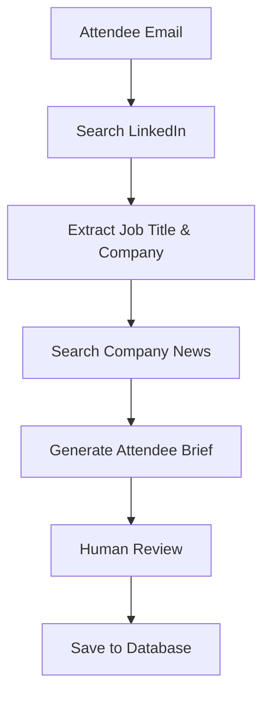

# EventOS Feature Implementation Plan

## Executive Summary

This document outlines a simple, phased approach to implementing the missing features identified in the Airtable comparison analysis. The plan focuses on **quick wins first**, using CopilotKit to accelerate AI feature development.

**Timeline:** 8 weeks (2-month sprint)
**Team:** 2-3 developers
**Approach:** Ship incrementally, test with real users, iterate based on feedback

---

## Phase 1: Foundation (Week 1-2)

### Priority: Fix Critical Schema Gaps

#### 1.1 Add Sessions/Agenda Table (Week 1, Days 1-2)
```sql
-- Simple schema, expand later if needed
CREATE TABLE sessions (
  id UUID PRIMARY KEY DEFAULT gen_random_uuid(),
  event_id UUID NOT NULL REFERENCES events(id) ON DELETE CASCADE,
  name VARCHAR(200) NOT NULL,
  description TEXT,
  session_type VARCHAR(50) DEFAULT 'talk',
  start_time TIMESTAMPTZ NOT NULL,
  end_time TIMESTAMPTZ NOT NULL,
  room VARCHAR(100),
  capacity INTEGER,
  speakers TEXT[], -- Simple array for MVP
  created_at TIMESTAMPTZ DEFAULT now(),
  updated_at TIMESTAMPTZ DEFAULT now()
);

CREATE INDEX idx_sessions_event_id ON sessions(event_id);
CREATE INDEX idx_sessions_start_time ON sessions(start_time);
```

**Implementation:**
- Add Supabase migration
- Create TypeScript types
- Build basic CRUD API endpoints
- Add to Event Wizard Stage 3 (optional agenda builder)

**Outcome:** Events can have agendas/schedules

---

#### 1.2 Add Event Attachments (Week 1, Days 3-4)
```sql
CREATE TABLE event_attachments (
  id UUID PRIMARY KEY DEFAULT gen_random_uuid(),
  event_id UUID NOT NULL REFERENCES events(id) ON DELETE CASCADE,
  file_name VARCHAR(255) NOT NULL,
  file_url TEXT NOT NULL,
  file_type VARCHAR(50),
  file_size_bytes INTEGER,
  uploaded_by UUID REFERENCES auth.users(id),
  created_at TIMESTAMPTZ DEFAULT now()
);

CREATE INDEX idx_attachments_event_id ON event_attachments(event_id);
```

**Implementation:**
- Use Supabase Storage for file uploads
- Add file upload UI to event creation form
- Support images, PDFs, documents
- Generate thumbnails for images

**Outcome:** Organizers can attach venue contracts, floor plans, promotional images

---

#### 1.3 Enhance Attendees Table (Week 1, Day 5)
```sql
ALTER TABLE attendees ADD COLUMN IF NOT EXISTS
  job_title VARCHAR(200),
  company_name VARCHAR(200),
  linkedin_url TEXT,
  status VARCHAR(50) DEFAULT 'registered';
```

**Implementation:**
- Update TypeScript types
- Add fields to registration form (optional)
- Enable job title/company display in attendee list

**Outcome:** Better attendee data for networking

---

#### 1.4 Enhance Venues Table (Week 2, Days 1-2)
```sql
ALTER TABLE venues ADD COLUMN IF NOT EXISTS
  daily_cost NUMERIC(10,2),
  images JSONB DEFAULT '[]',
  website_url TEXT,
  rating NUMERIC(2,1) DEFAULT 0;
```

**Implementation:**
- Add image upload for venues
- Add pricing field to venue forms
- Display venue images in venue selector

**Outcome:** Rich venue browsing experience

---

## Phase 2: AI Features - Quick Wins (Week 3-4)

### Priority: Implement Simple AI Features with CopilotKit

#### 2.1 AI-Powered Event Description Generator (Week 3, Days 1-2)

**Approach:** Direct-to-LLM (simplest)

**Implementation:**
```typescript
// In event creation form
useCopilotAction({
  name: "generateEventDescription",
  description: "Generate compelling event description",
  parameters: [
    { name: "eventName", type: "string", required: true },
    { name: "eventType", type: "string", required: true },
    { name: "targetAudience", type: "string" },
    { name: "keyTopics", type: "string[]" },
  ],
  handler: async ({ eventName, eventType, targetAudience, keyTopics }) => {
    // AI generates description
    return {
      description: generatedText,
      suggestedHashtags: tags
    };
  }
});
```

**UI:** Add "Generate with AI" button next to description field

**Outcome:** Organizers save 10 minutes per event creation

---

#### 2.2 Personalized Email Templates (Week 3, Days 3-5)

**Approach:** Direct-to-LLM with templates

**Implementation:**
```typescript
// Email template generator
const generatePersonalizedEmail = async (
  attendee: Attendee,
  event: Event,
  emailType: 'invitation' | 'reminder' | 'follow_up'
) => {
  const context = `
    Attendee: ${attendee.full_name}, ${attendee.job_title} at ${attendee.company_name}
    Event: ${event.name} - ${event.description}
    Type: ${emailType}
  `;

  // Use CopilotKit with template
  return generateEmail(context);
};
```

**Features:**
- Pre-built templates for 5 email types
- AI personalization based on attendee data
- Preview before sending
- Save as draft

**Outcome:** Higher email open rates, less time writing emails

---

#### 2.3 Smart Venue Recommendations (Week 4, Days 1-3)

**Approach:** Direct-to-LLM with scoring algorithm

**Implementation:**
```typescript
interface VenueRequirements {
  capacity: number;
  location: string;
  budget: number;
  amenities: string[];
  eventType: string;
}

const scoreVenues = async (requirements: VenueRequirements, venues: Venue[]) => {
  // AI evaluates each venue
  const scored = await Promise.all(
    venues.map(venue => evaluateVenue(venue, requirements))
  );

  return scored
    .sort((a, b) => b.score - a.score)
    .slice(0, 5); // Top 5 recommendations
};
```

**UI:**
- Show "AI Recommended" badge on top venues
- Explain why venue is recommended
- Filter by "Best Fit" / "Good Fit"

**Outcome:** Faster venue selection, better matches

---

#### 2.4 Agenda/Session Generator (Week 4, Days 4-5)

**Approach:** Direct-to-LLM with structured output

**Implementation:**
```typescript
const generateAgenda = async (event: Event, preferences: AgendaPreferences) => {
  // AI creates full-day agenda
  const sessions = await generateSessions({
    eventType: event.type,
    duration: preferences.durationHours,
    attendeeCount: event.capacity,
    topics: preferences.topics,
    includeBreaks: true,
    includeNetworking: true
  });

  // Returns array of session objects ready to insert
  return sessions;
};
```

**Features:**
- One-click agenda generation
- Customize session types, durations
- Auto-add breaks, networking, meals
- Edit after generation

**Outcome:** Create full conference agenda in 2 minutes instead of 2 hours

---

## Phase 3: Advanced AI Features (Week 5-6)

### Priority: Multi-Step AI Workflows

#### 3.1 AI Attendee Research Agent (Week 5, Days 1-3)

**Approach:** LangGraph (multi-step reasoning)

**Why LangGraph:**
- Needs to search LinkedIn, company websites, news
- Multi-step process: find person → get company info → analyze news
- State management across steps
- Human-in-the-loop approval

**Workflow:**


**Implementation:**
```typescript
// LangGraph agent
const attendeeResearchAgent = createLangGraphAgent({
  name: "AttendeeResearcher",
  tools: [
    linkedInSearchTool,
    companyNewsTool,
    briefGeneratorTool
  ],
  workflow: `
    1. Search LinkedIn for attendee
    2. Extract professional details
    3. Find recent company news
    4. Generate networking brief
    5. Present to user for approval
  `
});
```

**Features:**
- Batch process all attendees
- Show progress in real-time
- Review and edit briefs
- Export to PDF for team

**Outcome:** Organizers have detailed attendee intel for networking

---

#### 3.2 Marketing Campaign Generator (Week 5, Days 4-5 + Week 6, Days 1-2)

**Approach:** CrewAI Crews (multi-agent collaboration)

**Why CrewAI:**
- Multiple specialized agents (copywriter, designer, strategist)
- Each agent has specific role
- Collaborative workflow
- Produces multi-channel campaigns

**Agent Crew:**
```python
# Marketing Campaign Crew
strategist = Agent(
  role="Marketing Strategist",
  goal="Analyze event and define campaign strategy",
  tools=[event_analysis_tool, audience_research_tool]
)

copywriter = Agent(
  role="Copywriter",
  goal="Write compelling campaign copy for all channels",
  tools=[email_writer_tool, social_media_tool, ad_copy_tool]
)

designer = Agent(
  role="Creative Director",
  goal="Suggest visual themes and content ideas",
  tools=[design_suggestion_tool, template_selector_tool]
)

crew = Crew(
  agents=[strategist, copywriter, designer],
  tasks=[
    analyze_event_task,
    create_strategy_task,
    write_content_task,
    design_assets_task
  ]
)
```

**Output:**
- Email campaign (3-5 emails)
- Social media posts (10+ posts)
- Ad copy variations
- Content calendar
- Design recommendations

**Outcome:** Full marketing campaign in 15 minutes

---

#### 3.3 Venue Evaluation & Negotiation Assistant (Week 6, Days 3-5)

**Approach:** LangGraph with human-in-the-loop

**Workflow:**
```
1. Analyze venue requirements
2. Score venues on multiple criteria
3. Generate comparison report
4. Draft negotiation email
5. Human reviews and approves
6. Send to venues
7. Track responses
```

**Features:**
- Multi-criteria scoring (capacity, location, price, amenities)
- Side-by-side comparison
- Negotiation email templates
- Response tracking
- Price optimization suggestions

**Outcome:** Better venue deals, faster booking process

---

## Phase 4: Integration & Polish (Week 7-8)

### Priority: User Experience & Performance

#### 4.1 UI/UX Improvements (Week 7)
- Add loading states for all AI features
- Show token usage/costs
- Add "Regenerate" buttons
- Error handling and retry logic
- Save AI-generated content drafts
- Version history for AI content

#### 4.2 Testing & Optimization (Week 8, Days 1-3)
- User acceptance testing with 5-10 organizers
- Performance optimization
- Cost optimization (caching, model selection)
- A/B test AI features
- Gather feedback

#### 4.3 Documentation & Launch (Week 8, Days 4-5)
- Write user guides for each AI feature
- Create video tutorials
- Prepare launch announcement
- Set up analytics tracking
- Soft launch to beta users

---

## Implementation Priorities Summary

### Must Have (Phase 1-2) - Weeks 1-4
✅ Sessions/agenda table
✅ Event attachments
✅ Enhanced attendee fields
✅ Venue images and pricing
✅ AI event description generator
✅ Personalized email templates
✅ Smart venue recommendations
✅ Agenda generator

### Should Have (Phase 3) - Weeks 5-6
🎯 Attendee research agent
🎯 Marketing campaign generator
🎯 Venue evaluation assistant

### Nice to Have (Phase 4) - Weeks 7-8
💡 Advanced UI polish
💡 Comprehensive testing
💡 Documentation

---

## Technical Stack

### Backend
- **Database:** Supabase PostgreSQL (already in use)
- **AI:** CopilotKit + OpenAI/Anthropic
- **Agent Framework:** LangGraph for complex workflows, Direct-to-LLM for simple features
- **Language:** TypeScript (Node.js runtime)

### Frontend
- **Framework:** React + Next.js (already in use)
- **UI Components:** CopilotKit components (CopilotChat, CopilotSidebar)
- **State:** CopilotKit readable state + React Query
- **Styling:** Tailwind CSS + shadcn/ui

### Infrastructure
- **Hosting:** Vercel (already in use)
- **AI Runtime:** CopilotKit Cloud or self-hosted
- **File Storage:** Supabase Storage
- **Background Jobs:** Supabase Edge Functions

---

## Cost Estimates

### AI API Costs (Monthly, assuming 100 events/month)
- Event descriptions: ~$5 (100 events × $0.05)
- Email generation: ~$20 (500 emails × $0.04)
- Venue scoring: ~$10 (200 venues × $0.05)
- Agenda generation: ~$15 (100 agendas × $0.15)
- Attendee research: ~$50 (1,000 attendees × $0.05)
- Campaign generation: ~$30 (100 campaigns × $0.30)

**Total AI Costs:** ~$130/month (grows with usage)

### Development Costs
- 2 developers × 8 weeks × 40 hours = 640 hours
- At $100/hour = $64,000 total project cost

---

## Success Metrics

### Phase 1-2 (Weeks 1-4)
- ✅ All schema changes deployed
- ✅ 4 AI features live in production
- ✅ 50+ events using new features
- ✅ User satisfaction > 4/5 stars

### Phase 3 (Weeks 5-6)
- ✅ Advanced agents deployed
- ✅ 90% of attendees have AI-generated briefs
- ✅ Marketing campaigns generated for 80% of events
- ✅ Average campaign creation time < 15 minutes

### Phase 4 (Weeks 7-8)
- ✅ Full documentation published
- ✅ 10+ user testimonials
- ✅ AI features used in 80%+ of events
- ✅ Ready for public launch

---

## Risk Mitigation

### Technical Risks
- **AI hallucinations:** Add human review step for critical content
- **API costs spike:** Set usage limits, add caching
- **Performance issues:** Use background jobs for slow operations
- **Data privacy:** Never send sensitive data to AI, get user consent

### Product Risks
- **Low adoption:** Add onboarding tutorials, make AI optional
- **Poor AI quality:** A/B test prompts, allow user feedback
- **Complexity:** Start simple, add features gradually

---

## Next Steps

1. **Get approval** for this plan from stakeholders
2. **Assign developers** to Phase 1 tasks
3. **Set up CopilotKit** account and API keys
4. **Create feature branch** in git
5. **Start Week 1** schema migrations

---

## Appendix: Feature Comparison

| Feature | Airtable Has | EventOS Has | Implementation |
|---------|--------------|-------------|----------------|
| Sessions/Agenda | ✅ Yes | ❌ No | Week 1 - SQL |
| Attachments | ✅ Yes | ❌ No | Week 1 - Storage |
| AI Descriptions | ✅ Yes | ❌ No | Week 3 - Direct LLM |
| Email Generator | ✅ Yes | ❌ No | Week 3 - Direct LLM |
| Venue Scoring | ✅ Yes | ❌ No | Week 4 - Direct LLM |
| Attendee Research | ✅ Yes | ❌ No | Week 5 - LangGraph |
| Campaign Generator | ✅ Yes | ❌ No | Week 5-6 - CrewAI |
| Ticketing | ❌ No | ✅ Yes | Already built |
| Payments | ❌ No | ✅ Yes | Already built |
| CRM | ❌ No | ✅ Yes | Already built |

**Result:** After 8 weeks, EventOS will have **all Airtable features PLUS enterprise features**

---

*Document Created: 2025-10-20*
*Purpose: Implementation plan for EventOS AI features*
*Estimated Timeline: 8 weeks*
*Estimated Cost: $64,000 dev + $130/month AI*
