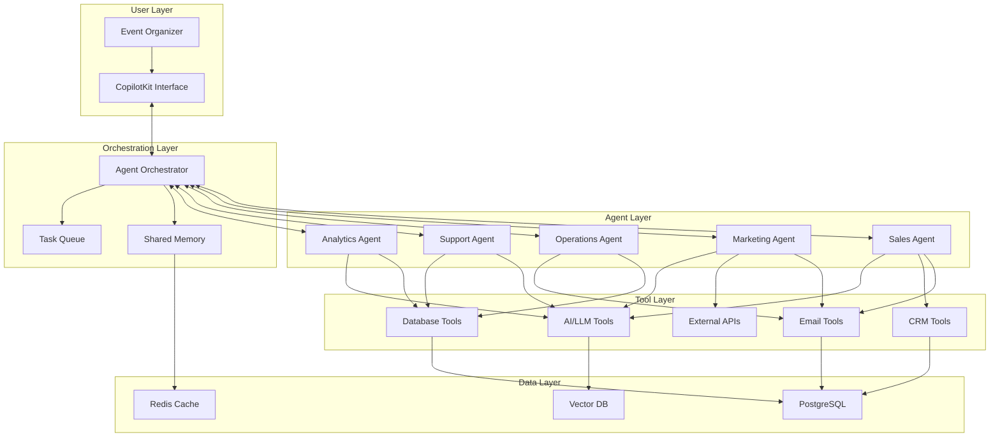

# AI Agents Architecture

**Version:** 1.0
**Date:** 2025-10-17
**Status:** Technical Specification
**Parent Document:** [00-AI-FEATURES-MASTER-PLAN.md](./00-AI-FEATURES-MASTER-PLAN.md)

---

## 🎯 Executive Summary

EventOS will deploy **5 autonomous AI agents** (CoAgents) that work 24/7 to handle sales, marketing, operations, support, and analytics—reducing manual work by 50% while increasing response quality and speed.

### CoAgents Overview

> "AI agents that work alongside humans, taking action when appropriate and escalating when needed—the perfect blend of automation and human judgment."

### Agent Capabilities

| Agent | Primary Function | Autonomy Level | Impact |
|-------|------------------|----------------|--------|
| **Sales Agent** | Sponsor outreach, lead qualification | 70% autonomous | 3x more outreach, 2x conversion |
| **Marketing Agent** | Campaign optimization, content scheduling | 80% autonomous | 4x more content, 90% optimal timing |
| **Operations Agent** | Task tracking, deadline monitoring | 90% autonomous | Zero missed deadlines |
| **Support Agent** | Attendee questions, issue resolution | 85% autonomous | 24/7 availability, 95% resolution |
| **Analytics Agent** | Insights, predictions, recommendations | 60% autonomous | Real-time insights, proactive alerts |

---

## 🏗️ Architecture Overview

### System Design



### Technology Stack

| Component | Technology | Purpose |
|-----------|------------|---------|
| **Agent Framework** | LangChain + CrewAI | Multi-agent orchestration |
| **LLM** | OpenAI GPT-4o | Natural language processing |
| **Conversational UI** | CopilotKit CoAgents | Human-in-the-loop interface |
| **Tool Calling** | LangChain Tools | Agent actions (email, database, API) |
| **Memory** | Redis + PostgreSQL | Short-term and long-term memory |
| **Vector Search** | Pinecone or Supabase Vector | Semantic search and RAG |
| **Task Queue** | BullMQ (Redis) | Asynchronous task processing |
| **Monitoring** | PostHog + Custom | Agent performance tracking |

---

## 🤖 Agent 1: Sales Agent

### Purpose
Proactively find sponsors, qualify leads, send proposals, and follow up—autonomously handling 70% of sponsor acquisition pipeline.

### Architecture

```python
from langchain.agents import AgentExecutor, create_openai_functions_agent
from langchain.tools import Tool
from langchain_openai import ChatOpenAI
from crewai import Agent, Task, Crew

class SalesAgent:
    """
    Autonomous sales agent for sponsor acquisition
    """

    def __init__(self):
        self.llm = ChatOpenAI(model="gpt-4o", temperature=0.3)
        self.tools = self.initialize_tools()
        self.agent = self.create_agent()
        self.memory = ConversationBufferMemory()

    def initialize_tools(self) -> List[Tool]:
        """Initialize tools available to sales agent"""

        return [
            Tool(
                name="search_sponsors",
                func=self.search_sponsors,
                description="Search for potential sponsors matching event criteria. Returns scored list of prospects."
            ),
            Tool(
                name="qualify_lead",
                func=self.qualify_lead,
                description="Analyze lead and assign score 0-100 based on fit, engagement, and conversion probability."
            ),
            Tool(
                name="generate_proposal",
                func=self.generate_proposal,
                description="Create personalized sponsorship proposal. Requires sponsor_id and event_id."
            ),
            Tool(
                name="send_email",
                func=self.send_email,
                description="Send email to prospect. Tracks opens, clicks, and responses."
            ),
            Tool(
                name="schedule_meeting",
                func=self.schedule_meeting,
                description="Schedule meeting using Calendly API. Sends calendar invite."
            ),
            Tool(
                name="update_crm",
                func=self.update_crm,
                description="Update sponsor record in CRM with notes, status, and next actions."
            ),
            Tool(
                name="search_linkedin",
                func=self.search_linkedin,
                description="Search LinkedIn for decision makers at company. Returns contact info."
            ),
            Tool(
                name="analyze_engagement",
                func=self.analyze_engagement,
                description="Analyze prospect's engagement (email opens, website visits, content downloads)."
            )
        ]

    def create_agent(self) -> AgentExecutor:
        """Create LangChain agent with tools"""

        system_prompt = """
        You are a professional sales agent for EventOS, specializing in corporate sponsorships.

        Your goals:
        1. Find high-quality sponsor prospects for events
        2. Qualify leads based on fit, budget, and engagement
        3. Generate and send personalized proposals
        4. Follow up strategically based on engagement
        5. Schedule meetings with qualified prospects
        6. Track all activities in CRM

        Best practices:
        - Focus on quality over quantity (target score 80+)
        - Personalize every outreach based on company's values and past sponsorships
        - Follow up 3-5 times with different value angles
        - Use social proof (testimonials, success stories)
        - Create urgency when appropriate (early bird pricing, limited spots)
        - Always track engagement and adapt approach

        Human escalation criteria:
        - Prospect requests pricing customization beyond defined packages
        - Prospect raises objections you cannot address
        - Deal value exceeds $50,000
        - Prospect requests legal review of contract terms
        - Any ethical concerns or red flags

        Tone: Professional, consultative, data-driven. Not pushy.
        """

        agent = create_openai_functions_agent(
            llm=self.llm,
            tools=self.tools,
            prompt=system_prompt
        )

        return AgentExecutor(
            agent=agent,
            tools=self.tools,
            memory=self.memory,
            verbose=True,
            max_iterations=10
        )

    async def run_outreach_campaign(self, event_id: str):
        """Autonomous outreach campaign for event"""

        task_prompt = f"""
        Run a complete sponsor outreach campaign for event {event_id}.

        Steps:
        1. Search for 20 potential sponsors matching the event criteria
        2. Qualify each lead and prioritize top 10 (score 80+)
        3. Generate personalized proposals for top 10
        4. Send initial outreach emails with proposals
        5. Track engagement over next 7 days
        6. Follow up with non-responders on day 3 and day 7
        7. Schedule meetings with interested prospects
        8. Update CRM with all activities and outcomes

        Report back:
        - Prospects found
        - Proposals sent
        - Response rate
        - Meetings scheduled
        - Any issues requiring human attention
        """

        result = await self.agent.arun(task_prompt)
        return result

    # Tool implementations
    async def search_sponsors(self, event_id: str, limit: int = 20):
        """Search for potential sponsors"""
        matching_engine = SponsorMatchingEngine()
        matches = await matching_engine.find_matches(event_id, limit)
        return matches

    async def qualify_lead(self, sponsor_id: str, event_id: str):
        """Qualify lead and assign score"""
        scoring_model = LeadScoringModel()
        score = await scoring_model.score_lead(sponsor_id, event_id)
        return score

    async def generate_proposal(self, sponsor_id: str, event_id: str):
        """Generate personalized proposal"""
        proposal_generator = ProposalGenerator()
        proposal = await proposal_generator.generate_proposal(
            event_id, sponsor_id, package_level="platinum"
        )
        return proposal

    async def send_email(self, to: str, subject: str, body: str, proposal_id: str = None):
        """Send email and track engagement"""
        email_client = ResendEmailClient()
        result = await email_client.send(
            to=to,
            subject=subject,
            body=body,
            track_opens=True,
            track_clicks=True,
            metadata={"proposal_id": proposal_id}
        )
        return result
```

### Database Schema

```sql
CREATE TABLE agent_sales_activities (
    id UUID PRIMARY KEY DEFAULT gen_random_uuid(),

    -- Agent identification
    agent_id TEXT DEFAULT 'sales_agent',
    agent_version TEXT,

    -- Activity details
    activity_type TEXT NOT NULL CHECK (activity_type IN (
        'prospect_search', 'lead_qualification', 'proposal_generation',
        'email_sent', 'follow_up_sent', 'meeting_scheduled',
        'crm_update', 'linkedin_search', 'engagement_analysis'
    )),

    -- Context
    event_id UUID REFERENCES events(id),
    sponsor_id UUID REFERENCES sponsors(id),
    proposal_id UUID REFERENCES sponsor_proposals(id),

    -- Activity data
    input_data JSONB,
    output_data JSONB,
    reasoning TEXT, -- AI's reasoning for action

    -- Results
    status TEXT DEFAULT 'success' CHECK (status IN ('success', 'failed', 'pending', 'escalated')),
    error_message TEXT,

    -- Autonomy tracking
    autonomous BOOLEAN DEFAULT TRUE,
    required_human_review BOOLEAN DEFAULT FALSE,
    escalation_reason TEXT,

    -- Performance
    duration_ms INTEGER,
    llm_tokens_used INTEGER,

    -- Timestamps
    created_at TIMESTAMPTZ DEFAULT NOW()
);

CREATE INDEX idx_sales_activities_event ON agent_sales_activities(event_id, created_at DESC);
CREATE INDEX idx_sales_activities_sponsor ON agent_sales_activities(sponsor_id, created_at DESC);
CREATE INDEX idx_sales_activities_type ON agent_sales_activities(activity_type);
CREATE INDEX idx_sales_activities_escalated ON agent_sales_activities(required_human_review)
    WHERE required_human_review = TRUE;
```

### CopilotKit CoAgent Integration

```typescript
// Sales CoAgent with human-in-the-loop
useCopilotAction({
  name: "salesAgent",
  description: "Deploy autonomous sales agent for sponsor outreach",
  parameters: [
    {
      name: "eventId",
      type: "string",
      required: true
    },
    {
      name: "mode",
      type: "string",
      enum: ["full_auto", "assisted", "review_only"],
      required: true
    }
  ],
  handler: async ({ eventId, mode }) => {
    const salesAgent = new SalesAgent();

    if (mode === "full_auto") {
      // Fully autonomous - agent handles everything
      const result = await salesAgent.run_outreach_campaign(eventId);
      return {
        message: "Sales agent completed outreach campaign",
        ...result
      };
    } else if (mode === "assisted") {
      // Agent suggests, human approves
      const prospects = await salesAgent.search_sponsors(eventId);
      return {
        message: "Found prospects. Review and approve?",
        prospects: prospects.slice(0, 10),
        next_action: "generate_proposals"
      };
    } else {
      // Review only - agent finds, human decides
      const analysis = await salesAgent.analyze_opportunities(eventId);
      return {
        message: "Analysis complete. Review recommendations.",
        analysis
      };
    }
  }
});
```

---

## 🎨 Agent 2: Marketing Agent

### Purpose
Optimize campaigns, schedule content, adjust messaging based on performance—handling 80% of marketing execution.

### Architecture

```python
class MarketingAgent:
    """
    Autonomous marketing agent for campaign optimization
    """

    def __init__(self):
        self.llm = ChatOpenAI(model="gpt-4o", temperature=0.7)
        self.tools = self.initialize_tools()
        self.agent = self.create_agent()

    def initialize_tools(self):
        return [
            Tool(
                name="generate_content",
                func=self.generate_content,
                description="Generate marketing content (emails, social posts, landing pages)"
            ),
            Tool(
                name="schedule_post",
                func=self.schedule_post,
                description="Schedule social media post at optimal time"
            ),
            Tool(
                name="analyze_campaign",
                func=self.analyze_campaign,
                description="Analyze campaign performance and suggest optimizations"
            ),
            Tool(
                name="send_email_campaign",
                func=self.send_email_campaign,
                description="Send email to segment with tracking"
            ),
            Tool(
                name="ab_test",
                func=self.ab_test,
                description="Run A/B test on subject lines or content"
            ),
            Tool(
                name="optimize_timing",
                func=self.optimize_timing,
                description="Calculate optimal send time based on audience engagement patterns"
            ),
            Tool(
                name="segment_audience",
                func=self.segment_audience,
                description="Segment contacts based on behavior, demographics, or engagement"
            ),
            Tool(
                name="monitor_metrics",
                func=self.monitor_metrics,
                description="Monitor key metrics (open rate, click rate, conversions)"
            )
        ]

    async def run_marketing_campaign(self, event_id: str):
        """Autonomous marketing campaign management"""

        task_prompt = f"""
        Manage complete marketing campaign for event {event_id}.

        Objectives:
        1. Maximize ticket sales
        2. Increase event awareness
        3. Engage target audience
        4. Optimize campaign performance continuously

        Your tasks:
        1. Generate multi-channel content (email, social, WhatsApp)
        2. Schedule posts at optimal times (analyze audience patterns)
        3. Monitor campaign performance daily
        4. A/B test subject lines and CTAs
        5. Adjust messaging based on engagement data
        6. Segment audience and personalize content
        7. Identify and double-down on high-performing channels

        Success criteria:
        - Open rate > 30%
        - Click rate > 5%
        - Conversion rate > 2%
        - Social engagement rate > 8%

        Report back daily with:
        - Performance metrics
        - Optimizations made
        - Recommendations for human review
        """

        result = await self.agent.arun(task_prompt)
        return result

    async def optimize_campaign_continuously(self, campaign_id: str):
        """Continuously monitor and optimize campaign"""

        while True:
            # Check metrics every 4 hours
            await asyncio.sleep(4 * 3600)

            # Analyze performance
            metrics = await self.monitor_metrics(campaign_id)

            # Identify issues
            if metrics.open_rate < 0.25:
                # Low open rate - test new subject lines
                await self.ab_test(
                    campaign_id,
                    test_type="subject_line",
                    variations=3
                )

            if metrics.click_rate < 0.03:
                # Low click rate - adjust CTAs
                await self.generate_content(
                    campaign_id,
                    content_type="cta",
                    optimization_goal="increase_clicks"
                )

            if metrics.conversion_rate > 0.05:
                # High conversion - scale up
                await self.increase_budget(campaign_id, multiplier=1.5)

            # Log optimization
            await self.log_optimization(campaign_id, metrics, actions_taken)
```

### Database Schema

```sql
CREATE TABLE agent_marketing_activities (
    id UUID PRIMARY KEY DEFAULT gen_random_uuid(),

    -- Agent identification
    agent_id TEXT DEFAULT 'marketing_agent',

    -- Activity details
    activity_type TEXT NOT NULL CHECK (activity_type IN (
        'content_generation', 'post_scheduled', 'campaign_analyzed',
        'email_sent', 'ab_test_started', 'timing_optimized',
        'audience_segmented', 'metrics_monitored', 'campaign_optimized'
    )),

    -- Context
    event_id UUID REFERENCES events(id),
    campaign_id UUID REFERENCES marketing_campaigns(id),

    -- Activity data
    input_data JSONB,
    output_data JSONB,
    optimization_reasoning TEXT,

    -- Performance
    metrics_before JSONB,
    metrics_after JSONB,
    performance_improvement NUMERIC(5,2), -- Percentage

    -- Status
    status TEXT DEFAULT 'success' CHECK (status IN ('success', 'failed', 'pending')),

    -- Timestamps
    created_at TIMESTAMPTZ DEFAULT NOW()
);

CREATE INDEX idx_marketing_activities_campaign ON agent_marketing_activities(campaign_id, created_at DESC);
CREATE INDEX idx_marketing_activities_type ON agent_marketing_activities(activity_type);
```

---

## ⚙️ Agent 3: Operations Agent

### Purpose
Track tasks, monitor deadlines, send reminders—ensuring 100% on-time delivery of event components.

### Architecture

```python
class OperationsAgent:
    """
    Autonomous operations agent for task and deadline management
    """

    def __init__(self):
        self.llm = ChatOpenAI(model="gpt-4o", temperature=0.2)
        self.tools = self.initialize_tools()

    def initialize_tools(self):
        return [
            Tool(
                name="check_deliverables",
                func=self.check_deliverables,
                description="Check status of all deliverables and identify at-risk items"
            ),
            Tool(
                name="send_reminder",
                func=self.send_reminder,
                description="Send reminder email to responsible party"
            ),
            Tool(
                name="escalate_issue",
                func=self.escalate_issue,
                description="Escalate urgent issue to event organizer"
            ),
            Tool(
                name="monitor_ticket_sales",
                func=self.monitor_ticket_sales,
                description="Monitor ticket sales velocity and predict final attendance"
            ),
            Tool(
                name="track_budget",
                func=self.track_budget,
                description="Track event budget vs actual spending"
            ),
            Tool(
                name="generate_status_report",
                func=self.generate_status_report,
                description="Generate weekly status report with key metrics and alerts"
            )
        ]

    async def run_daily_operations(self, event_id: str):
        """Daily operations check"""

        task_prompt = f"""
        Perform daily operations check for event {event_id}.

        Check:
        1. All deliverables due in next 7 days - send reminders if needed
        2. Overdue deliverables - escalate to organizer
        3. Ticket sales velocity - alert if below target
        4. Budget status - alert if over 90% spent with >30 days to go
        5. Vendor confirmations - follow up on pending

        For each issue found:
        - Assess severity (low, medium, high, critical)
        - Take appropriate action (remind, escalate, auto-fix)
        - Document in operations log

        Critical escalation criteria:
        - Deliverable overdue by 3+ days
        - Ticket sales 40%+ below target with <30 days to event
        - Budget overrun >10%
        - Vendor cancellation or major issue
        """

        result = await self.agent.arun(task_prompt)
        return result
```

---

## 💬 Agent 4: Support Agent

### Purpose
Answer attendee questions 24/7, resolve ticketing issues, escalate complex problems—handling 95% of support requests.

### Architecture

```python
class SupportAgent:
    """
    Autonomous support agent for attendee assistance
    """

    def __init__(self):
        self.llm = ChatOpenAI(model="gpt-4o", temperature=0.4)
        self.knowledge_base = VectorKnowledgeBase()
        self.tools = self.initialize_tools()

    def initialize_tools(self):
        return [
            Tool(
                name="search_knowledge_base",
                func=self.search_knowledge_base,
                description="Search event FAQs, policies, and documentation"
            ),
            Tool(
                name="lookup_ticket",
                func=self.lookup_ticket,
                description="Look up ticket details by order ID or email"
            ),
            Tool(
                name="resend_ticket",
                func=self.resend_ticket,
                description="Resend ticket confirmation email"
            ),
            Tool(
                name="transfer_ticket",
                func=self.transfer_ticket,
                description="Transfer ticket to different attendee"
            ),
            Tool(
                name="process_refund",
                func=self.process_refund,
                description="Process refund according to event policy"
            ),
            Tool(
                name="escalate_to_human",
                func=self.escalate_to_human,
                description="Escalate complex issue to human support agent"
            )
        ]

    async def handle_support_request(self, question: str, user_email: str):
        """Handle incoming support request"""

        task_prompt = f"""
        Support request from {user_email}:
        "{question}"

        Your task:
        1. Understand the question
        2. Search knowledge base for relevant information
        3. If it's a ticket issue, look up their ticket
        4. Provide clear, helpful answer
        5. Take action if needed (resend ticket, process refund, etc.)
        6. Escalate to human if:
           - Request involves refund >$500
           - Question about safety/security/legal matters
           - Attendee is upset or frustrated
           - Issue cannot be resolved with available tools

        Response format:
        - Direct answer to question
        - Any actions taken
        - Next steps (if applicable)
        - Whether escalation needed

        Tone: Friendly, empathetic, solution-oriented.
        """

        result = await self.agent.arun(task_prompt)
        return result
```

---

## 📊 Agent 5: Analytics Agent

### Purpose
Analyze data, identify trends, predict outcomes, recommend actions—providing real-time insights to organizers.

### Architecture

```python
class AnalyticsAgent:
    """
    Autonomous analytics agent for insights and predictions
    """

    def __init__(self):
        self.llm = ChatOpenAI(model="gpt-4o", temperature=0.3)
        self.tools = self.initialize_tools()

    def initialize_tools(self):
        return [
            Tool(
                name="query_database",
                func=self.query_database,
                description="Query event database for metrics and trends"
            ),
            Tool(
                name="predict_attendance",
                func=self.predict_attendance,
                description="Predict final attendance based on current sales velocity"
            ),
            Tool(
                name="analyze_revenue",
                func=self.analyze_revenue,
                description="Analyze revenue trends and project final revenue"
            ),
            Tool(
                name="identify_anomalies",
                func=self.identify_anomalies,
                description="Detect unusual patterns (spike in cancellations, traffic drop, etc.)"
            ),
            Tool(
                name="recommend_actions",
                func=self.recommend_actions,
                description="Recommend actions based on data analysis"
            ),
            Tool(
                name="generate_report",
                func=self.generate_report,
                description="Generate executive summary report with key insights"
            )
        ]

    async def generate_daily_insights(self, event_id: str):
        """Generate daily analytics insights"""

        task_prompt = f"""
        Analyze event {event_id} and provide insights.

        Analysis areas:
        1. Ticket sales velocity vs target
        2. Marketing campaign performance
        3. Revenue trends and projections
        4. Attendee demographics and segments
        5. Sponsor engagement and ROI
        6. Operational metrics (deliverables, budget)

        For each area:
        - Current status vs goal
        - Trends (improving/declining)
        - Predictions for event day
        - Recommended actions

        Identify:
        - Opportunities (what's working well - do more)
        - Risks (what's concerning - take action)
        - Anomalies (unusual patterns - investigate)

        Output format:
        - Executive summary (3-5 key insights)
        - Detailed analysis per area
        - Priority actions ranked by impact
        """

        result = await self.agent.arun(task_prompt)
        return result
```

---

## 🔄 Agent Orchestration

### Multi-Agent Coordination

```python
class AgentOrchestrator:
    """
    Coordinates multiple agents working together
    """

    def __init__(self):
        self.sales_agent = SalesAgent()
        self.marketing_agent = MarketingAgent()
        self.operations_agent = OperationsAgent()
        self.support_agent = SupportAgent()
        self.analytics_agent = AnalyticsAgent()

        self.shared_memory = Redis()
        self.task_queue = BullMQ()

    async def coordinate_event_launch(self, event_id: str):
        """Coordinate all agents for event launch"""

        # Create task graph
        tasks = [
            # Analytics agent analyzes target audience
            Task(
                agent=self.analytics_agent,
                action="analyze_target_audience",
                params={"event_id": event_id}
            ),

            # Sales agent finds sponsors (depends on analytics)
            Task(
                agent=self.sales_agent,
                action="run_outreach_campaign",
                params={"event_id": event_id},
                depends_on=["analyze_target_audience"]
            ),

            # Marketing agent creates campaign (depends on analytics)
            Task(
                agent=self.marketing_agent,
                action="run_marketing_campaign",
                params={"event_id": event_id},
                depends_on=["analyze_target_audience"]
            ),

            # Operations agent sets up tracking
            Task(
                agent=self.operations_agent,
                action="initialize_tracking",
                params={"event_id": event_id}
            ),

            # Support agent learns event details
            Task(
                agent=self.support_agent,
                action="index_event_knowledge",
                params={"event_id": event_id}
            )
        ]

        # Execute task graph
        results = await self.execute_task_graph(tasks)

        return results

    async def execute_task_graph(self, tasks: List[Task]):
        """Execute tasks respecting dependencies"""

        completed = set()
        results = {}

        while len(completed) < len(tasks):
            # Find tasks ready to execute
            ready = [
                t for t in tasks
                if t.id not in completed
                and all(dep in completed for dep in t.depends_on)
            ]

            if not ready:
                raise Exception("Circular dependency or deadlock")

            # Execute ready tasks in parallel
            task_results = await asyncio.gather(*[
                self.execute_task(task) for task in ready
            ])

            # Mark complete and store results
            for task, result in zip(ready, task_results):
                completed.add(task.id)
                results[task.id] = result

                # Update shared memory
                await self.shared_memory.set(
                    f"task:{task.id}:result",
                    json.dumps(result)
                )

        return results
```

---

## 📈 Success Metrics

| Agent | Metric | Target | Measurement |
|-------|--------|--------|-------------|
| **Sales** | Outreach volume | 5x manual | Activity logs |
| **Sales** | Conversion rate | 2x manual | CRM data |
| **Marketing** | Campaign efficiency | 4x content output | Content count |
| **Marketing** | Engagement rate | +50% | Analytics |
| **Operations** | On-time delivery | 100% | Deadline tracking |
| **Support** | Resolution rate | 95% auto-resolved | Ticket data |
| **Support** | Response time | <5 minutes | Timestamp logs |
| **Analytics** | Insight accuracy | 90% predictions | Outcome validation |

---

## 🛠️ Implementation Roadmap

### Month 7-9: Core Agents
- [ ] Implement Sales Agent with LangChain
- [ ] Implement Marketing Agent
- [ ] Build agent orchestration system
- [ ] Create shared memory and task queue
- [ ] Deploy to production with 10 alpha users

### Month 10-12: Advanced Agents
- [ ] Implement Operations Agent
- [ ] Implement Support Agent
- [ ] Implement Analytics Agent
- [ ] Build agent monitoring dashboard
- [ ] Launch to all users

---

**Status:** ✅ READY FOR IMPLEMENTATION
**Dependencies:** [00-AI-FEATURES-MASTER-PLAN.md](./00-AI-FEATURES-MASTER-PLAN.md), [01-SPONSOR-MANAGEMENT-AI.md](./01-SPONSOR-MANAGEMENT-AI.md)
**Previous:** [02-AUTOMATION-WORKFLOWS.md](./02-AUTOMATION-WORKFLOWS.md)
**Next:** [04-USER-JOURNEYS-FLOWS.md](./04-USER-JOURNEYS-FLOWS.md)
