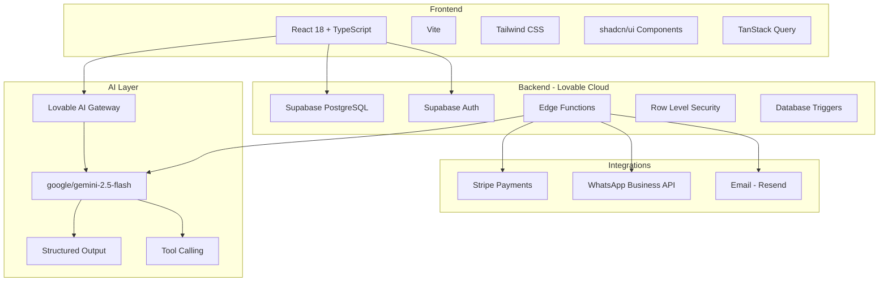
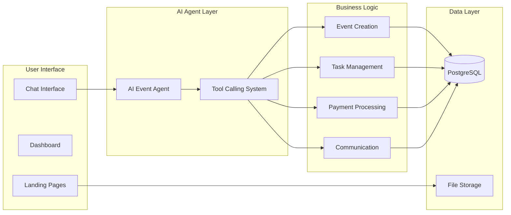
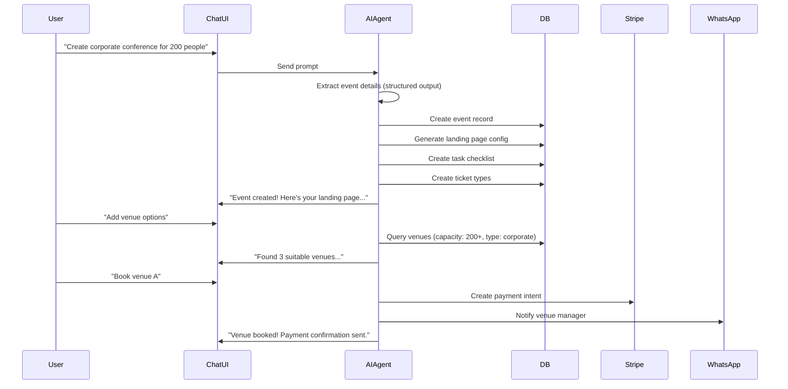
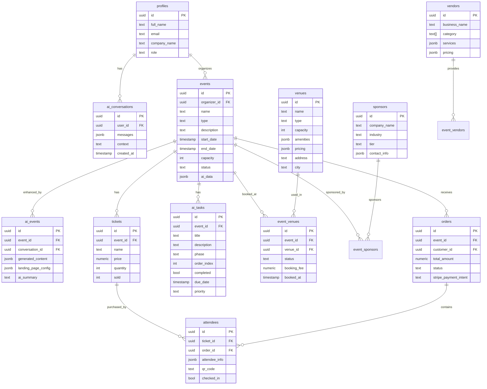
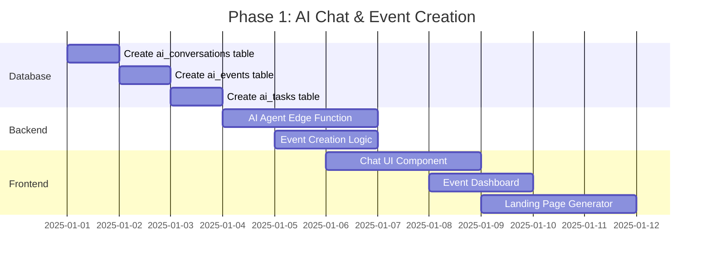
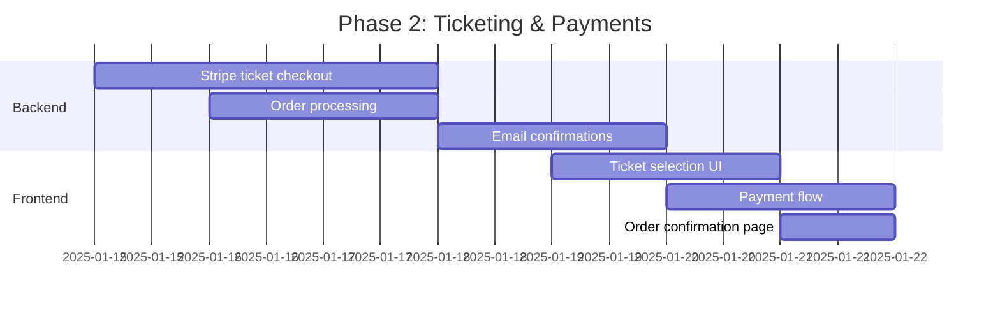
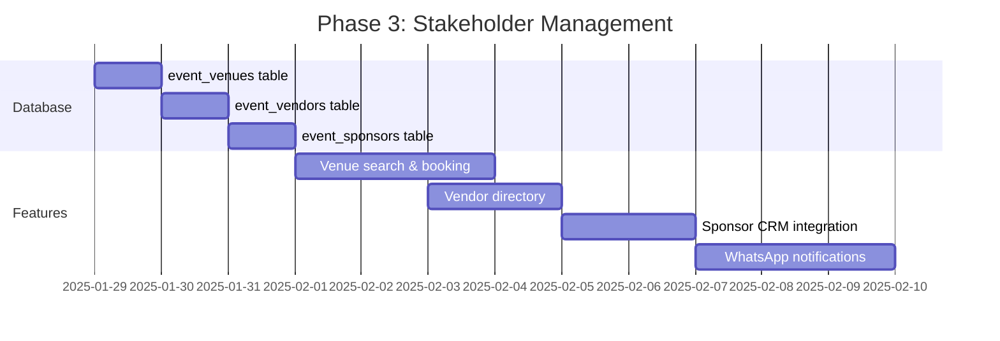
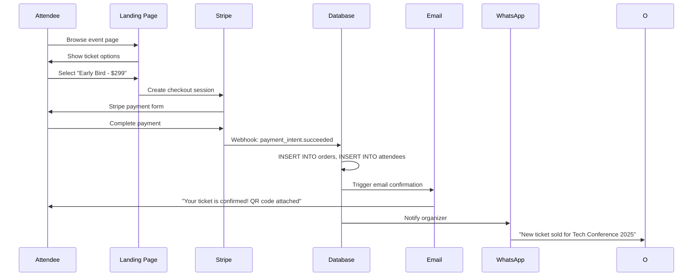
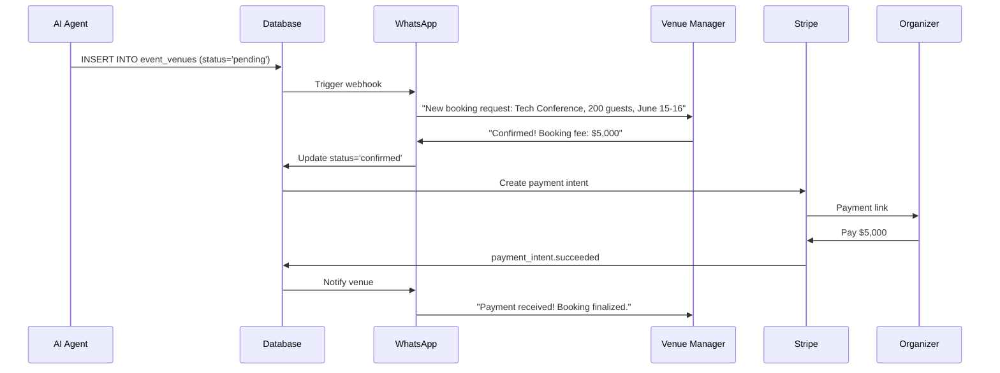

# AI-Powered Corporate Event Management System
## Master Implementation Plan

**Version:** 1.0  
**Focus:** Corporate Events (Conferences, Seminars, Corporate Meetings, Trade Shows)  
**Status:** 🔵 Planning Phase

---

## Table of Contents

1. [Executive Summary](#executive-summary)
2. [Red Flags & Risk Assessment](#red-flags--risk-assessment)
3. [Tech Stack](#tech-stack)
4. [System Architecture](#system-architecture)
5. [Core Features (MVP)](#core-features-mvp)
6. [Advanced Features](#advanced-features)
7. [Database Schema](#database-schema)
8. [Development Phases](#development-phases)
9. [User Journeys](#user-journeys)
10. [Implementation Order](#implementation-order)
11. [Best Practices](#best-practices)
12. [Progress Tracker](#progress-tracker)

---

## Executive Summary

An AI-first event management platform where corporate event organizers use natural language to:
- Create events via ChatGPT-style interface
- Generate landing pages automatically
- Manage tasks with AI suggestions
- Handle tickets & payments via Stripe
- Communicate with stakeholders via WhatsApp
- Manage venues, vendors, and sponsors

**Key Innovation:** Chat with AI → Complete event system created automatically.

---

## Red Flags & Risk Assessment

### 🔴 Critical Issues Identified

1. **Social Media Integration Complexity**
   - ❌ Instagram/Facebook require Business Account verification (weeks-long process)
   - ❌ OAuth token refresh adds significant complexity
   - ❌ Rate limits can break automations
   - ✅ **RECOMMENDATION:** Start with WhatsApp only, add social later (Phase 3)

2. **Authentication Confusion**
   - ❌ Previous mention of Clerk, but project uses Supabase Auth
   - ✅ **DECISION:** Use Supabase Auth (already configured)

3. **WhatsApp Business API**
   - ⚠️ Requires Facebook Business Manager setup
   - ⚠️ Costs money per message
   - ✅ **ALTERNATIVE:** Start with WhatsApp Business API Cloud (free tier available)

4. **Scope Creep**
   - ⚠️ Too many features at once
   - ✅ **SOLUTION:** Iterative development in clear phases

### ✅ Validated Approaches

- Lovable AI for event content generation (google/gemini-2.5-flash)
- Supabase Cloud for backend
- Stripe for payments (already integrated)
- Edge Functions for AI agents

---

## Tech Stack



### Technology Decisions

| Component | Technology | Rationale |
|-----------|-----------|-----------|
| **Frontend Framework** | React 18 + Vite | Fast HMR, modern tooling |
| **Styling** | Tailwind CSS | Design system consistency |
| **UI Components** | shadcn/ui | Customizable, accessible |
| **State Management** | TanStack Query | Server state caching |
| **AI Provider** | Lovable AI | No API key needed, free tier |
| **AI Model** | google/gemini-2.5-flash | Fast, multimodal, cost-effective |
| **Backend** | Lovable Cloud (Supabase) | Full-stack without setup |
| **Database** | PostgreSQL | Relational data, JSONB support |
| **Auth** | Supabase Auth | Built-in, secure |
| **Payments** | Stripe | Industry standard |
| **Messaging** | WhatsApp Business API | Direct stakeholder communication |
| **Email** | Resend | Reliable delivery |

---

## System Architecture

### High-Level Architecture



### AI Agent Flow



---

## Core Features (MVP)

### Phase 1: AI Chat & Event Creation

**Goal:** User can chat with AI to create a complete event

| Feature | Description | Priority |
|---------|-------------|----------|
| **Chat Interface** | ChatGPT-style UI with streaming responses | 🔴 Critical |
| **AI Event Extraction** | Natural language → structured event data | 🔴 Critical |
| **Event Generation** | Auto-create event with defaults | 🔴 Critical |
| **Landing Page Builder** | AI-generated event page | 🔴 Critical |
| **Task Planner** | AI-suggested task checklist | 🟡 High |
| **Conversation History** | Persist chat sessions | 🟡 High |

### Phase 2: Ticketing & Payments

| Feature | Description | Priority |
|---------|-------------|----------|
| **Ticket Types** | Create multiple ticket tiers | 🔴 Critical |
| **Stripe Integration** | Checkout flow for tickets | 🔴 Critical |
| **Order Management** | Track purchases | 🔴 Critical |
| **QR Code Generation** | Attendee check-in codes | 🟡 High |
| **Email Confirmations** | Auto-send via Resend | 🟡 High |

### Phase 3: Stakeholder Management

| Feature | Description | Priority |
|---------|-------------|----------|
| **Venue Database** | Corporate venues with capacity/amenities | 🟡 High |
| **Vendor Directory** | AV, catering, etc. | 🟢 Medium |
| **Sponsor Management** | CRM for sponsors | 🟢 Medium |
| **WhatsApp Integration** | Automated notifications | 🟡 High |

---

## Advanced Features

### Phase 4: Intelligence & Automation

| Feature | Description | Status |
|---------|-------------|--------|
| **AI Task Automation** | Auto-update tasks based on progress | 🔵 Future |
| **Smart Recommendations** | Venue/vendor suggestions | 🔵 Future |
| **Budget Forecasting** | AI-powered cost estimates | 🔵 Future |
| **Attendance Predictions** | ML-based forecasting | 🔵 Future |
| **Social Media Posting** | Auto-post to Instagram/Facebook | 🔵 Future |

---

## Database Schema

### ERD Diagram



### New Tables Required

#### 1. `ai_conversations`
```sql
CREATE TABLE ai_conversations (
  id UUID PRIMARY KEY DEFAULT gen_random_uuid(),
  user_id UUID REFERENCES auth.users NOT NULL,
  title TEXT,
  messages JSONB NOT NULL DEFAULT '[]',
  context TEXT,
  created_at TIMESTAMPTZ NOT NULL DEFAULT now(),
  updated_at TIMESTAMPTZ NOT NULL DEFAULT now()
);

-- RLS
ALTER TABLE ai_conversations ENABLE ROW LEVEL SECURITY;

CREATE POLICY "Users manage own conversations"
  ON ai_conversations FOR ALL
  USING (user_id = auth.uid())
  WITH CHECK (user_id = auth.uid());
```

#### 2. `ai_events`
```sql
CREATE TABLE ai_events (
  id UUID PRIMARY KEY DEFAULT gen_random_uuid(),
  event_id UUID REFERENCES events NOT NULL,
  conversation_id UUID REFERENCES ai_conversations,
  generated_content JSONB DEFAULT '{}',
  landing_page_config JSONB DEFAULT '{}',
  ai_summary TEXT,
  created_at TIMESTAMPTZ NOT NULL DEFAULT now()
);

-- RLS
ALTER TABLE ai_events ENABLE ROW LEVEL SECURITY;

CREATE POLICY "Event organizers access AI data"
  ON ai_events FOR ALL
  USING (
    event_id IN (
      SELECT id FROM events WHERE organizer_id = auth.uid()
    )
  );
```

#### 3. `ai_tasks`
```sql
CREATE TYPE task_phase AS ENUM (
  'pre_planning',
  'planning',
  'execution',
  'post_event'
);

CREATE TYPE task_priority AS ENUM ('low', 'medium', 'high', 'urgent');

CREATE TABLE ai_tasks (
  id UUID PRIMARY KEY DEFAULT gen_random_uuid(),
  event_id UUID REFERENCES events NOT NULL,
  title TEXT NOT NULL,
  description TEXT,
  phase task_phase NOT NULL DEFAULT 'planning',
  order_index INT NOT NULL DEFAULT 0,
  completed BOOLEAN NOT NULL DEFAULT false,
  due_date TIMESTAMPTZ,
  priority task_priority NOT NULL DEFAULT 'medium',
  assigned_to UUID REFERENCES auth.users,
  created_by_ai BOOLEAN NOT NULL DEFAULT true,
  created_at TIMESTAMPTZ NOT NULL DEFAULT now(),
  completed_at TIMESTAMPTZ
);

-- RLS
ALTER TABLE ai_tasks ENABLE ROW LEVEL SECURITY;

CREATE POLICY "Event organizers manage tasks"
  ON ai_tasks FOR ALL
  USING (
    event_id IN (
      SELECT id FROM events WHERE organizer_id = auth.uid()
    )
  );
```

#### 4. `event_venues` (linking table)
```sql
CREATE TYPE venue_booking_status AS ENUM (
  'pending',
  'confirmed',
  'cancelled'
);

CREATE TABLE event_venues (
  id UUID PRIMARY KEY DEFAULT gen_random_uuid(),
  event_id UUID REFERENCES events NOT NULL,
  venue_id UUID REFERENCES venues NOT NULL,
  status venue_booking_status NOT NULL DEFAULT 'pending',
  booking_fee NUMERIC,
  notes TEXT,
  booked_at TIMESTAMPTZ DEFAULT now(),
  created_at TIMESTAMPTZ NOT NULL DEFAULT now()
);

-- RLS
ALTER TABLE event_venues ENABLE ROW LEVEL SECURITY;

CREATE POLICY "Event organizers manage venue bookings"
  ON event_venues FOR ALL
  USING (
    event_id IN (
      SELECT id FROM events WHERE organizer_id = auth.uid()
    )
  );
```

#### 5. `event_sponsors` (linking table)
```sql
CREATE TABLE event_sponsors (
  id UUID PRIMARY KEY DEFAULT gen_random_uuid(),
  event_id UUID REFERENCES events NOT NULL,
  sponsor_id UUID REFERENCES crm_organizers NOT NULL,
  tier TEXT,
  amount NUMERIC,
  benefits JSONB DEFAULT '{}',
  status TEXT DEFAULT 'pending',
  created_at TIMESTAMPTZ NOT NULL DEFAULT now()
);

-- RLS policies similar to above
```

#### 6. `event_vendors` (linking table)
```sql
CREATE TABLE event_vendors (
  id UUID PRIMARY KEY DEFAULT gen_random_uuid(),
  event_id UUID REFERENCES events NOT NULL,
  vendor_id UUID REFERENCES vendors NOT NULL,
  service_type TEXT,
  cost NUMERIC,
  status TEXT DEFAULT 'pending',
  created_at TIMESTAMPTZ NOT NULL DEFAULT now()
);
```

#### 7. `whatsapp_templates`
```sql
CREATE TABLE whatsapp_templates (
  id UUID PRIMARY KEY DEFAULT gen_random_uuid(),
  name TEXT NOT NULL,
  template_type TEXT NOT NULL,
  content TEXT NOT NULL,
  variables JSONB DEFAULT '[]',
  created_at TIMESTAMPTZ NOT NULL DEFAULT now()
);
```

### Indexes for Performance

```sql
-- Conversation lookups
CREATE INDEX idx_ai_conversations_user_id ON ai_conversations(user_id);
CREATE INDEX idx_ai_conversations_created_at ON ai_conversations(created_at DESC);

-- Event-related queries
CREATE INDEX idx_ai_events_event_id ON ai_events(event_id);
CREATE INDEX idx_ai_events_conversation_id ON ai_events(conversation_id);

-- Task management
CREATE INDEX idx_ai_tasks_event_id ON ai_tasks(event_id);
CREATE INDEX idx_ai_tasks_due_date ON ai_tasks(due_date) WHERE NOT completed;
CREATE INDEX idx_ai_tasks_phase ON ai_tasks(phase);

-- Venue bookings
CREATE INDEX idx_event_venues_event_id ON event_venues(event_id);
CREATE INDEX idx_event_venues_status ON event_venues(status);
```

---

## Development Phases

### Phase 1: Foundation (Week 1-2)
**Goal:** AI chat creates events



**Deliverables:**
- ✅ Chat interface with streaming AI responses
- ✅ AI extracts event details from natural language
- ✅ Auto-creates event + landing page + tasks
- ✅ Conversation history persisted

### Phase 2: Ticketing & Payments (Week 3-4)
**Goal:** Sell tickets with Stripe



**Deliverables:**
- ✅ Multiple ticket types per event
- ✅ Stripe payment integration
- ✅ Email confirmations via Resend
- ✅ QR codes for attendees

### Phase 3: Stakeholder Management (Week 5-6)
**Goal:** Manage venues, vendors, sponsors



**Deliverables:**
- ✅ Venue database with search
- ✅ Vendor/sponsor management
- ✅ WhatsApp Business API integration
- ✅ Automated stakeholder notifications

### Phase 4: Intelligence & Polish (Week 7-8)
**Goal:** AI automation & advanced features

**Deliverables:**
- ✅ AI task automation
- ✅ Smart recommendations
- ✅ Analytics dashboard
- ✅ Social media posting (optional)

---

## User Journeys

### Journey 1: Event Organizer Creates Corporate Conference

```mermaid
sequenceDiagram
    participant O as Organizer
    participant C as Chat UI
    participant AI as AI Agent
    participant DB as Database
    participant S as Stripe
    participant W as WhatsApp

    O->>C: "Create a tech conference for 200 people in Toronto, June 15-16"
    C->>AI: Send prompt
    AI->>AI: Extract: type=conference, capacity=200, location=Toronto, dates
    AI->>DB: INSERT INTO events
    AI->>DB: Generate landing page config
    AI->>DB: Create tasks (pre-planning phase)
    AI->>C: "✅ Event created! Here's what I set up..."
    
    O->>C: "Show me suitable venues"
    AI->>DB: SELECT FROM venues WHERE capacity >= 200 AND city = 'Toronto' AND type = 'corporate'
    AI->>C: "Found 3 venues: Marriott Convention Center, Metro Toronto Convention Centre..."
    
    O->>C: "Book Metro Toronto Convention Centre"
    AI->>DB: INSERT INTO event_venues
    AI->>S: Create payment intent for venue booking fee
    AI->>W: Send confirmation to venue manager
    AI->>C: "✅ Venue booked! Payment link sent."
    
    O->>C: "Create early bird and regular tickets"
    AI->>DB: INSERT INTO tickets (2 rows)
    AI->>C: "✅ Tickets created. Early bird: $299, Regular: $399"
    
    O->>C: "What tasks should I focus on this week?"
    AI->>DB: SELECT FROM ai_tasks WHERE phase = 'pre_planning' AND NOT completed
    AI->>C: "Top 3 tasks: 1) Confirm AV requirements, 2) Send sponsor proposals, 3) Create event website"
```



### Journey 2: Attendee Purchases Ticket



### Journey 3: Venue Manager Receives Booking



---

## Implementation Order

### Step-by-Step Development Sequence

#### Sprint 1: Chat Foundation
1. ✅ Create `ai_conversations` table
2. ✅ Create `ai_events` table
3. ✅ Create `ai_tasks` table
4. ✅ Build chat UI component (`src/components/chat/ChatInterface.tsx`)
5. ✅ Create AI agent edge function (`supabase/functions/ai-event-agent/index.ts`)
6. ✅ Implement streaming responses
7. ✅ Test: "Create a corporate event" → Event created

#### Sprint 2: Event Creation
1. ✅ Extend AI agent to extract event details (structured output)
2. ✅ Auto-generate landing page config
3. ✅ Auto-generate task checklist
4. ✅ Create event dashboard page
5. ✅ Test: Complete event creation flow

#### Sprint 3: Ticketing
1. ✅ AI creates ticket types from description
2. ✅ Build ticket selection UI on landing page
3. ✅ Integrate Stripe checkout
4. ✅ Handle webhooks for order creation
5. ✅ Generate QR codes
6. ✅ Send email confirmations
7. ✅ Test: End-to-end ticket purchase

#### Sprint 4: Stakeholder Management
1. ✅ Create `event_venues`, `event_vendors`, `event_sponsors` tables
2. ✅ Build venue search interface
3. ✅ Implement booking flow
4. ✅ Integrate WhatsApp Business API
5. ✅ Create notification templates
6. ✅ Test: Book venue → WhatsApp sent

#### Sprint 5: AI Automation
1. ✅ AI auto-updates task status based on progress
2. ✅ Smart venue recommendations
3. ✅ Budget forecasting
4. ✅ Analytics dashboard

---

## Best Practices

### Vite + React

```typescript
// ✅ Use lazy loading for routes
const ChatInterface = lazy(() => import('@/components/chat/ChatInterface'));

// ✅ Code splitting for large components
const EventDashboard = lazy(() => import('@/pages/dashboard/EventDashboard'));

// ✅ Optimize bundle size
import { Button } from '@/components/ui/button'; // ✅ Named imports
// ❌ import * as UI from '@/components/ui'; // Avoid
```

### Supabase Edge Functions

```typescript
// ✅ Always handle CORS
const corsHeaders = {
  'Access-Control-Allow-Origin': '*',
  'Access-Control-Allow-Headers': 'authorization, x-client-info, apikey, content-type',
};

// ✅ Use structured output for AI
const response = await fetch('https://ai.gateway.lovable.dev/v1/chat/completions', {
  method: 'POST',
  headers: {
    'Authorization': `Bearer ${Deno.env.get('LOVABLE_API_KEY')}`,
    'Content-Type': 'application/json',
  },
  body: JSON.stringify({
    model: 'google/gemini-2.5-flash',
    messages: [...],
    tools: [{
      type: 'function',
      function: {
        name: 'create_event',
        parameters: { /* JSON schema */ }
      }
    }],
    tool_choice: { type: 'function', function: { name: 'create_event' } }
  })
});

// ✅ Use Supabase client methods (not raw fetch)
const { data, error } = await supabase.from('events').insert({ ... });
```

### Database

```sql
-- ✅ Always use indexes on foreign keys
CREATE INDEX idx_ai_events_event_id ON ai_events(event_id);

-- ✅ Use JSONB for flexible data
ALTER TABLE events ADD COLUMN ai_data JSONB DEFAULT '{}';

-- ✅ Add check constraints
ALTER TABLE tickets ADD CONSTRAINT positive_price CHECK (price >= 0);

-- ✅ Use triggers for auto-updates
CREATE TRIGGER update_event_updated_at
  BEFORE UPDATE ON events
  FOR EACH ROW
  EXECUTE FUNCTION update_updated_at_column();

-- ✅ Secure with RLS
ALTER TABLE ai_conversations ENABLE ROW LEVEL SECURITY;
```

### AI Prompting

```typescript
// ✅ Clear system prompt
const systemPrompt = `You are an AI event planner for corporate events.
Extract event details from user messages and structure them as:
- Event name
- Type (conference, seminar, meeting, trade show)
- Capacity
- Start/end dates
- Location
Keep responses professional and concise.`;

// ✅ Use examples in prompts
const fewShotExamples = `
User: "Create a tech conference for 200 people in June"
Assistant: { "name": "Tech Conference 2025", "type": "conference", "capacity": 200, "start_date": "2025-06-01" }
`;
```

---

## Progress Tracker

### Feature Completion Status

| Feature | Status | Sprint | Notes |
|---------|--------|--------|-------|
| **Core Infrastructure** |
| Database schema | 🔵 Not Started | 1 | Tables defined above |
| Supabase Auth | ✅ Complete | - | Already configured |
| Edge function template | 🔵 Not Started | 1 | |
| **Chat Interface** |
| Chat UI component | 🔵 Not Started | 1 | shadcn-based |
| Streaming responses | 🔵 Not Started | 1 | SSE implementation |
| Conversation history | 🔵 Not Started | 1 | |
| **AI Event Creation** |
| Event extraction | 🔵 Not Started | 1 | Structured output |
| Landing page generation | 🔵 Not Started | 2 | |
| Task generation | 🔵 Not Started | 2 | |
| **Ticketing** |
| Ticket creation UI | 🔵 Not Started | 3 | |
| Stripe integration | ✅ Complete | - | Already configured |
| Email confirmations | 🔵 Not Started | 3 | Resend integration |
| QR code generation | ✅ Complete | - | Already implemented |
| **Stakeholder Management** |
| Venue database | ✅ Complete | - | Table exists |
| Venue booking flow | 🔵 Not Started | 4 | |
| Vendor directory | ✅ Complete | - | Table exists |
| Sponsor CRM | ✅ Complete | - | Tables exist |
| WhatsApp integration | 🔵 Not Started | 4 | |
| **Advanced Features** |
| AI task automation | 🔵 Not Started | 5 | |
| Smart recommendations | 🔵 Not Started | 5 | |
| Social media posting | 🔵 Not Started | 6 | Phase 4 |

### Development Metrics

- **Total Features:** 25
- **Completed:** 5 (20%)
- **In Progress:** 0
- **Not Started:** 20
- **Target MVP:** Sprint 3 (12 features)

---

## Summary

### What We're Building

An AI-first corporate event management platform where:
1. **Organizers chat** with AI to create events (like ChatGPT)
2. **AI generates** landing pages, tasks, and tickets automatically
3. **Stakeholders** (venues, vendors, sponsors) integrate via WhatsApp
4. **Payments** flow through Stripe seamlessly
5. **Everything** is powered by Lovable AI + Cloud (Supabase)

### Key Differentiators

- 🤖 **AI-First:** Natural language event creation
- ⚡ **Speed:** Event → Landing page → Tickets in minutes
- 🏢 **Corporate Focus:** Not weddings/social events
- 📱 **WhatsApp Native:** Stakeholder communication built-in
- 🔒 **Secure:** Supabase RLS + proper auth

### Success Metrics

- User creates event in < 5 minutes via chat
- Landing page generated automatically
- First ticket sold within 24 hours of creation
- 90% of stakeholder notifications via WhatsApp
- Zero manual database queries needed

---

## Next Steps

1. **Review this plan** with stakeholders
2. **Approve database schema** changes
3. **Start Sprint 1:** Create `ai_conversations` table
4. **Build chat UI** component
5. **Deploy AI agent** edge function
6. **Test end-to-end:** Chat → Event → Landing page

---

**Version History:**
- v1.0 (2025-01-XX): Initial plan created
