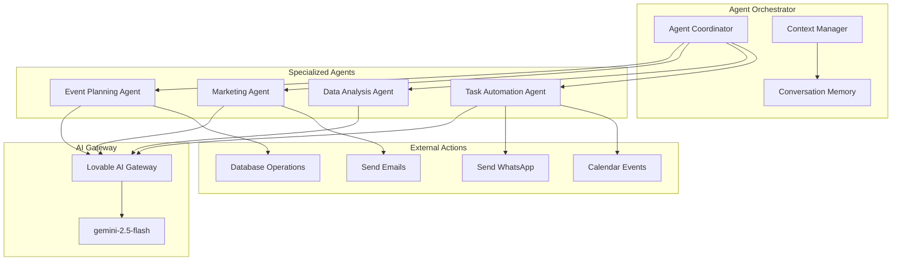
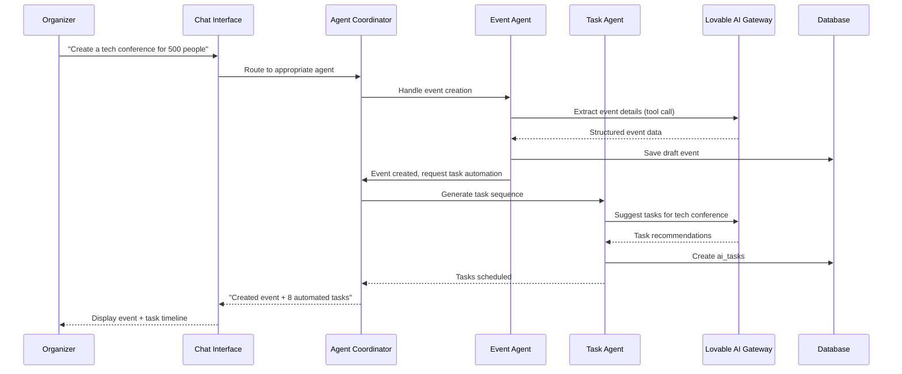

# 07 - AI Agents & Automation

## 🤖 Overview

AI-powered agents that automate event management tasks, provide insights, and assist organizers throughout the event lifecycle.

## 🏗️ Agent Architecture



## 🎯 Agent Types

### 1. Event Planning Agent

**Purpose**: Assist with event creation, venue recommendations, and logistics planning.

**Capabilities**:
- Extract structured event data from conversation
- Suggest optimal event dates and times
- Recommend venue capacity based on expected attendance
- Generate landing page configurations
- Create event schedules and agendas

**Tools**:
```typescript
const eventPlanningTools = [
  {
    type: 'function',
    function: {
      name: 'extract_event_details',
      description: 'Extract structured event information from natural language',
      parameters: {
        type: 'object',
        properties: {
          name: { type: 'string', description: 'Event name' },
          type: { 
            type: 'string', 
            enum: ['corporate', 'conference', 'workshop', 'networking', 'training'],
            description: 'Type of event'
          },
          start_date: { type: 'string', format: 'date-time' },
          end_date: { type: 'string', format: 'date-time' },
          capacity: { type: 'integer', description: 'Expected attendees' },
          description: { type: 'string' },
          target_audience: { type: 'string' }
        },
        required: ['name', 'type', 'start_date']
      }
    }
  },
  {
    type: 'function',
    function: {
      name: 'generate_landing_page',
      description: 'Generate landing page configuration',
      parameters: {
        type: 'object',
        properties: {
          hero: {
            type: 'object',
            properties: {
              headline: { type: 'string' },
              subheadline: { type: 'string' },
              cta_text: { type: 'string' }
            }
          },
          sections: {
            type: 'array',
            items: {
              type: 'object',
              properties: {
                type: { type: 'string', enum: ['about', 'schedule', 'speakers', 'faq'] },
                content: { type: 'string' }
              }
            }
          }
        }
      }
    }
  }
];
```

### 2. Marketing Agent

**Purpose**: Generate marketing content, optimize campaigns, and track engagement.

**Capabilities**:
- Write compelling event descriptions
- Generate social media posts
- Create email templates
- Suggest marketing strategies
- Analyze engagement metrics

**Tools**:
```typescript
const marketingTools = [
  {
    type: 'function',
    function: {
      name: 'generate_marketing_copy',
      description: 'Create marketing content for various channels',
      parameters: {
        type: 'object',
        properties: {
          channel: { 
            type: 'string', 
            enum: ['email', 'social_media', 'landing_page', 'ad_copy']
          },
          tone: {
            type: 'string',
            enum: ['professional', 'casual', 'urgent', 'friendly']
          },
          length: {
            type: 'string',
            enum: ['short', 'medium', 'long']
          },
          key_points: {
            type: 'array',
            items: { type: 'string' }
          }
        },
        required: ['channel']
      }
    }
  },
  {
    type: 'function',
    function: {
      name: 'suggest_posting_schedule',
      description: 'Recommend optimal times to post on social media',
      parameters: {
        type: 'object',
        properties: {
          event_date: { type: 'string', format: 'date-time' },
          target_audience: { type: 'string' },
          platforms: {
            type: 'array',
            items: { type: 'string', enum: ['linkedin', 'twitter', 'facebook'] }
          }
        }
      }
    }
  }
];
```

### 3. Data Analysis Agent

**Purpose**: Provide insights from event data, predict trends, and recommend optimizations.

**Capabilities**:
- Analyze ticket sales patterns
- Predict final attendance
- Identify revenue opportunities
- Compare event performance
- Generate reports and dashboards

**Tools**:
```typescript
const dataAnalysisTools = [
  {
    type: 'function',
    function: {
      name: 'analyze_sales_trend',
      description: 'Analyze ticket sales and predict final numbers',
      parameters: {
        type: 'object',
        properties: {
          event_id: { type: 'string', format: 'uuid' },
          analysis_type: {
            type: 'string',
            enum: ['trend', 'forecast', 'comparison']
          },
          time_period: { type: 'string', enum: ['7d', '30d', 'all'] }
        },
        required: ['event_id']
      }
    }
  },
  {
    type: 'function',
    function: {
      name: 'generate_insights',
      description: 'Generate actionable insights from event data',
      parameters: {
        type: 'object',
        properties: {
          event_id: { type: 'string', format: 'uuid' },
          insight_categories: {
            type: 'array',
            items: {
              type: 'string',
              enum: ['revenue', 'attendance', 'engagement', 'risks']
            }
          }
        }
      }
    }
  }
];
```

### 4. Task Automation Agent

**Purpose**: Automate routine tasks, schedule communications, and manage workflows.

**Capabilities**:
- Create automated task sequences
- Schedule reminder emails/WhatsApp
- Monitor event deadlines
- Execute post-event workflows
- Handle repetitive operations

**Tools**:
```typescript
const taskAutomationTools = [
  {
    type: 'function',
    function: {
      name: 'create_task_sequence',
      description: 'Create automated task sequence for event lifecycle',
      parameters: {
        type: 'object',
        properties: {
          event_id: { type: 'string', format: 'uuid' },
          sequence_type: {
            type: 'string',
            enum: ['pre_event', 'day_of', 'post_event']
          },
          tasks: {
            type: 'array',
            items: {
              type: 'object',
              properties: {
                action: { type: 'string' },
                trigger: { type: 'string' },
                delay_days: { type: 'integer' }
              }
            }
          }
        }
      }
    }
  },
  {
    type: 'function',
    function: {
      name: 'schedule_communication',
      description: 'Schedule email or WhatsApp messages',
      parameters: {
        type: 'object',
        properties: {
          channel: { type: 'string', enum: ['email', 'whatsapp'] },
          template_name: { type: 'string' },
          recipients: { type: 'array', items: { type: 'string' } },
          scheduled_time: { type: 'string', format: 'date-time' },
          variables: { type: 'object' }
        },
        required: ['channel', 'template_name', 'recipients', 'scheduled_time']
      }
    }
  }
];
```

## 🔄 Agent Workflow



## 💾 Database Schema

```sql
-- AI Agent execution logs
CREATE TABLE public.agent_executions (
  id UUID PRIMARY KEY DEFAULT gen_random_uuid(),
  conversation_id UUID REFERENCES ai_conversations(id) ON DELETE CASCADE,
  agent_type TEXT NOT NULL CHECK (agent_type IN ('event_planning', 'marketing', 'data_analysis', 'task_automation')),
  input_data JSONB NOT NULL,
  tool_calls JSONB DEFAULT '[]',
  output_data JSONB,
  status TEXT DEFAULT 'running' CHECK (status IN ('running', 'completed', 'failed')),
  error_message TEXT,
  execution_time_ms INTEGER,
  created_at TIMESTAMP WITH TIME ZONE DEFAULT NOW(),
  completed_at TIMESTAMP WITH TIME ZONE
);

CREATE INDEX idx_executions_conversation ON agent_executions(conversation_id);
CREATE INDEX idx_executions_status ON agent_executions(status);

-- Agent insights and recommendations
CREATE TABLE public.agent_insights (
  id UUID PRIMARY KEY DEFAULT gen_random_uuid(),
  event_id UUID REFERENCES ai_events(id) ON DELETE CASCADE,
  agent_type TEXT NOT NULL,
  insight_type TEXT NOT NULL CHECK (insight_type IN ('recommendation', 'warning', 'opportunity', 'prediction')),
  title TEXT NOT NULL,
  description TEXT NOT NULL,
  priority INTEGER DEFAULT 5 CHECK (priority >= 1 AND priority <= 10),
  metadata JSONB DEFAULT '{}',
  status TEXT DEFAULT 'active' CHECK (status IN ('active', 'dismissed', 'actioned')),
  created_at TIMESTAMP WITH TIME ZONE DEFAULT NOW()
);

CREATE INDEX idx_insights_event ON agent_insights(event_id, status);
CREATE INDEX idx_insights_priority ON agent_insights(priority DESC);

-- Agent learning feedback
CREATE TABLE public.agent_feedback (
  id UUID PRIMARY KEY DEFAULT gen_random_uuid(),
  execution_id UUID REFERENCES agent_executions(id) ON DELETE CASCADE,
  user_id UUID NOT NULL REFERENCES profiles(id) ON DELETE CASCADE,
  rating INTEGER CHECK (rating >= 1 AND rating <= 5),
  feedback_text TEXT,
  helpful BOOLEAN,
  created_at TIMESTAMP WITH TIME ZONE DEFAULT NOW()
);
```

## 🧠 Agent Prompts

### Event Planning Agent System Prompt

```typescript
const eventPlanningPrompt = `You are an expert event planning AI assistant. Your role is to help organizers create successful corporate events.

Your capabilities:
- Extract event details from natural conversation
- Suggest optimal dates, venues, and formats
- Generate compelling landing page content
- Recommend ticket pricing strategies
- Create event timelines and schedules

When extracting event information:
1. Listen for explicit details (dates, capacity, budget)
2. Infer implicit requirements (type of event → likely venue needs)
3. Ask clarifying questions when critical info is missing
4. Suggest industry best practices

Always provide structured output using the extract_event_details tool.
Always be concise, helpful, and professional.

Current date: ${new Date().toISOString()}`;
```

### Marketing Agent System Prompt

```typescript
const marketingPrompt = `You are a marketing copywriter specializing in corporate events.

Your expertise:
- Crafting compelling event descriptions
- Writing engaging email campaigns
- Creating social media content
- Optimizing call-to-action messaging

Guidelines:
- Match the tone to the event type (formal for corporate, casual for networking)
- Emphasize unique value propositions
- Create urgency without being pushy
- Use data-driven language for B2B audiences

When generating content:
1. Identify the target audience
2. Highlight key benefits and outcomes
3. Include clear calls-to-action
4. Optimize for the specific channel (email vs social media)

Use the generate_marketing_copy tool for all content creation.`;
```

### Task Automation Agent System Prompt

```typescript
const taskAutomationPrompt = `You are a workflow automation specialist for event management.

Your role:
- Create automated task sequences for events
- Schedule communications (email, WhatsApp)
- Monitor deadlines and trigger reminders
- Optimize repetitive operations

Standard event task sequence:
PRE-EVENT:
- 30 days before: Early bird pricing announcement
- 14 days before: Send reminder to registrants
- 7 days before: Final details and logistics email
- 1 day before: Check-in instructions

DAY OF EVENT:
- Morning: Welcome message with QR codes
- During: Real-time support monitoring

POST-EVENT:
- +1 day: Thank you email
- +3 days: Feedback survey
- +7 days: Follow-up content (recordings, slides)

Customize based on event type and organizer preferences.
Use create_task_sequence and schedule_communication tools.`;
```

## 📊 Agent Performance Metrics

```sql
-- Agent performance view
CREATE VIEW agent_performance AS
SELECT 
  agent_type,
  COUNT(*) as total_executions,
  COUNT(*) FILTER (WHERE status = 'completed') as successful,
  COUNT(*) FILTER (WHERE status = 'failed') as failed,
  AVG(execution_time_ms) as avg_execution_time,
  AVG(CASE 
    WHEN af.rating IS NOT NULL THEN af.rating 
    ELSE NULL 
  END) as avg_rating
FROM agent_executions ae
LEFT JOIN agent_feedback af ON ae.id = af.execution_id
GROUP BY agent_type;

-- Insights effectiveness
CREATE VIEW insights_effectiveness AS
SELECT 
  agent_type,
  insight_type,
  COUNT(*) as total_insights,
  COUNT(*) FILTER (WHERE status = 'actioned') as actioned,
  COUNT(*) FILTER (WHERE status = 'dismissed') as dismissed,
  ROUND(
    COUNT(*) FILTER (WHERE status = 'actioned')::NUMERIC / 
    NULLIF(COUNT(*), 0) * 100, 
    2
  ) as action_rate_percent
FROM agent_insights
GROUP BY agent_type, insight_type;
```

## 🔧 Edge Function Implementation

```typescript
// supabase/functions/execute-agent/index.ts
import { serve } from "https://deno.land/std@0.168.0/http/server.ts";

const AGENT_PROMPTS: Record<string, string> = {
  event_planning: eventPlanningPrompt,
  marketing: marketingPrompt,
  data_analysis: dataAnalysisPrompt,
  task_automation: taskAutomationPrompt,
};

const AGENT_TOOLS: Record<string, any[]> = {
  event_planning: eventPlanningTools,
  marketing: marketingTools,
  data_analysis: dataAnalysisTools,
  task_automation: taskAutomationTools,
};

serve(async (req) => {
  const corsHeaders = { 'Access-Control-Allow-Origin': '*' };
  if (req.method === 'OPTIONS') return new Response(null, { headers: corsHeaders });

  try {
    const { agentType, conversationId, userMessage } = await req.json();
    
    const authHeader = req.headers.get('Authorization')!;
    const supabase = createClient(
      Deno.env.get('SUPABASE_URL')!,
      Deno.env.get('SUPABASE_ANON_KEY')!,
      { global: { headers: { Authorization: authHeader } } }
    );

    // Log execution start
    const { data: execution } = await supabase
      .from('agent_executions')
      .insert({
        conversation_id: conversationId,
        agent_type: agentType,
        input_data: { message: userMessage },
        status: 'running'
      })
      .select()
      .single();

    const startTime = Date.now();

    // Call Lovable AI with agent-specific prompt and tools
    const response = await fetch('https://ai.gateway.lovable.dev/v1/chat/completions', {
      method: 'POST',
      headers: {
        'Authorization': `Bearer ${Deno.env.get('LOVABLE_API_KEY')}`,
        'Content-Type': 'application/json',
      },
      body: JSON.stringify({
        model: 'google/gemini-2.5-flash',
        messages: [
          { role: 'system', content: AGENT_PROMPTS[agentType] },
          { role: 'user', content: userMessage }
        ],
        tools: AGENT_TOOLS[agentType],
        tool_choice: 'auto',
        stream: false
      })
    });

    const result = await response.json();
    const executionTime = Date.now() - startTime;

    // Extract tool calls and results
    const toolCalls = result.choices?.[0]?.message?.tool_calls || [];
    const assistantMessage = result.choices?.[0]?.message?.content;

    // Log execution completion
    await supabase
      .from('agent_executions')
      .update({
        tool_calls: toolCalls,
        output_data: { message: assistantMessage, tool_results: toolCalls },
        status: 'completed',
        execution_time_ms: executionTime,
        completed_at: new Date().toISOString()
      })
      .eq('id', execution.id);

    return new Response(
      JSON.stringify({
        executionId: execution.id,
        message: assistantMessage,
        toolCalls: toolCalls
      }),
      { headers: { ...corsHeaders, 'Content-Type': 'application/json' } }
    );

  } catch (error) {
    console.error('Agent execution error:', error);
    return new Response(JSON.stringify({ error: error.message }), {
      status: 500,
      headers: { ...corsHeaders, 'Content-Type': 'application/json' }
    });
  }
});
```

## ✅ Implementation Checklist

- [ ] Database tables for agent executions/insights/feedback
- [ ] Edge function: execute-agent
- [ ] Define system prompts for each agent type
- [ ] Implement tool calling for structured output
- [ ] Create agent routing logic in coordinator
- [ ] Build UI for agent insights display
- [ ] Add feedback mechanism for agent responses
- [ ] Implement agent performance tracking
- [ ] Create automated task execution from agent recommendations
- [ ] Test all agent types end-to-end

## 🚀 Usage Example

```typescript
// Execute event planning agent
const { data } = await supabase.functions.invoke('execute-agent', {
  body: {
    agentType: 'event_planning',
    conversationId: 'conv-uuid',
    userMessage: 'I want to organize a tech conference for 500 developers in March'
  }
});

// Result includes:
// - assistantMessage: natural language response
// - toolCalls: structured data extractions
// - executionId: for feedback tracking
```

## 📈 Success Metrics

- **Agent Accuracy**: % of tool calls that produce valid structured output
- **User Satisfaction**: Average rating from feedback (target: 4.5+/5)
- **Task Completion**: % of agent-generated tasks that are executed
- **Time Saved**: Reduction in manual event setup time (target: 70%)
- **Insight Action Rate**: % of insights that organizers act on (target: 60%)
