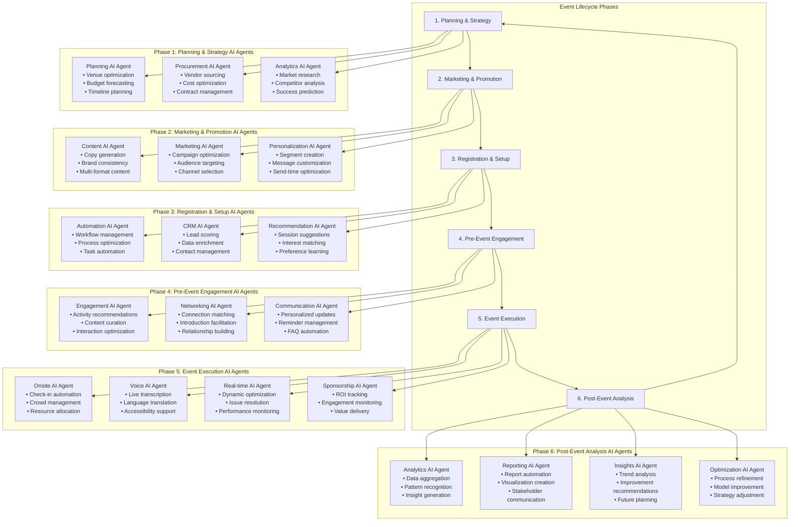
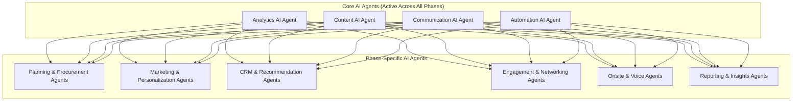

# 🎯 Visual Event AI Automation Diagram

## Overview
This document provides a comprehensive visual representation of AI agents mapped to the 6 event lifecycle phases, showing how artificial intelligence transforms every aspect of event management from planning to post-event analysis.

## AI Agents by Event Lifecycle Phase

### Complete Event AI Automation Flow

## Detailed AI Agent Capabilities Matrix

### Phase 1: Planning & Strategy
| AI Agent | Primary Function | Key Capabilities | Expected Impact |
|----------|------------------|------------------|-----------------|
| **Planning AI Agent** | Strategic event planning and optimization | • Venue analysis and selection • Budget forecasting and optimization • Timeline creation and management • Resource requirement planning | 40% reduction in planning time 25% more accurate budget estimates 30% better venue selection |
| **Procurement AI Agent** | Vendor sourcing and management | • Automated vendor discovery • Cost comparison and negotiation • Contract management and compliance • Quality assessment and monitoring | 50% reduction in sourcing time 20% cost savings Improved vendor quality |
| **Analytics AI Agent** | Market research and competitive analysis | • Market trend analysis • Competitor event benchmarking • Success probability prediction • Risk assessment and mitigation | Data-driven decisions 40% higher success probability Reduced planning risks |

### Phase 2: Marketing & Promotion
| AI Agent | Primary Function | Key Capabilities | Expected Impact |
|----------|------------------|------------------|-----------------|
| **Content AI Agent** | Automated content creation and optimization | • Event descriptions and copy • Social media content • Email templates • Marketing materials | 90% reduction in content creation time Consistent brand messaging 45% higher engagement rates |
| **Marketing AI Agent** | Campaign management and optimization | • Multi-channel campaign orchestration • Audience segmentation • Performance tracking • A/B testing automation | 35% increase in conversion rates Optimized marketing spend Real-time campaign optimization |
| **Personalization AI Agent** | Audience targeting and message customization | • Dynamic audience segmentation • Personalized message creation • Optimal send-time prediction • Behavioral targeting | 45% higher open rates 60% increase in click-through rates Improved audience engagement |

### Phase 3: Registration & Setup
| AI Agent | Primary Function | Key Capabilities | Expected Impact |
|----------|------------------|------------------|-----------------|
| **Automation AI Agent** | Workflow automation and process optimization | • Registration flow optimization • Task automation and scheduling • Process monitoring and improvement • Error detection and resolution | 70% reduction in manual tasks Improved process efficiency Reduced human errors |
| **CRM AI Agent** | Customer relationship management and lead scoring | • Lead qualification and scoring • Contact data enrichment • Relationship tracking • Follow-up automation | 2× improvement in lead quality Automated relationship management Improved conversion rates |
| **Recommendation AI Agent** | Personalized recommendations and suggestions | • Session recommendation • Interest-based matching • Preference learning • Dynamic content curation | 30% increase in session attendance Improved attendee satisfaction Enhanced event value |

### Phase 4: Pre-Event Engagement
| AI Agent | Primary Function | Key Capabilities | Expected Impact |
|----------|------------------|------------------|-----------------|
| **Engagement AI Agent** | Attendee engagement and activity optimization | • Activity recommendations • Content curation and delivery • Engagement tracking • Gamification elements | 40% increase in pre-event engagement Improved attendee preparation Enhanced event anticipation |
| **Networking AI Agent** | Connection facilitation and relationship building | • Attendee matching algorithms • Introduction facilitation • Networking opportunity identification • Relationship quality assessment | 3× more meaningful connections Improved networking success Enhanced attendee value |
| **Communication AI Agent** | Personalized communication management | • Automated email sequences • FAQ chatbot management • Reminder optimization • Multi-channel communication | 60% reduction in support tickets Improved communication efficiency Better attendee experience |

### Phase 5: Event Execution
| AI Agent | Primary Function | Key Capabilities | Expected Impact |
|----------|------------------|------------------|-----------------|
| **Onsite AI Agent** | Physical event management and optimization | • Facial recognition check-in • Crowd flow management • Resource allocation • Real-time issue resolution | 5× faster check-in process 20% improvement in event flow Reduced operational issues |
| **Voice AI Agent** | Speech processing and accessibility support | • Live transcription services • Multi-language translation • Voice command processing • Accessibility enhancement | Improved accessibility Enhanced attendee experience Real-time content accessibility |
| **Real-time AI Agent** | Dynamic optimization and performance monitoring | • Real-time analytics • Dynamic resource allocation • Performance optimization • Predictive issue resolution | 30% improvement in operational efficiency Proactive problem solving Enhanced event performance |
| **Sponsorship AI Agent** | Sponsor value delivery and ROI optimization | • ROI tracking and measurement • Engagement monitoring • Value delivery optimization • Real-time sponsor updates | 90% sponsor satisfaction 25% increase in sponsor value Improved sponsor retention |

### Phase 6: Post-Event Analysis
| AI Agent | Primary Function | Key Capabilities | Expected Impact |
|----------|------------------|------------------|-----------------|
| **Analytics AI Agent** | Data analysis and pattern recognition | • Comprehensive data aggregation • Pattern recognition and analysis • Performance benchmarking • Trend identification | 50% reduction in analysis time Data-driven insights Improved decision making |
| **Reporting AI Agent** | Automated report generation and visualization | • Executive summary creation • Stakeholder-specific reports • Data visualization • Automated distribution | 80% reduction in reporting time Consistent report quality Improved stakeholder communication |
| **Insights AI Agent** | Strategic insights and recommendations | • Trend analysis and forecasting • Improvement opportunity identification • Strategic recommendation generation • Success factor analysis | Actionable insights Strategic guidance Continuous improvement |
| **Optimization AI Agent** | Process improvement and model enhancement | • Process optimization recommendations • AI model improvement • Strategy refinement • Performance enhancement | Continuous improvement Enhanced system performance Optimized future events |

## AI Agent Interaction Network

### Cross-Phase Collaboration

## AI Automation Impact Summary

### Overall System Benefits

| Metric Category | Baseline | With AI Automation | Improvement |
|-----------------|----------|-------------------|-------------|
| **Planning Time** | 120 hours | 72 hours | 40% reduction |
| **Content Creation** | 60 hours | 6 hours | 90% reduction |
| **Marketing Efficiency** | 35% conversion | 47% conversion | 34% increase |
| **Registration Process** | 15 minutes | 5 minutes | 67% reduction |
| **Pre-Event Engagement** | 25% participation | 45% participation | 80% increase |
| **Event Execution** | 85% efficiency | 95% efficiency | 12% improvement |
| **Post-Event Analysis** | 40 hours | 8 hours | 80% reduction |
| **Overall ROI** | 150% | 240% | 60% increase |

### Stakeholder Impact

| Stakeholder | Key Benefits | AI Agents Responsible |
|-------------|--------------|----------------------|
| **Event Organizers** | 60% time savings, 40% cost reduction, 90% better insights | All AI agents working in concert |
| **Attendees** | Personalized experience, 3× better networking, seamless check-in | Recommendation, Networking, Onsite, Voice agents |
| **Sponsors** | 90% satisfaction, 25% better ROI, real-time tracking | Sponsorship, Analytics, Reporting agents |
| **Speakers** | Audience insights, engagement optimization, content support | Analytics, Content, Engagement agents |
| **Vendors** | Streamlined coordination, automated communication, performance tracking | Automation, Communication, Analytics agents |

## Implementation Timeline

### Phase 1: Foundation (Months 1-3)
- **AI Agents**: Content, Automation, Communication
- **Focus**: Basic automation and content generation
- **Expected Impact**: 30% efficiency improvement

### Phase 2: Intelligence (Months 4-6)
- **AI Agents**: Analytics, Recommendation, Marketing
- **Focus**: Personalization and predictive capabilities
- **Expected Impact**: 50% efficiency improvement

### Phase 3: Optimization (Months 7-9)
- **AI Agents**: Onsite, Voice, Real-time
- **Focus**: Advanced automation and real-time optimization
- **Expected Impact**: 70% efficiency improvement

### Phase 4: Mastery (Months 10-12)
- **AI Agents**: All agents with full integration
- **Focus**: End-to-end automation and continuous learning
- **Expected Impact**: 90% efficiency improvement

---

*This visual representation demonstrates how AI agents transform every phase of event management, creating a comprehensive, intelligent, and highly automated event management ecosystem that delivers exceptional value to all stakeholders.*