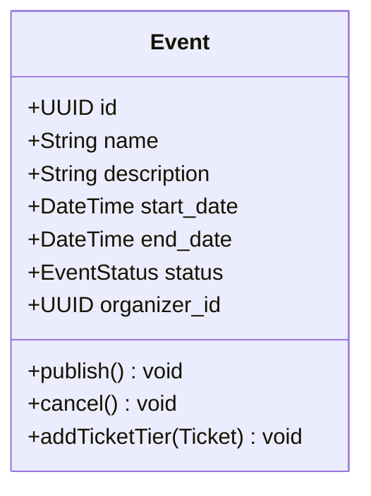
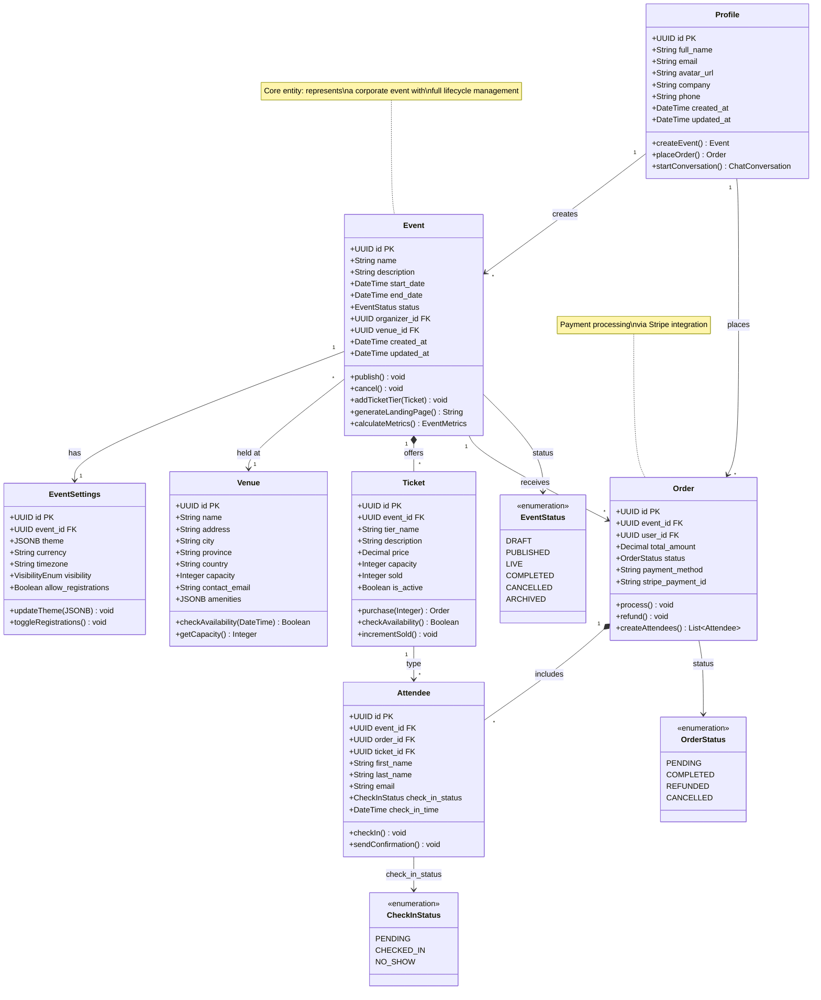

# 🧱 EventOS Class Diagram - Claude Prompt

**Diagram Type:** Class Diagram
**Purpose:** Visualize data entities, attributes, and relationships
**Output Format:** Mermaid class diagram syntax

---

## 🎯 Objective

Generate **Mermaid class diagrams** that show the data model structure for EventOS, including:
- Main entities (classes)
- Attributes (properties)
- Methods (operations)
- Relationships (associations, inheritance, composition)
- Cardinality (1:1, 1:N, N:M)

---

## 📋 EventOS Context

**Project:** EventOS - AI-Powered Corporate Event Management Platform

**Database:** Supabase PostgreSQL with Row-Level Security

**Key Entity Groups:**
1. **Users & Authentication** - profiles, user_roles
2. **Events** - events, venues, tickets, event_settings
3. **Sponsors & Vendors** - sponsors, sponsorships, vendors, event_vendors
4. **Attendees & Orders** - orders, attendees
5. **CRM** - crm_contacts, crm_opportunities, crm_activities
6. **AI & Chat** - chat_conversations, chat_messages, ai_tasks
7. **Analytics** - event_metrics, system_logs

---

## 🧠 Class Structure Guidelines

### Entity Classes

**Profile (User)**
```
Attributes:
- id: UUID (PK)
- full_name: string
- email: string
- avatar_url: string
- company: string
- phone: string
- created_at: timestamp
- updated_at: timestamp

Methods:
+ createEvent(): Event
+ placeOrder(): Order
+ startConversation(): Conversation
```

**Event**
```
Attributes:
- id: UUID (PK)
- name: string
- description: text
- start_date: timestamp
- end_date: timestamp
- status: enum (draft, published, live, completed, cancelled)
- organizer_id: UUID (FK)
- venue_id: UUID (FK)
- created_at: timestamp
- updated_at: timestamp

Methods:
+ publish(): void
+ cancel(): void
+ addTicketTier(tier: Ticket): void
+ generateLandingPage(): string
+ calculateMetrics(): EventMetrics
```

---

## 📐 Relationship Types to Show

### Association (1:N, N:M)
- Profile **creates many** Events (1:N)
- Event **has many** Tickets (1:N)
- Event **has many-to-many** Sponsors via Sponsorships (N:M)

### Composition (strong ownership)
- Event **composed of** EventSettings (1:1)
- Order **composed of** Attendees (1:N)

### Aggregation (weak ownership)
- Event **aggregates** Venue (1:1, venue exists independently)

### Inheritance
- CRMContact **inherits from** BaseContact
- SystemLog **inherits from** BaseLog

---

## 🚀 Instructions to Claude

Generate **5 Mermaid class diagrams** for EventOS:

### 1. **Core Event Management System**

**Title:** EventOS Core Domain Model

**Classes to Include:**
- Profile
- Event
- EventSettings
- Venue
- Ticket
- Order
- Attendee

**Relationships:**
- Profile `1` → `*` Event (creates)
- Event `1` → `1` EventSettings (has)
- Event `*` → `1` Venue (held at)
- Event `1` → `*` Ticket (offers)
- Event `1` → `*` Order (receives)
- Order `1` → `*` Attendee (includes)
- Ticket `1` → `*` Attendee (type)

**Key Attributes for Each Class:**
- Show primary keys (id)
- Show foreign keys
- Show 3-5 most important business attributes
- Show status/enum fields

**Key Methods for Each Class:**
- Show 3-5 main operations
- Use verb-noun naming (createEvent, placeOrder)
- Show return types

---

### 2. **Sponsorship & Vendor Management**

**Title:** Sponsor and Vendor Relationship Model

**Classes to Include:**
- Event
- Sponsor
- Sponsorship (join entity)
- Vendor
- EventVendor (join entity)

**Relationships:**
- Event `*` ←→ `*` Sponsor via Sponsorship
- Event `*` ←→ `*` Vendor via EventVendor

**Show Association Classes:**
- Sponsorship should have attributes: level, amount, benefits, status
- EventVendor should have attributes: service_details, contract_amount, status

---

### 3. **CRM & Contact Management**

**Title:** CRM Data Model

**Classes to Include:**
- CRMOrganizer
- CRMContact
- CRMOpportunity
- CRMActivity
- CRMNote

**Relationships:**
- CRMOrganizer `1` → `*` CRMContact (manages)
- CRMOrganizer `1` → `*` CRMOpportunity (tracks)
- CRMContact `1` → `*` CRMOpportunity (related to)
- CRMContact `1` → `*` CRMActivity (has)
- CRMOpportunity `1` → `*` CRMActivity (linked to)
- CRMContact `1` → `*` CRMNote (has)

**Show Enums:**
- Contact type: sponsor, vendor, attendee, lead
- Opportunity stage: lead, qualified, proposal, negotiation, won, lost
- Activity type: call, email, meeting, note, task

---

### 4. **AI Chat & Task Management**

**Title:** AI Conversation and Task Model

**Classes to Include:**
- Profile
- ChatConversation
- ChatMessage
- Event
- AITask

**Relationships:**
- Profile `1` → `*` ChatConversation (starts)
- ChatConversation `1` → `*` ChatMessage (contains)
- ChatConversation `*` → `0..1` Event (discusses)
- Event `1` → `*` AITask (has)
- ChatConversation `1` → `*` AITask (generates)

**Show Specialized Attributes:**
- ChatMessage.tool_calls: JSONB (AI function calls)
- ChatConversation.metadata: JSONB (context data)
- AITask.category: enum (venue, marketing, operations, etc.)

---

### 5. **Analytics & Metrics**

**Title:** Event Analytics Model

**Classes to Include:**
- Event
- EventMetrics
- SystemLog
- Notification

**Relationships:**
- Event `1` → `1` EventMetrics (has)
- Event `1` → `*` SystemLog (generates)
- Profile `1` → `*` Notification (receives)

**Show Calculated Fields:**
- EventMetrics.conversion_rate: numeric (calculated)
- EventMetrics.engagement_score: numeric (calculated)

---

## ✅ Output Requirements

**For each class diagram, provide:**

1. **Clear title** describing the domain
2. **All classes** with:
   - Class name (noun, PascalCase)
   - Attributes with types
   - Primary key (PK) and foreign keys (FK) marked
   - Methods with return types
3. **Relationships** with:
   - Cardinality clearly shown (1:1, 1:N, N:M)
   - Relationship labels (verb phrases)
   - Arrow direction indicating ownership
4. **Association classes** for many-to-many with attributes
5. **Enums** shown as separate classes or notes
6. **Valid Mermaid syntax** ready to render

**Styling Preferences:**
```mermaid
%%{init: {'theme': 'base', 'themeVariables': { 'primaryColor': '#3b82f6', 'primaryTextColor': '#fff', 'primaryBorderColor': '#1e40af', 'lineColor': '#64748b'}}}%%
```

---

## 📋 Mermaid Class Diagram Syntax

### Basic Class


### Relationships
```mermaid
Profile "1" --> "*" Event : creates
Event "1" --> "1" EventSettings : has
Event "*" --> "1" Venue : held at
Event "1" *-- "*" Ticket : contains (composition)
Event "1" o-- "*" Attendee : includes (aggregation)
```

### Cardinality Notation
- `1` : Exactly one
- `0..1` : Zero or one
- `*` : Many (zero or more)
- `1..*` : One or more

### Relationship Types
- `-->` : Association
- `--` : Solid line (strong association)
- `..>` : Dependency (dashed)
- `--|>` : Inheritance
- `--*` : Composition (filled diamond)
- `--o` : Aggregation (hollow diamond)

### Enums
```mermaid
class EventStatus {
    <<enumeration>>
    DRAFT
    PUBLISHED
    LIVE
    COMPLETED
    CANCELLED
}
```

### Abstract Classes
```mermaid
class BaseEntity {
    <<abstract>>
    +UUID id
    +DateTime created_at
    +DateTime updated_at
}

Event --|> BaseEntity
```

### Interfaces
```mermaid
class Timestamped {
    <<interface>>
    +DateTime created_at
    +DateTime updated_at
}

Event ..|> Timestamped
```

---

## 🎨 Example: Core Event Management Model



---

## 🚀 Final Instruction

> "Generate **5 complete Mermaid class diagrams** for EventOS based on the domain models described above.
> Each diagram should show all classes with attributes (including types and PK/FK), key methods with return types, relationships with proper cardinality, enums as separate classes, and be production-ready with valid Mermaid syntax.
> Output each diagram separately with a descriptive title and brief explanation of the domain it represents."

---

**Created:** October 11, 2025
**For:** EventOS System Documentation
**Purpose:** Generate comprehensive class diagrams for data model
**Status:** Ready for Claude ✅
