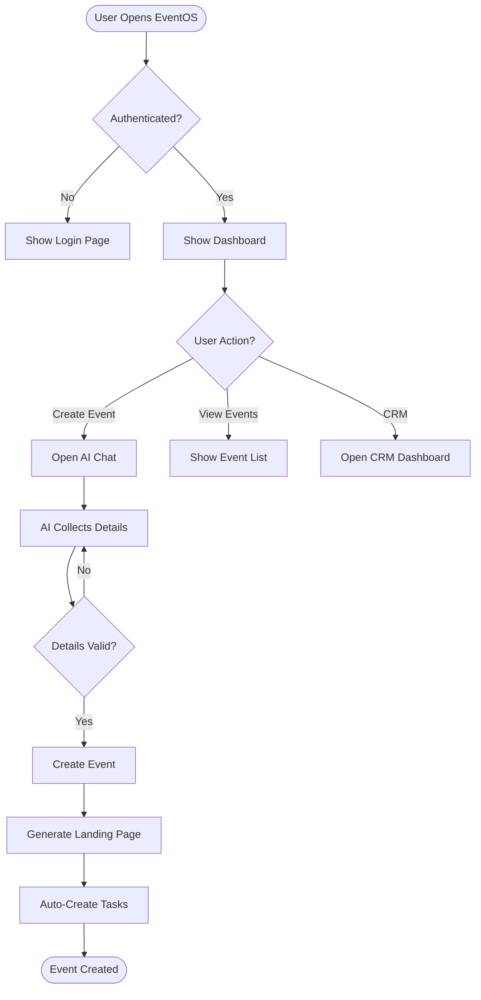
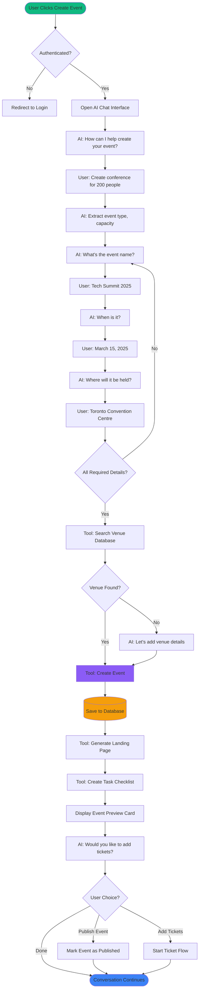

# 🗺️ EventOS Flowchart Diagram - Claude Prompt

**Diagram Type:** Flowchart
**Purpose:** Visualize overall system logic and process flows
**Output Format:** Mermaid flowchart syntax

---

## 🎯 Objective

Generate a **Mermaid flowchart** that shows the main process flows in EventOS, including:
- Event creation workflow (AI-assisted)
- Ticket purchase flow
- Sponsor/vendor onboarding
- CRM contact management
- Task automation triggers

---

## 📋 EventOS Context

**Project:** EventOS - AI-Powered Corporate Event Management Platform

**Main Workflows to Model:**

1. **AI-Assisted Event Creation**
   - User starts chat conversation
   - AI collects event details iteratively
   - System creates event in database
   - Landing page auto-generated
   - Tasks auto-created

2. **Ticket Purchase Flow**
   - Attendee visits event landing page
   - Selects ticket tier
   - Stripe checkout
   - Payment confirmation
   - Email confirmation sent
   - Attendee record created

3. **Sponsor Onboarding**
   - Organizer adds sponsor
   - Sponsor level selected (Platinum/Gold/Silver/Bronze)
   - Benefits assigned
   - Logo upload
   - Sponsorship confirmed

4. **CRM Contact Management**
   - Organizer imports/adds contact
   - Contact type assigned (Sponsor/Vendor/Lead)
   - Activities tracked
   - Opportunities created
   - Follow-up tasks scheduled

5. **Task Automation**
   - Event created trigger
   - AI analyzes event details
   - Tasks auto-generated by category
   - Priorities assigned
   - Due dates calculated

---

## 🧠 Required Flowchart Elements

### Standard Shapes
- **Rectangle** → Process/Action
- **Diamond** → Decision point
- **Circle** → Start/End
- **Parallelogram** → Input/Output

### Key Decision Points to Show
- User authenticated? (Yes/No)
- Event details complete? (Yes/No)
- Payment successful? (Yes/No)
- Sponsor level? (Platinum/Gold/Silver/Bronze)
- Contact type? (Sponsor/Vendor/Lead/Attendee)

### Error Handling Paths
- Payment failed → Show error → Retry
- Validation failed → Show errors → Re-submit
- AI service unavailable → Fallback to manual

---

## 📐 Example Mermaid Flowchart Syntax



---

## 🚀 Instructions to Claude

Generate **5 separate Mermaid flowcharts** for EventOS:

### 1. **Main Application Flow**
Show high-level navigation and user paths from login through main features.

**Include:**
- Authentication gate
- Dashboard navigation
- Main features (Chat, Events, CRM, Analytics)
- User role branches (Organizer, Sponsor, Vendor, Admin)

### 2. **AI Event Creation Flow**
Detail the step-by-step AI chat interaction for creating events.

**Include:**
- Start conversation
- AI asks questions (name, date, location, capacity, etc.)
- Iterative clarification loop
- Validation checks
- Event creation
- Landing page generation
- Task checklist creation
- Success confirmation

### 3. **Ticket Purchase Flow**
Show attendee journey from landing page to confirmed ticket.

**Include:**
- View event landing page
- Browse ticket tiers
- Select quantity
- Enter attendee details
- Stripe checkout redirect
- Payment processing
- Success/failure handling
- Email confirmation
- Add to calendar option

### 4. **Sponsor/Vendor Management Flow**
Show how organizers add and manage sponsors/vendors.

**Include:**
- Add sponsor/vendor form
- Select type (Sponsor vs Vendor)
- Choose level/service type
- Upload documents (logo, contract)
- Set benefits/details
- Confirmation
- Link to event

### 5. **CRM Activity Tracking Flow**
Show how organizers track interactions with contacts.

**Include:**
- Select contact
- Choose activity type (Call, Email, Meeting, Note)
- Enter activity details
- Set follow-up date
- Link to opportunity (optional)
- Save activity
- Update opportunity stage (if linked)

---

## ✅ Output Requirements

**For each flowchart, provide:**

1. **Clear title** describing the workflow
2. **Start and end points** clearly marked
3. **Decision diamonds** for all conditional logic
4. **Error handling paths** shown in red/dashed lines
5. **Success paths** shown in green/solid lines
6. **Descriptive labels** for each step (verb-noun format)
7. **Logical grouping** using subgraphs if needed
8. **Valid Mermaid syntax** ready to paste and render

**Styling Preferences:**
```mermaid
%%{init: {'theme': 'base', 'themeVariables': { 'primaryColor': '#3b82f6', 'primaryTextColor': '#fff', 'primaryBorderColor': '#1e40af', 'lineColor': '#64748b', 'secondaryColor': '#10b981', 'tertiaryColor': '#ef4444'}}}%%
```

---

## 📋 EventOS-Specific Details

**Tech Stack:**
- Frontend: React, TypeScript, Vite
- Backend: Supabase (PostgreSQL, Edge Functions)
- AI: Lovable AI Gateway (google/gemini-2.5-flash)
- Payments: Stripe
- Auth: Supabase Auth

**Key Tables:**
- `profiles`, `events`, `tickets`, `orders`, `attendees`
- `sponsors`, `sponsorships`, `vendors`, `event_vendors`
- `chat_conversations`, `chat_messages`, `ai_tasks`
- `crm_contacts`, `crm_opportunities`, `crm_activities`

**External Services:**
- Stripe API (checkout, webhooks)
- Resend API (email notifications)
- WhatsApp Business API (future)
- Lovable AI Gateway (SSE streaming)

---

## 🎨 Example: AI Event Creation Flow



---

## 🚀 Final Instruction

> "Generate **5 complete Mermaid flowcharts** for EventOS based on the workflows described above.
> Each flowchart should be production-ready, clearly labeled, include error handling, and use proper Mermaid syntax.
> Output each diagram separately with a descriptive title and brief explanation of what it shows."

---

**Created:** October 11, 2025
**For:** EventOS System Documentation
**Purpose:** Generate comprehensive flowcharts for all major workflows
**Status:** Ready for Claude ✅
