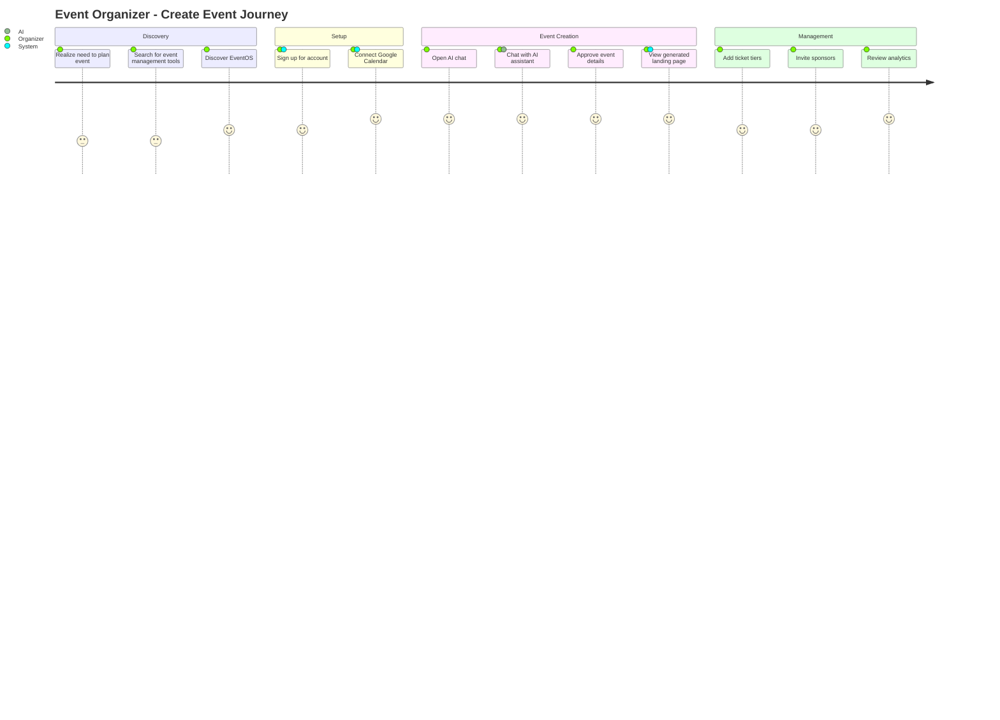
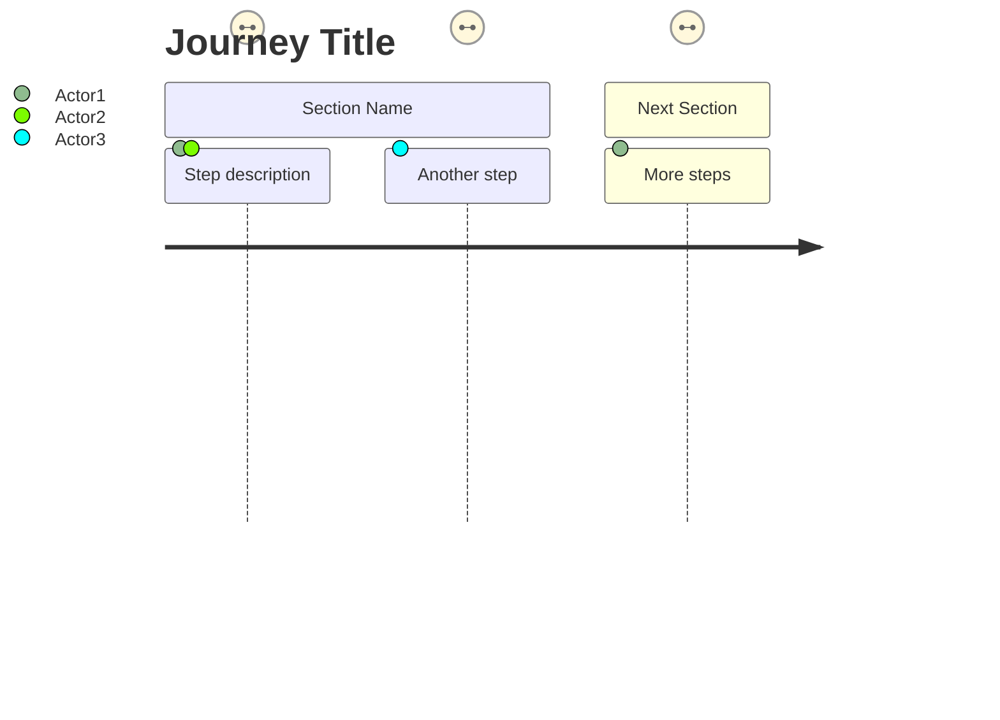

# 🚀 EventOS User Journey Diagram - Claude Prompt

**Diagram Type:** User Journey Diagram
**Purpose:** Visualize user experience and emotional journey through the system
**Output Format:** Mermaid journey diagram syntax

---

## 🎯 Objective

Generate **Mermaid user journey diagrams** that show:
- User personas (Organizer, Attendee, Sponsor, Vendor)
- Journey stages (steps in the process)
- User satisfaction scores (1-5)
- Actor performing each action
- Emotional highs and lows throughout experience

---

## 📋 EventOS Context

**Project:** EventOS - AI-Powered Corporate Event Management Platform

**User Personas:**

1. **Event Organizer** - Corporate professional planning events
2. **Attendee** - Person registering for and attending events
3. **Sponsor** - Company sponsoring corporate events
4. **Vendor** - Service provider (catering, AV, etc.)
5. **System** - Automated actions by EventOS

**Key User Journeys:**

1. **Organizer: Create Event via AI Chat**
2. **Attendee: Purchase Ticket & Attend Event**
3. **Sponsor: Onboard & Activate Sponsorship**
4. **Vendor: Get Hired for Event**
5. **Organizer: Manage Multiple Events**
6. **Attendee: Discover Event & Register**

---

## 🧠 Journey Scoring System

### Satisfaction Scores (1-5)
- **5** - Delighted (exceeds expectations, moment of joy)
- **4** - Satisfied (meets expectations, smooth experience)
- **3** - Neutral (acceptable, neither good nor bad)
- **2** - Frustrated (friction, problems encountered)
- **1** - Very Frustrated (major pain point, considering abandoning)

### Journey Stages
- **Discovery** - User becomes aware of need/opportunity
- **Consideration** - User evaluates options
- **Action** - User takes primary action
- **Experience** - User uses the product/service
- **Outcome** - User achieves goal or result
- **Retention** - User returns or continues relationship

---

## 📐 Example Mermaid Journey Syntax



---

## 🚀 Instructions to Claude

Generate **6 Mermaid user journey diagrams** for EventOS:

### 1. **Event Organizer: AI-Assisted Event Creation**

**Title:** Event Organizer - Create Corporate Event Journey

**Persona:** Sarah, 36-year-old HR manager planning company training workshop

**Journey Stages:**

**Section 1: Discovery & Setup**
- Assigned to plan quarterly training event (Score: 3, Actor: Organizer)
- Overwhelmed by manual planning process (Score: 2, Actor: Organizer)
- Colleague recommends EventOS (Score: 4, Actor: Organizer)
- Sign up for account in 2 minutes (Score: 4, Actor: Organizer, System)

**Section 2: Event Creation**
- Open AI chat interface (Score: 4, Actor: Organizer)
- Chat: "Create training workshop for 50 people" (Score: 5, Actor: Organizer, AI)
- AI asks clarifying questions naturally (Score: 5, Actor: AI)
- Provide event details conversationally (Score: 5, Actor: Organizer)
- AI creates event instantly (Score: 5, Actor: AI, System)
- View beautiful event preview card (Score: 5, Actor: Organizer)

**Section 3: Customization**
- Review auto-generated landing page (Score: 5, Actor: Organizer)
- Add custom branding (Score: 4, Actor: Organizer)
- Create 2 ticket tiers (Early Bird, Regular) (Score: 4, Actor: Organizer)
- Review AI-generated task checklist (Score: 5, Actor: Organizer)

**Section 4: Launch**
- Publish event with one click (Score: 5, Actor: Organizer, System)
- Share landing page link with team (Score: 5, Actor: Organizer)
- Watch registrations come in real-time (Score: 5, Actor: Organizer)
- Receive first ticket sale notification (Score: 5, Actor: System, Organizer)

**Section 5: Event Day**
- Check in attendees with QR codes (Score: 4, Actor: Organizer, Attendee)
- Monitor attendance dashboard (Score: 4, Actor: Organizer)
- Event runs smoothly (Score: 5, Actor: Organizer, Attendee)

**Section 6: Post-Event**
- View attendance analytics (Score: 5, Actor: Organizer)
- Export attendee list (Score: 4, Actor: Organizer)
- Send post-event survey (Score: 4, Actor: Organizer, System)
- Plan next event with confidence (Score: 5, Actor: Organizer)

**Expected Emotional Arc:**
- Start: Stressed about planning (2)
- Peak: AI creates event instantly (5)
- Maintain: High satisfaction throughout (4-5)
- End: Confident and ready to repeat (5)

---

### 2. **Attendee: Ticket Purchase & Event Attendance**

**Title:** Attendee - Discover, Register, and Attend Event

**Persona:** Marcus, 42-year-old business owner attending networking event

**Journey Stages:**

**Section 1: Discovery**
- Receive event link from colleague (Score: 4, Actor: Attendee)
- Open beautiful landing page (Score: 5, Actor: Attendee)
- Read event description (Score: 4, Actor: Attendee)
- Check date and location (Score: 4, Actor: Attendee)

**Section 2: Registration**
- Compare ticket tiers (Early Bird vs Regular) (Score: 4, Actor: Attendee)
- Select Early Bird ticket (Score: 4, Actor: Attendee)
- Enter attendee details (Score: 4, Actor: Attendee)
- Redirect to Stripe checkout (Score: 4, Actor: Attendee, System)

**Section 3: Payment**
- Enter payment details (Score: 3, Actor: Attendee)
- Payment processes quickly (Score: 4, Actor: System)
- See confirmation screen (Score: 5, Actor: Attendee, System)

**Section 4: Confirmation**
- Receive email with ticket + QR code (Score: 5, Actor: System, Attendee)
- Add event to Google Calendar (Score: 5, Actor: Attendee, System)
- Save QR code to phone (Score: 4, Actor: Attendee)

**Section 5: Reminder**
- Receive reminder 1 day before (Score: 4, Actor: System, Attendee)
- Review event details again (Score: 4, Actor: Attendee)
- Plan travel to venue (Score: 4, Actor: Attendee)

**Section 6: Event Day**
- Arrive at venue (Score: 4, Actor: Attendee)
- QR code scanned instantly (Score: 5, Actor: Attendee, Organizer)
- Enter event smoothly (Score: 5, Actor: Attendee)
- Enjoy networking (Score: 5, Actor: Attendee)

**Section 7: Post-Event**
- Receive thank you email (Score: 4, Actor: System, Attendee)
- Complete feedback survey (Score: 4, Actor: Attendee)
- Share event on LinkedIn (Score: 5, Actor: Attendee)

**Expected Emotional Arc:**
- Start: Curious about event (4)
- Dip: Payment friction (3)
- Peak: Smooth check-in (5)
- End: Great experience, will attend again (5)

---

### 3. **Sponsor: Onboard & Activate Sponsorship**

**Title:** Sponsor - Corporate Sponsorship Journey

**Persona:** Jennifer, 29-year-old marketing director seeking brand exposure

**Journey Stages:**

**Section 1: Opportunity**
- Contacted by event organizer (Score: 4, Actor: Organizer, Sponsor)
- Review event details (Score: 4, Actor: Sponsor)
- Check attendee demographics (Score: 5, Actor: Sponsor)
- Perfect fit for target audience (Score: 5, Actor: Sponsor)

**Section 2: Negotiation**
- Discuss sponsorship levels (Score: 4, Actor: Organizer, Sponsor)
- Review benefits (Gold tier) (Score: 5, Actor: Sponsor)
- Agree on $5,000 sponsorship (Score: 4, Actor: Organizer, Sponsor)

**Section 3: Onboarding**
- Receive sponsorship agreement (Score: 4, Actor: System, Sponsor)
- Sign contract digitally (Score: 4, Actor: Sponsor)
- Upload company logo (Score: 4, Actor: Sponsor)
- Make payment (Score: 3, Actor: Sponsor)

**Section 4: Activation**
- Logo appears on landing page (Score: 5, Actor: System, Sponsor)
- Listed in event sponsors section (Score: 5, Actor: Sponsor)
- Share event with network (Score: 5, Actor: Sponsor)
- Track referral clicks (Score: 5, Actor: Sponsor)

**Section 5: Event Day**
- Banner displayed at venue (Score: 5, Actor: Organizer, Sponsor)
- Meet attendees at booth (Score: 5, Actor: Sponsor, Attendee)
- Collect leads (Score: 5, Actor: Sponsor)

**Section 6: Post-Event**
- Receive sponsorship report (Score: 5, Actor: System, Sponsor)
- See logo impressions and clicks (Score: 5, Actor: Sponsor)
- Calculate ROI (positive!) (Score: 5, Actor: Sponsor)
- Commit to sponsor next event (Score: 5, Actor: Sponsor)

**Expected Emotional Arc:**
- Start: Cautious about investment (4)
- Dip: Payment process (3)
- Peak: See brand exposure (5)
- End: Great ROI, will sponsor again (5)

---

### 4. **Vendor: Service Provider Onboarding**

**Title:** Vendor - Get Hired for Event Services

**Persona:** Alex, 45-year-old catering company owner

**Journey Stages:**

**Section 1: Inquiry**
- Contacted by organizer for catering (Score: 4, Actor: Organizer, Vendor)
- Review event requirements (Score: 4, Actor: Vendor)
- Provide service quote (Score: 4, Actor: Vendor)
- Quote accepted (Score: 5, Actor: Organizer, Vendor)

**Section 2: Onboarding**
- Added to EventOS as vendor (Score: 4, Actor: Organizer, System)
- Receive vendor portal invite (Score: 4, Actor: System, Vendor)
- Complete vendor profile (Score: 4, Actor: Vendor)
- Upload menu and pricing (Score: 4, Actor: Vendor)

**Section 3: Contract**
- Receive service agreement (Score: 4, Actor: System, Vendor)
- Review terms and conditions (Score: 4, Actor: Vendor)
- Sign contract digitally (Score: 4, Actor: Vendor)
- Receive initial deposit (Score: 5, Actor: System, Vendor)

**Section 4: Preparation**
- View final attendee count (Score: 5, Actor: Vendor)
- Prepare food for 50 people (Score: 4, Actor: Vendor)
- Coordinate delivery time (Score: 4, Actor: Vendor, Organizer)

**Section 5: Event Day**
- Deliver catering on time (Score: 5, Actor: Vendor)
- Set up food stations (Score: 4, Actor: Vendor)
- Receive positive feedback (Score: 5, Actor: Attendee, Vendor)

**Section 6: Post-Event**
- Submit final invoice (Score: 4, Actor: Vendor)
- Receive final payment (Score: 5, Actor: System, Vendor)
- Get 5-star review from organizer (Score: 5, Actor: Organizer, Vendor)
- Added to recommended vendors list (Score: 5, Actor: System, Vendor)

**Expected Emotional Arc:**
- Start: Hopeful about new business (4)
- Maintain: Smooth process (4)
- Peak: Positive event feedback (5)
- End: Payment + future opportunities (5)

---

### 5. **Organizer: Manage Multiple Events**

**Title:** Power User - Multi-Event Management Journey

**Persona:** Rachel, 52-year-old professional event planner managing 5 events

**Journey Stages:**

**Section 1: Dashboard**
- Log in to see 5 active events (Score: 4, Actor: Organizer)
- View combined analytics dashboard (Score: 5, Actor: Organizer)
- Check ticket sales across events (Score: 5, Actor: Organizer)
- Identify best performing event (Score: 5, Actor: Organizer)

**Section 2: Switch Context**
- Click on Q1 Conference event (Score: 5, Actor: Organizer)
- View event-specific details (Score: 5, Actor: Organizer)
- Switch to Product Launch event (Score: 5, Actor: Organizer)
- Context switches instantly (Score: 5, Actor: System, Organizer)

**Section 3: Chat History**
- Open AI chat (Score: 5, Actor: Organizer)
- See 5 conversation threads (Score: 5, Actor: Organizer)
- Resume Q1 Conference conversation (Score: 5, Actor: Organizer)
- AI remembers full context (Score: 5, Actor: AI, Organizer)

**Section 4: Bulk Actions**
- Export all attendee lists (Score: 5, Actor: Organizer)
- Send reminder emails to all events (Score: 5, Actor: Organizer, System)
- Update ticket prices across 3 events (Score: 4, Actor: Organizer)

**Section 5: CRM**
- Review sponsor opportunities (Score: 5, Actor: Organizer)
- Track 10 active deals (Score: 5, Actor: Organizer)
- Move deal to "Won" stage (Score: 5, Actor: Organizer)
- Assign sponsor to upcoming event (Score: 5, Actor: Organizer)

**Section 6: Optimization**
- Identify low-selling event (Score: 4, Actor: Organizer)
- Ask AI for marketing suggestions (Score: 5, Actor: Organizer, AI)
- Implement AI recommendations (Score: 5, Actor: Organizer)
- Watch ticket sales increase (Score: 5, Actor: Organizer)

**Expected Emotional Arc:**
- Start: Confident power user (4)
- Maintain: High productivity (5)
- Dip: One event underperforming (4)
- Peak: AI helps optimize (5)
- End: All events successful (5)

---

### 6. **Attendee: Last-Minute Registration**

**Title:** Attendee - Impulse Registration Journey

**Persona:** Tom, 28-year-old developer sees event shared on Twitter

**Journey Stages:**

**Section 1: Discovery**
- Scrolling Twitter feed (Score: 3, Actor: Attendee)
- See colleague share event link (Score: 4, Actor: Attendee)
- Curious about tech workshop (Score: 4, Actor: Attendee)
- Click link (Score: 4, Actor: Attendee)

**Section 2: Quick Evaluation**
- Landing page loads instantly (Score: 5, Actor: Attendee)
- Scan event details (Score: 4, Actor: Attendee)
- Check date: tomorrow! (Score: 3, Actor: Attendee)
- See only 5 tickets left (Score: 4, Actor: Attendee)
- Feel urgency to register (Score: 4, Actor: Attendee)

**Section 3: Fast Checkout**
- Click "Buy Ticket" (Score: 4, Actor: Attendee)
- Autofill with Google (Score: 5, Actor: Attendee, System)
- Stripe checkout in 1 click (Score: 5, Actor: Attendee)
- Payment confirmation (Score: 5, Actor: System, Attendee)
- Total time: 90 seconds (Score: 5, Actor: Attendee)

**Section 4: Instant Gratification**
- Email arrives immediately (Score: 5, Actor: System, Attendee)
- QR code already in inbox (Score: 5, Actor: Attendee)
- Add to calendar with 1 tap (Score: 5, Actor: Attendee, System)
- Set reminder on phone (Score: 5, Actor: Attendee)

**Section 5: Next Day**
- Wake up to reminder notification (Score: 4, Actor: System, Attendee)
- Head to venue after work (Score: 4, Actor: Attendee)
- Fast check-in with QR code (Score: 5, Actor: Attendee, Organizer)
- Enjoy workshop (Score: 5, Actor: Attendee)

**Section 6: Post-Event**
- Connect with speakers on LinkedIn (Score: 5, Actor: Attendee)
- Implement learnings at work (Score: 5, Actor: Attendee)
- Share experience on Twitter (Score: 5, Actor: Attendee)
- Follow organizer for future events (Score: 5, Actor: Attendee)

**Expected Emotional Arc:**
- Start: Casually browsing social media (3)
- Spike: FOMO when seeing limited tickets (4)
- Peak: Fast checkout experience (5)
- Maintain: Great event experience (5)
- End: Excited to attend more (5)

---

## ✅ Output Requirements

**For each user journey, provide:**

1. **Clear title** with persona name and journey type
2. **Persona description** (name, age, role, context)
3. **Journey sections** (6-7 stages)
4. **Each step** with:
   - Action description (what user does)
   - Score (1-5 satisfaction)
   - Actors (who is involved)
5. **Emotional arc summary** showing highs/lows
6. **Valid Mermaid syntax** ready to render

**Styling Preferences:**
```mermaid
%%{init: {'theme': 'base', 'themeVariables': { 'primaryColor': '#3b82f6'}}}%%
```

---

## 📋 Mermaid Journey Syntax



**Actors:**
- Organizer
- Attendee
- Sponsor
- Vendor
- AI
- System

**Scores:** 1-5 (1 = frustrated, 5 = delighted)

---

## 🚀 Final Instruction

> "Generate **6 complete Mermaid user journey diagrams** for EventOS based on the personas and scenarios described above.
> Each journey should show 6-7 sections with multiple steps, satisfaction scores (1-5), actors involved, and represent realistic user experiences with emotional highs and lows.
> Output each diagram separately with persona description and emotional arc summary."

---

**Created:** October 11, 2025
**For:** EventOS System Documentation
**Purpose:** Generate user journey maps for all key personas
**Status:** Ready for Claude ✅
