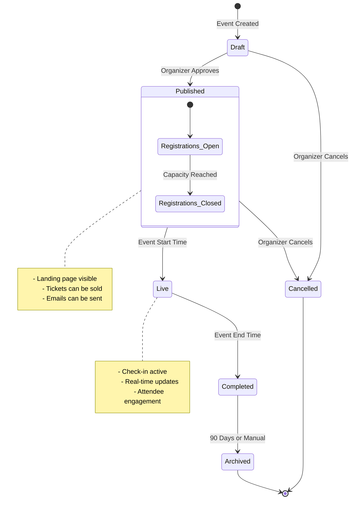
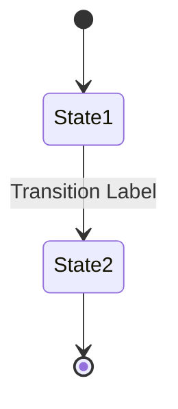
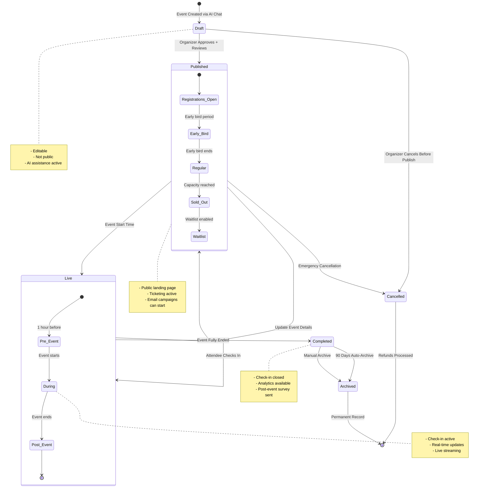

# ⚙️ EventOS State Diagram - Claude Prompt

**Diagram Type:** State Diagram
**Purpose:** Visualize lifecycle and status transitions for key entities
**Output Format:** Mermaid state diagram syntax

---

## 🎯 Objective

Generate **Mermaid state diagrams** that show status transitions and lifecycles for:
- Events (Draft → Published → Live → Completed → Archived)
- Orders (Pending → Completed → Refunded → Cancelled)
- Sponsorships (Pending → Confirmed → Cancelled)
- CRM Opportunities (Lead → Qualified → Proposal → Negotiation → Won/Lost)
- AI Tasks (Pending → In Progress → Completed → Cancelled)

---

## 📋 EventOS Context

**Project:** EventOS - AI-Powered Corporate Event Management Platform

**Key Entities with State Lifecycles:**

1. **Events** - Core entity with complex workflow
2. **Orders** - Payment and ticketing lifecycle
3. **Sponsorships** - Sponsor relationship status
4. **CRM Opportunities** - Sales pipeline stages
5. **AI Tasks** - Task completion workflow
6. **Attendees** - Check-in status
7. **Conversations** - Chat session status

---

## 🧠 State Transitions to Model

### 1. Event Lifecycle

**States:**
- `Draft` - Initial creation, not published
- `Published` - Visible on landing page, registrations open
- `Live` - Event is currently happening
- `Completed` - Event finished
- `Archived` - Historical record
- `Cancelled` - Event was cancelled

**Transitions:**
- Draft → Published (organizer approves)
- Published → Live (event start time reached)
- Published → Cancelled (organizer cancels)
- Live → Completed (event end time reached)
- Completed → Archived (manual or auto after 90 days)

**Entry/Exit Actions:**
- Enter Live: Send reminder emails to attendees
- Exit Live: Trigger post-event survey
- Enter Cancelled: Refund all orders, send cancellation emails

---

### 2. Order Lifecycle

**States:**
- `Pending` - Payment initiated
- `Completed` - Payment successful
- `Refunded` - Payment refunded
- `Cancelled` - Order cancelled before payment

**Transitions:**
- Pending → Completed (Stripe webhook: payment succeeded)
- Pending → Cancelled (timeout or user cancels)
- Completed → Refunded (organizer issues refund)

**Entry/Exit Actions:**
- Enter Completed: Create attendee records, send confirmation email
- Enter Refunded: Delete attendee records, send refund email
- Enter Cancelled: Release ticket inventory

---

### 3. Sponsorship Lifecycle

**States:**
- `Pending` - Sponsor invited/proposed
- `Confirmed` - Sponsor agreement signed
- `Cancelled` - Sponsorship cancelled

**Transitions:**
- Pending → Confirmed (sponsor accepts, payment received)
- Pending → Cancelled (sponsor declines or timeout)
- Confirmed → Cancelled (sponsor withdraws)

**Entry/Exit Actions:**
- Enter Confirmed: Add logo to event page, send welcome email
- Enter Cancelled: Remove branding, notify organizer

---

### 4. CRM Opportunity Lifecycle

**States:**
- `Lead` - Initial contact
- `Qualified` - Lead meets criteria
- `Proposal` - Proposal sent
- `Negotiation` - Discussing terms
- `Won` - Deal closed successfully
- `Lost` - Deal lost

**Transitions:**
- Lead → Qualified (sales team qualifies)
- Qualified → Proposal (proposal created)
- Proposal → Negotiation (prospect responds)
- Negotiation → Won (contract signed)
- Negotiation → Lost (prospect declines)
- Any stage → Lost (deal falls through)

**Entry/Exit Actions:**
- Enter Proposal: Generate proposal document
- Enter Won: Create invoice, update revenue metrics
- Enter Lost: Log lost reason, update forecasts

---

### 5. AI Task Lifecycle

**States:**
- `Pending` - Task created, not started
- `In Progress` - Currently being worked on
- `Completed` - Task finished
- `Cancelled` - Task no longer needed

**Transitions:**
- Pending → In Progress (user starts task)
- In Progress → Completed (user marks done)
- In Progress → Pending (user pauses)
- Pending → Cancelled (user cancels)
- In Progress → Cancelled (user cancels)

**Entry/Exit Actions:**
- Enter In Progress: Set started_at timestamp
- Enter Completed: Set completed_at timestamp, notify organizer
- Enter Cancelled: Log cancellation reason

---

## 📐 Example Mermaid State Syntax



---

## 🚀 Instructions to Claude

Generate **7 separate Mermaid state diagrams** for EventOS:

### 1. **Event Lifecycle State Diagram**

**Title:** Event Status Transitions

**States to Include:**
- Draft
- Published (with nested states: Registrations Open/Closed)
- Live (with nested states: Pre-Event, During, Post-Event)
- Completed
- Archived
- Cancelled

**Transitions:**
- Draft → Published (organizer approves)
- Published → Live (start time reached)
- Live → Completed (end time reached)
- Completed → Archived (manual or 90 days)
- Draft → Cancelled (organizer cancels before publish)
- Published → Cancelled (organizer cancels after publish)

**Entry/Exit Actions to Note:**
- Enter Published: Generate landing page, open registrations
- Enter Live: Send reminder emails, activate check-in
- Exit Live: Close check-in, trigger surveys
- Enter Completed: Calculate metrics, send thank-you emails
- Enter Cancelled: Process refunds, send cancellation notices

---

### 2. **Order Payment Lifecycle**

**Title:** Order Status Transitions

**States:**
- Pending
- Processing (Stripe)
- Completed
- Refunded
- Cancelled
- Failed

**Transitions:**
- Pending → Processing (payment initiated)
- Processing → Completed (payment succeeded)
- Processing → Failed (payment declined)
- Failed → Pending (user retries)
- Pending → Cancelled (timeout or user cancels)
- Completed → Refunded (organizer refunds)

**Actions:**
- Enter Completed: Create attendees, send confirmation
- Enter Refunded: Delete attendees, send refund email
- Enter Failed: Log error, notify user

---

### 3. **Sponsorship Agreement Lifecycle**

**Title:** Sponsorship Status Transitions

**States:**
- Pending
- Confirmed
- Active (during event)
- Completed (after event)
- Cancelled

**Transitions:**
- Pending → Confirmed (contract signed)
- Confirmed → Active (event goes live)
- Active → Completed (event ends)
- Pending → Cancelled (sponsor declines)
- Confirmed → Cancelled (sponsor withdraws)

**Actions:**
- Enter Confirmed: Add logo, assign benefits
- Enter Active: Display branding prominently
- Enter Completed: Generate sponsorship report
- Enter Cancelled: Remove branding, process refund

---

### 4. **CRM Opportunity Pipeline**

**Title:** Sales Opportunity Stages

**States:**
- Lead
- Qualified
- Proposal
- Negotiation
- Won
- Lost

**Transitions:**
- Lead → Qualified (meets criteria)
- Qualified → Proposal (proposal sent)
- Proposal → Negotiation (prospect engaged)
- Negotiation → Won (contract signed)
- Any stage → Lost (deal fails)

**Actions:**
- Enter Qualified: Create opportunity record
- Enter Proposal: Generate proposal doc
- Enter Won: Create event, update revenue
- Enter Lost: Log lost reason

---

### 5. **AI Task Completion Workflow**

**Title:** Task Status Transitions

**States:**
- Pending
- In Progress
- Blocked (waiting on external factor)
- Completed
- Cancelled

**Transitions:**
- Pending → In Progress (user starts)
- In Progress → Blocked (dependency not met)
- Blocked → In Progress (dependency resolved)
- In Progress → Completed (user marks done)
- Pending/In Progress → Cancelled (no longer needed)

**Actions:**
- Enter In Progress: Set started_at, assign to user
- Enter Completed: Set completed_at, check dependent tasks
- Enter Cancelled: Log reason, notify stakeholders

---

### 6. **Attendee Check-In Flow**

**Title:** Attendee Check-In Status

**States:**
- Registered
- Confirmed (payment complete)
- Checked In
- No Show
- Cancelled

**Transitions:**
- Registered → Confirmed (payment received)
- Confirmed → Checked In (scanned at door)
- Confirmed → No Show (event ends, not checked in)
- Registered → Cancelled (refund issued)

**Actions:**
- Enter Confirmed: Send ticket + QR code
- Enter Checked In: Log entry time, grant access
- Enter No Show: Log for analytics

---

### 7. **Chat Conversation Lifecycle**

**Title:** Conversation Status Transitions

**States:**
- Active
- Archived
- Deleted

**Transitions:**
- [*] → Active (new conversation started)
- Active → Archived (user archives)
- Archived → Active (user restores)
- Active → Deleted (user deletes)
- Archived → Deleted (user deletes)

**Actions:**
- Enter Active: Display in sidebar
- Enter Archived: Hide from main list
- Enter Deleted: Soft delete (retain in DB)

---

## ✅ Output Requirements

**For each state diagram, provide:**

1. **Clear title** describing the entity/workflow
2. **All states** clearly labeled
3. **Initial state** `[*]` and terminal states
4. **Transition arrows** with trigger conditions
5. **Composite states** (nested) where applicable
6. **Notes** explaining state meanings
7. **Entry/exit actions** as comments or notes
8. **Valid Mermaid syntax** ready to render

**Styling Preferences:**
```mermaid
%%{init: {'theme': 'base', 'themeVariables': { 'primaryColor': '#3b82f6', 'primaryTextColor': '#fff', 'primaryBorderColor': '#1e40af', 'lineColor': '#64748b', 'secondaryColor': '#10b981', 'tertiaryColor': '#ef4444'}}}%%
```

---

## 📋 Mermaid State Diagram Features to Use

### Basic States


### Composite States (Nested)
```mermaid
state Published {
    [*] --> Open
    Open --> Closed : Capacity Reached
    Closed --> [*]
}
```

### Choice (Conditional Branching)
```mermaid
state payment_check <<choice>>
Processing --> payment_check
payment_check --> Completed : if success
payment_check --> Failed : if error
```

### Fork/Join (Parallel States)
```mermaid
state fork_state <<fork>>
    [*] --> fork_state
    fork_state --> State1
    fork_state --> State2

state join_state <<join>>
    State1 --> join_state
    State2 --> join_state
    join_state --> [*]
```

### Notes
```mermaid
note right of Published
    Landing page is live
    Tickets can be sold
end note
```

### Directional Flow
```mermaid
stateDiagram-v2
    direction LR
    Draft --> Published --> Live
```

---

## 🎨 Example: Complete Event Lifecycle



---

## 🚀 Final Instruction

> "Generate **7 complete Mermaid state diagrams** for EventOS based on the entity lifecycles described above.
> Each diagram should clearly show all states, transitions with trigger conditions, nested states where applicable, entry/exit actions as notes, and be production-ready with valid Mermaid syntax.
> Output each diagram separately with a descriptive title and brief explanation of the lifecycle."

---

**Created:** October 11, 2025
**For:** EventOS System Documentation
**Purpose:** Generate state diagrams for entity lifecycles
**Status:** Ready for Claude ✅
