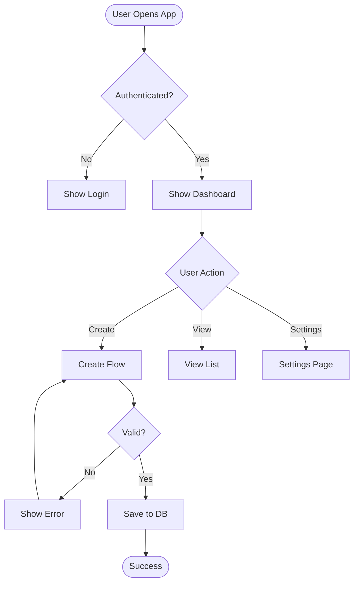
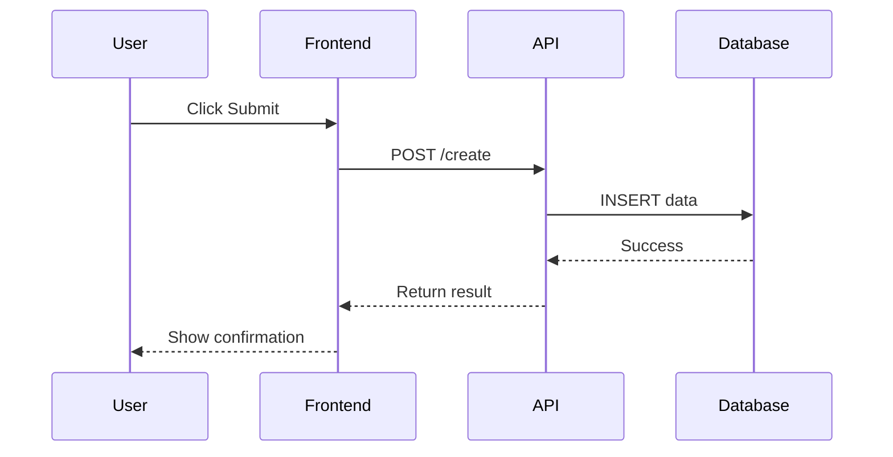
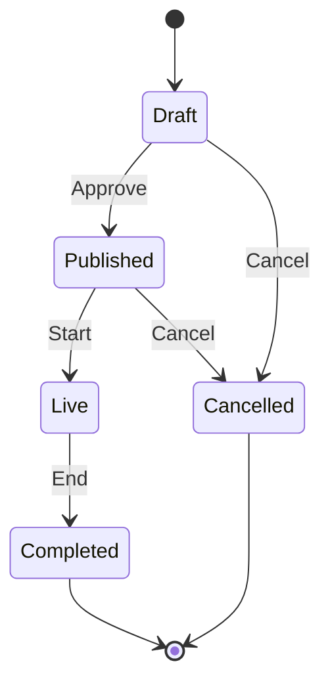
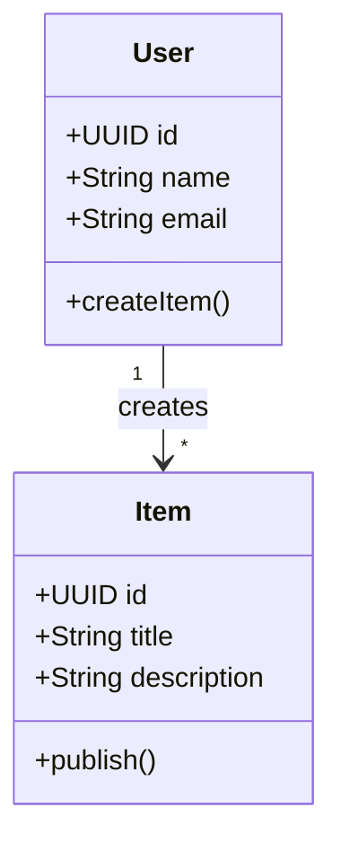
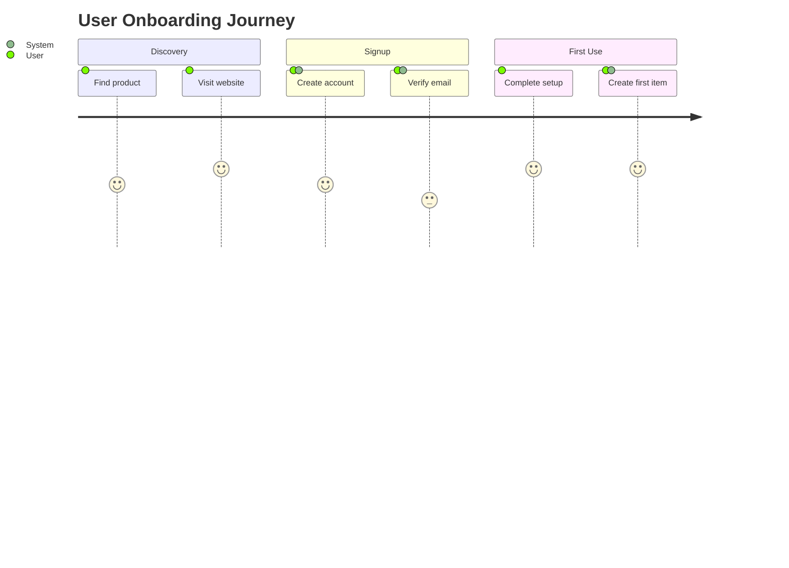

# 🧭 Universal Mermaid Diagram Generator - Master Prompt

**Purpose:** Generate any type of Mermaid diagram for any project
**Diagram Types:** Flowchart, Sequence, State, Class, User Journey, ERD, Gantt
**Output Format:** Production-ready Mermaid syntax

---

## 🎯 Overview

This is a **universal, reusable prompt template** for generating professional Mermaid diagrams for any software project, system, or workflow.

Simply fill in the project-specific details in Section 3, then send to Claude to generate all diagram types.

---

## 🧠 Instructions to Claude

You are an expert **system architect, UX designer, and technical documentation specialist**.

Based on the project description provided, generate **multiple Mermaid diagrams** that visually represent:

1. **Flowchart** → Overall system logic, process flows, and decision paths
2. **Sequence Diagram** → Step-by-step interactions between components/actors
3. **State Diagram** → Lifecycle and status transitions for key entities
4. **Class Diagram** → Data entities, attributes, methods, and relationships
5. **User Journey** → User experience from start to goal with satisfaction scores

Each diagram should be:
- ✅ Clean and professionally labeled
- ✅ Written in valid Mermaid syntax
- ✅ Ready to paste into Markdown or Mermaid Live Editor
- ✅ Production-quality for documentation

---

## 📐 Output Format

For each diagram type, provide:

### Format

````markdown
## [Diagram Type]: [Descriptive Title]

**Purpose:** [Brief explanation of what this diagram shows]

**Key Elements:**
- [Element 1]
- [Element 2]
- [Element 3]

```mermaid
[Valid Mermaid syntax here]
```
````

---

## 📦 Project Information Template

Fill this out before sending to Claude:

```
PROJECT NAME: [Your project name]

DESCRIPTION: [Brief summary of what the system does]

MAIN ACTORS / ROLES:
- [Actor 1: description]
- [Actor 2: description]
- [Actor 3: description]

CORE WORKFLOWS:
1. [Workflow 1: description]
2. [Workflow 2: description]
3. [Workflow 3: description]

KEY ENTITIES / OBJECTS:
- [Entity 1: description]
- [Entity 2: description]
- [Entity 3: description]

TECHNOLOGY STACK:
- Frontend: [tech]
- Backend: [tech]
- Database: [tech]
- External APIs: [list]

ENTITY LIFECYCLE (for State Diagram):
[Entity Name]:
- State 1 → State 2 (trigger)
- State 2 → State 3 (trigger)

USER JOURNEY STAGES:
[Persona]: [Journey Name]
1. Stage 1: [description]
2. Stage 2: [description]
3. Stage 3: [description]
```

---

## 🎨 Example Outputs

### 1. Flowchart Example



### 2. Sequence Diagram Example



### 3. State Diagram Example



### 4. Class Diagram Example



### 5. User Journey Example



---

## 🚀 Diagram Type Guidelines

### 📊 When to Use Each Diagram

| Diagram Type | Best For | Example Use Case |
|--------------|----------|------------------|
| **Flowchart** | Process logic, decision paths | User onboarding flow, checkout process |
| **Sequence** | Component interactions | API calls, authentication flow |
| **State** | Entity lifecycles | Order status, document workflow |
| **Class** | Data models | Database schema, object relationships |
| **User Journey** | User experience | Customer journey from discovery to purchase |
| **ERD** | Database design | Full database schema with relationships |
| **Gantt** | Project timeline | Development roadmap, sprint planning |

---

## 📋 Mermaid Syntax Quick Reference

### Flowchart
```
flowchart TD
    A[Rectangle] --> B{Diamond}
    B -->|Yes| C[Process]
    B -->|No| D[End]
```

### Sequence
```
sequenceDiagram
    Alice->>Bob: Request
    Bob-->>Alice: Response
```

### State
```
stateDiagram-v2
    [*] --> State1
    State1 --> State2
    State2 --> [*]
```

### Class
```
classDiagram
    Class1 "1" --> "*" Class2
```

### Journey
```
journey
    title Journey
    section Phase
      Step : score: Actor
```

---

## 🎯 Quality Checklist

Before finalizing diagrams, ensure:

- [ ] All syntax is valid Mermaid
- [ ] Labels are clear and concise
- [ ] Arrows show correct direction
- [ ] Decision points use diamond shapes
- [ ] Colors/styling enhance readability
- [ ] Diagram fits on one screen/page
- [ ] No syntax errors when rendered
- [ ] Relationships are accurate
- [ ] Cardinality is correct (1:1, 1:N, N:M)
- [ ] Legend/notes explain complex elements

---

## 🔗 Useful Resources

- **Mermaid Live Editor:** https://mermaid.live
- **Mermaid Documentation:** https://mermaid.js.org
- **Mermaid Cheat Sheet:** https://jojozhuang.github.io/tutorial/mermaid-cheat-sheet/

---

## 💡 Pro Tips

1. **Keep It Simple:** Start with high-level diagrams, add detail iteratively
2. **Use Subgraphs:** Group related components for clarity
3. **Add Notes:** Explain complex logic or business rules
4. **Style Consistently:** Use same color scheme across diagrams
5. **Test Rendering:** Always test in Mermaid Live Editor first
6. **Version Control:** Save diagram source in `.md` files alongside code
7. **Update Regularly:** Diagrams should reflect current system state

---

## 🚀 Final Instruction to Claude

> "Based on the project information provided, generate **5 comprehensive Mermaid diagrams** (Flowchart, Sequence, State, Class, and User Journey) that document the system architecture, workflows, and user experience.
>
> Each diagram should:
> - Be production-ready with valid Mermaid syntax
> - Include clear labels and annotations
> - Show appropriate level of detail
> - Be optimized for readability
> - Include a brief explanation of what it represents
>
> Output each diagram separately with a descriptive title, purpose statement, and the complete Mermaid code block."

---

## 📝 EventOS Example (Pre-Filled)

For reference, here's the template filled out for EventOS:

```
PROJECT NAME: EventOS

DESCRIPTION: AI-powered corporate event management platform where event planners chat with AI to create events, sell tickets, manage sponsors/vendors, and track analytics.

MAIN ACTORS / ROLES:
- Event Organizer: Corporate professional planning events
- Attendee: Person registering for and attending events
- Sponsor: Company sponsoring corporate events
- Vendor: Service provider (catering, AV tech, etc.)
- AI Assistant: Lovable AI helping create events
- System: Automated EventOS processes

CORE WORKFLOWS:
1. AI-Assisted Event Creation: Chat with AI → Event created → Landing page generated
2. Ticket Purchase: Browse event → Select tier → Stripe checkout → Confirmation email
3. Sponsor Onboarding: Invite sponsor → Upload logo → Confirm → Display on event page
4. CRM Contact Management: Add contact → Track activities → Create opportunity → Convert to event

KEY ENTITIES / OBJECTS:
- Event: Corporate event with tickets, sponsors, attendees
- Order: Ticket purchase transaction
- Sponsorship: Sponsor relationship with event
- ChatConversation: AI conversation thread
- CRMOpportunity: Sales pipeline opportunity

TECHNOLOGY STACK:
- Frontend: React 18, TypeScript, Vite, Tailwind CSS
- Backend: Supabase (PostgreSQL, Edge Functions)
- AI: Lovable AI Gateway (google/gemini-2.5-flash)
- Payments: Stripe
- Email: Resend

ENTITY LIFECYCLE:
Event:
- Draft → Published (organizer approves)
- Published → Live (event starts)
- Live → Completed (event ends)
- Completed → Archived (90 days later)

Order:
- Pending → Completed (payment succeeds)
- Pending → Cancelled (timeout)
- Completed → Refunded (organizer refunds)

USER JOURNEY STAGES:
Event Organizer: Create Event via AI
1. Discovery: Realize need to plan event
2. Setup: Sign up for EventOS account
3. Event Creation: Chat with AI to create event
4. Customization: Add tickets, branding
5. Launch: Publish event and share
6. Management: Monitor registrations and check-ins
```

---

**Created:** October 11, 2025
**Purpose:** Universal template for generating Mermaid diagrams for any project
**Status:** Ready to Use ✅

---

## 🎓 How to Use This Template

1. **Copy the "Project Information Template" section**
2. **Fill in your project details**
3. **Paste the entire prompt + your details into Claude**
4. **Claude generates all 5 diagram types**
5. **Copy Mermaid code into your documentation**
6. **Test in Mermaid Live Editor**
7. **Commit to your repository**

That's it! You now have production-ready system diagrams. 🚀
