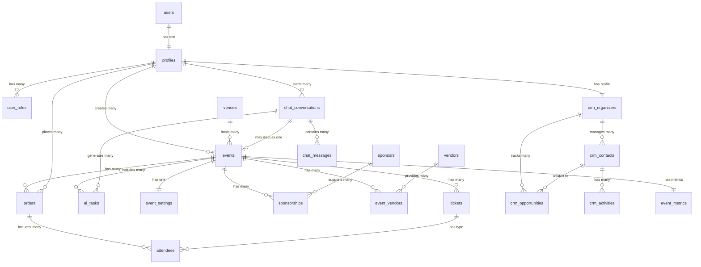

# >é EventOS Entity Relationship Diagram (ERD) - Claude Prompt

**Goal:** Create a **Mermaid-based Entity Relationship Diagram (ERD)** for the **EventOS platform**  a full AI-powered event management system.
The ERD should clearly show **all main entities**, **relationships**, and **cardinalities**.

---

## =Ø Context

EventOS enables **corporate event planners** to:

* Chat with AI to create and manage events
* Sell tickets
* Manage sponsors, vendors, venues, staff, and attendees
* Automate tasks and track event progress
* Integrate analytics and CRM data

---

## >ñ Core Entities to Include

### 1. Authentication & Users

**`users`** (Supabase `auth.users`)
- Managed by Supabase Auth
- Contains: id, email, encrypted_password, email_confirmed_at

**`profiles`** ’ one-to-one with `users`
- id (PK, FK to auth.users.id)
- full_name
- avatar_url
- company
- phone
- created_at
- updated_at

**`user_roles`** ’ maps users to roles
- id (PK)
- user_id (FK to profiles.id)
- role (enum: 'organizer', 'sponsor', 'vendor', 'attendee', 'staff', 'admin')
- assigned_at
- assigned_by (FK to profiles.id)

---

### 2. Events

**`events`**
- id (PK)
- name
- description
- start_date
- end_date
- status (enum: 'draft', 'published', 'live', 'completed', 'cancelled')
- organizer_id (FK to profiles.id)
- venue_id (FK to venues.id)
- created_at
- updated_at

**`event_settings`**
- id (PK)
- event_id (FK to events.id, unique)
- theme (jsonb)
- currency (default 'CAD')
- timezone (default 'America/Toronto')
- visibility (enum: 'public', 'private', 'unlisted')
- allow_registrations (boolean)
- created_at
- updated_at

**`tickets`** (renamed from event_tickets for consistency)
- id (PK)
- event_id (FK to events.id)
- tier_name
- description
- price (numeric)
- capacity (integer)
- sold (integer, default 0)
- is_active (boolean)
- created_at
- updated_at

**`ai_tasks`** (AI-generated event planning tasks)
- id (PK)
- event_id (FK to events.id)
- conversation_id (FK to chat_conversations.id, nullable)
- user_id (FK to profiles.id)
- title
- description
- category (enum: 'venue', 'marketing', 'operations', 'catering', 'tech', 'post-event')
- status (enum: 'pending', 'in_progress', 'completed', 'cancelled')
- priority (enum: 'low', 'medium', 'high')
- due_date
- completed_at
- created_at
- updated_at

**`venues`**
- id (PK)
- name
- address
- city
- province
- postal_code
- country (default 'Canada')
- capacity (integer)
- contact_name
- contact_email
- contact_phone
- amenities (jsonb)
- created_at
- updated_at

**`event_media`**
- id (PK)
- event_id (FK to events.id)
- media_type (enum: 'image', 'video', 'document')
- url
- storage_path
- caption
- display_order (integer)
- created_at
- updated_at

**`event_analytics`** (renamed from event_ai_logs for clarity)
- id (PK)
- event_id (FK to events.id)
- conversation_id (FK to chat_conversations.id, nullable)
- action_type (enum: 'event_created', 'event_updated', 'tickets_added', 'landing_page_generated', 'task_created')
- action_details (jsonb)
- timestamp
- performed_by (FK to profiles.id)

---

### 3. Sponsors & Vendors

**`sponsors`**
- id (PK)
- company_name
- logo_url
- website
- contact_name
- contact_email
- contact_phone
- description
- created_at
- updated_at

**`sponsorships`** (join table: events ’ sponsors)
- id (PK)
- event_id (FK to events.id)
- sponsor_id (FK to sponsors.id)
- level (enum: 'platinum', 'gold', 'silver', 'bronze')
- amount (numeric)
- benefits (jsonb)
- status (enum: 'pending', 'confirmed', 'cancelled')
- created_at
- updated_at

**`vendors`**
- id (PK)
- company_name
- service_type (enum: 'catering', 'av_tech', 'decor', 'photography', 'transportation', 'other')
- contact_name
- contact_email
- contact_phone
- website
- description
- created_at
- updated_at

**`event_vendors`** (join table: events ’ vendors)
- id (PK)
- event_id (FK to events.id)
- vendor_id (FK to vendors.id)
- service_details (text)
- contract_amount (numeric)
- status (enum: 'pending', 'confirmed', 'cancelled')
- created_at
- updated_at

---

### 4. Attendees & Orders

**`orders`**
- id (PK)
- event_id (FK to events.id)
- user_id (FK to profiles.id)
- total_amount (numeric)
- status (enum: 'pending', 'completed', 'refunded', 'cancelled')
- payment_method (enum: 'stripe', 'manual')
- stripe_payment_id
- created_at
- updated_at

**`attendees`**
- id (PK)
- event_id (FK to events.id)
- order_id (FK to orders.id, nullable)
- ticket_id (FK to tickets.id)
- first_name
- last_name
- email
- phone
- company
- check_in_status (enum: 'pending', 'checked_in', 'no_show')
- check_in_time
- created_at
- updated_at

---

### 5. CRM & Communication

**`crm_organizers`**
- id (PK)
- user_id (FK to profiles.id, unique)
- company_name
- industry
- annual_events (integer)
- typical_event_size
- created_at
- updated_at

**`crm_contacts`**
- id (PK)
- organizer_id (FK to crm_organizers.id)
- type (enum: 'sponsor', 'vendor', 'attendee', 'lead')
- first_name
- last_name
- email
- phone
- company
- position
- notes (text)
- created_at
- updated_at

**`crm_opportunities`**
- id (PK)
- organizer_id (FK to crm_organizers.id)
- contact_id (FK to crm_contacts.id, nullable)
- stage (enum: 'lead', 'qualified', 'proposal', 'negotiation', 'won', 'lost')
- value (numeric)
- event_type
- expected_close_date
- notes (text)
- created_at
- updated_at

**`crm_activities`**
- id (PK)
- organizer_id (FK to crm_organizers.id)
- contact_id (FK to crm_contacts.id, nullable)
- opportunity_id (FK to crm_opportunities.id, nullable)
- type (enum: 'call', 'email', 'meeting', 'note', 'task')
- subject
- description (text)
- due_date
- completed_at
- created_at
- updated_at

**`crm_notes`**
- id (PK)
- organizer_id (FK to crm_organizers.id)
- contact_id (FK to crm_contacts.id, nullable)
- opportunity_id (FK to crm_opportunities.id, nullable)
- content (text)
- is_pinned (boolean)
- created_at
- updated_at

**`whatsapp_threads`** (future integration)
- id (PK)
- contact_id (FK to crm_contacts.id)
- event_id (FK to events.id, nullable)
- phone_number
- thread_id (external WhatsApp thread ID)
- last_message_at
- created_at
- updated_at

---

### 6. AI Conversations

**`chat_conversations`**
- id (PK)
- user_id (FK to profiles.id)
- title
- metadata (jsonb)  stores current_event_id, context, etc.
- created_at
- updated_at

**`chat_messages`**
- id (PK)
- conversation_id (FK to chat_conversations.id)
- role (enum: 'user', 'assistant', 'system')
- content (text)
- tool_calls (jsonb)  stores AI tool execution details
- created_at

---

### 7. Analytics & Metrics

**`event_metrics`**
- id (PK)
- event_id (FK to events.id, unique)
- tickets_sold (integer)
- total_revenue (numeric)
- page_views (integer)
- conversion_rate (numeric)
- engagement_score (numeric)
- last_calculated_at
- created_at
- updated_at

**`system_logs`**
- id (PK)
- log_type (enum: 'error', 'warning', 'info', 'debug')
- module (text)  e.g., 'chat', 'payments', 'email'
- message (text)
- metadata (jsonb)
- severity (integer)
- created_at

---

### 8. Additional Tables (Edge Function Support)

**`notifications`**
- id (PK)
- user_id (FK to profiles.id)
- type (enum: 'event_update', 'ticket_sale', 'task_reminder', 'system')
- title
- message
- read_at
- action_url
- created_at

**`wizard_states`** (event creation wizard progress)
- id (PK)
- user_id (FK to profiles.id)
- event_id (FK to events.id, nullable)
- current_stage (integer)
- form_data (jsonb)
- completed_stages (jsonb)
- created_at
- updated_at

---

## >í Key Relationships

### One-to-Many
- **users ’ profiles** (1:1)
- **profiles ’ events** (1:N)  One user creates many events
- **events ’ tickets** (1:N)  One event has many ticket tiers
- **events ’ ai_tasks** (1:N)  One event has many AI-generated tasks
- **events ’ attendees** (1:N)  One event has many attendees
- **events ’ orders** (1:N)  One event has many ticket orders
- **chat_conversations ’ chat_messages** (1:N)  One conversation has many messages

### Many-to-Many (via join tables)
- **events ’ sponsors** (via `sponsorships`)
- **events ’ vendors** (via `event_vendors`)

### Optional Relationships
- **chat_conversations ’ events** (N:1, nullable)  Conversations may discuss an event
- **ai_tasks ’ chat_conversations** (N:1, nullable)  Tasks may be created from chat

---

## >à Output Requirements

1. **Use Mermaid ER diagram syntax**:
   ```
   erDiagram
       ENTITY ||--o{ RELATED_ENTITY : "relationship"
   ```

2. **Include primary keys (PK) and foreign keys (FK)** for each table

3. **Use clear and consistent naming** (snake_case)

4. **Group logically by modules**:
   - Authentication & Users
   - Events & Venues
   - Sponsors & Vendors
   - Attendees & Orders
   - CRM
   - AI & Chat
   - Analytics

5. **Add annotations** (comments) for important relationships

6. **Output cleanly formatted Markdown** (diagram only, minimal explanations)

---

##  Example Mermaid Output Format



---

## =€ Final Instruction to Claude

> **"Generate the full ERD for EventOS using Mermaid syntax as shown above.**
>
> **Include:**
> - All 25+ tables listed in this document
> - Primary keys (PK) and foreign keys (FK) clearly labeled
> - Relationship cardinalities (1:1, 1:N, N:M)
> - Logical grouping by functional area (Auth, Events, CRM, AI, etc.)
> - Comments for complex relationships
> - Consistent snake_case naming
> - Support for Supabase RLS patterns (user_id columns for multi-tenancy)
>
> **Output a single, complete Mermaid ER diagram that can be copy-pasted into:**
> - Mermaid Live Editor (https://mermaid.live)
> - GitHub Markdown
> - Database design tools
>
> **Ensure the diagram matches best practices for:**
> - Supabase PostgreSQL schema design
> - Row-Level Security (RLS) implementation
> - JSONB usage for flexible metadata
> - Event management system architecture"

---

**Created:** October 11, 2025
**For:** EventOS Database Architecture
**Purpose:** Complete ERD generation prompt for Claude
**Status:** Ready for Use 

---

## =Ý Additional Notes

### AI Vector Tables (Optional Enhancement)

If you want to include **AI embeddings and vector search** for intelligent event recommendations, add:

**`event_embeddings`**
- id (PK)
- event_id (FK to events.id, unique)
- embedding (vector(1536))  OpenAI embedding
- content_hash (text)
- generated_at

**`conversation_embeddings`**
- id (PK)
- conversation_id (FK to chat_conversations.id)
- message_id (FK to chat_messages.id)
- embedding (vector(1536))
- generated_at

### Edge Function Logs (Optional Enhancement)

**`edge_function_logs`**
- id (PK)
- function_name (text)  e.g., 'chat-with-ai', 'create-checkout'
- execution_time_ms (integer)
- status (enum: 'success', 'error')
- error_message (text, nullable)
- request_id (uuid)
- created_at

---

**Usage:** Copy this entire document and paste into Claude to generate the complete EventOS ERD in Mermaid format.
