# 📈 AI Event Management System Diagrams

## Overview
This document contains visual diagrams and flowcharts that illustrate the AI-powered event management system architecture, user journeys, and data flows. These diagrams provide a comprehensive visual understanding of how AI agents interact within the event management ecosystem.

## System Architecture Diagram

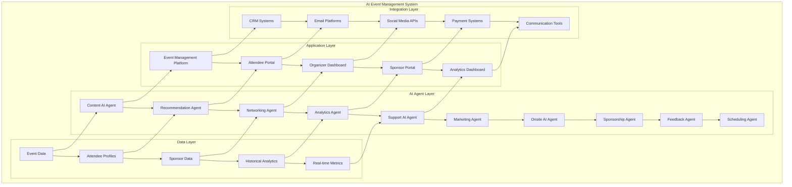

## AI Agent Ecosystem Flow

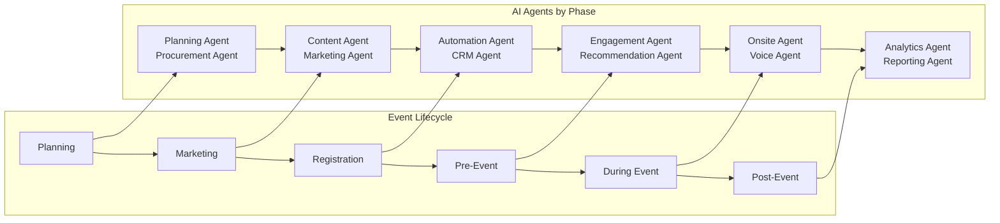

## Event Management AI Workflow

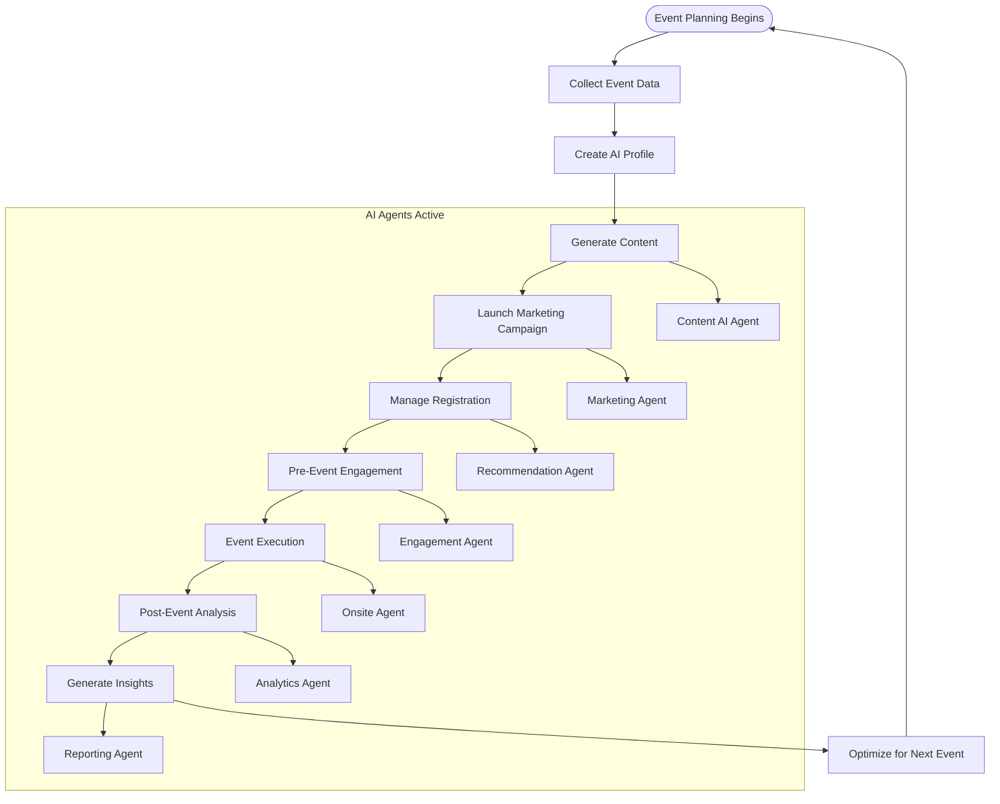

## Attendee Journey with AI

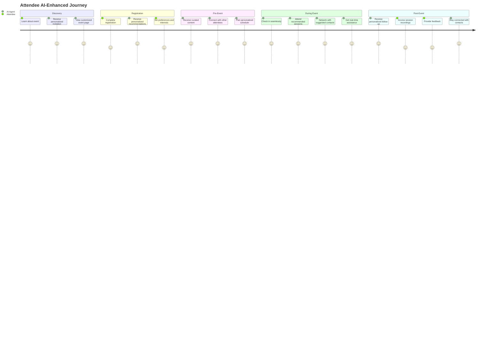

## Sponsor Management AI Flow

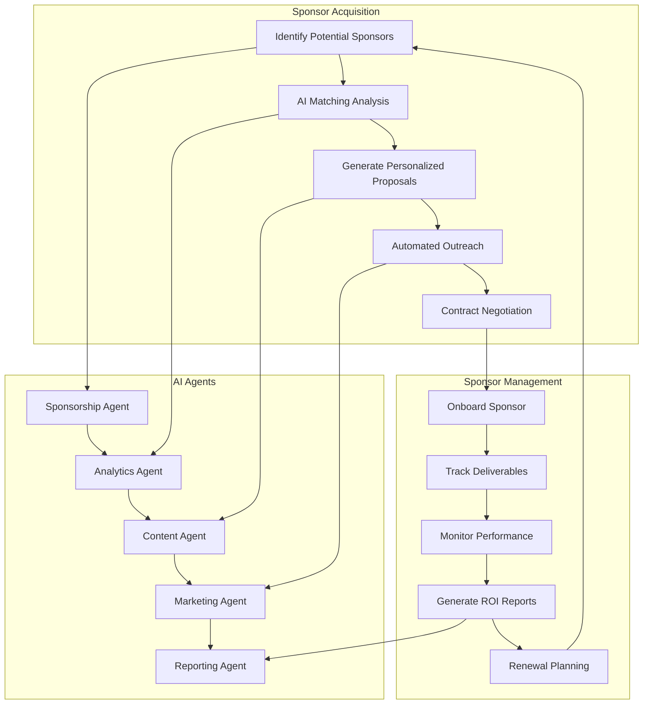

## Data Flow Architecture

```mermaid
graph LR
    subgraph "Data Sources"
        A[Event Management System] --> B[Attendee Interactions]
        B --> C[Social Media Data]
        C --> D[Email Engagement]
        D --> E[Website Analytics]
        E --> F[Survey Responses]
    end
    
    subgraph "AI Processing"
        G[Data Ingestion] --> H[Data Cleaning]
        H --> I[Feature Engineering]
        I --> J[Model Training]
        J --> K[Prediction Generation]
        K --> L[Insight Extraction]
    end
    
    subgraph "Output Applications"
        M[Personalized Recommendations] --> N[Automated Campaigns]
        N --> O[Performance Dashboards]
        O --> P[Predictive Analytics]
        P --> Q[Optimization Suggestions]
    end
    
    F --> G
    L --> M
```

## AI Agent Interaction Matrix

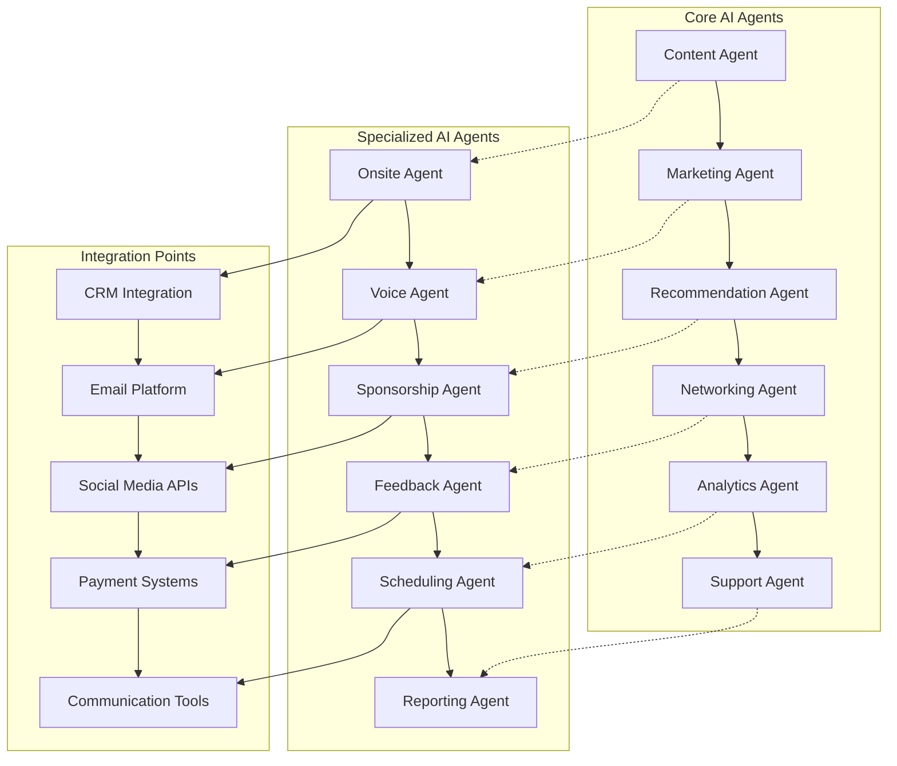

## Real-time Analytics Dashboard

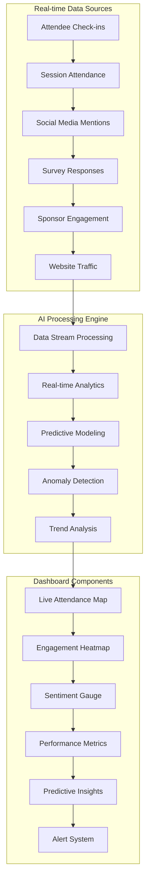

## Machine Learning Pipeline

```mermaid
flowchart LR
    subgraph "Data Collection"
        A[Raw Event Data] --> B[Attendee Behavior]
        B --> C[Engagement Metrics]
        C --> D[Historical Patterns]
    end
    
    subgraph "Data Processing"
        E[Data Cleaning] --> F[Feature Extraction]
        F --> G[Data Validation]
        G --> H[Data Augmentation]
    end
    
    subgraph "Model Training"
        I[Model Selection] --> J[Hyperparameter Tuning]
        J --> K[Cross-validation]
        K --> L[Model Evaluation]
    end
    
    subgraph "Deployment"
        M[Model Deployment] --> N[Real-time Inference]
        N --> O[Performance Monitoring]
        O --> P[Model Updates]
    end
    
    D --> E
    H --> I
    L --> M
    P --> I
```

## Integration Architecture

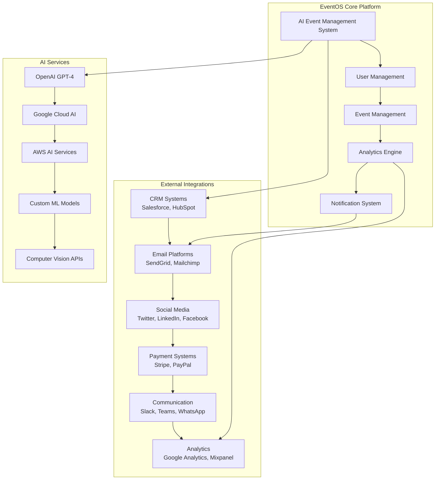

## Security & Privacy Framework

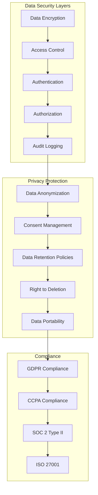

---

*These diagrams provide a comprehensive visual understanding of the AI-powered event management system architecture, workflows, and integrations. They serve as technical documentation and can be used for system design, development planning, and stakeholder communication.*