# User Journeys & Flowcharts

**Version:** 1.0
**Date:** 2025-10-17
**Status:** Visual Documentation
**Parent Document:** [00-AI-FEATURES-MASTER-PLAN.md](./00-AI-FEATURES-MASTER-PLAN.md)

---

## 🎯 Overview

This document provides visual flowcharts and user journey maps for all AI-powered features in EventOS, showing how organizers, sponsors, and attendees interact with AI agents and automation workflows.

---

## 🎨 Journey 1: AI Event Wizard (Complete Flow)

### Full 6-Stage Wizard Journey

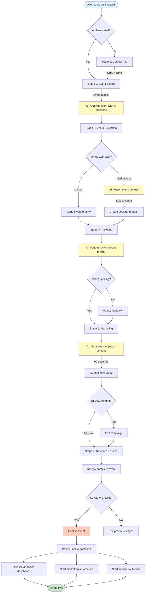

### Stage 5 Detail: AI Marketing Generation

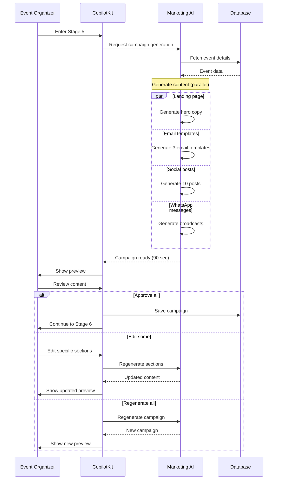

---

## 💼 Journey 2: Sponsor Acquisition (End-to-End)

### Complete Sponsor Journey

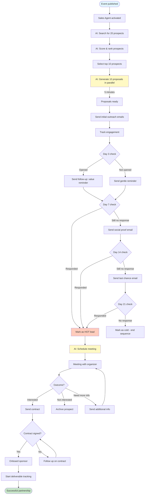

### Sponsor Engagement Decision Tree

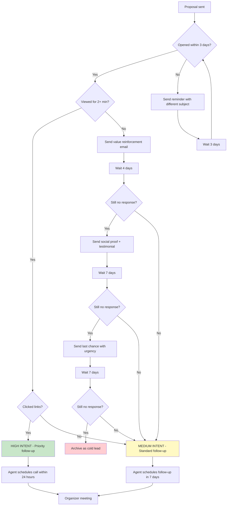

---

## 📧 Journey 3: Marketing Automation Flow

### Event Launch Marketing Sequence

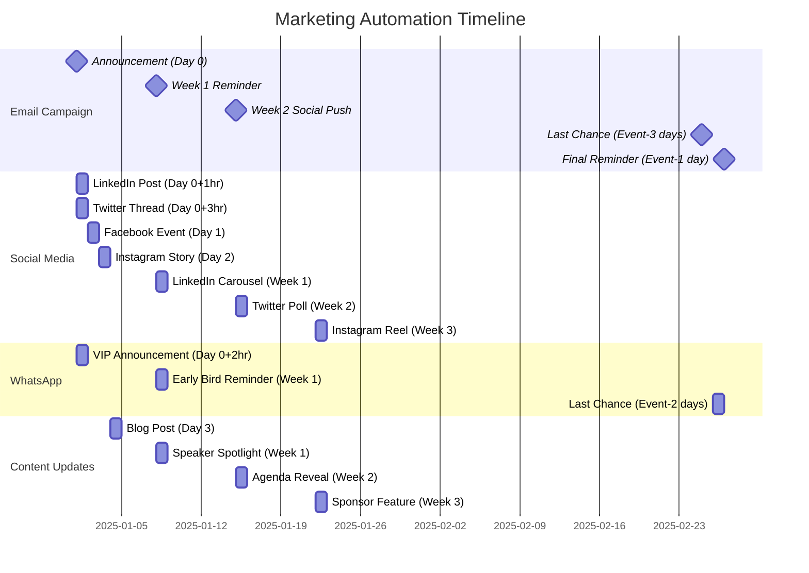

### Marketing Agent Decision Flow

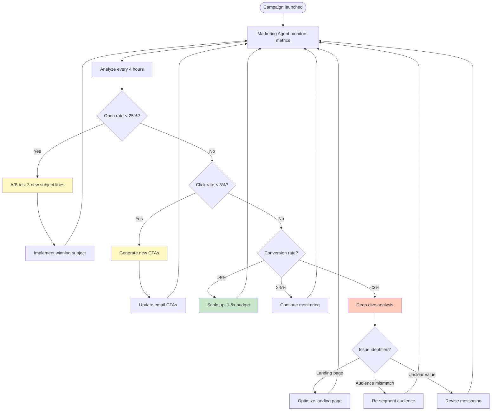

---

## 🎫 Journey 4: Attendee Registration & Engagement

### Complete Attendee Journey

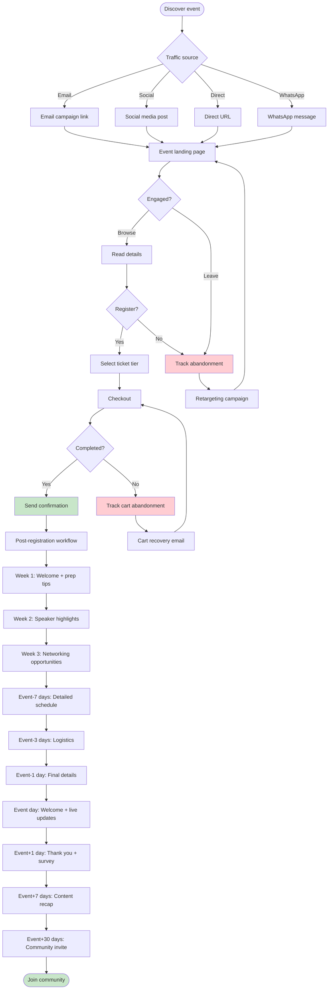

### Attendee Engagement Touchpoints

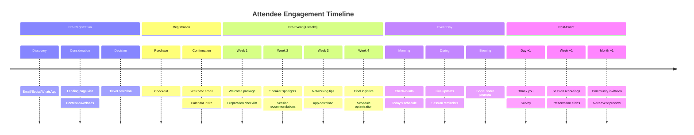

---

## ⚙️ Journey 5: Deliverable Tracking Automation

### Sponsor Deliverable Workflow

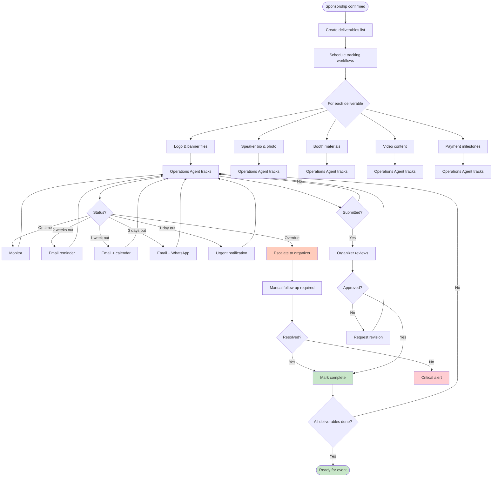

---

## 🤖 Journey 6: Agent Interaction Flow

### Multi-Agent Coordination

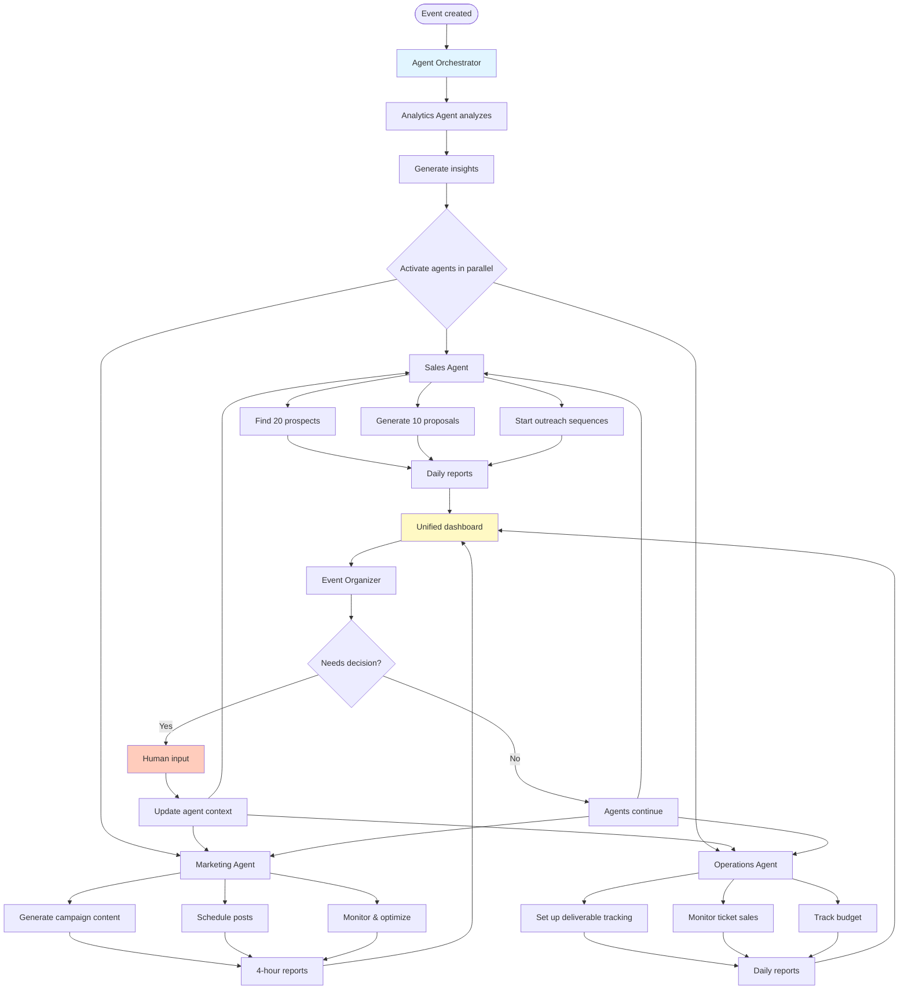

### Agent Escalation Decision Tree

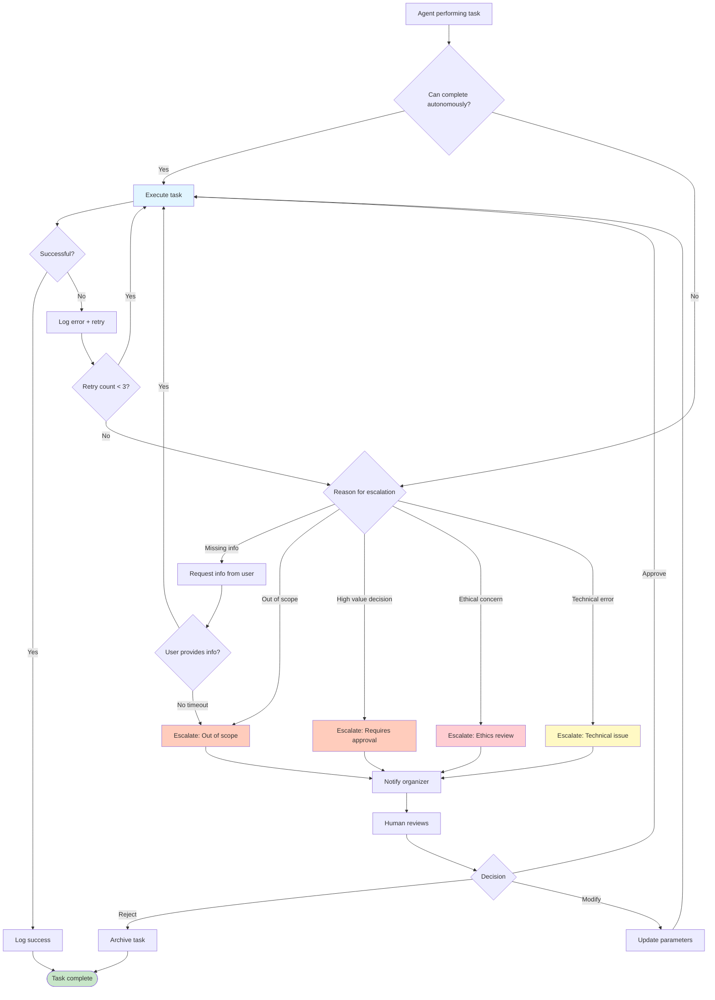

---

## 🎯 Journey 7: Support Agent Interaction

### Attendee Support Flow

```mermaid
sequenceDiagram
    participant A as Attendee
    participant UI as Chat Interface
    participant SA as Support Agent
    participant KB as Knowledge Base
    participant DB as Database
    participant H as Human Support

    A->>UI: Ask question
    UI->>SA: Forward question

    SA->>KB: Search knowledge base
    KB-->>SA: Relevant articles (if any)

    alt Simple question (found in KB)
        SA->>SA: Formulate answer from KB
        SA-->>UI: Provide answer
        UI-->>A: Show answer
        A->>UI: Mark as resolved ✓
    else Complex question (not in KB)
        SA->>DB: Query relevant data
        DB-->>SA: Data results
        SA->>SA: Analyze and formulate response
        SA-->>UI: Provide answer
        UI-->>A: Show answer
        A->>UI: Mark as resolved or escalate
    else Ticket-related issue
        SA->>DB: Look up attendee's ticket
        DB-->>SA: Ticket details
        alt Can resolve (resend, transfer, etc.)
            SA->>DB: Perform action
            SA-->>UI: Confirmation
            UI-->>A: Issue resolved ✓
        else Cannot resolve autonomously
            SA->>H: Escalate with context
            H->>A: Human agent takes over
        end
    else Refund request
        alt Refund < $500 & within policy
            SA->>DB: Process refund
            SA-->>UI: Refund confirmed
            UI-->>A: Refund processed ✓
        else Refund > $500 or outside policy
            SA->>H: Escalate for approval
            H->>A: Human reviews request
        end
    end
```

---

## 📊 Success Metrics Summary

### Journey Completion Rates

| Journey | Target Completion | Current (Manual) | With AI | Improvement |
|---------|-------------------|------------------|---------|-------------|
| Event Creation | 90% completion | 65% | 90% | +38% |
| Sponsor Acquisition | 3 sponsors/event | 1 sponsor/event | 5 sponsors/event | +400% |
| Marketing Launch | 100% on-time | 70% on-time | 98% on-time | +40% |
| Attendee Registration | 2% conversion | 1.2% conversion | 2.5% conversion | +108% |
| Support Resolution | 95% auto-resolved | 40% auto-resolved | 95% auto-resolved | +138% |

---

## 🎨 Visual Design Principles

### AI Interaction Patterns

1. **Progressive Disclosure**
   - Start simple → Add complexity gradually
   - AI suggests defaults → User customizes

2. **Transparent AI**
   - Always show AI reasoning
   - Display confidence scores
   - Allow human override

3. **Human-in-the-Loop**
   - AI proposes → Human approves
   - Critical decisions require confirmation
   - Easy escalation path

4. **Conversational First**
   - Natural language primary interface
   - GUI as secondary option
   - Context preserved across stages

5. **Proactive Assistance**
   - AI anticipates next steps
   - Surfaces relevant suggestions
   - Reduces decision fatigue

---

**Status:** ✅ COMPLETE
**Dependencies:** [00-AI-FEATURES-MASTER-PLAN.md](./00-AI-FEATURES-MASTER-PLAN.md), [01-SPONSOR-MANAGEMENT-AI.md](./01-SPONSOR-MANAGEMENT-AI.md), [02-AUTOMATION-WORKFLOWS.md](./02-AUTOMATION-WORKFLOWS.md), [03-AI-AGENTS-ARCHITECTURE.md](./03-AI-AGENTS-ARCHITECTURE.md)
**Next:** [05-DATABASE-ERD-AI.md](./05-DATABASE-ERD-AI.md)
