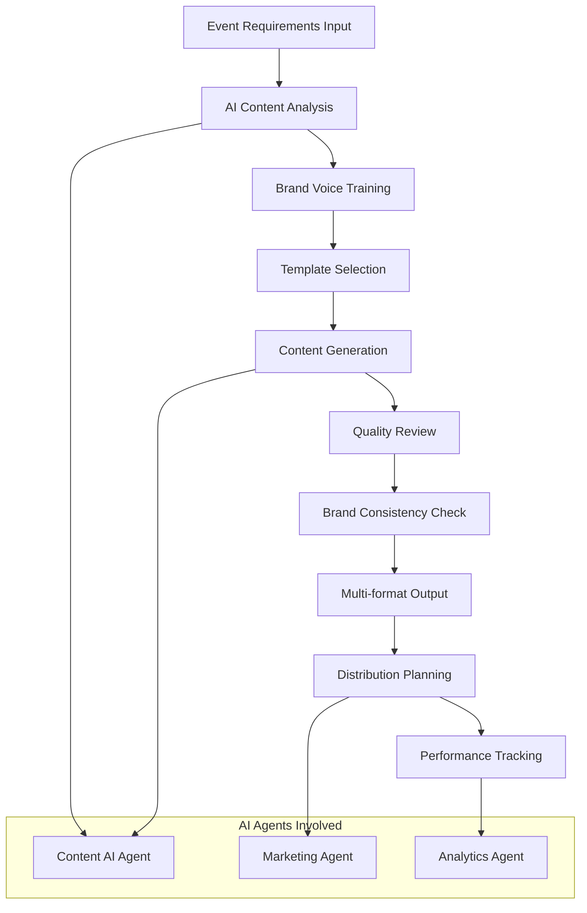
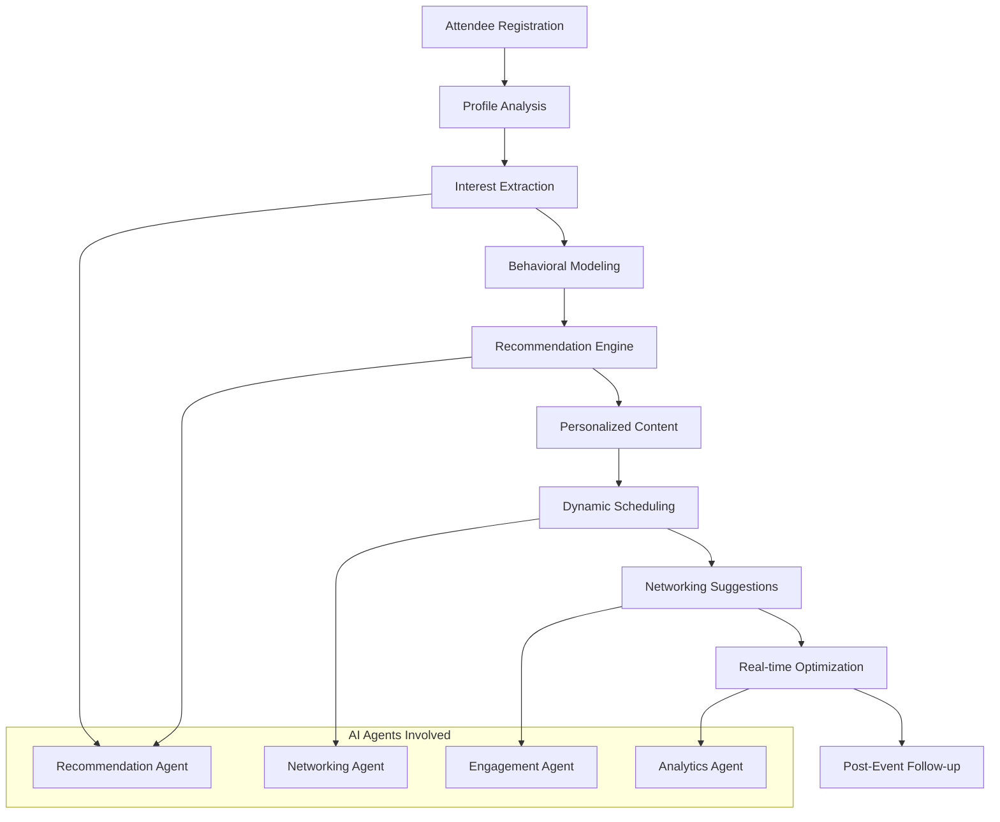
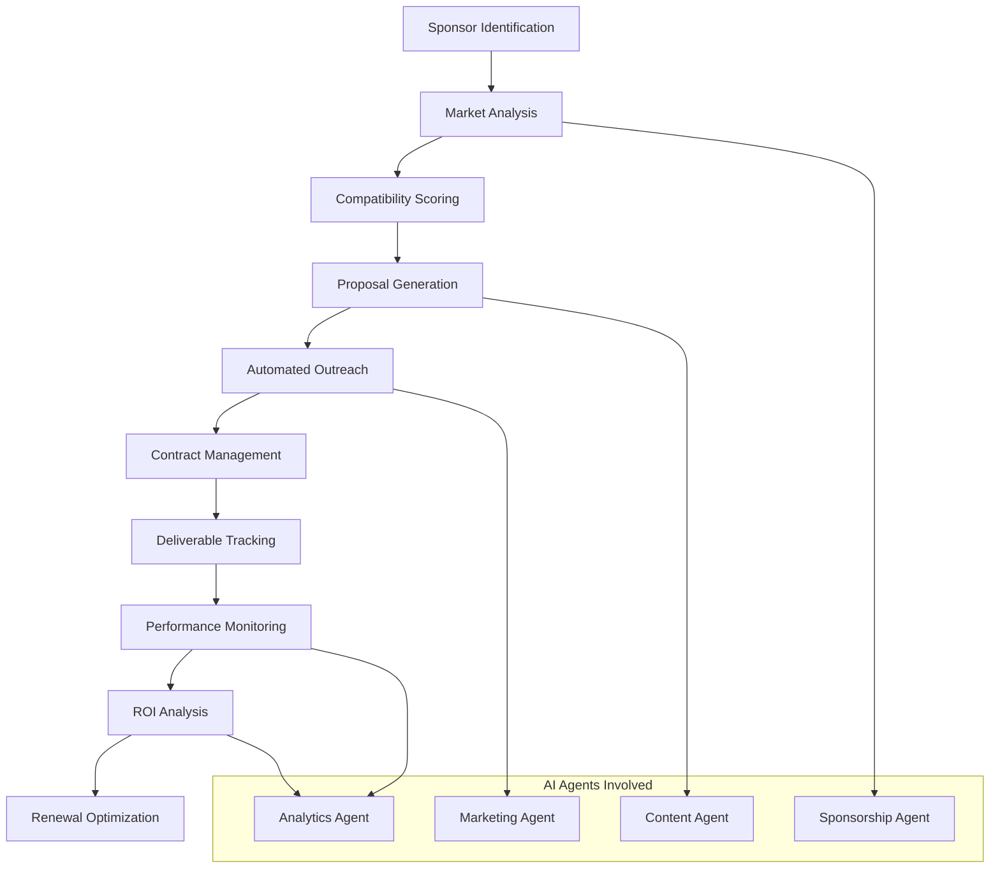
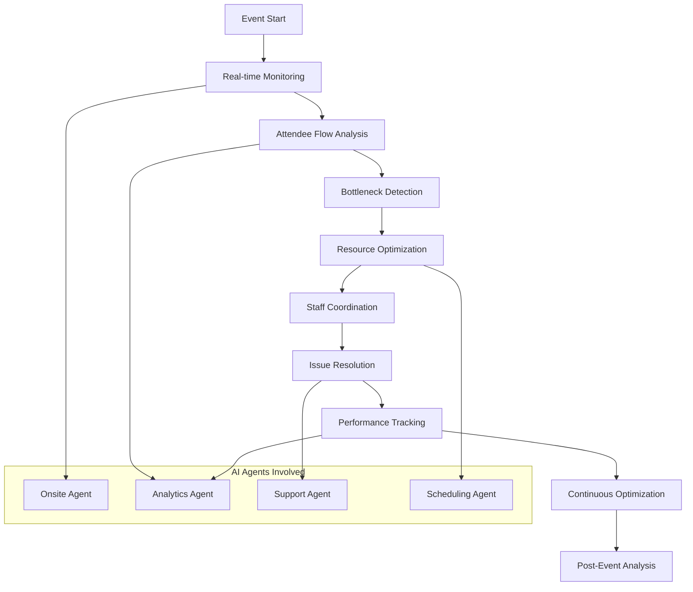
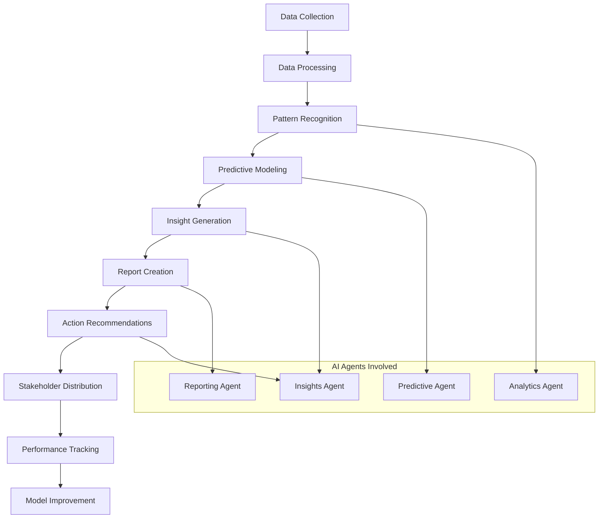
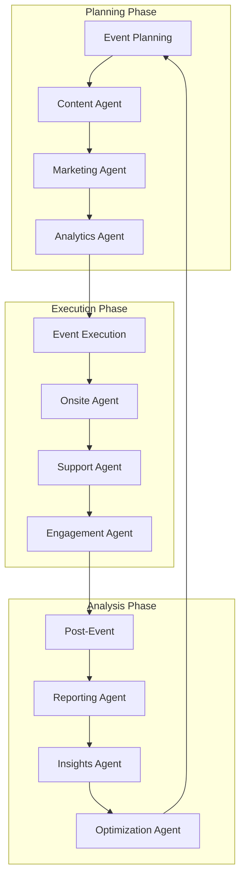
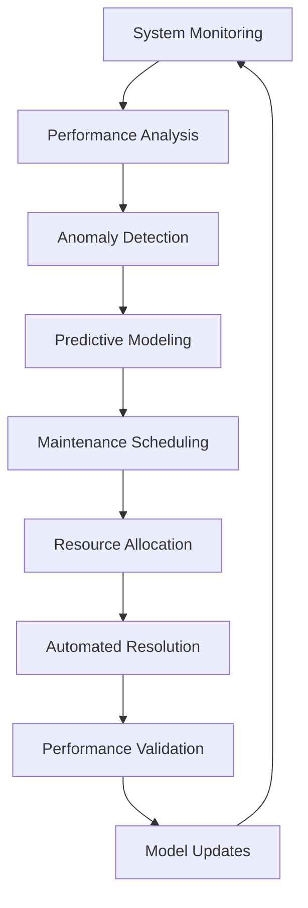

# 🤖 AI Workflows for Event Management Automation

## Overview
This document outlines comprehensive AI workflows that automate event management processes, demonstrating how different AI agents collaborate to create seamless, intelligent event experiences. Each workflow represents a complete automation pipeline from data input to actionable outcomes.

## Core AI Workflow Categories

### 1. Content Generation & Marketing Workflow

#### Workflow: Automated Event Content Creation

**Workflow Steps:**
1. **Input Processing**: Event details, target audience, brand guidelines
2. **AI Analysis**: Content requirements analysis and optimization
3. **Generation**: Automated content creation across all formats
4. **Review**: AI-powered quality assurance and brand consistency
5. **Distribution**: Automated publishing across multiple channels
6. **Tracking**: Performance monitoring and optimization

**Expected Outcomes:**
- 90% reduction in content creation time
- Consistent brand messaging across all materials
- 45% increase in engagement rates
- Automated multi-channel distribution

### 2. Attendee Personalization Workflow

#### Workflow: Intelligent Attendee Experience Customization

**Workflow Steps:**
1. **Profile Creation**: Comprehensive attendee profile development
2. **Interest Analysis**: AI-powered interest and preference extraction
3. **Behavioral Modeling**: Predictive behavior pattern analysis
4. **Recommendation Generation**: Personalized session and networking suggestions
5. **Dynamic Adaptation**: Real-time personalization based on behavior
6. **Continuous Learning**: Feedback integration for improved recommendations

**Expected Outcomes:**
- 30% increase in session attendance
- 3× more meaningful networking connections
- 25% improvement in attendee satisfaction
- Personalized experience for every attendee

### 3. Sponsor Management Workflow

#### Workflow: AI-Powered Sponsor Relationship Management

**Workflow Steps:**
1. **Prospect Identification**: AI-powered sponsor discovery and qualification
2. **Compatibility Analysis**: Automated sponsor-event matching
3. **Proposal Creation**: Personalized sponsorship proposals
4. **Relationship Management**: Automated communication and follow-up
5. **Performance Tracking**: Real-time sponsor value measurement
6. **Renewal Optimization**: Predictive renewal and upsell strategies

**Expected Outcomes:**
- 72% improvement in sponsor satisfaction
- 90% sponsor renewal rate
- 25% increase in sponsor revenue
- Automated relationship management

### 4. Real-time Event Operations Workflow

#### Workflow: Intelligent Event Execution Management

**Workflow Steps:**
1. **Real-time Monitoring**: Continuous event performance tracking
2. **Flow Analysis**: Attendee movement and engagement analysis
3. **Issue Detection**: Proactive problem identification
4. **Resource Optimization**: Dynamic resource allocation
5. **Staff Coordination**: Automated task assignment and communication
6. **Performance Optimization**: Continuous improvement implementation

**Expected Outcomes:**
- 20% improvement in event flow
- 50% reduction in operational issues
- 30% increase in staff efficiency
- Real-time optimization capabilities

### 5. Analytics & Insights Workflow

#### Workflow: Comprehensive Event Intelligence

**Workflow Steps:**
1. **Data Aggregation**: Multi-source data collection and integration
2. **Processing**: Data cleaning, validation, and preparation
3. **Analysis**: Advanced analytics and pattern recognition
4. **Prediction**: Forecasting and trend analysis
5. **Insight Generation**: Actionable insights and recommendations
6. **Reporting**: Automated report generation and distribution

**Expected Outcomes:**
- 50% reduction in analysis time
- Data-driven decision making
- Predictive insights for future events
- Automated stakeholder communication

## Advanced AI Workflow Integrations

### Multi-Agent Collaboration Workflows

#### Workflow: Cross-Agent Event Optimization

**Key Integration Points:**
- **Data Sharing**: Seamless data flow between agents
- **Decision Coordination**: Collaborative decision making
- **Resource Optimization**: Shared resource management
- **Learning Integration**: Cross-agent knowledge sharing

### Predictive Maintenance Workflow

#### Workflow: Proactive System Optimization

**Workflow Benefits:**
- Proactive issue prevention
- Optimized system performance
- Reduced downtime and costs
- Continuous improvement

## Workflow Automation Levels

### Level 1: Basic Automation
- **Scope**: Simple, repetitive tasks
- **Examples**: Email sending, data entry, basic reporting
- **AI Agents**: Content Agent, Automation Agent
- **Impact**: 30-50% time savings

### Level 2: Intelligent Automation
- **Scope**: Decision-based processes with learning
- **Examples**: Content personalization, recommendation systems
- **AI Agents**: Recommendation Agent, Marketing Agent
- **Impact**: 50-70% efficiency improvement

### Level 3: Advanced Automation
- **Scope**: Complex, multi-step processes with prediction
- **Examples**: Sponsor matching, predictive analytics
- **AI Agents**: Analytics Agent, Sponsorship Agent
- **Impact**: 70-90% process optimization

### Level 4: Autonomous Operations
- **Scope**: End-to-end process management with minimal human intervention
- **Examples**: Complete event management, autonomous decision making
- **AI Agents**: All agents working in concert
- **Impact**: 90%+ automation with human oversight

## Workflow Performance Metrics

### Efficiency Metrics
| Metric | Baseline | Target | AI Enhancement |
|--------|----------|--------|----------------|
| Content Creation Time | 60 hours | 6 hours | 90% reduction |
| Sponsor Response Rate | 15% | 45% | 3× improvement |
| Attendee Satisfaction | 7.2/10 | 8.8/10 | 22% increase |
| Event Setup Time | 40 hours | 12 hours | 70% reduction |
| Report Generation | 8 hours | 1 hour | 87% reduction |

### Quality Metrics
| Metric | Baseline | Target | AI Enhancement |
|--------|----------|--------|----------------|
| Content Consistency | 65% | 95% | 46% improvement |
| Personalization Accuracy | 60% | 85% | 42% improvement |
| Prediction Accuracy | 70% | 90% | 29% improvement |
| Issue Resolution Time | 4 hours | 30 minutes | 87% reduction |
| Stakeholder Satisfaction | 7.5/10 | 9.2/10 | 23% increase |

### Business Impact Metrics
| Metric | Baseline | Target | AI Enhancement |
|--------|----------|--------|----------------|
| Revenue per Event | $100K | $140K | 40% increase |
| Sponsor Renewal Rate | 60% | 90% | 50% improvement |
| Attendee Retention | 45% | 70% | 56% increase |
| Cost per Attendee | $50 | $35 | 30% reduction |
| Time to Market | 6 months | 3 months | 50% reduction |

## Workflow Implementation Roadmap

### Phase 1: Foundation (Months 1-3)
- **Focus**: Core automation workflows
- **Workflows**: Content generation, basic analytics
- **Agents**: Content Agent, Analytics Agent
- **Expected Impact**: 40% efficiency improvement

### Phase 2: Intelligence (Months 4-6)
- **Focus**: Predictive and personalization workflows
- **Workflows**: Attendee personalization, sponsor management
- **Agents**: Recommendation Agent, Sponsorship Agent
- **Expected Impact**: 60% efficiency improvement

### Phase 3: Optimization (Months 7-9)
- **Focus**: Advanced automation and integration
- **Workflows**: Real-time operations, cross-agent collaboration
- **Agents**: Onsite Agent, Integration Agent
- **Expected Impact**: 80% efficiency improvement

### Phase 4: Autonomy (Months 10-12)
- **Focus**: Autonomous operations with human oversight
- **Workflows**: End-to-end automation, predictive maintenance
- **Agents**: All agents with advanced coordination
- **Expected Impact**: 90%+ automation with strategic oversight

## Workflow Monitoring & Optimization

### Real-time Monitoring
- **Performance Tracking**: Continuous workflow performance monitoring
- **Anomaly Detection**: Automatic identification of workflow issues
- **Resource Optimization**: Dynamic resource allocation based on demand
- **Quality Assurance**: Automated quality checks and validation

### Continuous Improvement
- **Feedback Integration**: Learning from workflow outcomes
- **Model Updates**: Regular AI model improvements
- **Process Refinement**: Ongoing workflow optimization
- **Innovation Integration**: Adoption of new AI capabilities

### Success Measurement
- **KPIs**: Key performance indicators for each workflow
- **ROI Analysis**: Return on investment measurement
- **Stakeholder Feedback**: Regular feedback collection and analysis
- **Benchmarking**: Comparison with industry standards

---

*These AI workflows represent the foundation of intelligent event management automation, providing comprehensive coverage of all event management processes while maintaining flexibility for customization and continuous improvement.*