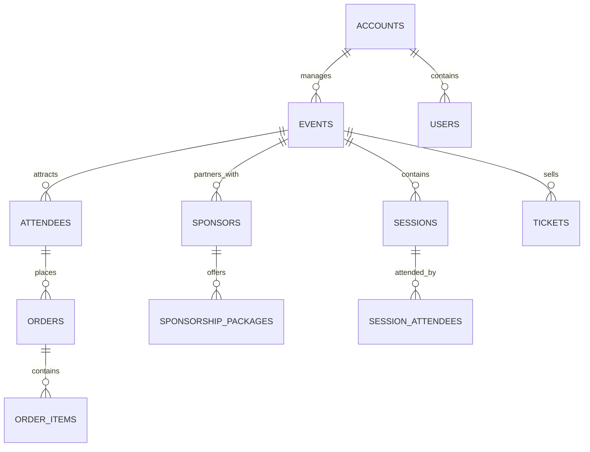
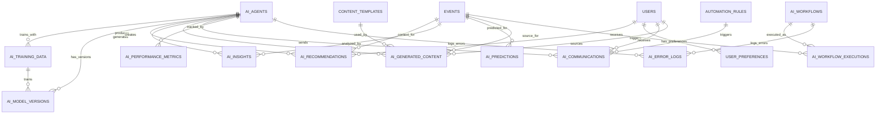

# 🗄️ AI Event Management Data Schema

## Overview
This document defines the comprehensive data schema for the AI-powered event management system. The schema supports all AI agents, workflows, and analytics requirements while maintaining data integrity, scalability, and performance optimization.

## Core Data Architecture

### Primary Data Domains



## AI-Specific Data Tables

### 1. AI Agent Management

#### ai_agents
```sql
CREATE TABLE ai_agents (
    id UUID PRIMARY KEY DEFAULT gen_random_uuid(),
    name TEXT NOT NULL,
    type TEXT NOT NULL CHECK (type IN (
        'content', 'recommendation', 'networking', 'analytics', 
        'support', 'marketing', 'onsite', 'sponsorship', 
        'feedback', 'scheduling', 'sales', 'procurement',
        'insights', 'engagement', 'voice', 'behavior',
        'reporting', 'hybrid', 'emotion', 'sustainability'
    )),
    status TEXT DEFAULT 'active' CHECK (status IN ('active', 'inactive', 'training', 'maintenance')),
    version TEXT NOT NULL,
    configuration JSONB NOT NULL DEFAULT '{}',
    performance_metrics JSONB NOT NULL DEFAULT '{}',
    created_at TIMESTAMPTZ DEFAULT now(),
    updated_at TIMESTAMPTZ DEFAULT now()
);
```

#### ai_agent_performance
```sql
CREATE TABLE ai_agent_performance (
    id UUID PRIMARY KEY DEFAULT gen_random_uuid(),
    agent_id UUID NOT NULL REFERENCES ai_agents(id) ON DELETE CASCADE,
    metric_name TEXT NOT NULL,
    metric_value DECIMAL(10,4) NOT NULL,
    measurement_date TIMESTAMPTZ NOT NULL,
    context JSONB DEFAULT '{}',
    created_at TIMESTAMPTZ DEFAULT now()
);
```

### 2. AI Workflow Management

#### ai_workflows
```sql
CREATE TABLE ai_workflows (
    id UUID PRIMARY KEY DEFAULT gen_random_uuid(),
    name TEXT NOT NULL,
    description TEXT,
    workflow_type TEXT NOT NULL CHECK (workflow_type IN (
        'content_generation', 'attendee_personalization', 'sponsor_management',
        'real_time_operations', 'analytics_insights', 'predictive_maintenance'
    )),
    status TEXT DEFAULT 'draft' CHECK (status IN ('draft', 'active', 'paused', 'archived')),
    configuration JSONB NOT NULL DEFAULT '{}',
    steps JSONB NOT NULL DEFAULT '[]',
    triggers JSONB NOT NULL DEFAULT '{}',
    created_at TIMESTAMPTZ DEFAULT now(),
    updated_at TIMESTAMPTZ DEFAULT now()
);
```

#### ai_workflow_executions
```sql
CREATE TABLE ai_workflow_executions (
    id UUID PRIMARY KEY DEFAULT gen_random_uuid(),
    workflow_id UUID NOT NULL REFERENCES ai_workflows(id) ON DELETE CASCADE,
    event_id UUID REFERENCES events(id) ON DELETE CASCADE,
    status TEXT NOT NULL CHECK (status IN ('running', 'completed', 'failed', 'cancelled')),
    started_at TIMESTAMPTZ NOT NULL,
    completed_at TIMESTAMPTZ,
    input_data JSONB DEFAULT '{}',
    output_data JSONB DEFAULT '{}',
    error_log JSONB DEFAULT '{}',
    performance_metrics JSONB DEFAULT '{}',
    created_at TIMESTAMPTZ DEFAULT now()
);
```

### 3. AI Learning & Training Data

#### ai_training_data
```sql
CREATE TABLE ai_training_data (
    id UUID PRIMARY KEY DEFAULT gen_random_uuid(),
    agent_id UUID NOT NULL REFERENCES ai_agents(id) ON DELETE CASCADE,
    data_type TEXT NOT NULL CHECK (data_type IN (
        'content', 'behavior', 'feedback', 'performance', 'interaction'
    )),
    source_event_id UUID REFERENCES events(id) ON DELETE SET NULL,
    source_user_id UUID REFERENCES users(id) ON DELETE SET NULL,
    raw_data JSONB NOT NULL,
    processed_data JSONB,
    quality_score DECIMAL(3,2) CHECK (quality_score >= 0 AND quality_score <= 1),
    is_verified BOOLEAN DEFAULT false,
    created_at TIMESTAMPTZ DEFAULT now()
);
```

#### ai_model_versions
```sql
CREATE TABLE ai_model_versions (
    id UUID PRIMARY KEY DEFAULT gen_random_uuid(),
    agent_id UUID NOT NULL REFERENCES ai_agents(id) ON DELETE CASCADE,
    version_number TEXT NOT NULL,
    model_path TEXT NOT NULL,
    training_data_size INTEGER NOT NULL,
    performance_metrics JSONB NOT NULL DEFAULT '{}',
    hyperparameters JSONB DEFAULT '{}',
    is_active BOOLEAN DEFAULT false,
    deployed_at TIMESTAMPTZ,
    created_at TIMESTAMPTZ DEFAULT now()
);
```

### 4. AI Recommendations & Personalization

#### ai_recommendations
```sql
CREATE TABLE ai_recommendations (
    id UUID PRIMARY KEY DEFAULT gen_random_uuid(),
    user_id UUID NOT NULL REFERENCES users(id) ON DELETE CASCADE,
    event_id UUID NOT NULL REFERENCES events(id) ON DELETE CASCADE,
    recommendation_type TEXT NOT NULL CHECK (recommendation_type IN (
        'session', 'networking', 'sponsor', 'content', 'activity'
    )),
    recommended_item_id UUID NOT NULL,
    recommended_item_type TEXT NOT NULL,
    confidence_score DECIMAL(3,2) NOT NULL CHECK (confidence_score >= 0 AND confidence_score <= 1),
    reasoning JSONB DEFAULT '{}',
    is_accepted BOOLEAN,
    feedback_score INTEGER CHECK (feedback_score >= 1 AND feedback_score <= 5),
    created_at TIMESTAMPTZ DEFAULT now(),
    expires_at TIMESTAMPTZ
);
```

#### user_preferences
```sql
CREATE TABLE user_preferences (
    id UUID PRIMARY KEY DEFAULT gen_random_uuid(),
    user_id UUID NOT NULL REFERENCES users(id) ON DELETE CASCADE,
    preference_type TEXT NOT NULL,
    preference_value JSONB NOT NULL,
    confidence_level DECIMAL(3,2) DEFAULT 0.5,
    source TEXT DEFAULT 'explicit' CHECK (source IN ('explicit', 'inferred', 'behavioral')),
    last_updated TIMESTAMPTZ DEFAULT now(),
    created_at TIMESTAMPTZ DEFAULT now()
);
```

### 5. AI Analytics & Insights

#### ai_insights
```sql
CREATE TABLE ai_insights (
    id UUID PRIMARY KEY DEFAULT gen_random_uuid(),
    event_id UUID NOT NULL REFERENCES events(id) ON DELETE CASCADE,
    insight_type TEXT NOT NULL CHECK (insight_type IN (
        'attendee_behavior', 'sponsor_performance', 'content_engagement',
        'networking_success', 'revenue_optimization', 'operational_efficiency'
    )),
    insight_title TEXT NOT NULL,
    insight_description TEXT NOT NULL,
    insight_data JSONB NOT NULL,
    confidence_score DECIMAL(3,2) NOT NULL,
    impact_score DECIMAL(3,2) NOT NULL,
    actionable_items JSONB DEFAULT '[]',
    generated_by_agent_id UUID REFERENCES ai_agents(id) ON DELETE SET NULL,
    is_implemented BOOLEAN DEFAULT false,
    created_at TIMESTAMPTZ DEFAULT now()
);
```

#### ai_predictions
```sql
CREATE TABLE ai_predictions (
    id UUID PRIMARY KEY DEFAULT gen_random_uuid(),
    event_id UUID REFERENCES events(id) ON DELETE CASCADE,
    prediction_type TEXT NOT NULL CHECK (prediction_type IN (
        'attendance', 'engagement', 'revenue', 'churn', 'satisfaction'
    )),
    predicted_value DECIMAL(10,4) NOT NULL,
    confidence_interval JSONB NOT NULL,
    prediction_horizon INTEGER NOT NULL, -- days ahead
    model_version TEXT NOT NULL,
    input_features JSONB NOT NULL,
    created_at TIMESTAMPTZ DEFAULT now(),
    expires_at TIMESTAMPTZ NOT NULL
);
```

### 6. AI Content Management

#### ai_generated_content
```sql
CREATE TABLE ai_generated_content (
    id UUID PRIMARY KEY DEFAULT gen_random_uuid(),
    content_type TEXT NOT NULL CHECK (content_type IN (
        'event_description', 'session_title', 'speaker_bio', 'email_template',
        'social_post', 'proposal', 'report', 'presentation'
    )),
    source_event_id UUID REFERENCES events(id) ON DELETE SET NULL,
    source_user_id UUID REFERENCES users(id) ON DELETE SET NULL,
    title TEXT NOT NULL,
    content TEXT NOT NULL,
    metadata JSONB DEFAULT '{}',
    quality_score DECIMAL(3,2),
    is_approved BOOLEAN DEFAULT false,
    approved_by UUID REFERENCES users(id) ON DELETE SET NULL,
    approved_at TIMESTAMPTZ,
    generated_by_agent_id UUID REFERENCES ai_agents(id) ON DELETE SET NULL,
    created_at TIMESTAMPTZ DEFAULT now()
);
```

#### content_templates
```sql
CREATE TABLE content_templates (
    id UUID PRIMARY KEY DEFAULT gen_random_uuid(),
    template_name TEXT NOT NULL,
    template_type TEXT NOT NULL,
    template_content TEXT NOT NULL,
    variables JSONB DEFAULT '[]',
    brand_guidelines JSONB DEFAULT '{}',
    usage_count INTEGER DEFAULT 0,
    success_rate DECIMAL(3,2) DEFAULT 0.0,
    created_at TIMESTAMPTZ DEFAULT now(),
    updated_at TIMESTAMPTZ DEFAULT now()
);
```

### 7. AI Communication & Automation

#### ai_communications
```sql
CREATE TABLE ai_communications (
    id UUID PRIMARY KEY DEFAULT gen_random_uuid(),
    communication_type TEXT NOT NULL CHECK (communication_type IN (
        'email', 'sms', 'push_notification', 'in_app_message'
    )),
    recipient_id UUID NOT NULL,
    recipient_type TEXT NOT NULL CHECK (recipient_type IN ('user', 'attendee', 'sponsor')),
    subject TEXT,
    content TEXT NOT NULL,
    personalization_data JSONB DEFAULT '{}',
    send_scheduled_at TIMESTAMPTZ,
    sent_at TIMESTAMPTZ,
    delivery_status TEXT DEFAULT 'pending' CHECK (delivery_status IN (
        'pending', 'sent', 'delivered', 'opened', 'clicked', 'failed'
    )),
    engagement_metrics JSONB DEFAULT '{}',
    generated_by_agent_id UUID REFERENCES ai_agents(id) ON DELETE SET NULL,
    created_at TIMESTAMPTZ DEFAULT now()
);
```

#### automation_rules
```sql
CREATE TABLE automation_rules (
    id UUID PRIMARY KEY DEFAULT gen_random_uuid(),
    rule_name TEXT NOT NULL,
    rule_type TEXT NOT NULL CHECK (rule_type IN (
        'trigger', 'condition', 'action', 'sequence'
    )),
    trigger_conditions JSONB NOT NULL,
    action_definitions JSONB NOT NULL,
    is_active BOOLEAN DEFAULT true,
    execution_count INTEGER DEFAULT 0,
    success_rate DECIMAL(3,2) DEFAULT 0.0,
    last_executed_at TIMESTAMPTZ,
    created_at TIMESTAMPTZ DEFAULT now(),
    updated_at TIMESTAMPTZ DEFAULT now()
);
```

### 8. AI Performance & Monitoring

#### ai_performance_metrics
```sql
CREATE TABLE ai_performance_metrics (
    id UUID PRIMARY KEY DEFAULT gen_random_uuid(),
    agent_id UUID NOT NULL REFERENCES ai_agents(id) ON DELETE CASCADE,
    metric_category TEXT NOT NULL CHECK (metric_category IN (
        'accuracy', 'precision', 'recall', 'latency', 'throughput', 'cost'
    )),
    metric_name TEXT NOT NULL,
    metric_value DECIMAL(10,4) NOT NULL,
    measurement_context JSONB DEFAULT '{}',
    measurement_timestamp TIMESTAMPTZ NOT NULL,
    created_at TIMESTAMPTZ DEFAULT now()
);
```

#### ai_error_logs
```sql
CREATE TABLE ai_error_logs (
    id UUID PRIMARY KEY DEFAULT gen_random_uuid(),
    agent_id UUID REFERENCES ai_agents(id) ON DELETE SET NULL,
    workflow_id UUID REFERENCES ai_workflows(id) ON DELETE SET NULL,
    error_type TEXT NOT NULL,
    error_message TEXT NOT NULL,
    error_context JSONB DEFAULT '{}',
    stack_trace TEXT,
    severity TEXT NOT NULL CHECK (severity IN ('low', 'medium', 'high', 'critical')),
    is_resolved BOOLEAN DEFAULT false,
    resolved_at TIMESTAMPTZ,
    created_at TIMESTAMPTZ DEFAULT now()
);
```

## AI Data Relationships

### Extended Entity Relationship Diagram



## Data Indexing Strategy

### Performance Optimization Indexes

```sql
-- AI Agent Performance Indexes
CREATE INDEX idx_ai_agent_performance_agent_date ON ai_agent_performance(agent_id, measurement_date);
CREATE INDEX idx_ai_agent_performance_metric ON ai_agent_performance(metric_name, measurement_date);

-- AI Recommendations Indexes
CREATE INDEX idx_ai_recommendations_user_event ON ai_recommendations(user_id, event_id);
CREATE INDEX idx_ai_recommendations_type_confidence ON ai_recommendations(recommendation_type, confidence_score);
CREATE INDEX idx_ai_recommendations_expires ON ai_recommendations(expires_at) WHERE expires_at IS NOT NULL;

-- AI Insights Indexes
CREATE INDEX idx_ai_insights_event_type ON ai_insights(event_id, insight_type);
CREATE INDEX idx_ai_insights_confidence_impact ON ai_insights(confidence_score, impact_score);
CREATE INDEX idx_ai_insights_created ON ai_insights(created_at DESC);

-- AI Predictions Indexes
CREATE INDEX idx_ai_predictions_event_type ON ai_predictions(event_id, prediction_type);
CREATE INDEX idx_ai_predictions_horizon ON ai_predictions(prediction_horizon);
CREATE INDEX idx_ai_predictions_expires ON ai_predictions(expires_at);

-- AI Communications Indexes
CREATE INDEX idx_ai_communications_recipient ON ai_communications(recipient_id, recipient_type);
CREATE INDEX idx_ai_communications_status ON ai_communications(delivery_status);
CREATE INDEX idx_ai_communications_scheduled ON ai_communications(send_scheduled_at) WHERE send_scheduled_at IS NOT NULL;

-- AI Performance Metrics Indexes
CREATE INDEX idx_ai_performance_agent_category ON ai_performance_metrics(agent_id, metric_category);
CREATE INDEX idx_ai_performance_timestamp ON ai_performance_metrics(measurement_timestamp DESC);
```

## Data Retention & Archiving

### Retention Policies

```sql
-- AI Performance Data (Keep 2 years)
CREATE POLICY ai_performance_retention ON ai_performance_metrics
FOR DELETE USING (measurement_timestamp < now() - interval '2 years');

-- AI Error Logs (Keep 1 year)
CREATE POLICY ai_error_logs_retention ON ai_error_logs
FOR DELETE USING (created_at < now() - interval '1 year');

-- AI Training Data (Keep 5 years for model improvement)
CREATE POLICY ai_training_data_retention ON ai_training_data
FOR DELETE USING (created_at < now() - interval '5 years');

-- Expired Recommendations (Clean up daily)
CREATE POLICY ai_recommendations_expiry ON ai_recommendations
FOR DELETE USING (expires_at < now());
```

## Data Security & Privacy

### Row Level Security (RLS) Policies

```sql
-- AI Agents (Admin only)
ALTER TABLE ai_agents ENABLE ROW LEVEL SECURITY;
CREATE POLICY ai_agents_admin_only ON ai_agents
FOR ALL USING (
    EXISTS (SELECT 1 FROM account_users 
            WHERE account_id = (SELECT account_id FROM events WHERE id = ai_agents.id)
            AND user_id = auth.uid() 
            AND role IN ('admin', 'owner'))
);

-- AI Recommendations (User specific)
ALTER TABLE ai_recommendations ENABLE ROW LEVEL SECURITY;
CREATE POLICY ai_recommendations_user_access ON ai_recommendations
FOR ALL USING (user_id = auth.uid());

-- AI Communications (User specific)
ALTER TABLE ai_communications ENABLE ROW LEVEL SECURITY;
CREATE POLICY ai_communications_user_access ON ai_communications
FOR SELECT USING (
    recipient_id = auth.uid() AND recipient_type = 'user'
);

-- AI Insights (Event context)
ALTER TABLE ai_insights ENABLE ROW LEVEL SECURITY;
CREATE POLICY ai_insights_event_access ON ai_insights
FOR ALL USING (
    EXISTS (SELECT 1 FROM events 
            WHERE events.id = ai_insights.event_id
            AND EXISTS (SELECT 1 FROM account_users 
                       WHERE account_id = events.account_id 
                       AND user_id = auth.uid()))
);
```

## Data Validation & Constraints

### Business Logic Constraints

```sql
-- Ensure confidence scores are valid
ALTER TABLE ai_recommendations ADD CONSTRAINT check_confidence_score 
CHECK (confidence_score >= 0.0 AND confidence_score <= 1.0);

-- Ensure prediction horizons are positive
ALTER TABLE ai_predictions ADD CONSTRAINT check_prediction_horizon 
CHECK (prediction_horizon > 0);

-- Ensure quality scores are valid
ALTER TABLE ai_training_data ADD CONSTRAINT check_quality_score 
CHECK (quality_score >= 0.0 AND quality_score <= 1.0);

-- Ensure feedback scores are valid
ALTER TABLE ai_recommendations ADD CONSTRAINT check_feedback_score 
CHECK (feedback_score IS NULL OR (feedback_score >= 1 AND feedback_score <= 5));
```

## Data Migration & Versioning

### Schema Versioning

```sql
-- AI Schema Version Tracking
CREATE TABLE ai_schema_versions (
    version TEXT PRIMARY KEY,
    applied_at TIMESTAMPTZ DEFAULT now(),
    description TEXT,
    migration_script TEXT
);

-- Insert current version
INSERT INTO ai_schema_versions (version, description) 
VALUES ('1.0.0', 'Initial AI data schema implementation');
```

---

*This comprehensive data schema provides the foundation for all AI-powered event management features while ensuring scalability, performance, and data integrity across the entire system.*