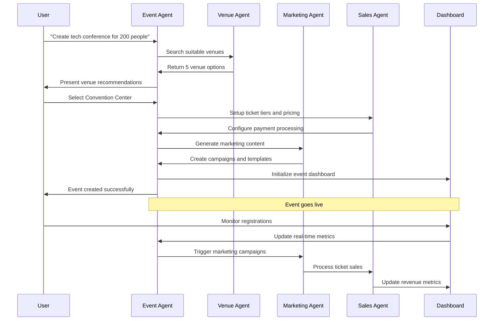
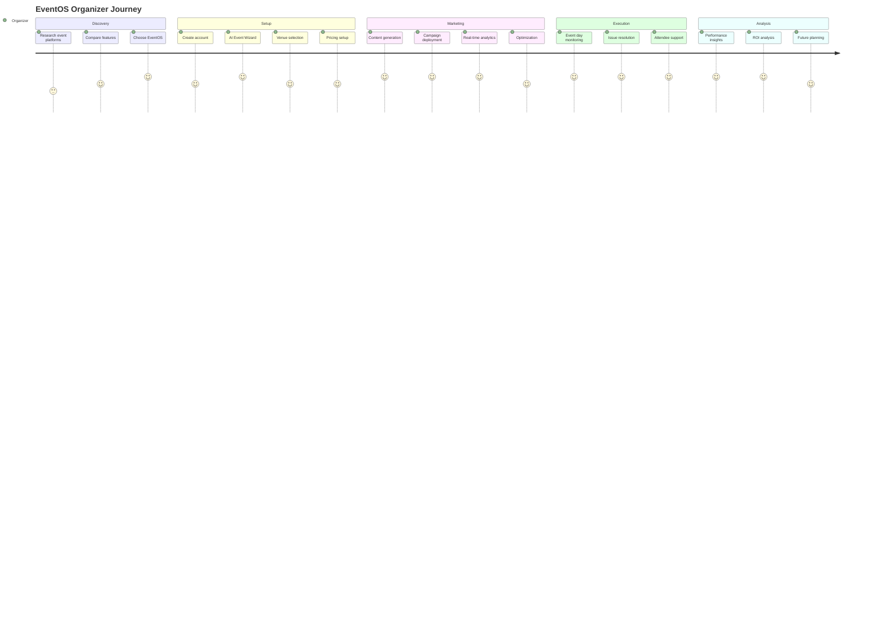
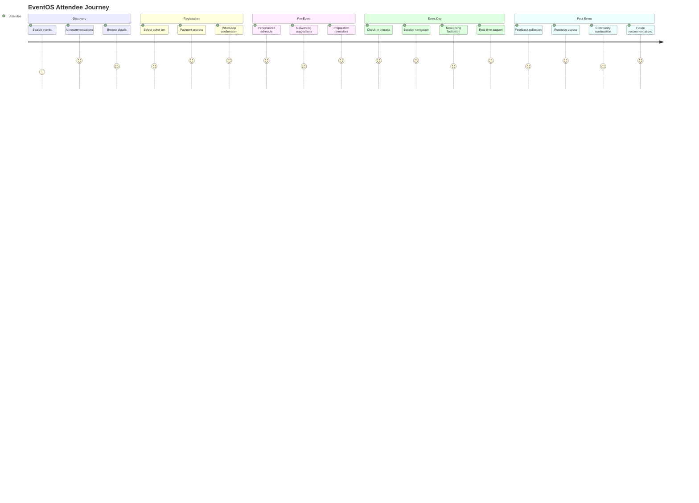
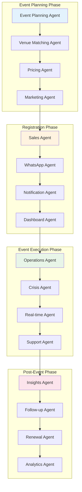
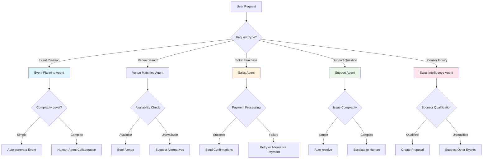
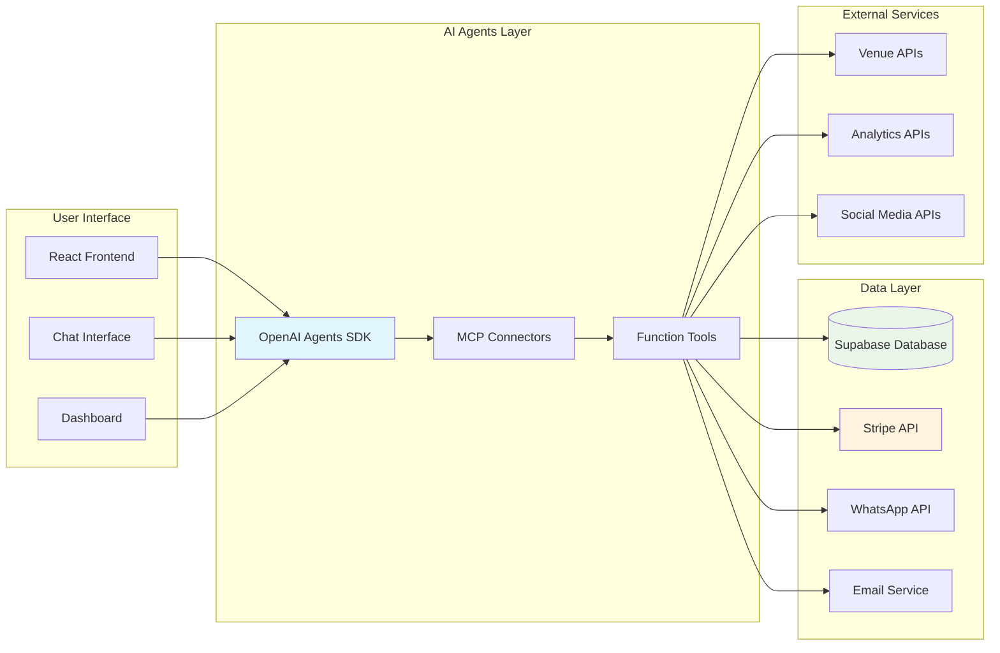
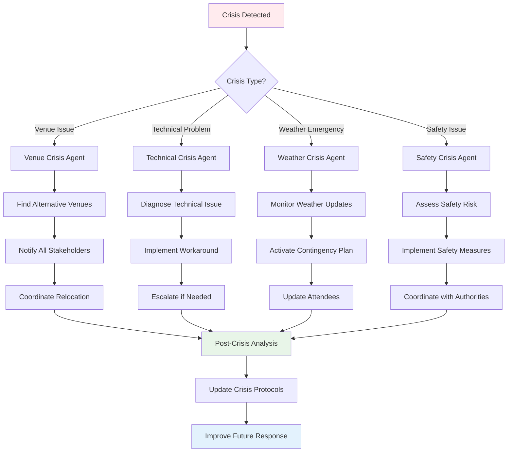
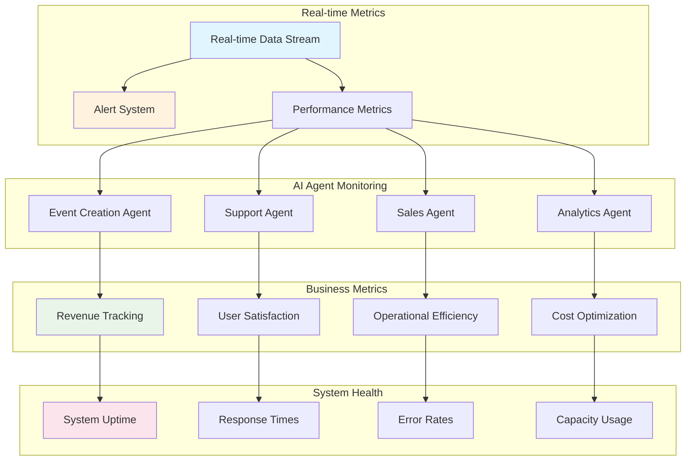
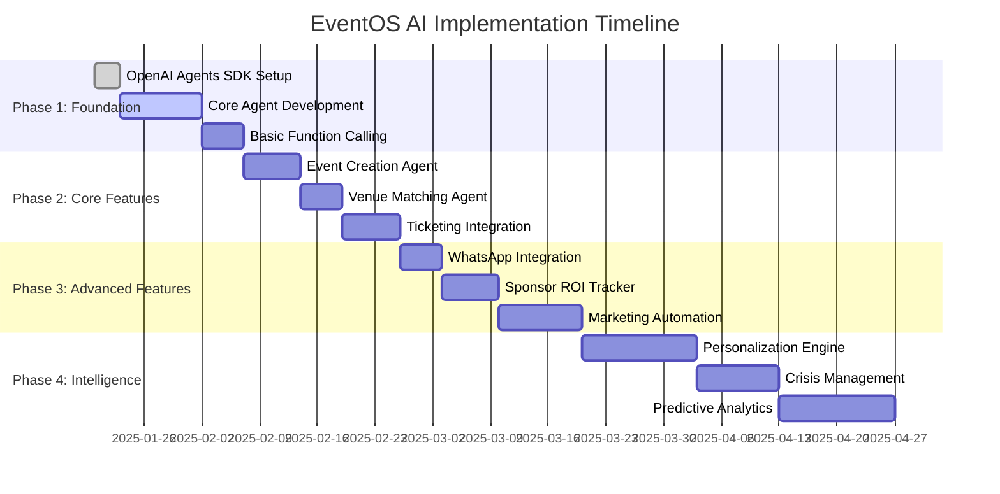
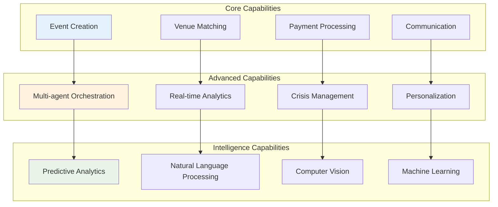

# 📊 EventOS AI Workflow Diagrams

**Project:** EventOS - AI-Powered Event Management  
**Analysis Date:** 2025-01-17  
**Scope:** Mermaid Diagrams for AI Agent Workflows

---

## 🔄 Event Creation → AI Content → Stripe → WhatsApp Flow

```mermaid
flowchart TD
    A[User: "Create Tech Conference"] --> B[Event Creation Agent]
    B --> C{Analyze Requirements}
    C --> D[Suggest Venue & Pricing]
    D --> E[Generate Event Page]
    E --> F[Setup Ticket Tiers]
    F --> G[Configure Stripe Checkout]
    G --> H[Deploy Marketing Campaigns]
    H --> I[Event Published]
    
    I --> J[Attendee Registers]
    J --> K[Stripe Payment Processing]
    K --> L[Webhook Triggered]
    L --> M[Update Event Dashboard]
    M --> N[WhatsApp Confirmation]
    N --> O[Email Receipt]
    O --> P[Marketing Follow-up]
    
    P --> Q[Pre-Event Reminders]
    Q --> R[Event Day Check-in]
    R --> S[Post-Event Feedback]
    
    style B fill:#e1f5fe
    style L fill:#fff3e0
    style N fill:#e8f5e8
    style Q fill:#fce4ec
```

---

## 🎯 Multi-Agent Event Planning Workflow



---

## 👤 Organizer Journey Map



---

## 🎫 Attendee Journey Map



---

## 🤖 Multi-Agent Event Orchestration



---

## 🎯 AI Agent Decision Tree



---

## 📊 Data Flow Architecture



---

## 🚨 Crisis Management Flow



---

## 📈 Performance Monitoring Dashboard



---

## 🔧 Implementation Roadmap



---

## 🎯 Agent Capability Matrix



---

These diagrams provide a comprehensive visual representation of how AI agents will orchestrate the entire EventOS experience, from initial event creation through post-event analysis, ensuring seamless, intelligent, and efficient event management.
