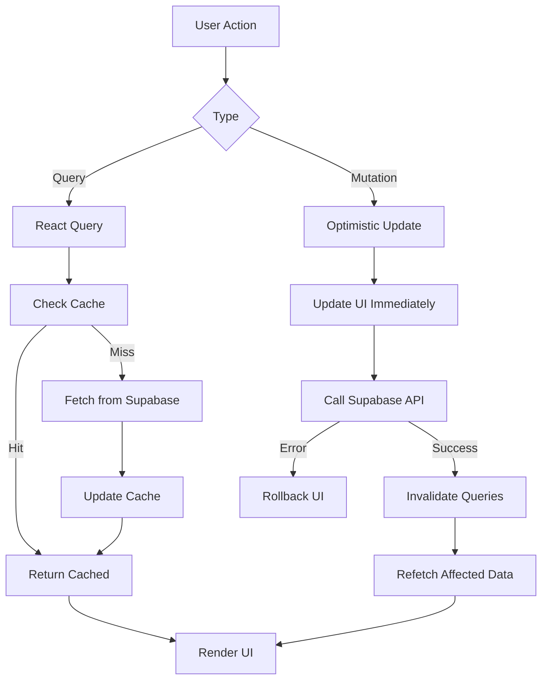

# 🎯 Frontend Master Plan — EventOS React Application

**Version:** 1.0
**Last Updated:** 2025-10-17
**Stack:** React 18 + Vite + TypeScript + Supabase + shadcn/ui

---

## 📋 Table of Contents

1. [Goals & Scope](#goals--scope)
2. [Tech Stack](#tech-stack)
3. [Directory Structure](#directory-structure)
4. [Provider Tree](#provider-tree)
5. [Routing Architecture](#routing-architecture)
6. [Data Flow](#data-flow)
7. [Real-time Integration](#real-time-integration)
8. [Testing Strategy](#testing-strategy)
9. [Success Criteria](#success-criteria)

---

## 🎯 Goals & Scope

### MVP Focus
Build a production-ready event management platform enabling organizers to:
- ✅ Create and publish events
- ✅ Configure ticket tiers with pricing
- ✅ Generate and manage promo codes
- ✅ Process ticket orders via Stripe
- ✅ Track sales and attendee data
- ✅ Manage CRM contacts and interactions

### Out of Scope (Phase 2)
- ❌ Multi-language support
- ❌ Advanced analytics dashboards
- ❌ Mobile native apps
- ❌ Third-party integrations (Mailchimp, Zapier)

---

## 🛠️ Tech Stack

### Core Framework
```json
{
  "react": "^18.3.0",
  "vite": "^5.0.0",
  "typescript": "^5.3.0"
}
```

### State & Data Management
```json
{
  "@tanstack/react-query": "^5.0.0",    // Server state & caching
  "zustand": "^4.5.0",                   // Client-side UI state
  "@supabase/supabase-js": "^2.39.0",   // Database client
  "@supabase/auth-helpers-react": "^0.5.0"  // Auth utilities
}
```

### UI & Styling
```json
{
  "tailwindcss": "^3.4.0",
  "@radix-ui/react-*": "latest",        // Accessible primitives
  "class-variance-authority": "^0.7.0",  // Component variants
  "lucide-react": "^0.300.0"            // Icon library
}
```

### Forms & Validation
```json
{
  "react-hook-form": "^7.49.0",
  "zod": "^3.22.0",
  "@hookform/resolvers": "^3.3.0"
}
```

### Development Tools
```json
{
  "eslint": "^8.56.0",
  "prettier": "^3.1.0",
  "@types/react": "^18.2.0"
}
```

---

## 📁 Directory Structure

```
src/
├── components/
│   ├── ui/                    # shadcn/ui primitives
│   │   ├── button.tsx
│   │   ├── card.tsx
│   │   ├── dialog.tsx
│   │   └── form.tsx
│   ├── layout/                # Page layouts
│   │   ├── DashboardLayout.tsx
│   │   ├── PublicLayout.tsx
│   │   └── AuthLayout.tsx
│   └── shared/                # Reusable components
│       ├── EventCard.tsx
│       ├── TicketSelector.tsx
│       └── PromoCodeInput.tsx
│
├── features/                  # Feature-based modules
│   ├── events/
│   │   ├── components/
│   │   │   ├── EventForm.tsx
│   │   │   ├── EventList.tsx
│   │   │   └── EventDetails.tsx
│   │   ├── hooks/
│   │   │   ├── useEvents.ts
│   │   │   └── useEventMutations.ts
│   │   ├── schemas/
│   │   │   └── eventSchema.ts
│   │   └── types/
│   │       └── event.types.ts
│   ├── tickets/
│   ├── orders/
│   ├── promo-codes/
│   └── crm/
│
├── lib/                       # Core utilities
│   ├── supabase.ts           # Supabase client
│   ├── queryClient.ts        # React Query config
│   └── utils.ts              # Helper functions
│
├── store/                     # Zustand stores
│   ├── useCartStore.ts
│   ├── useUIStore.ts
│   └── useFiltersStore.ts
│
├── hooks/                     # Global custom hooks
│   ├── useAuth.ts
│   ├── useSupabase.ts
│   └── useToast.ts
│
├── routes/                    # Route definitions
│   ├── public/
│   │   ├── HomePage.tsx
│   │   ├── EventPage.tsx
│   │   └── CheckoutPage.tsx
│   ├── auth/
│   │   ├── LoginPage.tsx
│   │   └── SignupPage.tsx
│   └── dashboard/
│       ├── DashboardHome.tsx
│       ├── EventsPage.tsx
│       └── OrdersPage.tsx
│
├── types/                     # Global TypeScript types
│   ├── database.types.ts     # Supabase generated
│   └── global.d.ts
│
├── App.tsx                    # Root component
├── main.tsx                   # Entry point
└── index.css                  # Global styles
```

---

## 🔗 Provider Tree

```tsx
// main.tsx
import React from 'react'
import ReactDOM from 'react-dom/client'
import { QueryClient, QueryClientProvider } from '@tanstack/react-query'
import { SessionContextProvider } from '@supabase/auth-helpers-react'
import { ThemeProvider } from '@/components/theme-provider'
import { Toaster } from '@/components/ui/toaster'
import { supabase } from '@/lib/supabase'
import App from './App'

const queryClient = new QueryClient({
  defaultOptions: {
    queries: {
      staleTime: 60 * 1000, // 1 minute
      retry: 1,
    },
  },
})

ReactDOM.createRoot(document.getElementById('root')!).render(
  <React.StrictMode>
    <QueryClientProvider client={queryClient}>
      <SessionContextProvider supabaseClient={supabase}>
        <ThemeProvider defaultTheme="light" storageKey="eventos-theme">
          <App />
          <Toaster />
        </ThemeProvider>
      </SessionContextProvider>
    </QueryClientProvider>
  </React.StrictMode>
)
```

### Provider Responsibilities

1. **QueryClientProvider** → Server state caching and synchronization
2. **SessionContextProvider** → Supabase authentication session management
3. **ThemeProvider** → Dark/light mode persistence
4. **Toaster** → Global toast notifications

---

## 🗺️ Routing Architecture

```tsx
// App.tsx
import { BrowserRouter, Routes, Route } from 'react-router-dom'
import { ProtectedRoute } from '@/components/ProtectedRoute'

function App() {
  return (
    <BrowserRouter>
      <Routes>
        {/* Public Routes */}
        <Route path="/" element={<HomePage />} />
        <Route path="/events" element={<EventsListPage />} />
        <Route path="/events/:slug" element={<EventDetailsPage />} />
        <Route path="/checkout/:orderId" element={<CheckoutPage />} />

        {/* Auth Routes */}
        <Route path="/auth/login" element={<LoginPage />} />
        <Route path="/auth/signup" element={<SignupPage />} />
        <Route path="/auth/reset" element={<ResetPasswordPage />} />

        {/* Protected Dashboard Routes */}
        <Route element={<ProtectedRoute />}>
          <Route path="/dashboard" element={<DashboardLayout />}>
            <Route index element={<DashboardHome />} />
            <Route path="events" element={<EventsManagementPage />} />
            <Route path="events/new" element={<EventCreatePage />} />
            <Route path="events/:id/edit" element={<EventEditPage />} />
            <Route path="orders" element={<OrdersPage />} />
            <Route path="promo-codes" element={<PromoCodesPage />} />
            <Route path="crm" element={<CRMPage />} />
          </Route>
        </Route>

        {/* 404 */}
        <Route path="*" element={<NotFoundPage />} />
      </Routes>
    </BrowserRouter>
  )
}
```

### Route Protection Pattern

```tsx
// components/ProtectedRoute.tsx
import { Navigate, Outlet } from 'react-router-dom'
import { useSession } from '@supabase/auth-helpers-react'

export function ProtectedRoute() {
  const session = useSession()

  if (!session) {
    return <Navigate to="/auth/login" replace />
  }

  return <Outlet />
}
```

---

## 🔄 Data Flow



### Data Flow Principles

1. **Single Source of Truth** → React Query cache
2. **Optimistic Updates** → Instant UI feedback
3. **Automatic Revalidation** → Fresh data on focus/reconnect
4. **Error Boundaries** → Graceful error handling

### Example Query Pattern

```tsx
// features/events/hooks/useEvents.ts
import { useQuery } from '@tanstack/react-query'
import { supabase } from '@/lib/supabase'
import type { Event } from '@/types/database.types'

export function useEvents(filters?: EventFilters) {
  return useQuery({
    queryKey: ['events', filters],
    queryFn: async () => {
      let query = supabase
        .from('events')
        .select('*, ticket_tiers(*), venue:venues(*)')
        .eq('status', 'published')

      if (filters?.eventType) {
        query = query.eq('event_type', filters.eventType)
      }

      const { data, error } = await query

      if (error) throw error
      return data as Event[]
    },
    staleTime: 5 * 60 * 1000, // 5 minutes
  })
}
```

### Example Mutation Pattern

```tsx
// features/events/hooks/useEventMutations.ts
import { useMutation, useQueryClient } from '@tanstack/react-query'
import { supabase } from '@/lib/supabase'
import { useToast } from '@/hooks/useToast'

export function useCreateEvent() {
  const queryClient = useQueryClient()
  const { toast } = useToast()

  return useMutation({
    mutationFn: async (eventData: CreateEventInput) => {
      const { data, error } = await supabase
        .from('events')
        .insert(eventData)
        .select()
        .single()

      if (error) throw error
      return data
    },
    onSuccess: () => {
      queryClient.invalidateQueries({ queryKey: ['events'] })
      toast({
        title: 'Event created',
        description: 'Your event has been created successfully',
      })
    },
    onError: (error) => {
      toast({
        title: 'Error',
        description: error.message,
        variant: 'destructive',
      })
    },
  })
}
```

---

## ⚡ Real-time Integration

### Real-time Subscription Pattern

```tsx
// features/orders/hooks/useOrdersRealtime.ts
import { useEffect } from 'react'
import { useQueryClient } from '@tanstack/react-query'
import { supabase } from '@/lib/supabase'

export function useOrdersRealtime(eventId: string) {
  const queryClient = useQueryClient()

  useEffect(() => {
    const channel = supabase
      .channel(`orders:${eventId}`)
      .on(
        'postgres_changes',
        {
          event: '*', // INSERT, UPDATE, DELETE
          schema: 'public',
          table: 'orders',
          filter: `event_id=eq.${eventId}`,
        },
        (payload) => {
          console.log('Order change:', payload)

          // Invalidate orders query to refetch
          queryClient.invalidateQueries({
            queryKey: ['orders', eventId],
          })
        }
      )
      .subscribe()

    // Cleanup subscription on unmount
    return () => {
      supabase.removeChannel(channel)
    }
  }, [eventId, queryClient])
}
```

### Usage in Components

```tsx
// features/orders/components/OrdersList.tsx
export function OrdersList({ eventId }: { eventId: string }) {
  const { data: orders, isLoading } = useOrders(eventId)

  // Enable real-time updates
  useOrdersRealtime(eventId)

  if (isLoading) return <OrdersSkeleton />

  return (
    <div className="space-y-4">
      {orders?.map(order => (
        <OrderCard key={order.id} order={order} />
      ))}
    </div>
  )
}
```

---

## 🧪 Testing Strategy

### 1. Component Mount Test
```bash
npm run dev
# Expected: App loads with no console errors
# Verify: Network tab shows successful Supabase connection
```

### 2. Authentication Flow Test
```
1. Visit /auth/login
2. Enter test credentials
3. Verify redirect to /dashboard
4. Refresh page
5. Confirm session persists (no re-login required)
```

### 3. Protected Routes Test
```
1. Open /dashboard in incognito
2. Expected: Immediate redirect to /auth/login
3. Log in
4. Verify redirect back to /dashboard
```

### 4. Real-time Updates Test
```
1. Open Orders page in browser
2. Open Supabase Studio in another tab
3. Insert new order manually
4. Verify: Orders list updates automatically within 2 seconds
5. Check: No duplicate entries appear
```

### 5. Error Handling Test
```
1. Disconnect internet
2. Try creating an event
3. Verify: Toast shows "Network error" message
4. Reconnect internet
5. Verify: Automatic retry and success toast
```

---

## ✅ Success Criteria

### Performance Metrics
- ✅ Initial page load: < 2 seconds
- ✅ Time to Interactive (TTI): < 3 seconds
- ✅ Real-time update latency: < 2 seconds
- ✅ Query response time: < 500ms (cached)

### Functional Requirements
- ✅ All routes load without errors
- ✅ Auth redirects work consistently
- ✅ Real-time changes reflect in UI
- ✅ Forms validate both client and server-side
- ✅ Error toasts display for all failures
- ✅ Loading states prevent double-submissions

### Code Quality
- ✅ Zero TypeScript errors
- ✅ Zero ESLint warnings
- ✅ All components properly typed
- ✅ No unused imports or variables
- ✅ Consistent code formatting (Prettier)

### Accessibility
- ✅ All interactive elements keyboard accessible
- ✅ Focus indicators visible
- ✅ Screen reader friendly
- ✅ ARIA labels on complex components
- ✅ Color contrast meets WCAG AA

---

## 📚 References

- [React Query Docs](https://tanstack.com/query/latest)
- [Supabase React Guide](https://supabase.com/docs/guides/getting-started/quickstarts/reactjs)
- [shadcn/ui Components](https://ui.shadcn.com/)
- [React Hook Form](https://react-hook-form.com/)
- [Zustand Documentation](https://zustand-demo.pmnd.rs/)

---

**Next:** [02-SETUP_AND_DEPLOYMENT_GUIDE.md](./02-SETUP_AND_DEPLOYMENT_GUIDE.md)
