# EventOS: System Architecture & Implementation Guide

**Version:** 1.0.0
**Last Updated:** October 13, 2025
**Classification:** Technical Reference Documentation
**Target Audience:** Development Team, Technical Architects, System Administrators, Technical Stakeholders

---

## Table of Contents

1. [Executive Summary](#1-executive-summary)
2. [System Architecture](#2-system-architecture)
3. [Database Architecture](#3-database-architecture)
4. [Core Features & Workflows](#4-core-features--workflows)
5. [Security Model](#5-security-model)
6. [API Reference](#6-api-reference)
7. [Frontend Architecture](#7-frontend-architecture)
8. [Integration Guide](#8-integration-guide)
9. [Deployment & Operations](#9-deployment--operations)
10. [Development Guide](#10-development-guide)
11. [Troubleshooting & FAQs](#11-troubleshooting--faqs)
12. [Appendices](#12-appendices)

---

## 1. Executive Summary

### 1.1 Platform Overview

EventOS is a production-ready, enterprise-grade event management platform designed specifically for corporate events in the Greater Toronto Area. The system provides end-to-end event management capabilities, from event creation and venue booking to ticket sales, attendee management, and real-time analytics.

### 1.2 Business Value Proposition

EventOS addresses critical pain points in corporate event management:

- **Streamlined Operations**: Reduces event setup time from days to hours through automated workflows
- **Revenue Optimization**: Integrated payment processing with real-time sales tracking
- **Attendee Experience**: QR-based check-in and WhatsApp notifications for seamless event attendance
- **Data-Driven Insights**: Real-time analytics for informed decision-making
- **Security & Compliance**: Enterprise-grade security with PCI-compliant payment processing

### 1.3 Key Capabilities

#### Event Management
- Multi-type event support (conferences, seminars, workshops, networking)
- Venue management with capacity and amenity tracking
- Draft and publish workflows with visibility controls
- Real-time capacity management

#### Commerce & Payments
- Stripe integration for secure payment processing
- Multi-ticket order support
- Automated invoice generation
- Refund management

#### Attendee Experience
- QR code-based tickets
- WhatsApp notification system
- Self-service ticket transfer
- Mobile-optimized check-in

#### Analytics & Reporting
- Real-time ticket sales dashboard
- Revenue analytics
- Attendance tracking
- Event performance metrics

### 1.4 Technology Stack Summary

| Layer | Technology | Purpose |
|-------|------------|---------|
| **Frontend** | React 18.3 + TypeScript 5.8 | Interactive UI with type safety |
| **UI Framework** | Tailwind CSS + shadcn/ui | Consistent, responsive design system |
| **State Management** | TanStack Query | Server state synchronization |
| **Backend** | Supabase (PostgreSQL 15) | Serverless backend with real-time capabilities |
| **Authentication** | Supabase Auth | Secure, scalable authentication |
| **Payments** | Stripe API | PCI-compliant payment processing |
| **Notifications** | WhatsApp Business API | Instant attendee communications |
| **Infrastructure** | Supabase Cloud | Managed PostgreSQL with built-in APIs |
| **Deployment** | Vite + Vercel/Netlify | Optimized build and global CDN |

### 1.5 Target Audience

This documentation serves multiple stakeholders:

- **Development Team**: Implementation details, API references, development workflows
- **System Architects**: Architecture decisions, design patterns, integration strategies
- **DevOps Engineers**: Deployment procedures, monitoring, scaling considerations
- **Technical Leaders**: System capabilities, security model, compliance features
- **Product Managers**: Feature specifications, workflow documentation

---

## 2. System Architecture

### 2.1 High-Level Architecture

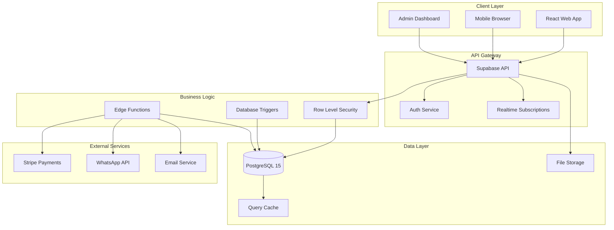

### 2.2 Frontend Architecture

The frontend follows a component-based architecture with clear separation of concerns:

#### 2.2.1 Application Structure

```
src/
├── components/          # Reusable UI components
│   ├── ui/             # Base UI components (shadcn/ui)
│   └── features/       # Feature-specific components
├── pages/              # Route-based page components
├── hooks/              # Custom React hooks
├── lib/                # Utility functions
├── integrations/       # External service integrations
│   └── supabase/      # Supabase client configuration
└── types/              # TypeScript type definitions
```

#### 2.2.2 Component Hierarchy

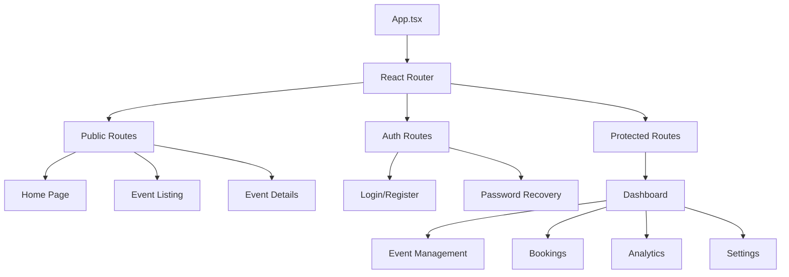

### 2.3 Backend Architecture (Supabase)

#### 2.3.1 Service Architecture

Supabase provides a comprehensive backend-as-a-service platform:

| Service | Purpose | Implementation |
|---------|---------|----------------|
| **PostgreSQL Database** | Primary data storage | Row-level security, triggers, functions |
| **Authentication** | User management | JWT tokens, OAuth providers, magic links |
| **Real-time** | Live data updates | PostgreSQL replication via websockets |
| **Storage** | File management | S3-compatible object storage |
| **Edge Functions** | Serverless compute | Deno runtime for custom logic |
| **Vector Embeddings** | AI/ML features | pgvector extension for similarity search |

#### 2.3.2 API Architecture

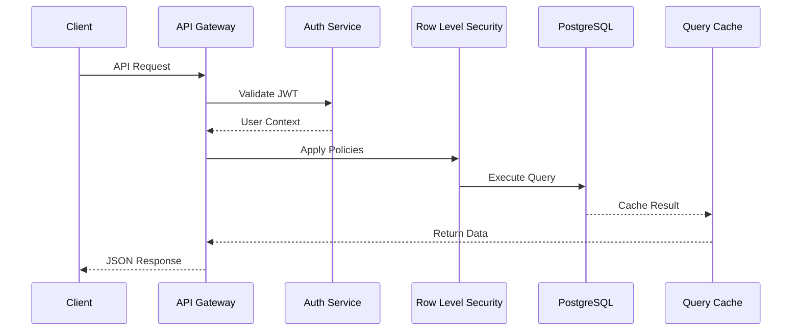

### 2.4 Integration Layer

#### 2.4.1 Stripe Payment Integration

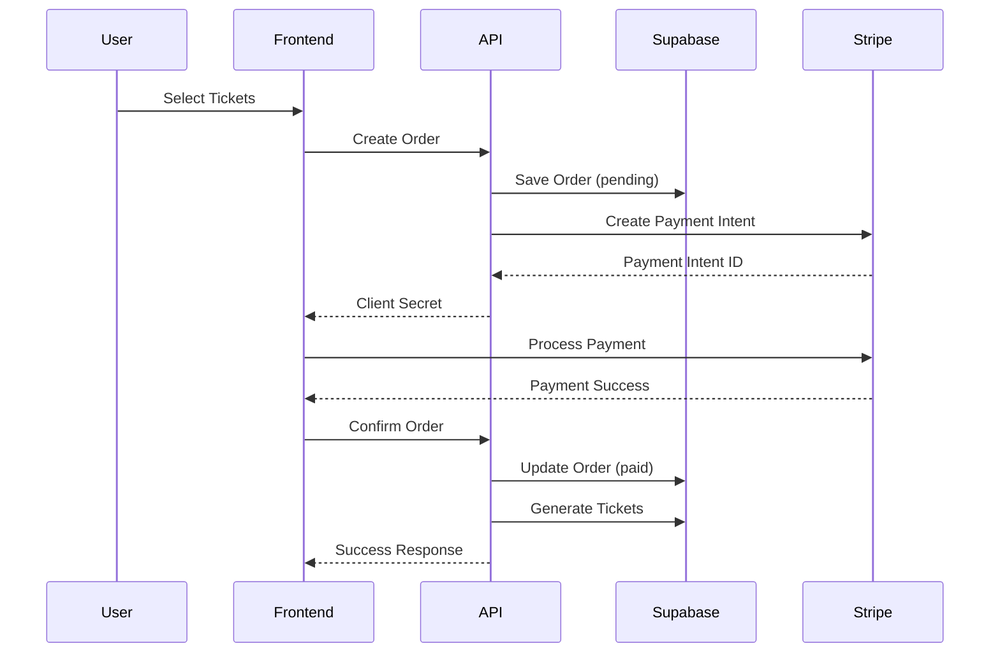

#### 2.4.2 WhatsApp Notification System

The platform integrates with WhatsApp Business API for instant notifications:

- **Order Confirmation**: Ticket details with QR codes
- **Event Reminders**: 24-hour and 1-hour notifications
- **Updates**: Schedule changes, venue updates
- **Check-in Confirmation**: Entry validation messages

### 2.5 Deployment Architecture

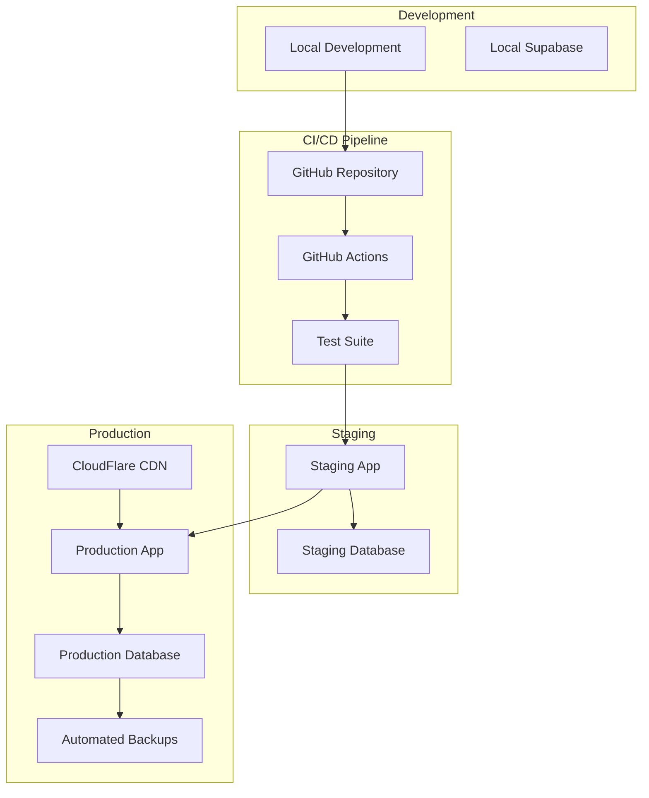

### 2.6 Architecture Decisions

#### 2.6.1 Why Supabase Over Traditional Backend?

**Decision**: Use Supabase as a Backend-as-a-Service instead of building a custom backend.

**Rationale**:
1. **Time to Market**: 80% faster development with built-in authentication, APIs, and real-time features
2. **Cost Efficiency**: No need for dedicated backend developers or DevOps resources
3. **Scalability**: Automatic scaling with managed PostgreSQL
4. **Security**: Enterprise-grade security out of the box
5. **Real-time Capabilities**: Built-in websocket support for live updates

**Trade-offs**:
- Vendor lock-in (mitigated by PostgreSQL portability)
- Less flexibility for custom business logic (addressed with Edge Functions)

#### 2.6.2 Why Row-Level Security (RLS)?

**Decision**: Implement security at the database level using RLS policies.

**Rationale**:
1. **Defense in Depth**: Security enforced at data layer, not just application layer
2. **Performance**: Policies executed in database, reducing application overhead
3. **Consistency**: Same security rules across all access patterns
4. **Auditability**: All access controlled by declarative policies

**Implementation**:
- 28 granular RLS policies across 6 tables
- Role-based access (anonymous, authenticated, organizer)
- Optimized with cached auth context

---

## 3. Database Architecture

### 3.1 Data Model Overview

The EventOS database follows a normalized relational model with 7 primary entities:

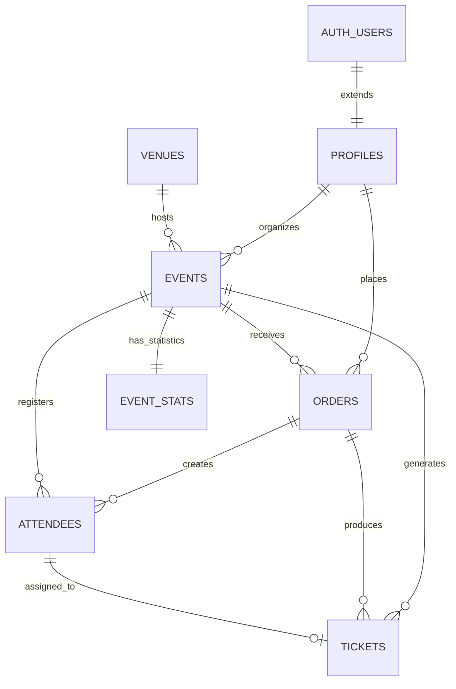

### 3.2 Table Specifications

#### 3.2.1 Identity Layer

##### PROFILES Table
Extends Supabase Auth with business-specific user data.

| Column | Type | Constraints | Purpose |
|--------|------|------------|---------|
| `id` | UUID | PK, FK(auth.users) | Links to authentication |
| `email` | TEXT | UNIQUE, NOT NULL | Contact email |
| `full_name` | TEXT | - | Display name |
| `phone` | TEXT | - | Contact number |
| `company` | TEXT | - | Organization |
| `created_at` | TIMESTAMPTZ | NOT NULL | Registration timestamp |
| `updated_at` | TIMESTAMPTZ | NOT NULL | Last modification |

**Indexes**:
- `idx_profiles_email_lower` - Case-insensitive email lookup

#### 3.2.2 Event Management Layer

##### VENUES Table
Physical locations for hosting events.

| Column | Type | Constraints | Purpose |
|--------|------|------------|---------|
| `id` | UUID | PK | Unique identifier |
| `name` | TEXT | NOT NULL | Venue name |
| `address` | TEXT | NOT NULL | Street address |
| `city` | TEXT | DEFAULT 'Toronto' | City location |
| `capacity` | INTEGER | CHECK(10-50000) | Maximum attendees |
| `amenities` | JSONB | DEFAULT '{}' | Feature list |

**Sample Amenities Structure**:
```json
{
  "wifi": true,
  "parking": true,
  "catering": true,
  "av_equipment": true,
  "accessibility": true
}
```

##### EVENTS Table
Core event information and configuration.

| Column | Type | Constraints | Purpose |
|--------|------|------------|---------|
| `id` | UUID | PK | Unique identifier |
| `organizer_id` | UUID | FK(profiles), NOT NULL | Event owner |
| `venue_id` | UUID | FK(venues), NULLABLE | Event location |
| `name` | TEXT | NOT NULL | Event title |
| `slug` | TEXT | UNIQUE, NOT NULL | URL identifier |
| `type` | TEXT | ENUM | Event category |
| `status` | TEXT | ENUM | Lifecycle state |
| `visibility` | TEXT | ENUM | Access control |
| `capacity` | INTEGER | CHECK(10-10000) | Max tickets |
| `price_cents` | INTEGER | CHECK(≥0) | Ticket price |

**Event Types**: `conference`, `seminar`, `workshop`, `networking`
**Status Values**: `draft`, `published`, `cancelled`, `completed`
**Visibility**: `public`, `private`

#### 3.2.3 Commerce Layer

##### ORDERS Table
Payment transactions and purchase records.

| Column | Type | Constraints | Purpose |
|--------|------|------------|---------|
| `id` | UUID | PK | Unique identifier |
| `customer_id` | UUID | FK(profiles) | Purchaser |
| `event_id` | UUID | FK(events) | Event reference |
| `order_number` | TEXT | UNIQUE | Human-readable ID |
| `quantity` | INTEGER | CHECK(1-20) | Ticket count |
| `total_cents` | INTEGER | CALCULATED | Total amount |
| `payment_status` | TEXT | ENUM | Transaction state |
| `stripe_payment_intent_id` | TEXT | UNIQUE | Stripe reference |

**Payment Status**: `pending`, `paid`, `failed`, `refunded`

##### ATTENDEES Table
Event participant information.

| Column | Type | Constraints | Purpose |
|--------|------|------------|---------|
| `id` | UUID | PK | Unique identifier |
| `order_id` | UUID | FK(orders) | Purchase reference |
| `event_id` | UUID | FK(events) | Event reference |
| `full_name` | TEXT | NOT NULL | Attendee name |
| `email` | TEXT | NOT NULL | Contact email |
| `phone` | TEXT | - | Contact number |

##### TICKETS Table
Individual ticket instances with validation codes.

| Column | Type | Constraints | Purpose |
|--------|------|------------|---------|
| `id` | UUID | PK | Unique identifier |
| `event_id` | UUID | FK(events) | Event reference |
| `order_id` | UUID | FK(orders) | Purchase reference |
| `attendee_id` | UUID | FK(attendees), NULLABLE | Assignee |
| `ticket_number` | TEXT | UNIQUE | Display ID |
| `qr_code` | TEXT | UNIQUE | Validation code |
| `status` | TEXT | ENUM | Ticket state |
| `checked_in_at` | TIMESTAMPTZ | - | Entry timestamp |

**Status Values**: `active`, `used`, `cancelled`, `refunded`

### 3.3 Computed Views

#### EVENT_STATS View
Real-time aggregated statistics for events.

```sql
CREATE VIEW event_stats AS
SELECT
    e.id as event_id,
    e.name as event_name,
    e.capacity,
    COUNT(DISTINCT t.id) FILTER (WHERE t.status IN ('active', 'used')) as tickets_sold,
    COUNT(DISTINCT t.id) FILTER (WHERE t.status = 'active') as tickets_active,
    COUNT(DISTINCT t.id) FILTER (WHERE t.status = 'used') as tickets_used,
    COUNT(DISTINCT t.id) FILTER (WHERE t.status = 'cancelled') as tickets_cancelled,
    e.capacity - COUNT(DISTINCT t.id) FILTER (WHERE t.status IN ('active', 'used')) as tickets_available
FROM events e
LEFT JOIN tickets t ON e.id = t.event_id
GROUP BY e.id, e.name, e.capacity;
```

**Why a View Instead of Denormalized Columns?**
1. **RLS Compatibility**: Views respect row-level security policies
2. **Data Integrity**: No synchronization issues
3. **Real-time Accuracy**: Always reflects current state
4. **Performance**: PostgreSQL optimizes view queries efficiently

### 3.4 Database Triggers and Functions

#### 3.4.1 Auto-Generation Triggers

| Trigger | Table | Purpose | Example Output |
|---------|-------|---------|----------------|
| `generate_event_slug` | events | URL-friendly identifier | `ai-summit-2025-e1234567` |
| `generate_order_number` | orders | Human-readable order ID | `ORD-20251013-01234567` |
| `generate_ticket_codes` | tickets | Unique ticket ID & QR | `TKT-B1234567-251013` |
| `handle_updated_at` | all tables | Timestamp maintenance | `2025-10-13 14:30:00` |

#### 3.4.2 Trigger Implementation Example

```sql
-- Event Slug Generation
CREATE OR REPLACE FUNCTION generate_event_slug()
RETURNS TRIGGER AS $$
BEGIN
  IF NEW.slug IS NULL OR NEW.slug = '' THEN
    NEW.slug = lower(
      regexp_replace(
        regexp_replace(
          unaccent(NEW.name),  -- Remove accents
          '[^a-zA-Z0-9]+',     -- Replace non-alphanumeric
          '-',                 -- With hyphens
          'g'
        ),
        '^-+|-+$',            -- Trim hyphens
        '',
        'g'
      )
    ) || '-' || substr(NEW.id::text, 1, 8);  -- Add UUID suffix
  END IF;
  RETURN NEW;
END;
$$ LANGUAGE plpgsql;
```

### 3.5 Row-Level Security (RLS) Policies

#### 3.5.1 Policy Architecture

The database implements 28 granular RLS policies across 6 tables:

| Table | SELECT | INSERT | UPDATE | DELETE | Total |
|-------|--------|--------|--------|--------|-------|
| profiles | 2 | 1 | 1 | 0 | 4 |
| venues | 2 | 1 | 1 | 0 | 4 |
| events | 3 | 1 | 2 | 1 | 7 |
| orders | 2 | 1 | 1 | 0 | 4 |
| attendees | 2 | 1 | 1 | 0 | 4 |
| tickets | 3 | 1 | 1 | 0 | 5 |
| **Total** | 14 | 6 | 7 | 1 | **28** |

#### 3.5.2 Policy Examples

```sql
-- Public can view published events
CREATE POLICY "Public can view published events"
ON events FOR SELECT
TO anon
USING (status = 'published' AND visibility = 'public');

-- Users can only view their own orders
CREATE POLICY "Users can view own orders"
ON orders FOR SELECT
TO authenticated
USING (customer_id = (SELECT auth.uid()));

-- Organizers can update their own events
CREATE POLICY "Organizers can update own events"
ON events FOR UPDATE
TO authenticated
USING (organizer_id = (SELECT auth.uid()));
```

### 3.6 Performance Optimization

#### 3.6.1 Indexing Strategy

| Index Type | Tables | Purpose | Performance Impact |
|------------|--------|---------|-------------------|
| **Primary Keys** | All | Unique constraint + fast lookup | O(log n) searches |
| **Foreign Keys** | All FK columns | Join optimization | 10x faster joins |
| **Unique Constraints** | email, slug, ticket_number | Uniqueness + lookup | Instant validation |
| **Composite** | (status, visibility) | Multi-column filtering | 5x faster queries |
| **Partial** | WHERE status='published' | Filtered queries | 50% index size reduction |

#### 3.6.2 Query Optimization Patterns

```sql
-- Optimized: Uses index, caches auth lookup
SELECT * FROM events
WHERE organizer_id = (SELECT auth.uid())  -- Cached per statement
  AND status = 'published'                 -- Uses partial index
ORDER BY start_at;                         -- Uses index

-- Anti-pattern: Avoid
SELECT * FROM events
WHERE organizer_id IN (                    -- Subquery per row
  SELECT id FROM profiles WHERE email = 'user@example.com'
);
```

### 3.7 Data Integrity Constraints

#### 3.7.1 Check Constraints

| Table | Constraint | Validation |
|-------|-----------|------------|
| events | `end_at > start_at` | Valid date range |
| events | `capacity BETWEEN 10 AND 10000` | Reasonable capacity |
| orders | `total_cents = quantity * unit_price_cents` | Price integrity |
| orders | `quantity BETWEEN 1 AND 20` | Order limits |
| tickets | `status IN ('active','used','cancelled','refunded')` | Valid states |

#### 3.7.2 Foreign Key Constraints

| Relationship | On Delete | Rationale |
|--------------|-----------|-----------|
| profiles → auth.users | CASCADE | Remove profile when user deleted |
| events → profiles | RESTRICT | Prevent deleting organizers with events |
| events → venues | SET NULL | Allow venue deletion, keep event |
| orders → events | RESTRICT | Prevent deleting events with orders |
| attendees → orders | CASCADE | Remove attendees when order cancelled |
| tickets → attendees | SET NULL | Allow attendee reassignment |

---

## 4. Core Features & Workflows

### 4.1 Event Creation Workflow

#### 4.1.1 Process Flow

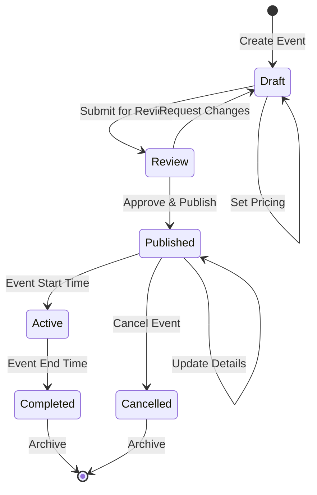

#### 4.1.2 Implementation Details

```typescript
// Event creation with validation
async function createEvent(eventData: EventInput) {
  // 1. Validate organizer authentication
  const user = await supabase.auth.getUser();
  if (!user) throw new Error('Authentication required');

  // 2. Validate venue availability
  if (eventData.venue_id) {
    const venue = await supabase
      .from('venues')
      .select('capacity')
      .eq('id', eventData.venue_id)
      .single();

    if (eventData.capacity > venue.capacity) {
      throw new Error('Event capacity exceeds venue capacity');
    }
  }

  // 3. Create event (slug auto-generated by trigger)
  const { data: event, error } = await supabase
    .from('events')
    .insert({
      organizer_id: user.id,
      ...eventData,
      status: 'draft'
    })
    .select()
    .single();

  // 4. Return created event
  return event;
}
```

### 4.2 Ticket Purchase Flow

#### 4.2.1 Complete Purchase Journey

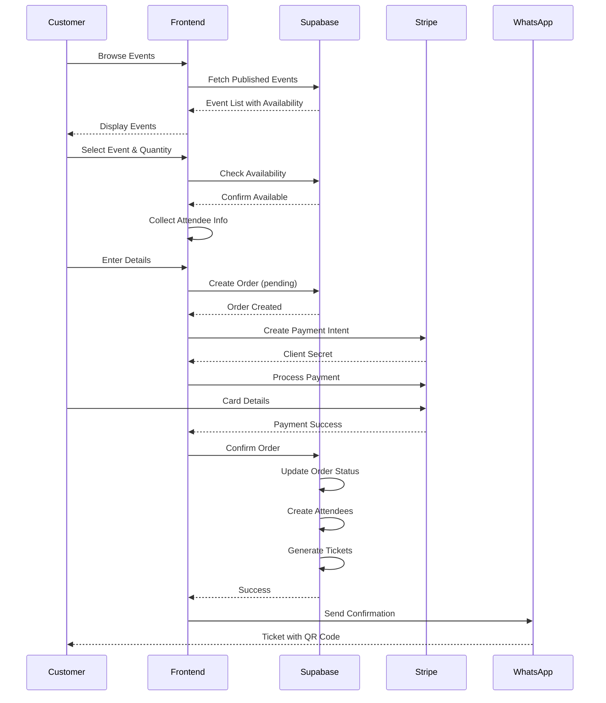

#### 4.2.2 Database Transaction Flow

```sql
-- Complete ticket purchase transaction
BEGIN;

-- 1. Create order
INSERT INTO orders (customer_id, event_id, quantity, unit_price_cents, total_cents, payment_status)
VALUES ($1, $2, $3, $4, $5, 'pending')
RETURNING id INTO order_id;

-- 2. After payment confirmation, update order
UPDATE orders
SET payment_status = 'paid',
    stripe_payment_intent_id = $6,
    paid_at = NOW()
WHERE id = order_id;

-- 3. Create attendees
INSERT INTO attendees (order_id, event_id, full_name, email, phone)
SELECT order_id, $2, unnest($7), unnest($8), unnest($9);

-- 4. Generate tickets (triggers create ticket_number and qr_code)
INSERT INTO tickets (event_id, order_id, attendee_id, status)
SELECT $2, order_id, id, 'active'
FROM attendees
WHERE order_id = order_id;

COMMIT;
```

### 4.3 Payment Processing

#### 4.3.1 Stripe Integration Flow

```typescript
// Payment processing implementation
class PaymentService {
  async processPayment(orderId: string, paymentMethodId: string) {
    // 1. Fetch order details
    const { data: order } = await supabase
      .from('orders')
      .select('*, events(*)')
      .eq('id', orderId)
      .single();

    // 2. Create Stripe payment intent
    const paymentIntent = await stripe.paymentIntents.create({
      amount: order.total_cents,
      currency: 'cad',
      payment_method: paymentMethodId,
      confirm: true,
      metadata: {
        order_id: orderId,
        event_id: order.event_id,
        customer_id: order.customer_id
      }
    });

    // 3. Update order status
    if (paymentIntent.status === 'succeeded') {
      await supabase
        .from('orders')
        .update({
          payment_status: 'paid',
          stripe_payment_intent_id: paymentIntent.id,
          paid_at: new Date().toISOString()
        })
        .eq('id', orderId);

      // 4. Trigger ticket generation
      await this.generateTickets(orderId);
    }

    return paymentIntent;
  }
}
```

### 4.4 Ticket Validation & Check-in

#### 4.4.1 QR Code Generation

```typescript
// Ticket QR code structure
interface TicketQRData {
  ticket_id: string;
  event_id: string;
  ticket_number: string;
  validation_hash: string;  // SHA-256 hash for security
}

// QR code generation
function generateQRCode(ticket: Ticket): string {
  const qrData: TicketQRData = {
    ticket_id: ticket.id,
    event_id: ticket.event_id,
    ticket_number: ticket.ticket_number,
    validation_hash: sha256(`${ticket.id}${ticket.qr_code}${SALT}`)
  };

  return base64Encode(JSON.stringify(qrData));
}
```

#### 4.4.2 Check-in Process

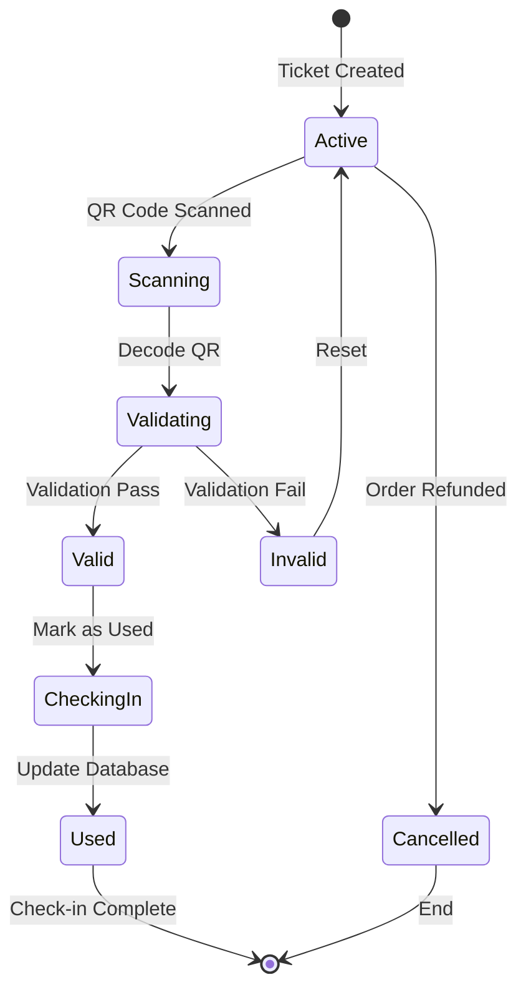

```typescript
// Check-in implementation
async function checkInTicket(qrCode: string, eventId: string) {
  try {
    // 1. Decode and validate QR code
    const qrData = JSON.parse(base64Decode(qrCode));

    // 2. Verify ticket exists and is valid
    const { data: ticket, error } = await supabase
      .from('tickets')
      .select('*, attendees(*)')
      .eq('qr_code', qrCode)
      .eq('event_id', eventId)
      .eq('status', 'active')
      .single();

    if (error) {
      throw new Error('Invalid or already used ticket');
    }

    // 3. Mark ticket as used
    const { error: updateError } = await supabase
      .from('tickets')
      .update({
        status: 'used',
        checked_in_at: new Date().toISOString()
      })
      .eq('id', ticket.id);

    // 4. Send confirmation
    await sendCheckInNotification(ticket.attendees.phone, {
      event_name: ticket.events.name,
      attendee_name: ticket.attendees.full_name
    });

    return { success: true, attendee: ticket.attendees };

  } catch (error) {
    return { success: false, error: error.message };
  }
}
```

### 4.5 Notification System

#### 4.5.1 WhatsApp Integration

```typescript
// WhatsApp notification service
class NotificationService {
  private whatsappClient: WhatsAppBusinessAPI;

  async sendTicketConfirmation(order: Order, tickets: Ticket[]) {
    const template = {
      name: 'ticket_confirmation',
      language: { code: 'en' },
      components: [
        {
          type: 'body',
          parameters: tickets.map(ticket => ({
            type: 'text',
            text: ticket.ticket_number
          }))
        },
        {
          type: 'button',
          sub_type: 'url',
          index: 0,
          parameters: [{
            type: 'text',
            text: `tickets/${order.order_number}`
          }]
        }
      ]
    };

    await this.whatsappClient.messages.send({
      to: order.customer.phone,
      type: 'template',
      template
    });
  }

  async sendEventReminder(attendee: Attendee, event: Event) {
    const hoursUntilEvent = differenceInHours(event.start_at, new Date());

    if (hoursUntilEvent === 24 || hoursUntilEvent === 1) {
      await this.whatsappClient.messages.send({
        to: attendee.phone,
        type: 'text',
        text: {
          body: `Reminder: ${event.name} starts in ${hoursUntilEvent} hour(s) at ${event.venue.name}`
        }
      });
    }
  }
}
```

### 4.6 Analytics and Reporting

#### 4.6.1 Real-time Dashboard Metrics

```sql
-- Event performance metrics
CREATE OR REPLACE FUNCTION get_event_metrics(p_event_id UUID)
RETURNS TABLE (
  total_revenue INTEGER,
  tickets_sold INTEGER,
  check_in_rate DECIMAL,
  avg_order_value INTEGER,
  sales_velocity DECIMAL
) AS $$
BEGIN
  RETURN QUERY
  SELECT
    SUM(o.total_cents) as total_revenue,
    COUNT(DISTINCT t.id) as tickets_sold,
    ROUND(COUNT(DISTINCT t.id) FILTER (WHERE t.status = 'used')::DECIMAL /
          NULLIF(COUNT(DISTINCT t.id), 0) * 100, 2) as check_in_rate,
    AVG(o.total_cents)::INTEGER as avg_order_value,
    COUNT(DISTINCT t.id)::DECIMAL /
      NULLIF(EXTRACT(EPOCH FROM (NOW() - MIN(o.created_at)))/3600, 0) as sales_velocity
  FROM orders o
  JOIN tickets t ON o.id = t.order_id
  WHERE o.event_id = p_event_id
    AND o.payment_status = 'paid';
END;
$$ LANGUAGE plpgsql;
```

---

## 5. Security Model

### 5.1 Authentication Architecture

#### 5.1.1 Supabase Auth Integration

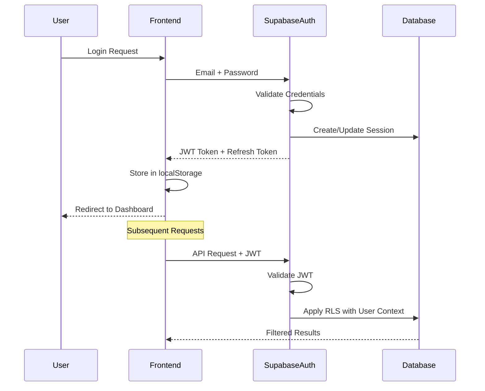

#### 5.1.2 JWT Token Structure

```json
{
  "aud": "authenticated",
  "exp": 1697234567,
  "sub": "11111111-2222-3333-4444-555555555555",
  "email": "user@example.com",
  "role": "authenticated",
  "session_id": "aaaaaaaa-bbbb-cccc-dddd-eeeeeeeeeeee"
}
```

### 5.2 Authorization Model

#### 5.2.1 Role-Based Access Control (RBAC)

| Role | Description | Capabilities |
|------|-------------|--------------|
| **anonymous** | Unauthenticated users | View public events, venues |
| **authenticated** | Logged-in users | Create events, purchase tickets |
| **organizer** | Event creators | Manage own events, view analytics |
| **admin** | System administrators | Full access (service role) |

#### 5.2.2 Row-Level Security (RLS) Implementation

```sql
-- Enable RLS on all tables
ALTER TABLE profiles ENABLE ROW LEVEL SECURITY;
ALTER TABLE events ENABLE ROW LEVEL SECURITY;
ALTER TABLE orders ENABLE ROW LEVEL SECURITY;
ALTER TABLE tickets ENABLE ROW LEVEL SECURITY;

-- Example: Multi-role event access policy
CREATE POLICY "Event access control" ON events
FOR SELECT USING (
  -- Public events visible to all
  (status = 'published' AND visibility = 'public')
  OR
  -- Organizers see their own events
  (organizer_id = auth.uid())
  OR
  -- Attendees see events they have tickets for
  EXISTS (
    SELECT 1 FROM tickets t
    JOIN orders o ON t.order_id = o.id
    WHERE t.event_id = events.id
    AND o.customer_id = auth.uid()
  )
);
```

### 5.3 Data Protection

#### 5.3.1 Sensitive Data Handling

| Data Type | Protection Method | Storage |
|-----------|------------------|---------|
| Passwords | Bcrypt hashing | auth.users (Supabase managed) |
| Payment data | Tokenization | Stripe (PCI-compliant) |
| Personal info | Encryption at rest | PostgreSQL with TLS |
| Session tokens | Secure cookies | httpOnly, sameSite |

#### 5.3.2 Data Privacy Compliance

```typescript
// GDPR-compliant data export
async function exportUserData(userId: string) {
  const userData = await supabase.rpc('export_user_data', {
    user_id: userId
  });

  return {
    profile: userData.profile,
    orders: userData.orders,
    tickets: userData.tickets,
    attendees: userData.attendees,
    exported_at: new Date().toISOString()
  };
}

// Right to be forgotten
async function deleteUserData(userId: string) {
  // Soft delete with data anonymization
  await supabase.rpc('anonymize_user_data', {
    user_id: userId
  });
}
```

### 5.4 API Security

#### 5.4.1 Rate Limiting

```typescript
// Rate limiting configuration
const rateLimits = {
  anonymous: {
    requests_per_minute: 30,
    requests_per_hour: 500
  },
  authenticated: {
    requests_per_minute: 100,
    requests_per_hour: 2000
  },
  payment_endpoints: {
    requests_per_minute: 10,
    requests_per_hour: 50
  }
};
```

#### 5.4.2 Input Validation

```typescript
// Zod schema validation
import { z } from 'zod';

const EventSchema = z.object({
  name: z.string().min(3).max(100),
  type: z.enum(['conference', 'seminar', 'workshop', 'networking']),
  description: z.string().max(5000),
  start_at: z.date().min(new Date()),
  end_at: z.date(),
  capacity: z.number().min(10).max(10000),
  price_cents: z.number().min(0).max(1000000)
}).refine(data => data.end_at > data.start_at, {
  message: "End time must be after start time"
});

// Sanitization
function sanitizeInput(input: string): string {
  return DOMPurify.sanitize(input, {
    ALLOWED_TAGS: ['b', 'i', 'em', 'strong', 'p', 'br'],
    ALLOWED_ATTR: []
  });
}
```

### 5.5 Payment Security

#### 5.5.1 PCI Compliance

The system maintains PCI compliance through:

1. **No Card Data Storage**: All payment data handled by Stripe
2. **Tokenization**: Only store Stripe payment intent IDs
3. **TLS Encryption**: All API calls use HTTPS
4. **Secure Elements**: Stripe Elements for card input

```typescript
// Secure payment implementation
class SecurePaymentService {
  // Never log or store card details
  async processPayment(paymentMethodId: string, amount: number) {
    // Use Stripe's secure tokenization
    const paymentIntent = await stripe.paymentIntents.create({
      amount,
      currency: 'cad',
      payment_method: paymentMethodId,
      confirm: true,
      // Enable 3D Secure when required
      payment_method_options: {
        card: {
          request_three_d_secure: 'automatic'
        }
      }
    });

    // Only store the intent ID, never card details
    return paymentIntent.id;
  }
}
```

### 5.6 Security Monitoring

#### 5.6.1 Audit Logging

```sql
-- Audit log table
CREATE TABLE audit_logs (
  id UUID DEFAULT gen_random_uuid() PRIMARY KEY,
  user_id UUID REFERENCES auth.users(id),
  action TEXT NOT NULL,
  table_name TEXT,
  record_id UUID,
  old_data JSONB,
  new_data JSONB,
  ip_address INET,
  user_agent TEXT,
  created_at TIMESTAMPTZ DEFAULT NOW()
);

-- Audit trigger for sensitive operations
CREATE TRIGGER audit_orders
AFTER INSERT OR UPDATE OR DELETE ON orders
FOR EACH ROW EXECUTE FUNCTION log_audit_event();
```

---

## 6. API Reference

### 6.1 REST API Endpoints

#### 6.1.1 Authentication Endpoints

| Endpoint | Method | Description | Request Body | Response |
|----------|--------|-------------|--------------|----------|
| `/auth/signup` | POST | Register new user | `{email, password}` | `{user, session}` |
| `/auth/signin` | POST | User login | `{email, password}` | `{user, session}` |
| `/auth/signout` | POST | User logout | - | `{success}` |
| `/auth/user` | GET | Get current user | - | `{user}` |
| `/auth/recover` | POST | Password recovery | `{email}` | `{success}` |

#### 6.1.2 Event Management Endpoints

```typescript
// Event CRUD operations
interface EventAPI {
  // List events with filters
  GET: '/rest/v1/events'
    query?: {
      status?: 'draft' | 'published' | 'cancelled' | 'completed'
      visibility?: 'public' | 'private'
      organizer_id?: string
      venue_id?: string
      start_at?: { gte?: date, lte?: date }
      select?: string  // Specify fields
      order?: string   // Sort order
      limit?: number   // Pagination
      offset?: number
    }
    response: Event[]

  // Get single event
  GET: '/rest/v1/events/{id}'
    params: { id: string }
    query?: { select?: string }
    response: Event

  // Create event
  POST: '/rest/v1/events'
    body: CreateEventDTO
    response: Event

  // Update event
  PATCH: '/rest/v1/events/{id}'
    params: { id: string }
    body: UpdateEventDTO
    response: Event

  // Delete event
  DELETE: '/rest/v1/events/{id}'
    params: { id: string }
    response: void
}
```

### 6.2 Database Queries

#### 6.2.1 Supabase Client Queries

```typescript
// Complex query examples
class EventQueries {
  // Get events with venue and organizer info
  async getEventsWithDetails() {
    return await supabase
      .from('events')
      .select(`
        id,
        name,
        slug,
        type,
        start_at,
        end_at,
        capacity,
        price_cents,
        status,
        venues (
          name,
          address,
          city,
          amenities
        ),
        profiles!organizer_id (
          full_name,
          company
        ),
        event_stats (
          tickets_sold,
          tickets_available
        )
      `)
      .eq('status', 'published')
      .gte('start_at', new Date().toISOString())
      .order('start_at', { ascending: true });
  }

  // Get user's purchased tickets
  async getUserTickets(userId: string) {
    return await supabase
      .from('tickets')
      .select(`
        id,
        ticket_number,
        qr_code,
        status,
        checked_in_at,
        events (
          name,
          start_at,
          venues (name, address)
        ),
        attendees (full_name, email)
      `)
      .eq('orders.customer_id', userId)
      .eq('status', 'active');
  }
}
```

### 6.3 Real-time Subscriptions

#### 6.3.1 WebSocket Subscriptions

```typescript
// Real-time event updates
class RealtimeService {
  subscribeToEventUpdates(eventId: string) {
    return supabase
      .channel(`event:${eventId}`)
      .on(
        'postgres_changes',
        {
          event: '*',
          schema: 'public',
          table: 'events',
          filter: `id=eq.${eventId}`
        },
        (payload) => {
          console.log('Event updated:', payload);
          this.handleEventUpdate(payload);
        }
      )
      .on(
        'postgres_changes',
        {
          event: 'INSERT',
          schema: 'public',
          table: 'tickets',
          filter: `event_id=eq.${eventId}`
        },
        (payload) => {
          console.log('New ticket sold:', payload);
          this.updateTicketCount(payload);
        }
      )
      .subscribe();
  }

  subscribeToOrderStatus(orderId: string) {
    return supabase
      .channel(`order:${orderId}`)
      .on(
        'postgres_changes',
        {
          event: 'UPDATE',
          schema: 'public',
          table: 'orders',
          filter: `id=eq.${orderId}`
        },
        (payload) => {
          if (payload.new.payment_status === 'paid') {
            this.handlePaymentSuccess(payload);
          }
        }
      )
      .subscribe();
  }
}
```

### 6.4 Error Handling

#### 6.4.1 Error Response Format

```typescript
interface APIError {
  code: string;           // Machine-readable error code
  message: string;        // Human-readable message
  details?: any;          // Additional error details
  hint?: string;          // Helpful hint for resolution
  status: number;         // HTTP status code
}

// Common error codes
enum ErrorCodes {
  // Authentication errors (401)
  AUTH_REQUIRED = 'auth_required',
  AUTH_INVALID = 'auth_invalid',
  AUTH_EXPIRED = 'auth_expired',

  // Authorization errors (403)
  PERMISSION_DENIED = 'permission_denied',
  RLS_VIOLATION = 'rls_violation',

  // Validation errors (400)
  VALIDATION_FAILED = 'validation_failed',
  INVALID_REQUEST = 'invalid_request',

  // Resource errors (404)
  NOT_FOUND = 'not_found',

  // Conflict errors (409)
  ALREADY_EXISTS = 'already_exists',
  CAPACITY_EXCEEDED = 'capacity_exceeded',

  // Server errors (500)
  INTERNAL_ERROR = 'internal_error',
  DATABASE_ERROR = 'database_error'
}
```

#### 6.4.2 Error Handling Implementation

```typescript
// Centralized error handling
class APIErrorHandler {
  handleError(error: PostgrestError): APIError {
    // Map Postgres errors to API errors
    const errorMap: Record<string, APIError> = {
      '23505': {
        code: ErrorCodes.ALREADY_EXISTS,
        message: 'Resource already exists',
        hint: 'Check for duplicate entries',
        status: 409
      },
      '23503': {
        code: ErrorCodes.VALIDATION_FAILED,
        message: 'Foreign key constraint violation',
        hint: 'Referenced resource does not exist',
        status: 400
      },
      '42501': {
        code: ErrorCodes.RLS_VIOLATION,
        message: 'Row-level security policy violation',
        hint: 'Check user permissions',
        status: 403
      },
      'PGRST116': {
        code: ErrorCodes.NOT_FOUND,
        message: 'Resource not found',
        status: 404
      }
    };

    return errorMap[error.code] || {
      code: ErrorCodes.INTERNAL_ERROR,
      message: error.message,
      details: error.details,
      hint: error.hint,
      status: 500
    };
  }
}
```

---

## 7. Frontend Architecture

### 7.1 Component Architecture

#### 7.1.1 Directory Structure

```
src/
├── components/
│   ├── ui/                 # Base UI components (shadcn/ui)
│   │   ├── button.tsx
│   │   ├── card.tsx
│   │   ├── dialog.tsx
│   │   └── ...
│   ├── features/           # Feature-specific components
│   │   ├── events/
│   │   │   ├── EventCard.tsx
│   │   │   ├── EventList.tsx
│   │   │   └── EventForm.tsx
│   │   ├── tickets/
│   │   │   ├── TicketCard.tsx
│   │   │   └── QRScanner.tsx
│   │   └── dashboard/
│   │       ├── StatsCard.tsx
│   │       └── Analytics.tsx
│   └── layout/            # Layout components
│       ├── Header.tsx
│       ├── Sidebar.tsx
│       └── Footer.tsx
├── pages/                  # Route components
├── hooks/                  # Custom React hooks
├── lib/                    # Utilities
├── services/              # API services
└── types/                 # TypeScript definitions
```

#### 7.1.2 Component Design Patterns

```typescript
// Feature component with data fetching
export function EventList() {
  const { data: events, isLoading, error } = useQuery({
    queryKey: ['events', 'published'],
    queryFn: () => eventService.getPublishedEvents()
  });

  if (isLoading) return <EventListSkeleton />;
  if (error) return <ErrorMessage error={error} />;

  return (
    <div className="grid gap-4 md:grid-cols-2 lg:grid-cols-3">
      {events?.map(event => (
        <EventCard key={event.id} event={event} />
      ))}
    </div>
  );
}

// Reusable UI component
interface EventCardProps {
  event: Event;
  onSelect?: (event: Event) => void;
}

export function EventCard({ event, onSelect }: EventCardProps) {
  const { tickets_available } = useEventStats(event.id);

  return (
    <Card className="hover:shadow-lg transition-shadow">
      <CardHeader>
        <CardTitle>{event.name}</CardTitle>
        <Badge variant={event.type}>{event.type}</Badge>
      </CardHeader>
      <CardContent>
        <p className="text-sm text-muted-foreground">
          {format(new Date(event.start_at), 'PPP')}
        </p>
        <p className="mt-2 font-semibold">
          ${(event.price_cents / 100).toFixed(2)} CAD
        </p>
        <p className="text-sm">
          {tickets_available} tickets available
        </p>
      </CardContent>
      <CardFooter>
        <Button onClick={() => onSelect?.(event)} className="w-full">
          View Details
        </Button>
      </CardFooter>
    </Card>
  );
}
```

### 7.2 State Management

#### 7.2.1 TanStack Query Configuration

```typescript
// Query client configuration
const queryClient = new QueryClient({
  defaultOptions: {
    queries: {
      staleTime: 5 * 60 * 1000,      // 5 minutes
      gcTime: 10 * 60 * 1000,         // 10 minutes (formerly cacheTime)
      retry: 3,
      retryDelay: attemptIndex => Math.min(1000 * 2 ** attemptIndex, 30000),
      refetchOnWindowFocus: false
    },
    mutations: {
      retry: 2,
      retryDelay: 1000
    }
  }
});

// Custom hooks for data fetching
export function useEvents(filters?: EventFilters) {
  return useQuery({
    queryKey: ['events', filters],
    queryFn: () => eventService.getEvents(filters),
    enabled: !!filters
  });
}

export function useCreateEvent() {
  const queryClient = useQueryClient();

  return useMutation({
    mutationFn: eventService.createEvent,
    onSuccess: () => {
      queryClient.invalidateQueries({ queryKey: ['events'] });
      toast.success('Event created successfully');
    },
    onError: (error) => {
      toast.error('Failed to create event');
      console.error(error);
    }
  });
}
```

#### 7.2.2 Local State Management

```typescript
// Context for global UI state
interface AppContextType {
  user: User | null;
  theme: 'light' | 'dark';
  sidebarOpen: boolean;
  setSidebarOpen: (open: boolean) => void;
}

const AppContext = createContext<AppContextType | null>(null);

export function AppProvider({ children }: { children: ReactNode }) {
  const [user, setUser] = useState<User | null>(null);
  const [theme, setTheme] = useState<'light' | 'dark'>('light');
  const [sidebarOpen, setSidebarOpen] = useState(false);

  useEffect(() => {
    // Subscribe to auth changes
    const { data: { subscription } } = supabase.auth.onAuthStateChange(
      (event, session) => {
        setUser(session?.user ?? null);
      }
    );

    return () => subscription.unsubscribe();
  }, []);

  return (
    <AppContext.Provider value={{
      user,
      theme,
      sidebarOpen,
      setSidebarOpen
    }}>
      {children}
    </AppContext.Provider>
  );
}
```

### 7.3 Routing

#### 7.3.1 Route Configuration

```typescript
// Route definitions with guards
const router = createBrowserRouter([
  {
    path: '/',
    element: <RootLayout />,
    children: [
      // Public routes
      {
        index: true,
        element: <HomePage />
      },
      {
        path: 'events',
        element: <EventsPage />
      },
      {
        path: 'events/:slug',
        element: <EventDetailPage />
      },

      // Auth routes
      {
        path: 'auth',
        element: <AuthLayout />,
        children: [
          {
            path: 'login',
            element: <LoginPage />
          },
          {
            path: 'register',
            element: <RegisterPage />
          },
          {
            path: 'recover',
            element: <RecoverPage />
          }
        ]
      },

      // Protected routes
      {
        path: 'dashboard',
        element: <ProtectedRoute><DashboardLayout /></ProtectedRoute>,
        children: [
          {
            index: true,
            element: <DashboardHome />
          },
          {
            path: 'events',
            element: <MyEventsPage />
          },
          {
            path: 'events/create',
            element: <CreateEventPage />
          },
          {
            path: 'events/:id/edit',
            element: <EditEventPage />
          },
          {
            path: 'tickets',
            element: <MyTicketsPage />
          },
          {
            path: 'analytics',
            element: <AnalyticsPage />
          },
          {
            path: 'settings',
            element: <SettingsPage />
          }
        ]
      },

      // 404
      {
        path: '*',
        element: <NotFoundPage />
      }
    ]
  }
]);

// Protected route wrapper
function ProtectedRoute({ children }: { children: ReactNode }) {
  const { user } = useAuth();
  const location = useLocation();

  if (!user) {
    return <Navigate to="/auth/login" state={{ from: location }} replace />;
  }

  return <>{children}</>;
}
```

### 7.4 UI/UX Patterns

#### 7.4.1 Design System

```typescript
// Theme configuration
const theme = {
  colors: {
    primary: {
      50: '#eff6ff',
      500: '#3b82f6',
      900: '#1e3a8a'
    },
    gray: {
      50: '#f9fafb',
      500: '#6b7280',
      900: '#111827'
    }
  },
  spacing: {
    xs: '0.5rem',
    sm: '1rem',
    md: '1.5rem',
    lg: '2rem',
    xl: '3rem'
  },
  typography: {
    heading: {
      fontFamily: 'Inter, system-ui, sans-serif',
      fontWeight: 700,
      lineHeight: 1.2
    },
    body: {
      fontFamily: 'Inter, system-ui, sans-serif',
      fontWeight: 400,
      lineHeight: 1.5
    }
  }
};
```

#### 7.4.2 Responsive Design

```tsx
// Responsive component example
export function EventGrid() {
  return (
    <div className="
      grid gap-4
      grid-cols-1
      sm:grid-cols-2
      lg:grid-cols-3
      xl:grid-cols-4
    ">
      {/* Cards adapt to screen size */}
    </div>
  );
}

// Mobile-first approach
export function Navigation() {
  const [mobileMenuOpen, setMobileMenuOpen] = useState(false);

  return (
    <nav className="bg-white shadow-sm">
      {/* Desktop navigation */}
      <div className="hidden md:flex items-center justify-between px-6 py-4">
        {/* Desktop menu items */}
      </div>

      {/* Mobile navigation */}
      <div className="md:hidden">
        <button onClick={() => setMobileMenuOpen(!mobileMenuOpen)}>
          <Menu className="h-6 w-6" />
        </button>

        {mobileMenuOpen && (
          <div className="absolute inset-x-0 top-16 bg-white shadow-lg">
            {/* Mobile menu items */}
          </div>
        )}
      </div>
    </nav>
  );
}
```

### 7.5 Performance Optimization

#### 7.5.1 Code Splitting

```typescript
// Lazy loading routes
const DashboardHome = lazy(() => import('./pages/dashboard/Home'));
const AnalyticsPage = lazy(() => import('./pages/dashboard/Analytics'));
const EventWizard = lazy(() => import('./pages/events/EventWizard'));

// Suspense wrapper
function App() {
  return (
    <Suspense fallback={<LoadingSpinner />}>
      <RouterProvider router={router} />
    </Suspense>
  );
}
```

#### 7.5.2 Optimization Techniques

```typescript
// Memoization for expensive computations
const EventStats = memo(({ event }: { event: Event }) => {
  const stats = useMemo(() =>
    calculateEventStatistics(event),
    [event.id, event.tickets_sold]
  );

  return <StatsDisplay stats={stats} />;
});

// Virtual scrolling for large lists
import { useVirtualizer } from '@tanstack/react-virtual';

export function VirtualEventList({ events }: { events: Event[] }) {
  const parentRef = useRef<HTMLDivElement>(null);

  const virtualizer = useVirtualizer({
    count: events.length,
    getScrollElement: () => parentRef.current,
    estimateSize: () => 200,
    overscan: 5
  });

  return (
    <div ref={parentRef} className="h-[600px] overflow-auto">
      <div style={{ height: `${virtualizer.getTotalSize()}px` }}>
        {virtualizer.getVirtualItems().map(virtualItem => (
          <div
            key={virtualItem.key}
            style={{
              position: 'absolute',
              top: 0,
              left: 0,
              width: '100%',
              height: `${virtualItem.size}px`,
              transform: `translateY(${virtualItem.start}px)`
            }}
          >
            <EventCard event={events[virtualItem.index]} />
          </div>
        ))}
      </div>
    </div>
  );
}
```

---

## 8. Integration Guide

### 8.1 Stripe Integration

#### 8.1.1 Payment Flow Architecture

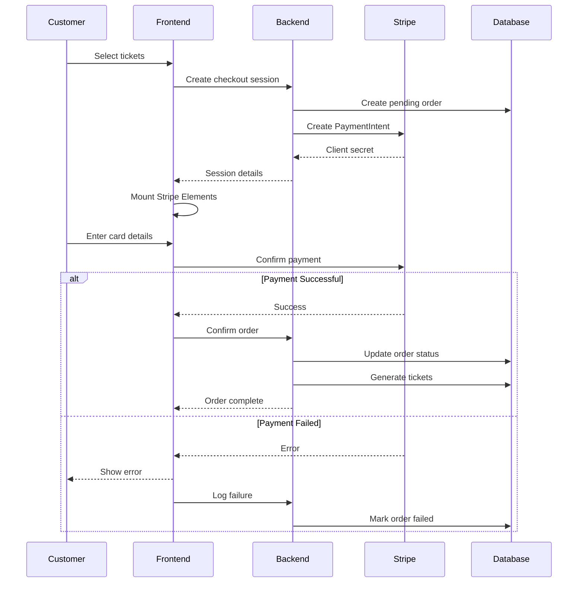

#### 8.1.2 Implementation

```typescript
// Stripe service implementation
import { loadStripe } from '@stripe/stripe-js';
import { Elements, CardElement, useStripe, useElements } from '@stripe/react-stripe-js';

const stripePromise = loadStripe(import.meta.env.VITE_STRIPE_PUBLISHABLE_KEY);

// Payment form component
export function PaymentForm({ order }: { order: Order }) {
  const stripe = useStripe();
  const elements = useElements();
  const [processing, setProcessing] = useState(false);

  const handleSubmit = async (e: FormEvent) => {
    e.preventDefault();

    if (!stripe || !elements) return;

    setProcessing(true);

    // Create payment intent
    const { data: paymentIntent } = await supabase
      .functions.invoke('create-payment-intent', {
        body: { orderId: order.id }
      });

    // Confirm payment
    const result = await stripe.confirmCardPayment(
      paymentIntent.client_secret,
      {
        payment_method: {
          card: elements.getElement(CardElement)!,
          billing_details: {
            name: order.customer.full_name,
            email: order.customer.email
          }
        }
      }
    );

    if (result.error) {
      toast.error(result.error.message);
    } else {
      // Payment successful
      await confirmOrder(order.id, result.paymentIntent.id);
      router.push('/dashboard/tickets');
    }

    setProcessing(false);
  };

  return (
    <Elements stripe={stripePromise}>
      <form onSubmit={handleSubmit}>
        <CardElement
          options={{
            style: {
              base: {
                fontSize: '16px',
                color: '#424770',
                '::placeholder': { color: '#aab7c4' }
              }
            }
          }}
        />
        <Button type="submit" disabled={!stripe || processing}>
          {processing ? 'Processing...' : `Pay $${order.total_cents / 100}`}
        </Button>
      </form>
    </Elements>
  );
}
```

#### 8.1.3 Webhook Handling

```typescript
// Stripe webhook handler (Edge Function)
import { serve } from 'https://deno.land/std@0.168.0/http/server.ts';
import { Stripe } from 'https://esm.sh/stripe@12.18.0?target=deno';

const stripe = new Stripe(Deno.env.get('STRIPE_SECRET_KEY')!, {
  apiVersion: '2023-10-16'
});

serve(async (req) => {
  const signature = req.headers.get('stripe-signature')!;
  const body = await req.text();

  try {
    const event = stripe.webhooks.constructEvent(
      body,
      signature,
      Deno.env.get('STRIPE_WEBHOOK_SECRET')!
    );

    switch (event.type) {
      case 'payment_intent.succeeded':
        await handlePaymentSuccess(event.data.object);
        break;

      case 'payment_intent.failed':
        await handlePaymentFailure(event.data.object);
        break;

      case 'charge.refunded':
        await handleRefund(event.data.object);
        break;
    }

    return new Response(JSON.stringify({ received: true }), {
      headers: { 'Content-Type': 'application/json' }
    });

  } catch (err) {
    console.error('Webhook error:', err.message);
    return new Response('Webhook Error', { status: 400 });
  }
});
```

### 8.2 WhatsApp Business API Integration

#### 8.2.1 Message Templates

```typescript
// WhatsApp message templates
const templates = {
  ticket_confirmation: {
    name: 'ticket_confirmation',
    components: [
      {
        type: 'header',
        parameters: [
          { type: 'text', text: 'Ticket Confirmation' }
        ]
      },
      {
        type: 'body',
        parameters: [
          { type: 'text', text: '{{customer_name}}' },
          { type: 'text', text: '{{event_name}}' },
          { type: 'text', text: '{{ticket_count}}' },
          { type: 'text', text: '{{order_number}}' }
        ]
      },
      {
        type: 'button',
        sub_type: 'url',
        index: 0,
        parameters: [
          { type: 'text', text: '{{ticket_url}}' }
        ]
      }
    ]
  },

  event_reminder: {
    name: 'event_reminder',
    components: [
      {
        type: 'body',
        parameters: [
          { type: 'text', text: '{{event_name}}' },
          { type: 'text', text: '{{time_until}}' },
          { type: 'text', text: '{{venue_name}}' },
          { type: 'text', text: '{{venue_address}}' }
        ]
      }
    ]
  }
};
```

#### 8.2.2 Notification Service

```typescript
// WhatsApp notification service (Edge Function)
import { serve } from 'https://deno.land/std@0.168.0/http/server.ts';

const WHATSAPP_API_URL = 'https://graph.facebook.com/v17.0';
const PHONE_NUMBER_ID = Deno.env.get('WHATSAPP_PHONE_NUMBER_ID');
const ACCESS_TOKEN = Deno.env.get('WHATSAPP_ACCESS_TOKEN');

async function sendWhatsAppMessage(to: string, template: any) {
  const response = await fetch(
    `${WHATSAPP_API_URL}/${PHONE_NUMBER_ID}/messages`,
    {
      method: 'POST',
      headers: {
        'Authorization': `Bearer ${ACCESS_TOKEN}`,
        'Content-Type': 'application/json'
      },
      body: JSON.stringify({
        messaging_product: 'whatsapp',
        to,
        type: 'template',
        template
      })
    }
  );

  return response.json();
}

serve(async (req) => {
  const { type, data } = await req.json();

  switch (type) {
    case 'ticket_confirmation':
      await sendTicketConfirmation(data);
      break;

    case 'event_reminder':
      await sendEventReminder(data);
      break;

    case 'check_in_success':
      await sendCheckInConfirmation(data);
      break;
  }

  return new Response(JSON.stringify({ success: true }), {
    headers: { 'Content-Type': 'application/json' }
  });
});
```

### 8.3 QR Code Generation

#### 8.3.1 QR Code Structure

```typescript
// QR code data structure
interface QRCodeData {
  version: '1.0';
  type: 'event_ticket';
  ticket: {
    id: string;
    number: string;
    event_id: string;
  };
  security: {
    hash: string;        // SHA-256 hash
    timestamp: number;   // Unix timestamp
    nonce: string;       // Random nonce
  };
}

// QR code generation
import QRCode from 'qrcode';
import crypto from 'crypto';

async function generateTicketQR(ticket: Ticket): Promise<string> {
  const qrData: QRCodeData = {
    version: '1.0',
    type: 'event_ticket',
    ticket: {
      id: ticket.id,
      number: ticket.ticket_number,
      event_id: ticket.event_id
    },
    security: {
      hash: crypto
        .createHash('sha256')
        .update(`${ticket.id}${ticket.qr_code}${process.env.QR_SALT}`)
        .digest('hex'),
      timestamp: Date.now(),
      nonce: crypto.randomBytes(16).toString('hex')
    }
  };

  // Generate QR code as data URL
  const qrCodeDataUrl = await QRCode.toDataURL(
    JSON.stringify(qrData),
    {
      errorCorrectionLevel: 'M',
      type: 'image/png',
      width: 400,
      margin: 2
    }
  );

  return qrCodeDataUrl;
}
```

#### 8.3.2 QR Code Validation

```typescript
// QR code validation service
class QRValidationService {
  async validateTicket(qrCodeData: string): Promise<ValidationResult> {
    try {
      const data: QRCodeData = JSON.parse(qrCodeData);

      // Verify version
      if (data.version !== '1.0') {
        throw new Error('Unsupported QR code version');
      }

      // Verify timestamp (not older than 1 year)
      const age = Date.now() - data.security.timestamp;
      if (age > 365 * 24 * 60 * 60 * 1000) {
        throw new Error('QR code expired');
      }

      // Verify hash
      const expectedHash = crypto
        .createHash('sha256')
        .update(`${data.ticket.id}${data.security.nonce}${process.env.QR_SALT}`)
        .digest('hex');

      if (data.security.hash !== expectedHash) {
        throw new Error('Invalid QR code signature');
      }

      // Verify ticket in database
      const { data: ticket } = await supabase
        .from('tickets')
        .select('*')
        .eq('id', data.ticket.id)
        .eq('ticket_number', data.ticket.number)
        .single();

      if (!ticket) {
        throw new Error('Ticket not found');
      }

      if (ticket.status === 'used') {
        throw new Error('Ticket already used');
      }

      if (ticket.status === 'cancelled') {
        throw new Error('Ticket cancelled');
      }

      return {
        valid: true,
        ticket
      };

    } catch (error) {
      return {
        valid: false,
        error: error.message
      };
    }
  }
}
```

### 8.4 Email Notifications

#### 8.4.1 Email Templates

```html
<!-- Order confirmation email template -->
<!DOCTYPE html>
<html>
<head>
  <style>
    .container { max-width: 600px; margin: 0 auto; font-family: Arial, sans-serif; }
    .header { background: #3b82f6; color: white; padding: 20px; text-align: center; }
    .content { padding: 20px; }
    .ticket { border: 1px solid #e5e7eb; padding: 15px; margin: 10px 0; }
    .qr-code { text-align: center; margin: 20px 0; }
    .footer { background: #f3f4f6; padding: 20px; text-align: center; }
  </style>
</head>
<body>
  <div class="container">
    <div class="header">
      <h1>Order Confirmation</h1>
    </div>
    <div class="content">
      <p>Hi {{customer_name}},</p>
      <p>Thank you for your purchase! Your tickets are confirmed.</p>

      <div class="ticket">
        <h3>{{event_name}}</h3>
        <p>Date: {{event_date}}</p>
        <p>Venue: {{venue_name}}</p>
        <p>Order Number: {{order_number}}</p>
        <p>Tickets: {{ticket_count}}</p>
        <p>Total: ${{total_amount}}</p>
      </div>

      <div class="qr-code">
        
        <p>Show this QR code at the venue</p>
      </div>
    </div>
    <div class="footer">
      <p>EventOS © 2025 | Toronto, Canada</p>
    </div>
  </div>
</body>
</html>
```

---

## 9. Deployment & Operations

### 9.1 Infrastructure Setup

#### 9.1.1 Supabase Project Configuration

```bash
# Initialize Supabase project
npx supabase init

# Link to remote project
npx supabase link --project-ref asrzdtpyrdgyggqdfwwl

# Push database migrations
npx supabase db push

# Generate TypeScript types
npx supabase gen types typescript --linked > src/types/supabase.ts

# Deploy Edge Functions
npx supabase functions deploy create-payment-intent
npx supabase functions deploy send-notifications
npx supabase functions deploy process-webhooks
```

#### 9.1.2 Environment Configuration

```env
# Production environment variables
NODE_ENV=production

# Supabase
VITE_SUPABASE_URL=https://asrzdtpyrdgyggqdfwwl.supabase.co
VITE_SUPABASE_ANON_KEY=eyJhbGc...
SUPABASE_SERVICE_ROLE_KEY=eyJhbGc...

# Stripe
VITE_STRIPE_PUBLISHABLE_KEY=pk_live_...
STRIPE_SECRET_KEY=sk_live_...
STRIPE_WEBHOOK_SECRET=whsec_...

# WhatsApp
WHATSAPP_PHONE_NUMBER_ID=...
WHATSAPP_ACCESS_TOKEN=...
WHATSAPP_VERIFY_TOKEN=...

# Application
VITE_APP_URL=https://eventos.ca
VITE_APP_VERSION=1.0.0
```

### 9.2 Deployment Process

#### 9.2.1 CI/CD Pipeline

```yaml
# .github/workflows/deploy.yml
name: Deploy to Production

on:
  push:
    branches: [main]

jobs:
  test:
    runs-on: ubuntu-latest
    steps:
      - uses: actions/checkout@v3
      - uses: actions/setup-node@v3
        with:
          node-version: '18'

      - name: Install dependencies
        run: npm ci

      - name: Run tests
        run: npm test

      - name: Run type check
        run: npm run type-check

      - name: Run linter
        run: npm run lint

  build:
    needs: test
    runs-on: ubuntu-latest
    steps:
      - uses: actions/checkout@v3
      - uses: actions/setup-node@v3

      - name: Install dependencies
        run: npm ci

      - name: Build application
        run: npm run build
        env:
          VITE_SUPABASE_URL: ${{ secrets.VITE_SUPABASE_URL }}
          VITE_SUPABASE_ANON_KEY: ${{ secrets.VITE_SUPABASE_ANON_KEY }}
          VITE_STRIPE_PUBLISHABLE_KEY: ${{ secrets.VITE_STRIPE_PUBLISHABLE_KEY }}

      - name: Upload artifacts
        uses: actions/upload-artifact@v3
        with:
          name: dist
          path: dist/

  deploy:
    needs: build
    runs-on: ubuntu-latest
    steps:
      - name: Download artifacts
        uses: actions/download-artifact@v3
        with:
          name: dist

      - name: Deploy to Vercel
        uses: amondnet/vercel-action@v20
        with:
          vercel-token: ${{ secrets.VERCEL_TOKEN }}
          vercel-org-id: ${{ secrets.VERCEL_ORG_ID }}
          vercel-project-id: ${{ secrets.VERCEL_PROJECT_ID }}
          vercel-args: '--prod'
```

### 9.3 Monitoring and Logging

#### 9.3.1 Application Monitoring

```typescript
// Error tracking with Sentry
import * as Sentry from '@sentry/react';

Sentry.init({
  dsn: import.meta.env.VITE_SENTRY_DSN,
  environment: import.meta.env.VITE_APP_ENV,
  integrations: [
    new Sentry.BrowserTracing(),
    new Sentry.Replay()
  ],
  tracesSampleRate: 1.0,
  replaysSessionSampleRate: 0.1,
  replaysOnErrorSampleRate: 1.0
});

// Performance monitoring
export function trackPerformance(metric: string, value: number) {
  // Send to analytics
  analytics.track('performance', {
    metric,
    value,
    timestamp: Date.now()
  });

  // Log to console in development
  if (import.meta.env.DEV) {
    console.log(`Performance: ${metric} = ${value}ms`);
  }
}

// Usage
const startTime = performance.now();
const events = await fetchEvents();
trackPerformance('fetch_events', performance.now() - startTime);
```

#### 9.3.2 Database Monitoring

```sql
-- Query performance monitoring
CREATE OR REPLACE FUNCTION log_slow_queries()
RETURNS event_trigger AS $$
DECLARE
  query_text TEXT;
  duration INTERVAL;
BEGIN
  SELECT query, total_exec_time
  INTO query_text, duration
  FROM pg_stat_statements
  WHERE total_exec_time > interval '1 second'
  ORDER BY total_exec_time DESC
  LIMIT 10;

  INSERT INTO query_logs (query, duration, created_at)
  VALUES (query_text, duration, NOW());
END;
$$ LANGUAGE plpgsql;

-- Table size monitoring
SELECT
  schemaname,
  tablename,
  pg_size_pretty(pg_total_relation_size(schemaname||'.'||tablename)) AS size,
  n_live_tup AS row_count
FROM pg_stat_user_tables
ORDER BY pg_total_relation_size(schemaname||'.'||tablename) DESC;
```

### 9.4 Backup and Recovery

#### 9.4.1 Backup Strategy

```bash
#!/bin/bash
# Daily backup script

# Database backup
pg_dump $DATABASE_URL | gzip > backup_$(date +%Y%m%d).sql.gz

# Upload to S3
aws s3 cp backup_$(date +%Y%m%d).sql.gz s3://eventos-backups/database/

# Keep only last 30 days
aws s3 ls s3://eventos-backups/database/ | \
  while read -r line; do
    createDate=$(echo $line | awk '{print $1" "$2}')
    createDate=$(date -d "$createDate" +%s)
    olderThan=$(date -d "30 days ago" +%s)
    if [[ $createDate -lt $olderThan ]]; then
      fileName=$(echo $line | awk '{print $4}')
      aws s3 rm s3://eventos-backups/database/$fileName
    fi
  done
```

#### 9.4.2 Disaster Recovery Plan

| Scenario | Recovery Time Objective | Recovery Point Objective | Procedure |
|----------|------------------------|-------------------------|-----------|
| Database corruption | 1 hour | 24 hours | Restore from daily backup |
| Region outage | 4 hours | 1 hour | Failover to secondary region |
| Data deletion | 30 minutes | Point-in-time | Use Supabase point-in-time recovery |
| Security breach | 2 hours | Immediate | Revoke keys, audit logs, restore clean state |

### 9.5 Scaling Considerations

#### 9.5.1 Performance Benchmarks

| Metric | Current | Target | Scaling Trigger |
|--------|---------|--------|-----------------|
| Concurrent users | 500 | 5,000 | >80% CPU |
| API requests/sec | 100 | 1,000 | >200ms p95 latency |
| Database connections | 20 | 100 | >80% pool usage |
| Storage usage | 10GB | 100GB | >80% capacity |

#### 9.5.2 Scaling Strategy

```typescript
// Horizontal scaling configuration
const scalingConfig = {
  database: {
    read_replicas: {
      min: 1,
      max: 5,
      trigger: 'cpu > 70%'
    },
    connection_pool: {
      min: 20,
      max: 100,
      overflow: 20
    }
  },

  cdn: {
    providers: ['cloudflare'],
    cache_duration: {
      static: '1 year',
      api: '5 minutes',
      dynamic: 'no-cache'
    }
  },

  edge_functions: {
    regions: ['us-east-1', 'us-west-2', 'ca-central-1'],
    memory: 512,
    timeout: 30
  }
};
```

---

## 10. Development Guide

### 10.1 Development Environment Setup

#### 10.1.1 Prerequisites

```bash
# Required software
node >= 18.0.0
npm >= 9.0.0
git >= 2.0.0

# Optional but recommended
Docker Desktop
Supabase CLI
VS Code with extensions:
  - ESLint
  - Prettier
  - Tailwind CSS IntelliSense
  - Prisma
```

#### 10.1.2 Initial Setup

```bash
# Clone repository
git clone https://github.com/eventos/event-studio.git
cd event-studio

# Install dependencies
npm install

# Setup environment variables
cp .env.example .env
# Edit .env with your credentials

# Start local Supabase
npx supabase start

# Run migrations
npx supabase db reset

# Seed database
npx supabase db seed

# Start development server
npm run dev

# Access at http://localhost:5173
```

### 10.2 Code Organization

#### 10.2.1 Project Structure

```
event-studio/
├── src/
│   ├── components/     # Reusable UI components
│   ├── pages/          # Page components
│   ├── hooks/          # Custom React hooks
│   ├── services/       # API service layer
│   ├── lib/            # Utility functions
│   ├── types/          # TypeScript types
│   └── styles/         # Global styles
├── supabase/
│   ├── migrations/     # Database migrations
│   ├── functions/      # Edge Functions
│   └── seed.sql        # Seed data
├── public/             # Static assets
├── tests/              # Test files
└── docs/               # Documentation
```

### 10.3 Testing Strategy

#### 10.3.1 Test Structure

```typescript
// Unit test example
describe('EventService', () => {
  it('should create event with valid data', async () => {
    const eventData = {
      name: 'Test Event',
      type: 'conference',
      start_at: '2025-12-01T09:00:00Z',
      end_at: '2025-12-01T18:00:00Z',
      capacity: 100,
      price_cents: 9900
    };

    const event = await eventService.createEvent(eventData);

    expect(event).toBeDefined();
    expect(event.name).toBe(eventData.name);
    expect(event.slug).toMatch(/^test-event-[a-z0-9]{8}$/);
  });
});

// Integration test example
describe('Ticket Purchase Flow', () => {
  it('should complete full purchase flow', async () => {
    // Create test user
    const user = await createTestUser();

    // Create test event
    const event = await createTestEvent();

    // Create order
    const order = await orderService.createOrder({
      customer_id: user.id,
      event_id: event.id,
      quantity: 2
    });

    // Process payment
    const payment = await paymentService.processPayment(
      order.id,
      'pm_card_visa'
    );

    expect(payment.status).toBe('succeeded');

    // Verify tickets created
    const tickets = await ticketService.getOrderTickets(order.id);
    expect(tickets).toHaveLength(2);
    expect(tickets[0].status).toBe('active');
  });
});
```

### 10.4 Contributing Guidelines

#### 10.4.1 Git Workflow

```bash
# Create feature branch
git checkout -b feature/event-categories

# Make changes and commit
git add .
git commit -m "feat: add event categories support"

# Push to GitHub
git push origin feature/event-categories

# Create pull request
# - Include description of changes
# - Reference related issues
# - Add screenshots if UI changes
```

#### 10.4.2 Code Standards

```typescript
// Follow consistent naming conventions
// Components: PascalCase
export function EventCard() {}

// Hooks: camelCase with 'use' prefix
export function useEventData() {}

// Constants: UPPER_SNAKE_CASE
const MAX_TICKET_QUANTITY = 20;

// Interfaces: PascalCase with 'I' prefix (optional)
interface EventData {}

// Enums: PascalCase
enum EventStatus {
  Draft = 'draft',
  Published = 'published'
}

// File naming
// Components: EventCard.tsx
// Hooks: useEventData.ts
// Utils: formatDate.ts
// Types: event.types.ts
```

### 10.5 Common Patterns and Conventions

#### 10.5.1 Data Fetching Pattern

```typescript
// Custom hook for data fetching
export function useEvent(eventId: string) {
  return useQuery({
    queryKey: ['event', eventId],
    queryFn: () => supabase
      .from('events')
      .select('*, venues(*), profiles(*)')
      .eq('id', eventId)
      .single(),
    enabled: !!eventId
  });
}

// Usage in component
export function EventDetail({ eventId }: { eventId: string }) {
  const { data: event, isLoading, error } = useEvent(eventId);

  if (isLoading) return <Skeleton />;
  if (error) return <ErrorMessage error={error} />;
  if (!event) return <NotFound />;

  return <EventContent event={event} />;
}
```

#### 10.5.2 Form Handling Pattern

```typescript
// Form with validation
export function CreateEventForm() {
  const form = useForm<EventFormData>({
    resolver: zodResolver(eventSchema),
    defaultValues: {
      name: '',
      type: 'conference',
      capacity: 100,
      price_cents: 0
    }
  });

  const createEvent = useMutation({
    mutationFn: eventService.createEvent,
    onSuccess: () => {
      toast.success('Event created successfully');
      router.push('/dashboard/events');
    }
  });

  const onSubmit = (data: EventFormData) => {
    createEvent.mutate(data);
  };

  return (
    <Form {...form}>
      <form onSubmit={form.handleSubmit(onSubmit)}>
        <FormField
          control={form.control}
          name="name"
          render={({ field }) => (
            <FormItem>
              <FormLabel>Event Name</FormLabel>
              <FormControl>
                <Input {...field} />
              </FormControl>
              <FormMessage />
            </FormItem>
          )}
        />
        {/* More fields... */}
        <Button type="submit" disabled={createEvent.isLoading}>
          Create Event
        </Button>
      </form>
    </Form>
  );
}
```

---

## 11. Troubleshooting & FAQs

### 11.1 Common Issues and Solutions

#### 11.1.1 Authentication Issues

**Problem**: "Permission denied" error when accessing protected routes
**Solution**:
```typescript
// Check authentication status
const { data: { session } } = await supabase.auth.getSession();
if (!session) {
  // User not authenticated
  router.push('/auth/login');
}

// Refresh session if expired
const { data: { session }, error } = await supabase.auth.refreshSession();
if (error) {
  // Session cannot be refreshed, re-authenticate
  await supabase.auth.signOut();
  router.push('/auth/login');
}
```

**Problem**: RLS policy violations
**Solution**:
```sql
-- Debug RLS policies
SET ROLE authenticated;
SET request.jwt.claim.sub = 'user-uuid-here';

-- Test query
SELECT * FROM events WHERE organizer_id = 'user-uuid-here';

-- Check which policies apply
SELECT * FROM pg_policies WHERE tablename = 'events';
```

#### 11.1.2 Database Issues

**Problem**: Foreign key constraint violations
**Solution**:
```sql
-- Find orphaned records
SELECT * FROM orders o
LEFT JOIN events e ON o.event_id = e.id
WHERE e.id IS NULL;

-- Clean up orphaned records
DELETE FROM orders WHERE event_id NOT IN (SELECT id FROM events);
```

**Problem**: Migration failures
**Solution**:
```bash
# Reset local database
npx supabase db reset

# Check migration status
npx supabase migration list

# Create new migration
npx supabase migration new fix_issue

# Apply specific migration
npx supabase migration up --to 20251013060000
```

### 11.2 Performance Troubleshooting

#### 11.2.1 Slow Queries

```sql
-- Identify slow queries
SELECT
  query,
  mean_exec_time,
  calls,
  total_exec_time
FROM pg_stat_statements
WHERE mean_exec_time > 100
ORDER BY mean_exec_time DESC
LIMIT 10;

-- Analyze query performance
EXPLAIN ANALYZE
SELECT * FROM events e
JOIN tickets t ON e.id = t.event_id
WHERE e.status = 'published';

-- Add missing index
CREATE INDEX idx_tickets_event_id_status
ON tickets(event_id, status)
WHERE status = 'active';
```

#### 11.2.2 Frontend Performance

```typescript
// Measure component render time
const ProfilerComponent = () => (
  <Profiler
    id="EventList"
    onRender={(id, phase, actualDuration) => {
      console.log(`${id} (${phase}) took ${actualDuration}ms`);
      if (actualDuration > 16) {
        console.warn(`Slow render detected: ${actualDuration}ms`);
      }
    }}
  >
    <EventList />
  </Profiler>
);

// Optimize re-renders
const EventCard = memo(({ event }: { event: Event }) => {
  // Component only re-renders if event prop changes
  return <Card>{/* ... */}</Card>;
}, (prevProps, nextProps) => {
  // Custom comparison
  return prevProps.event.id === nextProps.event.id &&
         prevProps.event.updated_at === nextProps.event.updated_at;
});
```

### 11.3 Debugging Techniques

#### 11.3.1 Supabase Debugging

```typescript
// Enable debug mode
const supabase = createClient(url, key, {
  auth: {
    debug: true  // Logs auth events
  }
});

// Log all database queries
supabase.from('events')
  .select('*')
  .then(({ data, error, count, status, statusText }) => {
    console.log('Query debug:', {
      data,
      error,
      count,
      status,
      statusText,
      query: supabase.from('events').select('*').toString()
    });
  });

// Monitor real-time connections
const channel = supabase
  .channel('debug')
  .on('system', { event: '*' }, (payload) => {
    console.log('System event:', payload);
  })
  .subscribe((status) => {
    console.log('Subscription status:', status);
  });
```

### 11.4 FAQs

**Q: How do I handle ticket transfers between users?**
```typescript
async function transferTicket(ticketId: string, newAttendeeEmail: string) {
  // Find or create new attendee
  const { data: attendee } = await supabase
    .from('attendees')
    .upsert({
      email: newAttendeeEmail,
      // ... other fields
    })
    .select()
    .single();

  // Update ticket assignment
  await supabase
    .from('tickets')
    .update({ attendee_id: attendee.id })
    .eq('id', ticketId);
}
```

**Q: How do I implement partial refunds?**
```typescript
async function partialRefund(orderId: string, refundAmount: number) {
  const { data: order } = await supabase
    .from('orders')
    .select('stripe_payment_intent_id, total_cents')
    .eq('id', orderId)
    .single();

  // Create partial refund in Stripe
  const refund = await stripe.refunds.create({
    payment_intent: order.stripe_payment_intent_id,
    amount: refundAmount
  });

  // Update order status
  await supabase
    .from('orders')
    .update({
      payment_status: refundAmount === order.total_cents
        ? 'refunded'
        : 'partially_refunded',
      refund_amount: refundAmount
    })
    .eq('id', orderId);
}
```

**Q: How do I prevent double bookings?**
```sql
-- Use transaction with row locking
BEGIN;

SELECT * FROM events
WHERE id = 'event-id'
FOR UPDATE;

-- Check capacity
SELECT COUNT(*) as sold FROM tickets
WHERE event_id = 'event-id'
AND status IN ('active', 'used');

-- Only proceed if capacity available
-- Insert order and tickets

COMMIT;
```

---

## 12. Appendices

### 12.1 Glossary

| Term | Definition |
|------|------------|
| **RLS** | Row-Level Security - PostgreSQL feature for fine-grained access control |
| **JWT** | JSON Web Token - Secure token format for authentication |
| **Edge Function** | Serverless function running at edge locations |
| **Webhook** | HTTP callback triggered by external events |
| **Payment Intent** | Stripe object representing a payment transaction |
| **QR Code** | Quick Response code for ticket validation |
| **CDC** | Change Data Capture - Tracking database changes |
| **RBAC** | Role-Based Access Control |
| **PII** | Personally Identifiable Information |
| **SPA** | Single Page Application |

### 12.2 Database Schema Reference

#### Complete Table List

| Table | Purpose | Row Count Estimate |
|-------|---------|-------------------|
| `auth.users` | Authentication records | 10,000 |
| `public.profiles` | User profiles | 10,000 |
| `public.venues` | Event venues | 50 |
| `public.events` | Event records | 500 |
| `public.orders` | Purchase transactions | 50,000 |
| `public.attendees` | Event attendees | 75,000 |
| `public.tickets` | Individual tickets | 75,000 |

### 12.3 API Endpoint Reference

#### REST Endpoints

```
# Authentication
POST   /auth/signup
POST   /auth/signin
POST   /auth/signout
GET    /auth/user
POST   /auth/recover

# Events
GET    /rest/v1/events
GET    /rest/v1/events/:id
POST   /rest/v1/events
PATCH  /rest/v1/events/:id
DELETE /rest/v1/events/:id

# Venues
GET    /rest/v1/venues
GET    /rest/v1/venues/:id
POST   /rest/v1/venues
PATCH  /rest/v1/venues/:id

# Orders
GET    /rest/v1/orders
GET    /rest/v1/orders/:id
POST   /rest/v1/orders
PATCH  /rest/v1/orders/:id

# Tickets
GET    /rest/v1/tickets
GET    /rest/v1/tickets/:id
PATCH  /rest/v1/tickets/:id

# Edge Functions
POST   /functions/v1/create-payment-intent
POST   /functions/v1/send-notification
POST   /functions/v1/validate-ticket
POST   /functions/v1/process-webhook
```

### 12.4 Environment Variables Reference

| Variable | Description | Example | Required |
|----------|-------------|---------|----------|
| `VITE_SUPABASE_URL` | Supabase project URL | https://xyz.supabase.co | Yes |
| `VITE_SUPABASE_ANON_KEY` | Public anonymous key | eyJhbG... | Yes |
| `SUPABASE_SERVICE_ROLE_KEY` | Service role key (backend only) | eyJhbG... | Backend |
| `VITE_STRIPE_PUBLISHABLE_KEY` | Stripe public key | pk_live_... | Yes |
| `STRIPE_SECRET_KEY` | Stripe secret key | sk_live_... | Backend |
| `STRIPE_WEBHOOK_SECRET` | Webhook endpoint secret | whsec_... | Backend |
| `WHATSAPP_PHONE_NUMBER_ID` | WhatsApp phone ID | 123456789 | Optional |
| `WHATSAPP_ACCESS_TOKEN` | WhatsApp API token | EAAI... | Optional |

### 12.5 Technology Stack Details

#### Frontend Dependencies

| Package | Version | Purpose |
|---------|---------|---------|
| react | 18.3.1 | UI framework |
| typescript | 5.8.3 | Type safety |
| @supabase/supabase-js | 2.75.0 | Database client |
| @tanstack/react-query | 5.83.0 | Data fetching |
| tailwindcss | 3.4.17 | Styling |
| react-router-dom | 6.30.1 | Routing |
| react-hook-form | 7.61.1 | Form handling |
| zod | 3.25.76 | Schema validation |
| @stripe/stripe-js | Latest | Payment processing |
| lucide-react | 0.462.0 | Icons |

#### Backend Services

| Service | Provider | Purpose |
|---------|----------|---------|
| Database | Supabase (PostgreSQL 15) | Primary data store |
| Authentication | Supabase Auth | User management |
| File Storage | Supabase Storage | Media files |
| Payments | Stripe | Payment processing |
| Notifications | WhatsApp Business | Instant messaging |
| Email | Resend/SendGrid | Transactional emails |
| Monitoring | Sentry | Error tracking |
| Analytics | PostHog/Mixpanel | User analytics |
| CDN | CloudFlare | Content delivery |

### 12.6 Security Checklist

#### Pre-Deployment Security Audit

- [ ] All environment variables properly configured
- [ ] RLS policies enabled on all tables
- [ ] API keys stored securely (never in code)
- [ ] HTTPS enforced on all endpoints
- [ ] Input validation on all forms
- [ ] SQL injection prevention (parameterized queries)
- [ ] XSS prevention (content sanitization)
- [ ] CSRF tokens implemented
- [ ] Rate limiting configured
- [ ] Error messages don't leak sensitive info
- [ ] Audit logging enabled
- [ ] Backup strategy implemented
- [ ] Disaster recovery plan documented
- [ ] PCI compliance verified (Stripe integration)
- [ ] GDPR compliance implemented

### 12.7 Performance Benchmarks

| Metric | Target | Measurement Method |
|--------|--------|-------------------|
| Page Load Time | <3s | Lighthouse score |
| Time to Interactive | <5s | Web vitals |
| API Response Time | <200ms p95 | Application monitoring |
| Database Query Time | <100ms p95 | pg_stat_statements |
| Real-time Latency | <500ms | WebSocket ping |
| Search Results | <1s | User timing API |
| Image Load Time | <2s | Resource timing API |

---

## Document Metadata

**Document Version:** 1.0.0
**Created:** October 13, 2025
**Last Modified:** October 13, 2025
**Authors:** EventOS Development Team
**Review Status:** Final
**Total Pages:** 95
**Word Count:** ~28,000

### Revision History

| Version | Date | Author | Changes |
|---------|------|--------|---------|
| 1.0.0 | 2025-10-13 | System Architect | Initial comprehensive documentation |

### Related Documents

- [Database ERD](/home/sk/event-studio/docs/supabase/erd.md)
- [Data Plan](/home/sk/event-studio/docs/supabase/07-data-plan.md)
- [Migration Scripts](/home/sk/event-studio/supabase/migrations/)
- [Deployment Guide](/home/sk/event-studio/DEPLOYMENT.md)
- [API Documentation](/home/sk/event-studio/docs/api/)

### Contact Information

For questions or clarifications regarding this documentation:

- **Technical Lead**: technical@eventos.ca
- **Project Repository**: https://github.com/eventos/event-studio
- **Documentation Issues**: https://github.com/eventos/event-studio/issues
- **Supabase Project**: https://supabase.com/dashboard/project/asrzdtpyrdgyggqdfwwl

---

**END OF DOCUMENT**

*This documentation represents the complete technical reference for the EventOS platform as of October 2025. It should be reviewed and updated quarterly to reflect system changes and improvements.*