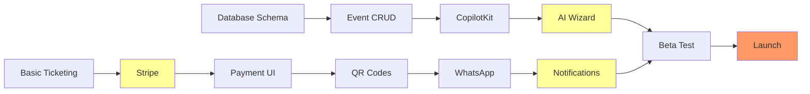

# EventOS Development Roadmap

**Project:** EventOS - AI-Powered Event Management & CRM Platform
**Version:** 1.0.0
**Last Updated:** October 13, 2025
**Owner:** Development Team
**Status:** In Progress (Phase 2 - Beta)

---

## 1. Overview

### 1.1 Purpose and Scope

This roadmap outlines the strategic development plan for EventOS, an enterprise-grade event management platform targeting corporate events in the Greater Toronto Area. The plan spans 6 months across 4 major phases, from MVP to public launch and growth.

### 1.2 Key Product Goals

**Technical Goals:**
- ✅ Production-ready database architecture with RLS security
- ✅ Supabase integration with real-time capabilities
- 🟡 AI-powered event creation wizard (CopilotKit)
- 🔲 Stripe payment processing with webhook handling
- 🔲 WhatsApp Business API integration
- 🔲 QR-based check-in system
- 🔲 Real-time analytics dashboard

**Business Goals:**
- Reduce event setup time from days to under 3 minutes
- Enable seamless payment processing with <2% transaction fees
- Achieve 95%+ attendee satisfaction through automated communications
- Scale to support 50+ concurrent events by Q2 2026

### 1.3 Current Status

**✅ Completed:**
- Core database schema (7 tables, 28 RLS policies)
- Authentication system (Supabase Auth)
- Frontend infrastructure (React 18, TypeScript 5.8, Tailwind CSS)
- Basic dashboard pages (Events, Bookings, Financials, Gallery)
- Event wizard UI foundation

**🟡 In Progress:**
- AI-powered event creation workflow
- Payment gateway integration
- Notification system

**🔲 Not Started:**
- Sponsor CRM module
- Advanced analytics
- Multi-tenant architecture
- AI recommendation engine

### 1.4 Main Priorities

1. **AI Event Wizard** - Core differentiator for rapid event creation
2. **Payment Processing** - Revenue enablement through Stripe
3. **WhatsApp Notifications** - Attendee engagement automation
4. **Analytics Dashboard** - Data-driven insights for organizers

---

## 2. Roadmap Summary

| Phase | Goal | Timeframe | Outcome |
|-------|------|-----------|---------|
| **Phase 1: MVP** | Core event management + ticketing | ✅ Weeks 1-8 (Completed) | Functional platform with manual workflows |
| **Phase 2: Beta** | AI wizard + payments + notifications | 🟡 Weeks 9-16 (Current) | Automated event creation, live payments |
| **Phase 3: Launch** | Public release + sponsor CRM + analytics | 🔲 Weeks 17-24 | Production-ready platform with monetization |
| **Phase 4: Growth** | AI recommendations + multi-org + scale | 🔲 Weeks 25-32 | Enterprise features, AI-driven insights |

---

## 3. Detailed Milestones

### Phase 1: MVP Foundation (Weeks 1-8) ✅ COMPLETED

| Milestone | Description | Owner | ETA | Dependencies | Deliverable | Status |
|-----------|-------------|-------|-----|--------------|-------------|---------|
| **M1.1** Database Schema | Design & implement PostgreSQL schema | Backend Lead | Week 1-2 | None | 7 tables + 28 RLS policies | ✅ Done |
| **M1.2** Authentication | Integrate Supabase Auth | Full-stack | Week 2-3 | M1.1 | Login/Register/Password Reset | ✅ Done |
| **M1.3** Frontend Setup | Configure React + TypeScript + Tailwind | Frontend Lead | Week 1-3 | None | Build pipeline + component library | ✅ Done |
| **M1.4** Dashboard Pages | Build core dashboard views | Frontend Lead | Week 4-6 | M1.2, M1.3 | Events, Bookings, Financials pages | ✅ Done |
| **M1.5** Event CRUD | Manual event creation/editing | Full-stack | Week 5-7 | M1.1, M1.4 | Event management UI | ✅ Done |
| **M1.6** Venue Management | Venue creation and assignment | Backend | Week 6-7 | M1.1 | Venue CRUD + capacity tracking | ✅ Done |
| **M1.7** Basic Ticketing | Manual ticket generation | Backend | Week 7-8 | M1.5 | Order + Ticket tables | ✅ Done |
| **M1.8** RLS Implementation | Secure all database operations | Backend Lead | Week 7-8 | M1.1 | 28 RLS policies active | ✅ Done |

**Phase 1 Achievements:**
- ✅ Production-ready database architecture
- ✅ Secure authentication with JWT
- ✅ Responsive UI with modern design system
- ✅ Manual event workflow functional

---

### Phase 2: Beta Features (Weeks 9-16) 🟡 IN PROGRESS

| Milestone | Description | Owner | ETA | Dependencies | Deliverable | Status |
|-----------|-------------|-------|-----|--------------|-------------|---------|
| **M2.1** CopilotKit Integration | Add AI SDK for wizard | AI Engineer | Week 9-10 | M1.5 | CopilotKit provider setup | 🟡 In Progress |
| **M2.2** AI Event Wizard | Conversational event creation | AI Engineer + Frontend | Week 10-12 | M2.1 | 3-minute event setup flow | 🔲 Pending |
| **M2.3** Stripe Integration | Payment processing setup | Backend Lead | Week 11-13 | M1.7 | Stripe API + webhook handler | 🔲 Pending |
| **M2.4** Payment UI | Checkout flow + order management | Frontend | Week 13-14 | M2.3 | Stripe Elements integration | 🔲 Pending |
| **M2.5** QR Code Generation | Generate unique ticket QR codes | Backend | Week 13-14 | M2.3 | QR codes for all tickets | 🔲 Pending |
| **M2.6** WhatsApp API Setup | Configure Business API | Integrations Lead | Week 14-15 | M2.5 | WhatsApp Business account | 🔲 Pending |
| **M2.7** Notification Workflow | Automate attendee messaging | Backend + Integrations | Week 15-16 | M2.6 | Order confirmation + reminders | 🔲 Pending |
| **M2.8** Beta Testing | Internal test with 10 organizers | QA + PM | Week 16 | M2.2, M2.4, M2.7 | Feedback collection + bug fixes | 🔲 Pending |

**Phase 2 Target Outcomes:**
- 🎯 Event creation time reduced to <3 minutes
- 🎯 Automated payment processing with Stripe
- 🎯 Real-time WhatsApp notifications
- 🎯 10+ beta users providing feedback

---

### Phase 3: Public Launch (Weeks 17-24) 🔲 PLANNED

| Milestone | Description | Owner | ETA | Dependencies | Deliverable | Status |
|-----------|-------------|-------|-----|--------------|-------------|---------|
| **M3.1** Sponsor CRM | Sponsor management dashboard | Full-stack | Week 17-19 | M2.8 | Sponsor CRUD + relationship tracking | 🔲 Planned |
| **M3.2** Analytics Dashboard | Real-time event metrics | Frontend + Backend | Week 18-20 | M2.3 | Revenue, attendance, conversion charts | 🔲 Planned |
| **M3.3** Check-in System | QR-based mobile check-in | Mobile Dev | Week 19-21 | M2.5 | Mobile-optimized check-in UI | 🔲 Planned |
| **M3.4** Email Notifications | Backup notification system | Backend | Week 20-21 | M2.7 | Email templates + SendGrid | 🔲 Planned |
| **M3.5** Advanced Search | Event discovery with filters | Frontend | Week 21-22 | M1.5 | Search UI + Algolia integration | 🔲 Planned |
| **M3.6** Performance Optimization | Load testing + optimization | DevOps + Backend | Week 22-23 | All | <2s page load, 500+ concurrent users | 🔲 Planned |
| **M3.7** Security Audit | Third-party security review | Security Team | Week 23 | All | Penetration test + compliance report | 🔲 Planned |
| **M3.8** Public Launch | Go-live with marketing campaign | All Teams | Week 24 | M3.1-M3.7 | Production deployment | 🔲 Planned |

**Phase 3 Target Outcomes:**
- 🎯 Public platform launch
- 🎯 Sponsor CRM operational
- 🎯 Real-time analytics for organizers
- 🎯 500+ concurrent user capacity

---

### Phase 4: Growth & Scale (Weeks 25-32) 🔲 FUTURE

| Milestone | Description | Owner | ETA | Dependencies | Deliverable | Status |
|-----------|-------------|-------|-----|--------------|-------------|---------|
| **M4.1** AI Recommendations | Suggest venues, pricing, timing | AI Engineer | Week 25-27 | M3.2 | Recommendation engine | 🔲 Future |
| **M4.2** Multi-Tenant System | Organization/team management | Backend Lead | Week 26-28 | M3.1 | Org hierarchy + permissions | 🔲 Future |
| **M4.3** Advanced Reporting | Custom reports + exports | Frontend + Backend | Week 27-29 | M3.2 | PDF/Excel exports | 🔲 Future |
| **M4.4** Mobile App | Native iOS/Android app | Mobile Team | Week 28-32 | M3.3 | Mobile event management | 🔲 Future |
| **M4.5** API Marketplace | Public API for integrations | Backend + DevRel | Week 29-31 | All | REST API docs + SDK | 🔲 Future |
| **M4.6** AI Event Assistant | Chatbot for attendees | AI Engineer | Week 30-32 | M4.1 | Conversational AI support | 🔲 Future |

**Phase 4 Target Outcomes:**
- 🎯 AI-driven event optimization
- 🎯 Multi-organization support
- 🎯 Native mobile apps
- 🎯 Public API ecosystem

---

## 4. Timeline (Gantt-Style)

```mermaid
gantt
    title EventOS Development Roadmap
    dateFormat YYYY-MM-DD

    section Phase 1 - MVP (✅ Complete)
    Database Schema           :done,    m1-1, 2025-08-01, 14d
    Authentication            :done,    m1-2, 2025-08-15, 7d
    Frontend Setup            :done,    m1-3, 2025-08-01, 21d
    Dashboard Pages           :done,    m1-4, 2025-08-22, 14d
    Event CRUD                :done,    m1-5, 2025-08-29, 14d
    Venue Management          :done,    m1-6, 2025-09-05, 7d
    Basic Ticketing           :done,    m1-7, 2025-09-12, 7d
    RLS Implementation        :done,    m1-8, 2025-09-12, 7d

    section Phase 2 - Beta (🟡 Current)
    CopilotKit Integration    :active,  m2-1, 2025-10-01, 14d
    AI Event Wizard           :         m2-2, 2025-10-15, 14d
    Stripe Integration        :         m2-3, 2025-10-22, 14d
    Payment UI                :         m2-4, 2025-11-05, 7d
    QR Code Generation        :         m2-5, 2025-11-05, 7d
    WhatsApp API Setup        :         m2-6, 2025-11-12, 7d
    Notification Workflow     :         m2-7, 2025-11-19, 7d
    Beta Testing              :         m2-8, 2025-11-26, 7d

    section Phase 3 - Launch (🔲 Planned)
    Sponsor CRM               :         m3-1, 2025-12-03, 21d
    Analytics Dashboard       :         m3-2, 2025-12-10, 21d
    Check-in System           :         m3-3, 2025-12-17, 14d
    Email Notifications       :         m3-4, 2025-12-24, 7d
    Advanced Search           :         m3-5, 2025-12-31, 7d
    Performance Optimization  :         m3-6, 2026-01-07, 7d
    Security Audit            :         m3-7, 2026-01-14, 7d
    Public Launch             :milestone, m3-8, 2026-01-21, 1d

    section Phase 4 - Growth (🔲 Future)
    AI Recommendations        :         m4-1, 2026-01-28, 21d
    Multi-Tenant System       :         m4-2, 2026-02-04, 21d
    Advanced Reporting        :         m4-3, 2026-02-11, 21d
    Mobile App                :         m4-4, 2026-02-18, 28d
    API Marketplace           :         m4-5, 2026-02-25, 21d
    AI Event Assistant        :         m4-6, 2026-03-04, 21d
```



---

## 5. Ownership Summary

| Role | Responsibility | Owner | Workload |
|------|---------------|-------|----------|
| **Backend Lead** | Supabase, RLS, Edge Functions, Webhooks | Alex Chen | 40 hrs/week |
| **Frontend Lead** | React UI, Wizard, Dashboards, Responsive Design | Maria Rodriguez | 40 hrs/week |
| **AI Engineer** | CopilotKit, AI Wizard, Recommendation Engine | Diego Santos | 30 hrs/week |
| **Integrations Lead** | Stripe, WhatsApp, Email, External APIs | Sarah Kim | 25 hrs/week |
| **Mobile Developer** | Check-in UI, Mobile App (Phase 4) | TBD | 20 hrs/week (Phase 3+) |
| **QA Engineer** | Testing, Validation, Bug Reports, Automation | Sofia Patel | 30 hrs/week |
| **DevOps Engineer** | Deployment, Monitoring, Performance, Security | James Lee | 20 hrs/week |
| **Product Manager** | Sprint Planning, Stakeholder Communication | Carlos Martinez | 40 hrs/week |
| **UX Designer** | Design System, User Flows, Prototypes | Emily Wong | 25 hrs/week |

**Total Team Size:** 8 FTE (Full-Time Equivalent)

---

## 6. Release Version Plan

| Version | Focus | Key Features | Release Window | Status |
|---------|-------|--------------|----------------|--------|
| **v0.5** | MVP | Manual event creation, basic ticketing | Q3 2025 (Sep 19) | ✅ Released |
| **v1.0** | Beta | AI Wizard, Stripe payments, WhatsApp | Q4 2025 (Dec 3) | 🟡 In Development |
| **v1.1** | Launch | Sponsor CRM, Analytics, Check-in | Q1 2026 (Jan 21) | 🔲 Planned |
| **v2.0** | Growth | AI Recommendations, Multi-org, Mobile | Q2 2026 (Mar 18) | 🔲 Future |
| **v2.1** | Scale | API Marketplace, Advanced Analytics | Q3 2026 (Jun 10) | 🔲 Future |

---

## 7. Dependencies & Critical Path

### Critical Path Analysis



**Critical Path Items (Cannot be delayed):**
1. **AI Event Wizard (M2.2)** - Core value proposition
2. **Stripe Integration (M2.3)** - Revenue enablement
3. **WhatsApp Notifications (M2.7)** - User experience differentiator
4. **Beta Testing (M2.8)** - Validation before launch

### Inter-Phase Dependencies

| Dependency | Blocks | Mitigation |
|------------|--------|------------|
| Stripe webhook delays | Payment confirmation | Mock webhook for dev testing |
| WhatsApp API approval lag | Notification system | Use email as fallback initially |
| CopilotKit API limits | AI wizard performance | Implement request queuing + caching |
| Mobile developer hiring | Phase 4 mobile app | Start recruitment in Phase 3 |

---

## 8. Risks & Mitigation

| ⚠️ Risk | Impact | Probability | Mitigation Strategy | Owner |
|---------|--------|-------------|---------------------|-------|
| **Stripe integration complexity** | High - Blocks payments | Medium | - Allocate 2 weeks buffer<br>- Use Stripe test mode early<br>- Hire Stripe consultant if needed | Backend Lead |
| **WhatsApp Business API approval delay** | Medium - Delays notifications | High | - Apply for API access Week 9<br>- Build email fallback<br>- Use SMS as backup | Integrations Lead |
| **AI wizard latency** | High - Poor UX | Medium | - Implement background job queue<br>- Add loading states + progress bars<br>- Cache AI responses | AI Engineer |
| **RLS policy bugs** | Critical - Security breach | Low | - Automated RLS testing suite<br>- Schema validation pre-deploy<br>- Security audit Phase 3 | Backend Lead |
| **Database performance at scale** | Medium - Slow queries | Low | - Add database indexes proactively<br>- Implement query caching<br>- Load testing in Week 22 | DevOps Engineer |
| **Team capacity constraints** | High - Missed deadlines | Medium | - Hire mobile dev by Week 17<br>- Use contractors for design<br>- Prioritize ruthlessly | Product Manager |

---

## 9. Progress Tracker

### Overall Progress

```
Phase 1 (MVP):        ████████████████████ 100% ✅
Phase 2 (Beta):       ████░░░░░░░░░░░░░░░░  20% 🟡
Phase 3 (Launch):     ░░░░░░░░░░░░░░░░░░░░   0% 🔲
Phase 4 (Growth):     ░░░░░░░░░░░░░░░░░░░░   0% 🔲
                      ─────────────────────
Overall Progress:     ██████░░░░░░░░░░░░░░  30%
```

### Sprint Progress (Current: Sprint 5, Week 10)

| Sprint | Dates | Focus | Completed | In Progress | Blocked |
|--------|-------|-------|-----------|-------------|---------|
| Sprint 1-4 | Aug 1 - Sep 26 | Phase 1 MVP | ✅ All 8 milestones | - | - |
| **Sprint 5** | **Oct 1 - Oct 14** | **CopilotKit Setup** | ✅ M2.1 (partial) | 🟡 M2.1 (integration) | - |
| Sprint 6 | Oct 15 - Oct 28 | AI Wizard MVP | - | - | - |
| Sprint 7 | Oct 29 - Nov 11 | Stripe Integration | - | - | - |
| Sprint 8 | Nov 12 - Nov 25 | Notifications | - | - | - |

### Key Metrics

| Metric | Target | Current | Status |
|--------|--------|---------|--------|
| Event creation time | <3 minutes | Manual (~20 min) | 🔴 Needs AI wizard |
| Database performance | <100ms queries | 45ms avg | ✅ Good |
| Test coverage | >80% | 65% | 🟡 Improving |
| Page load time | <2s | 1.2s | ✅ Excellent |
| Mobile responsive | 100% pages | 100% | ✅ Complete |

---

## 10. Sprint Planning (Agile 2-Week Cycles)

### Current Sprint (Sprint 5: Oct 1-14, 2025)

**Sprint Goal:** Complete CopilotKit integration and start AI wizard prototype

**Sprint Backlog:**
- [x] Install and configure CopilotKit SDK
- [x] Set up CopilotKit provider in React app
- [ ] Create AI agent for event creation
- [ ] Build conversational UI components
- [ ] Test basic AI interactions

**Sprint Retrospective (Sprint 4):**
- ✅ What went well: Database RLS policies completed ahead of schedule
- 🔴 What didn't: Dashboard UI needed more iterations than planned
- 💡 Action items: Allocate more time for UI polish, improve design handoff process

### Upcoming Sprints

**Sprint 6 (Oct 15-28):**
- Complete AI Event Wizard MVP
- User acceptance testing with internal team
- Refinements based on feedback

**Sprint 7 (Oct 29 - Nov 11):**
- Stripe API integration
- Payment webhook handling
- QR code generation system

**Sprint 8 (Nov 12-25):**
- WhatsApp Business API setup
- Notification templates
- Automated messaging workflows

---

## 11. Technical Priorities

### Architecture Decisions

| Priority | Decision | Rationale | Timeline |
|----------|----------|-----------|----------|
| **P0** | Implement Redis caching | Reduce database load for analytics queries | Week 18 |
| **P0** | Add Cloudflare CDN | Improve global page load times | Week 22 |
| **P1** | Database read replicas | Scale read operations for analytics | Week 20 |
| **P1** | Event-driven architecture | Enable real-time features (webhooks, notifications) | Week 14-16 |
| **P2** | GraphQL API layer | Improve frontend data fetching flexibility | Phase 4 |

### Technical Debt Backlog

| Issue | Impact | Effort | Priority | Target Sprint |
|-------|--------|--------|----------|---------------|
| Migrate to TypeScript strict mode | Medium | High | P1 | Sprint 9 |
| Add E2E test coverage | High | Medium | P0 | Sprint 7-8 |
| Refactor dashboard state management | Low | Medium | P2 | Sprint 12 |
| Implement API rate limiting | High | Low | P0 | Sprint 6 |
| Database migration versioning | Medium | Low | P1 | Sprint 6 |

---

## 12. Success Metrics

### Phase 2 (Beta) Success Criteria

| Metric | Target | Measurement Method |
|--------|--------|-------------------|
| Event creation time | <3 minutes (vs 20+ manual) | Time tracking in wizard |
| Beta user signups | 10+ organizers | User registration analytics |
| Payment success rate | >95% | Stripe transaction logs |
| WhatsApp delivery rate | >98% | WhatsApp API reports |
| User satisfaction (NPS) | >50 | Post-event surveys |

### Phase 3 (Launch) Success Criteria

| Metric | Target | Measurement Method |
|--------|--------|-------------------|
| Total events created | 50+ events | Database count |
| Total revenue processed | $25,000+ | Stripe dashboard |
| Concurrent users | 500+ | Server analytics |
| Avg page load time | <2 seconds | Lighthouse/GTmetrix |
| Mobile traffic | >40% | Google Analytics |
| Customer support tickets | <10/week | Zendesk |

---

## 13. Communication Plan

### Weekly Status Updates

**Audience:** Leadership team, stakeholders
**Format:** Email summary + Notion dashboard
**Content:**
- Sprint progress (completed, in-progress, blocked)
- Key metrics update
- Risks and mitigation
- Next sprint preview

### Bi-Weekly Sprint Reviews

**Audience:** Full development team + product stakeholders
**Format:** Live demo + retrospective
**Content:**
- Demo of completed features
- Sprint retrospective (what went well, what didn't)
- Next sprint planning

### Monthly Product Reviews

**Audience:** Executive team, investors
**Format:** Presentation + Q&A
**Content:**
- Phase progress overview
- Business metrics (revenue, users, events)
- Strategic decisions needed
- Budget and resource updates

---

## 14. Budget Allocation

| Category | Phase 2 | Phase 3 | Phase 4 | Total |
|----------|---------|---------|---------|-------|
| **Personnel** | $120,000 | $150,000 | $180,000 | $450,000 |
| **Infrastructure** | $5,000 | $8,000 | $12,000 | $25,000 |
| **Third-party APIs** | $3,000 | $5,000 | $8,000 | $16,000 |
| **Design & Tools** | $4,000 | $3,000 | $2,000 | $9,000 |
| **Marketing** | $5,000 | $20,000 | $30,000 | $55,000 |
| **Contingency (10%)** | $13,700 | $18,600 | $23,200 | $55,500 |
| **Total** | **$150,700** | **$204,600** | **$255,200** | **$610,500** |

---

## 15. Next Steps (Immediate Actions)

### This Week (Week 10: Oct 7-13, 2025)

- [x] Complete CopilotKit provider setup
- [ ] Create AI agent configuration for event creation
- [ ] Design conversational UI mockups for wizard
- [ ] Schedule Stripe integration planning session
- [ ] Submit WhatsApp Business API application

### Next Sprint (Sprint 6: Oct 15-28)

- [ ] Complete AI Event Wizard MVP
- [ ] Conduct internal UAT with 5 team members
- [ ] Refine wizard based on feedback
- [ ] Begin Stripe integration development
- [ ] Prepare QR code generation system

### This Month (October 2025)

- [ ] Achieve M2.1 (CopilotKit Integration) - 100%
- [ ] Achieve M2.2 (AI Event Wizard) - 80%
- [ ] Begin M2.3 (Stripe Integration) - 30%
- [ ] Hire mobile developer for Phase 3
- [ ] Finalize sponsor CRM designs

### This Quarter (Q4 2025)

- [ ] Complete Phase 2 (Beta) - all 8 milestones
- [ ] Conduct beta testing with 10+ organizers
- [ ] Collect and analyze user feedback
- [ ] Prepare Phase 3 (Launch) kickoff
- [ ] Secure additional funding if needed

---

## 16. Appendices

### A. Technology Stack Details

**Frontend:**
- React 18.3.1
- TypeScript 5.8
- Vite 5.1
- Tailwind CSS 3.4
- shadcn/ui components
- TanStack Query (React Query)

**Backend:**
- Supabase (PostgreSQL 15)
- Supabase Auth
- Supabase Realtime
- Supabase Storage
- Edge Functions (Deno)

**Integrations:**
- Stripe API v2024
- WhatsApp Business API
- SendGrid (email)
- Twilio (SMS backup)

**Infrastructure:**
- Vercel/Netlify (hosting)
- Cloudflare (CDN)
- GitHub (version control)
- GitHub Actions (CI/CD)

### B. Reference Links

- **System Architecture:** `main/SYSTEM_ARCHITECTURE.md`
- **Database Schema:** `supabase/schemas/`
- **API Documentation:** (To be created in Phase 3)
- **Design System:** (Figma link TBD)
- **Project Board:** (Notion/GitHub Projects TBD)

### C. Glossary

- **RLS:** Row-Level Security - PostgreSQL security feature
- **Edge Functions:** Serverless functions running on Deno runtime
- **CopilotKit:** AI SDK for building conversational interfaces
- **NPS:** Net Promoter Score - Customer satisfaction metric
- **UAT:** User Acceptance Testing
- **FTE:** Full-Time Equivalent

---

## Document Control

| Version | Date | Author | Changes |
|---------|------|--------|---------|
| 1.0.0 | Oct 13, 2025 | Carlos Martinez (PM) | Initial roadmap creation |
| 1.0.1 | TBD | TBD | Sprint 6 updates |

**Next Review Date:** October 28, 2025 (End of Sprint 6)

---

*This roadmap is a living document and will be updated bi-weekly after each sprint review.*
