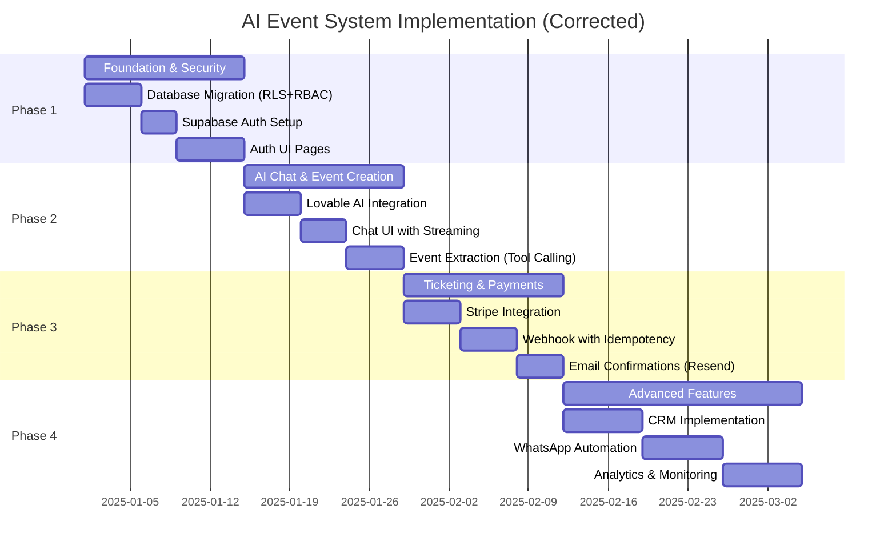
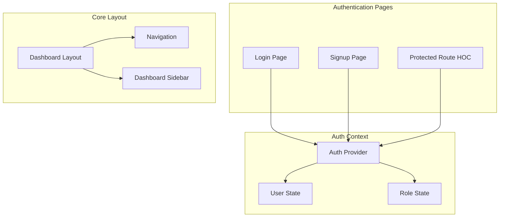
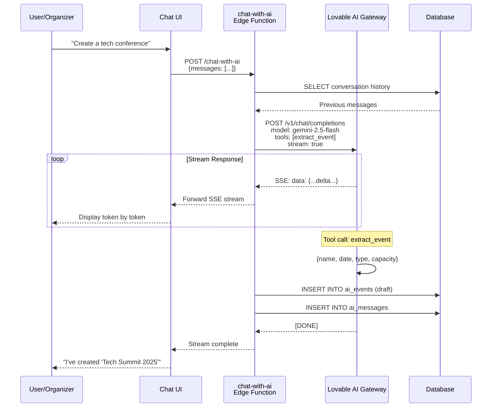
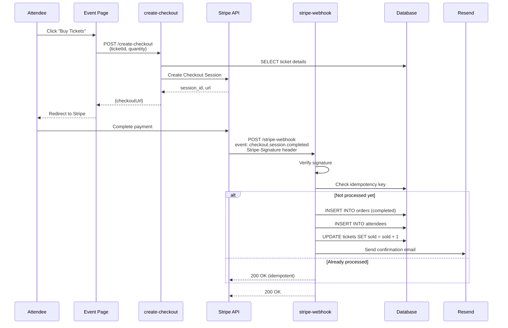

# 05 - Implementation Phases

## 📅 Development Timeline

**Updated:** Based on best-practices evaluation  
**Plan Correctness:** ✅ 92% aligned with Lovable Cloud best practices



## ✅ Evaluation Notes

**What's Correct:**
- ✅ Separate `user_roles` table (not in `profiles`)
- ✅ `SECURITY DEFINER` function for role checks
- ✅ RLS policies reference `profiles(id)` (not `auth.users`)
- ✅ Supabase Auth (not Clerk)
- ✅ Stripe webhook signature verification + idempotency
- ✅ Lovable AI Gateway (`google/gemini-2.5-flash`)

**What Changed:**
- Updated Phase 1 to emphasize RBAC security first
- Clarified Supabase Auth (removed Clerk references)
- Added explicit idempotency requirement for webhooks

## 🎯 Phase 1: Foundation & Security (Week 1-2)

### Objectives
- Secure authentication system
- Role-based access control (RBAC)
- Database schema with RLS
- Basic UI scaffolding

### Database Migration

```sql
-- 1. Create app_role enum
CREATE TYPE app_role AS ENUM ('admin', 'organizer', 'attendee');

-- 2. Create profiles table with auto-creation trigger
CREATE TABLE public.profiles (
  id UUID PRIMARY KEY REFERENCES auth.users(id) ON DELETE CASCADE,
  full_name TEXT,
  email TEXT,
  avatar_url TEXT,
  company_name TEXT,
  phone TEXT,
  created_at TIMESTAMP WITH TIME ZONE DEFAULT NOW(),
  updated_at TIMESTAMP WITH TIME ZONE DEFAULT NOW()
);

ALTER TABLE public.profiles ENABLE ROW LEVEL SECURITY;

CREATE POLICY "Public profiles viewable" ON public.profiles
  FOR SELECT USING (true);

CREATE POLICY "Users update own profile" ON public.profiles
  FOR UPDATE USING (auth.uid() = id);

-- 3. Create user_roles table (CRITICAL for security)
CREATE TABLE public.user_roles (
  id UUID PRIMARY KEY DEFAULT gen_random_uuid(),
  user_id UUID NOT NULL REFERENCES auth.users(id) ON DELETE CASCADE,
  role app_role NOT NULL,
  created_at TIMESTAMP WITH TIME ZONE DEFAULT NOW(),
  UNIQUE(user_id, role)
);

ALTER TABLE public.user_roles ENABLE ROW LEVEL SECURITY;

CREATE POLICY "Users view own roles" ON public.user_roles
  FOR SELECT USING (auth.uid() = user_id);

CREATE POLICY "Admins manage all roles" ON public.user_roles
  FOR ALL USING (public.has_role(auth.uid(), 'admin'));

-- 4. Create SECURITY DEFINER function for role checks
CREATE OR REPLACE FUNCTION public.has_role(_user_id UUID, _role app_role)
RETURNS BOOLEAN
LANGUAGE SQL
STABLE
SECURITY DEFINER
SET search_path = public
AS $$
  SELECT EXISTS (
    SELECT 1
    FROM public.user_roles
    WHERE user_id = _user_id AND role = _role
  )
$$;

-- 5. Create trigger to auto-create profile and default role
CREATE OR REPLACE FUNCTION public.handle_new_user()
RETURNS TRIGGER
LANGUAGE plpgsql
SECURITY DEFINER
SET search_path = public
AS $$
BEGIN
  INSERT INTO public.profiles (id, full_name, email)
  VALUES (
    NEW.id,
    COALESCE(NEW.raw_user_meta_data->>'full_name', ''),
    NEW.email
  );
  
  INSERT INTO public.user_roles (user_id, role)
  VALUES (NEW.id, 'attendee');
  
  RETURN NEW;
END;
$$;

CREATE TRIGGER on_auth_user_created
  AFTER INSERT ON auth.users
  FOR EACH ROW EXECUTE FUNCTION public.handle_new_user();

-- 6. Create updated_at trigger
CREATE OR REPLACE FUNCTION public.update_updated_at_column()
RETURNS TRIGGER
LANGUAGE plpgsql
AS $$
BEGIN
  NEW.updated_at = NOW();
  RETURN NEW;
END;
$$;

CREATE TRIGGER update_profiles_updated_at
  BEFORE UPDATE ON public.profiles
  FOR EACH ROW EXECUTE FUNCTION public.update_updated_at_column();
```

### Frontend Components



### Implementation Checklist
- [ ] Database migration with all security tables
- [ ] Supabase auth configuration (auto-confirm enabled)
- [ ] Login/Signup pages with validation
- [ ] Auth context with session management
- [ ] Protected route wrapper
- [ ] Basic dashboard layout
- [ ] Role display in UI

### Success Criteria
✅ Users can sign up with email/password  
✅ Auto-confirm email enabled (no verification required)  
✅ Profile auto-created on signup  
✅ Default 'attendee' role assigned  
✅ Login persists across page refreshes  
✅ Protected routes redirect to login  

---

## 🤖 Phase 2: AI Chat & Event Creation (Week 3-4)

### Objectives
- Lovable AI Gateway integration
- Real-time chat interface
- Event data extraction with structured output
- Landing page configuration generation

### AI Chat Flow



### Edge Function: `chat-with-ai`

```typescript
// supabase/functions/chat-with-ai/index.ts
import { serve } from "https://deno.land/std@0.168.0/http/server.ts";
import { createClient } from "https://esm.sh/@supabase/supabase-js@2";

const corsHeaders = {
  'Access-Control-Allow-Origin': '*',
  'Access-Control-Allow-Headers': 'authorization, x-client-info, apikey, content-type',
};

serve(async (req) => {
  if (req.method === 'OPTIONS') return new Response(null, { headers: corsHeaders });

  try {
    const { messages, conversationId } = await req.json();
    const LOVABLE_API_KEY = Deno.env.get('LOVABLE_API_KEY');
    
    const authHeader = req.headers.get('Authorization')!;
    const supabase = createClient(
      Deno.env.get('SUPABASE_URL')!,
      Deno.env.get('SUPABASE_ANON_KEY')!,
      { global: { headers: { Authorization: authHeader } } }
    );

    // Fetch conversation history
    const { data: history } = await supabase
      .from('ai_messages')
      .select('*')
      .eq('conversation_id', conversationId)
      .order('created_at', { ascending: true });

    const fullMessages = [
      { role: 'system', content: 'You are an AI event planning assistant...' },
      ...(history || []).map(m => ({ role: m.role, content: m.content })),
      ...messages
    ];

    // Call Lovable AI with structured output tools
    const response = await fetch('https://ai.gateway.lovable.dev/v1/chat/completions', {
      method: 'POST',
      headers: {
        'Authorization': `Bearer ${LOVABLE_API_KEY}`,
        'Content-Type': 'application/json',
      },
      body: JSON.stringify({
        model: 'google/gemini-2.5-flash',
        messages: fullMessages,
        tools: [
          {
            type: 'function',
            function: {
              name: 'extract_event_details',
              description: 'Extract structured event information from conversation',
              parameters: {
                type: 'object',
                properties: {
                  name: { type: 'string' },
                  type: { type: 'string', enum: ['corporate', 'conference', 'workshop'] },
                  start_date: { type: 'string', format: 'date-time' },
                  capacity: { type: 'number' }
                },
                required: ['name', 'type', 'start_date']
              }
            }
          }
        ],
        stream: true
      })
    });

    // Handle rate limits
    if (response.status === 429) {
      return new Response(
        JSON.stringify({ error: 'Rate limit exceeded. Please try again later.' }),
        { status: 429, headers: { ...corsHeaders, 'Content-Type': 'application/json' } }
      );
    }

    if (response.status === 402) {
      return new Response(
        JSON.stringify({ error: 'AI credits exhausted. Please add credits to your workspace.' }),
        { status: 402, headers: { ...corsHeaders, 'Content-Type': 'application/json' } }
      );
    }

    // Stream response back to client
    return new Response(response.body, {
      headers: { ...corsHeaders, 'Content-Type': 'text/event-stream' }
    });

  } catch (error) {
    console.error('Chat error:', error);
    return new Response(JSON.stringify({ error: error.message }), {
      status: 500,
      headers: { ...corsHeaders, 'Content-Type': 'application/json' }
    });
  }
});
```

### Database Tables

```sql
-- AI Conversations
CREATE TABLE public.ai_conversations (
  id UUID PRIMARY KEY DEFAULT gen_random_uuid(),
  user_id UUID NOT NULL REFERENCES profiles(id) ON DELETE CASCADE,
  title TEXT DEFAULT 'New Conversation',
  metadata JSONB DEFAULT '{}',
  created_at TIMESTAMP WITH TIME ZONE DEFAULT NOW(),
  updated_at TIMESTAMP WITH TIME ZONE DEFAULT NOW()
);

CREATE INDEX idx_conversations_user ON ai_conversations(user_id);

-- AI Messages
CREATE TABLE public.ai_messages (
  id UUID PRIMARY KEY DEFAULT gen_random_uuid(),
  conversation_id UUID NOT NULL REFERENCES ai_conversations(id) ON DELETE CASCADE,
  role TEXT NOT NULL CHECK (role IN ('user', 'assistant', 'system')),
  content TEXT NOT NULL,
  tool_calls JSONB,
  created_at TIMESTAMP WITH TIME ZONE DEFAULT NOW()
);

CREATE INDEX idx_messages_conversation ON ai_messages(conversation_id);

-- AI Events (draft events created by AI)
CREATE TABLE public.ai_events (
  id UUID PRIMARY KEY DEFAULT gen_random_uuid(),
  organizer_id UUID NOT NULL REFERENCES profiles(id) ON DELETE CASCADE,
  name TEXT NOT NULL,
  slug TEXT UNIQUE NOT NULL,
  type TEXT NOT NULL,
  start_date TIMESTAMP WITH TIME ZONE NOT NULL,
  end_date TIMESTAMP WITH TIME ZONE,
  capacity INTEGER,
  description TEXT,
  landing_page_config JSONB CHECK (
    jsonschema_is_valid(
      '{"type": "object", "properties": {"hero": {"type": "object"}, "sections": {"type": "array"}}}',
      landing_page_config
    )
  ),
  status TEXT DEFAULT 'draft' CHECK (status IN ('draft', 'published', 'archived')),
  created_at TIMESTAMP WITH TIME ZONE DEFAULT NOW(),
  updated_at TIMESTAMP WITH TIME ZONE DEFAULT NOW()
);

CREATE INDEX idx_events_organizer ON ai_events(organizer_id);
CREATE INDEX idx_events_slug ON ai_events(slug);
CREATE INDEX idx_landing_config ON ai_events USING GIN(landing_page_config);
```

### Implementation Checklist
- [ ] Enable Lovable AI (auto-provisions LOVABLE_API_KEY)
- [ ] Create `chat-with-ai` edge function
- [ ] Database tables for conversations/messages/events
- [ ] Chat UI with streaming token display
- [ ] Event extraction with tool calling
- [ ] Landing page config generation
- [ ] Event preview component
- [ ] Rate limit error handling (429, 402)

### Success Criteria
✅ Users can chat with AI in real-time  
✅ AI extracts structured event data  
✅ Landing page config generated as JSON  
✅ Events saved to database in draft state  
✅ Rate limit errors displayed to users  

---

## 💳 Phase 3: Ticketing & Payments (Week 5-6)

### Objectives
- Stripe integration with webhook security
- Ticket creation and management
- Order processing with idempotency
- Email confirmations via Resend

### Payment Flow



### Stripe Webhook Security

```typescript
// supabase/functions/stripe-webhook/index.ts
import Stripe from 'https://esm.sh/stripe@14.0.0';

const stripe = new Stripe(Deno.env.get('STRIPE_SECRET_KEY')!, {
  apiVersion: '2023-10-16',
});

serve(async (req) => {
  const signature = req.headers.get('stripe-signature')!;
  const body = await req.text();
  
  let event: Stripe.Event;
  
  try {
    // CRITICAL: Verify webhook signature
    event = stripe.webhooks.constructEvent(
      body,
      signature,
      Deno.env.get('STRIPE_WEBHOOK_SECRET')!
    );
  } catch (err) {
    console.error('Webhook signature verification failed:', err.message);
    return new Response(JSON.stringify({ error: 'Invalid signature' }), {
      status: 400
    });
  }

  // CRITICAL: Idempotency check
  const idempotencyKey = event.id;
  const { data: existing } = await supabase
    .from('orders')
    .select('id')
    .eq('stripe_payment_intent', idempotencyKey)
    .single();

  if (existing) {
    console.log('Event already processed:', idempotencyKey);
    return new Response(JSON.stringify({ received: true }), { status: 200 });
  }

  // Process event
  if (event.type === 'checkout.session.completed') {
    const session = event.data.object as Stripe.Checkout.Session;
    
    // Create order, attendees, update ticket count
    // Send confirmation email
  }

  return new Response(JSON.stringify({ received: true }), { status: 200 });
});
```

### Database Schema

```sql
-- Tickets
CREATE TABLE public.tickets (
  id UUID PRIMARY KEY DEFAULT gen_random_uuid(),
  event_id UUID NOT NULL REFERENCES ai_events(id) ON DELETE CASCADE,
  name TEXT NOT NULL,
  price NUMERIC NOT NULL CHECK (price >= 0),
  quantity INTEGER NOT NULL CHECK (quantity > 0),
  sold INTEGER DEFAULT 0 CHECK (sold >= 0 AND sold <= quantity),
  description TEXT,
  created_at TIMESTAMP WITH TIME ZONE DEFAULT NOW(),
  updated_at TIMESTAMP WITH TIME ZONE DEFAULT NOW()
);

-- Orders
CREATE TABLE public.orders (
  id UUID PRIMARY KEY DEFAULT gen_random_uuid(),
  event_id UUID NOT NULL REFERENCES ai_events(id) ON DELETE RESTRICT,
  customer_id UUID REFERENCES profiles(id) ON DELETE SET NULL,
  total_amount NUMERIC NOT NULL,
  stripe_payment_intent TEXT UNIQUE NOT NULL,
  stripe_checkout_session TEXT,
  status TEXT DEFAULT 'pending' CHECK (status IN ('pending', 'completed', 'failed')),
  tickets_data JSONB DEFAULT '[]',
  created_at TIMESTAMP WITH TIME ZONE DEFAULT NOW(),
  updated_at TIMESTAMP WITH TIME ZONE DEFAULT NOW()
);

CREATE INDEX idx_orders_stripe_pi ON orders(stripe_payment_intent);
CREATE INDEX idx_orders_customer ON orders(customer_id);

-- Attendees
CREATE TABLE public.attendees (
  id UUID PRIMARY KEY DEFAULT gen_random_uuid(),
  order_id UUID NOT NULL REFERENCES orders(id) ON DELETE CASCADE,
  ticket_id UUID NOT NULL REFERENCES tickets(id) ON DELETE RESTRICT,
  attendee_info JSONB DEFAULT '{}',
  qr_code TEXT UNIQUE NOT NULL,
  checked_in BOOLEAN DEFAULT false,
  checked_in_at TIMESTAMP WITH TIME ZONE,
  created_at TIMESTAMP WITH TIME ZONE DEFAULT NOW()
);

CREATE INDEX idx_attendees_order ON attendees(order_id);
CREATE INDEX idx_attendees_qr ON attendees(qr_code);
```

### Implementation Checklist
- [ ] Enable Stripe integration (collect secret key)
- [ ] Create Stripe webhook endpoint
- [ ] Implement signature verification
- [ ] Add idempotency checks
- [ ] Create checkout session endpoint
- [ ] Database tables for tickets/orders/attendees
- [ ] QR code generation for attendees
- [ ] Enable Resend integration
- [ ] Send confirmation emails
- [ ] Handle payment failures

### Success Criteria
✅ Stripe checkout sessions created  
✅ Webhook signatures verified  
✅ Duplicate events handled (idempotent)  
✅ Orders created on successful payment  
✅ Tickets sold count updated atomically  
✅ Attendees receive QR codes  
✅ Confirmation emails sent  

---

## 📊 Progress Tracking

| Phase | Duration | Status | Dependencies |
|-------|----------|--------|--------------|
| Phase 1: Foundation | 2 weeks | 🔴 Not Started | None |
| Phase 2: AI Chat | 2 weeks | 🔴 Not Started | Phase 1 |
| Phase 3: Payments | 2 weeks | 🔴 Not Started | Phase 2 |
| Phase 4: Advanced | 3 weeks | 🔴 Not Started | Phase 3 |

**Legend**: 🔴 Not Started | 🟡 In Progress | 🟢 Complete

---

## 🚀 Next Steps

After completing Phase 3, the MVP is production-ready. Phase 4 adds:
- CRM for organizer relationship management
- WhatsApp automation for attendee communications
- Analytics and monitoring dashboards
- Audit logs and compliance features
