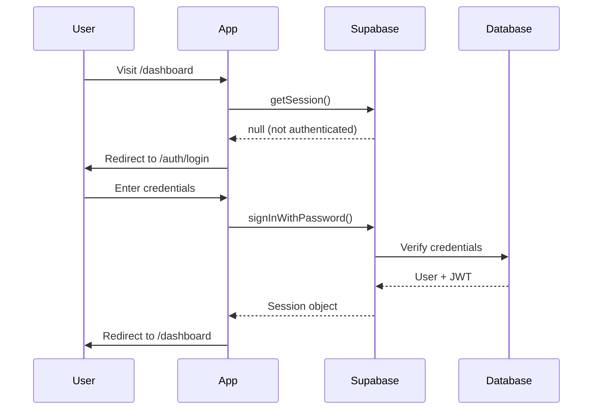

# 🔐 Auth and Access Flow — EventOS Authentication

**Version:** 1.0
**Last Updated:** 2025-10-17
**Auth Provider:** Supabase Auth

---

## 📋 Table of Contents

1. [Overview](#overview)
2. [Auth Setup](#auth-setup)
3. [Session Management](#session-management)
4. [Protected Routes](#protected-routes)
5. [Role-Based Access](#role-based-access)
6. [Auth UI Components](#auth-ui-components)
7. [Auth Hooks](#auth-hooks)
8. [Testing Strategy](#testing-strategy)
9. [Success Criteria](#success-criteria)

---

## 🎯 Overview

### Authentication Flow



### Auth Patterns Used

1. **Magic Link** → Email-based passwordless auth
2. **Password Auth** → Traditional email/password
3. **Session Persistence** → LocalStorage-based
4. **JWT Tokens** → Auto-refresh with PKCE flow
5. **Protected Routes** → React Router wrapper
6. **Role-Based Access** → Profile metadata checks

---

## 🔧 Auth Setup

### Step 1: Configure Supabase Auth

**In Supabase Dashboard → Authentication → URL Configuration:**

```
Site URL: http://localhost:5173
Redirect URLs:
  - http://localhost:5173/**
  - https://your-app.vercel.app/**
```

**Enable Auth Providers:**
```
✅ Email/Password
✅ Magic Link
❌ Google (Phase 2)
❌ GitHub (Phase 2)
```

### Step 2: Create Auth Context

**File:** `src/contexts/AuthContext.tsx`

```typescript
import { createContext, useContext, useEffect, useState } from 'react'
import { Session, User } from '@supabase/supabase-js'
import { supabase } from '@/lib/supabase'

interface AuthContextType {
  session: Session | null
  user: User | null
  loading: boolean
  signOut: () => Promise<void>
}

const AuthContext = createContext<AuthContextType | undefined>(undefined)

export function AuthProvider({ children }: { children: React.ReactNode }) {
  const [session, setSession] = useState<Session | null>(null)
  const [user, setUser] = useState<User | null>(null)
  const [loading, setLoading] = useState(true)

  useEffect(() => {
    // Get initial session
    supabase.auth.getSession().then(({ data: { session } }) => {
      setSession(session)
      setUser(session?.user ?? null)
      setLoading(false)
    })

    // Listen for auth changes
    const {
      data: { subscription },
    } = supabase.auth.onAuthStateChange((_event, session) => {
      setSession(session)
      setUser(session?.user ?? null)
      setLoading(false)
    })

    return () => subscription.unsubscribe()
  }, [])

  const signOut = async () => {
    await supabase.auth.signOut()
    setSession(null)
    setUser(null)
  }

  return (
    <AuthContext.Provider value={{ session, user, loading, signOut }}>
      {children}
    </AuthContext.Provider>
  )
}

export function useAuth() {
  const context = useContext(AuthContext)
  if (context === undefined) {
    throw new Error('useAuth must be used within an AuthProvider')
  }
  return context
}
```

### Step 3: Add to Provider Tree

**Update `src/main.tsx`:**

```typescript
import { AuthProvider } from '@/contexts/AuthContext'

ReactDOM.createRoot(document.getElementById('root')!).render(
  <React.StrictMode>
    <BrowserRouter>
      <QueryClientProvider client={queryClient}>
        <SessionContextProvider supabaseClient={supabase}>
          <AuthProvider>
            <App />
            <Toaster position="top-right" richColors />
          </AuthProvider>
        </SessionContextProvider>
      </QueryClientProvider>
    </BrowserRouter>
  </React.StrictMode>
)
```

---

## 🔑 Session Management

### Get Current Session

```typescript
import { supabase } from '@/lib/supabase'

// Get current session (no API call, reads from storage)
const { data: { session } } = await supabase.auth.getSession()

if (session) {
  console.log('User ID:', session.user.id)
  console.log('Access Token:', session.access_token)
  console.log('Expires At:', new Date(session.expires_at! * 1000))
}
```

### Session Refresh

Supabase automatically refreshes tokens before expiry when configured correctly:

```typescript
// In lib/supabase.ts
export const supabase = createClient(url, key, {
  auth: {
    autoRefreshToken: true, // ✅ Auto-refresh enabled
    persistSession: true,
    detectSessionInUrl: true,
  },
})
```

### Manual Session Refresh

```typescript
import { supabase } from '@/lib/supabase'

// Force refresh session
const { data: { session }, error } = await supabase.auth.refreshSession()

if (error) {
  console.error('Failed to refresh session:', error.message)
  // Redirect to login
}
```

### Handle Session Expiry

```typescript
import { useEffect } from 'react'
import { useNavigate } from 'react-router-dom'
import { supabase } from '@/lib/supabase'

export function useSessionMonitor() {
  const navigate = useNavigate()

  useEffect(() => {
    const { data: { subscription } } = supabase.auth.onAuthStateChange((event) => {
      if (event === 'TOKEN_REFRESHED') {
        console.log('Token refreshed successfully')
      }

      if (event === 'SIGNED_OUT') {
        navigate('/auth/login')
      }

      if (event === 'USER_UPDATED') {
        console.log('User metadata updated')
      }
    })

    return () => subscription.unsubscribe()
  }, [navigate])
}
```

---

## 🛡️ Protected Routes

### Method 1: Protected Route Component

**File:** `src/components/ProtectedRoute.tsx`

```typescript
import { Navigate, Outlet, useLocation } from 'react-router-dom'
import { useAuth } from '@/contexts/AuthContext'
import { LoadingSpinner } from '@/components/ui/loading-spinner'

export function ProtectedRoute() {
  const { session, loading } = useAuth()
  const location = useLocation()

  if (loading) {
    return (
      <div className="flex h-screen items-center justify-center">
        <LoadingSpinner />
      </div>
    )
  }

  if (!session) {
    // Redirect to login, save the attempted URL
    return <Navigate to="/auth/login" state={{ from: location }} replace />
  }

  return <Outlet />
}
```

**Usage in routes:**

```typescript
// App.tsx
import { Routes, Route } from 'react-router-dom'
import { ProtectedRoute } from '@/components/ProtectedRoute'

function App() {
  return (
    <Routes>
      {/* Public routes */}
      <Route path="/" element={<HomePage />} />
      <Route path="/auth/login" element={<LoginPage />} />

      {/* Protected routes */}
      <Route element={<ProtectedRoute />}>
        <Route path="/dashboard" element={<DashboardLayout />}>
          <Route index element={<DashboardHome />} />
          <Route path="events" element={<EventsPage />} />
          <Route path="orders" element={<OrdersPage />} />
        </Route>
      </Route>
    </Routes>
  )
}
```

### Method 2: Route Guard Hook

**File:** `src/hooks/useRequireAuth.ts`

```typescript
import { useEffect } from 'react'
import { useNavigate, useLocation } from 'react-router-dom'
import { useAuth } from '@/contexts/AuthContext'

export function useRequireAuth() {
  const { session, loading } = useAuth()
  const navigate = useNavigate()
  const location = useLocation()

  useEffect(() => {
    if (!loading && !session) {
      navigate('/auth/login', {
        state: { from: location },
        replace: true,
      })
    }
  }, [session, loading, navigate, location])

  return { session, loading }
}
```

**Usage in components:**

```typescript
// routes/dashboard/EventsPage.tsx
export function EventsPage() {
  const { session, loading } = useRequireAuth()

  if (loading) return <LoadingSpinner />

  return <div>Protected content for {session!.user.email}</div>
}
```

---

## 👥 Role-Based Access

### Profile Structure

```sql
-- Database schema
create table public.profiles (
  id uuid primary key references auth.users(id) on delete cascade,
  email text not null,
  full_name text,
  role text not null default 'attendee' check (role in ('organizer', 'attendee', 'admin')),
  created_at timestamptz default now()
);
```

### Fetch User Profile

**File:** `src/hooks/useProfile.ts`

```typescript
import { useQuery } from '@tanstack/react-query'
import { supabase } from '@/lib/supabase'
import { useAuth } from '@/contexts/AuthContext'

export interface Profile {
  id: string
  email: string
  full_name: string | null
  role: 'organizer' | 'attendee' | 'admin'
  created_at: string
}

export function useProfile() {
  const { user } = useAuth()

  return useQuery({
    queryKey: ['profile', user?.id],
    queryFn: async () => {
      if (!user) throw new Error('Not authenticated')

      const { data, error } = await supabase
        .from('profiles')
        .select('*')
        .eq('id', user.id)
        .single()

      if (error) throw error
      return data as Profile
    },
    enabled: !!user,
    staleTime: 5 * 60 * 1000, // 5 minutes
  })
}
```

### Role-Based Route Protection

**File:** `src/components/RoleProtectedRoute.tsx`

```typescript
import { Navigate, Outlet } from 'react-router-dom'
import { useProfile } from '@/hooks/useProfile'
import { LoadingSpinner } from '@/components/ui/loading-spinner'
import { Alert, AlertDescription } from '@/components/ui/alert'

interface Props {
  allowedRoles: Array<'organizer' | 'attendee' | 'admin'>
}

export function RoleProtectedRoute({ allowedRoles }: Props) {
  const { data: profile, isLoading } = useProfile()

  if (isLoading) {
    return (
      <div className="flex h-screen items-center justify-center">
        <LoadingSpinner />
      </div>
    )
  }

  if (!profile) {
    return <Navigate to="/auth/login" replace />
  }

  if (!allowedRoles.includes(profile.role)) {
    return (
      <div className="container mx-auto mt-10">
        <Alert variant="destructive">
          <AlertDescription>
            You don't have permission to access this page.
            Required role: {allowedRoles.join(', ')}
          </AlertDescription>
        </Alert>
      </div>
    )
  }

  return <Outlet />
}
```

**Usage:**

```typescript
// Only organizers can access
<Route element={<RoleProtectedRoute allowedRoles={['organizer']} />}>
  <Route path="/dashboard/events/new" element={<CreateEventPage />} />
</Route>

// Admins only
<Route element={<RoleProtectedRoute allowedRoles={['admin']} />}>
  <Route path="/admin" element={<AdminPanel />} />
</Route>
```

---

## 🎨 Auth UI Components

### Login Page

**File:** `src/routes/auth/LoginPage.tsx`

```typescript
import { useState } from 'react'
import { useNavigate, useLocation } from 'react-router-dom'
import { useForm } from 'react-hook-form'
import { zodResolver } from '@hookform/resolvers/zod'
import { z } from 'zod'
import { toast } from 'sonner'
import { supabase } from '@/lib/supabase'
import { Button } from '@/components/ui/button'
import { Input } from '@/components/ui/input'
import { Card, CardHeader, CardTitle, CardDescription, CardContent } from '@/components/ui/card'
import { Form, FormControl, FormField, FormItem, FormLabel, FormMessage } from '@/components/ui/form'

const loginSchema = z.object({
  email: z.string().email('Invalid email address'),
  password: z.string().min(6, 'Password must be at least 6 characters'),
})

type LoginForm = z.infer<typeof loginSchema>

export function LoginPage() {
  const navigate = useNavigate()
  const location = useLocation()
  const [loading, setLoading] = useState(false)

  const from = (location.state as any)?.from?.pathname || '/dashboard'

  const form = useForm<LoginForm>({
    resolver: zodResolver(loginSchema),
    defaultValues: {
      email: '',
      password: '',
    },
  })

  const onSubmit = async (values: LoginForm) => {
    setLoading(true)

    try {
      const { data, error } = await supabase.auth.signInWithPassword({
        email: values.email,
        password: values.password,
      })

      if (error) throw error

      toast.success('Welcome back!', {
        description: `Logged in as ${data.user.email}`,
      })

      navigate(from, { replace: true })
    } catch (error: any) {
      toast.error('Authentication failed', {
        description: error.message,
      })
    } finally {
      setLoading(false)
    }
  }

  return (
    <div className="flex min-h-screen items-center justify-center">
      <Card className="w-full max-w-md">
        <CardHeader>
          <CardTitle>Welcome back</CardTitle>
          <CardDescription>Sign in to your EventOS account</CardDescription>
        </CardHeader>
        <CardContent>
          <Form {...form}>
            <form onSubmit={form.handleSubmit(onSubmit)} className="space-y-4">
              <FormField
                control={form.control}
                name="email"
                render={({ field }) => (
                  <FormItem>
                    <FormLabel>Email</FormLabel>
                    <FormControl>
                      <Input
                        type="email"
                        placeholder="you@example.com"
                        {...field}
                      />
                    </FormControl>
                    <FormMessage />
                  </FormItem>
                )}
              />

              <FormField
                control={form.control}
                name="password"
                render={({ field }) => (
                  <FormItem>
                    <FormLabel>Password</FormLabel>
                    <FormControl>
                      <Input
                        type="password"
                        placeholder="••••••••"
                        {...field}
                      />
                    </FormControl>
                    <FormMessage />
                  </FormItem>
                )}
              />

              <Button type="submit" className="w-full" disabled={loading}>
                {loading ? 'Signing in...' : 'Sign in'}
              </Button>

              <div className="text-center text-sm">
                Don't have an account?{' '}
                <Button
                  variant="link"
                  className="p-0"
                  onClick={() => navigate('/auth/signup')}
                >
                  Sign up
                </Button>
              </div>
            </form>
          </Form>
        </CardContent>
      </Card>
    </div>
  )
}
```

### Magic Link Login

**File:** `src/routes/auth/MagicLinkPage.tsx`

```typescript
import { useState } from 'react'
import { useForm } from 'react-hook-form'
import { zodResolver } from '@hookform/resolvers/zod'
import { z } from 'zod'
import { toast } from 'sonner'
import { supabase } from '@/lib/supabase'
import { Button } from '@/components/ui/button'
import { Input } from '@/components/ui/input'
import { Card } from '@/components/ui/card'

const magicLinkSchema = z.object({
  email: z.string().email('Invalid email address'),
})

type MagicLinkForm = z.infer<typeof magicLinkSchema>

export function MagicLinkPage() {
  const [loading, setLoading] = useState(false)
  const [emailSent, setEmailSent] = useState(false)

  const form = useForm<MagicLinkForm>({
    resolver: zodResolver(magicLinkSchema),
    defaultValues: { email: '' },
  })

  const onSubmit = async (values: MagicLinkForm) => {
    setLoading(true)

    try {
      const { error } = await supabase.auth.signInWithOtp({
        email: values.email,
        options: {
          emailRedirectTo: `${window.location.origin}/dashboard`,
        },
      })

      if (error) throw error

      setEmailSent(true)
      toast.success('Check your email', {
        description: 'We sent you a magic link to sign in',
      })
    } catch (error: any) {
      toast.error('Failed to send magic link', {
        description: error.message,
      })
    } finally {
      setLoading(false)
    }
  }

  if (emailSent) {
    return (
      <div className="flex min-h-screen items-center justify-center">
        <Card className="p-6 text-center">
          <h2 className="text-2xl font-bold">Check your email</h2>
          <p className="mt-2 text-muted-foreground">
            We sent a magic link to {form.getValues('email')}
          </p>
        </Card>
      </div>
    )
  }

  return (
    <div className="flex min-h-screen items-center justify-center">
      <Card className="w-full max-w-md p-6">
        <h1 className="text-2xl font-bold">Sign in with Magic Link</h1>
        <p className="mt-2 text-sm text-muted-foreground">
          Enter your email to receive a sign-in link
        </p>

        <form onSubmit={form.handleSubmit(onSubmit)} className="mt-6 space-y-4">
          <Input
            type="email"
            placeholder="you@example.com"
            {...form.register('email')}
          />
          <Button type="submit" className="w-full" disabled={loading}>
            {loading ? 'Sending...' : 'Send magic link'}
          </Button>
        </form>
      </Card>
    </div>
  )
}
```

### Sign Out Button

**File:** `src/components/SignOutButton.tsx`

```typescript
import { useNavigate } from 'react-router-dom'
import { toast } from 'sonner'
import { useAuth } from '@/contexts/AuthContext'
import { Button } from '@/components/ui/button'
import { LogOut } from 'lucide-react'

export function SignOutButton() {
  const { signOut } = useAuth()
  const navigate = useNavigate()

  const handleSignOut = async () => {
    try {
      await signOut()
      toast.success('Signed out successfully')
      navigate('/auth/login')
    } catch (error: any) {
      toast.error('Failed to sign out', {
        description: error.message,
      })
    }
  }

  return (
    <Button variant="ghost" size="sm" onClick={handleSignOut}>
      <LogOut className="mr-2 h-4 w-4" />
      Sign out
    </Button>
  )
}
```

---

## 🪝 Auth Hooks

### useAuth Hook

```typescript
// Already created in AuthContext
import { useAuth } from '@/contexts/AuthContext'

export function MyComponent() {
  const { user, session, loading, signOut } = useAuth()

  if (loading) return <div>Loading...</div>
  if (!session) return <div>Not authenticated</div>

  return <div>Hello, {user!.email}</div>
}
```

### useRequireOrganizer Hook

```typescript
import { useProfile } from '@/hooks/useProfile'
import { useNavigate } from 'react-router-dom'
import { useEffect } from 'react'

export function useRequireOrganizer() {
  const { data: profile, isLoading } = useProfile()
  const navigate = useNavigate()

  useEffect(() => {
    if (!isLoading && profile?.role !== 'organizer') {
      navigate('/403', { replace: true })
    }
  }, [profile, isLoading, navigate])

  return { profile, isLoading }
}
```

---

## 🧪 Testing Strategy

### Test 1: Sign Up Flow

```
1. Visit /auth/signup
2. Enter: test@example.com / password123
3. Submit form
4. Expected: Success toast, redirect to /dashboard
5. Verify: User appears in Supabase Auth dashboard
```

### Test 2: Sign In Flow

```
1. Visit /auth/login
2. Enter valid credentials
3. Expected: Success toast, redirect to /dashboard
4. Refresh page
5. Expected: Still logged in (no redirect)
```

### Test 3: Protected Route

```
1. Open /dashboard in incognito
2. Expected: Immediate redirect to /auth/login
3. No flash of protected content
4. URL shows ?from=/dashboard (return URL saved)
```

### Test 4: Session Persistence

```
1. Log in successfully
2. Close browser tab
3. Reopen app
4. Expected: Still logged in, no re-authentication
5. Check: localStorage has supabase.auth.token
```

### Test 5: Sign Out

```
1. Click "Sign out" button
2. Expected: Redirect to /auth/login
3. Try accessing /dashboard
4. Expected: Redirected back to login
5. Verify: localStorage cleared
```

### Test 6: Role-Based Access

```
1. Log in as attendee
2. Try accessing /dashboard/events/new
3. Expected: "Permission denied" message
4. Log in as organizer
5. Try same route
6. Expected: Access granted
```

---

## ✅ Success Criteria

### Authentication
- ✅ Users can sign up with email/password
- ✅ Users can sign in with magic link
- ✅ Sessions persist across page refreshes
- ✅ Sessions persist across browser restarts
- ✅ Token refresh happens automatically

### Authorization
- ✅ Protected routes redirect unauthenticated users
- ✅ Role-based routes enforce permissions
- ✅ No flash of protected content
- ✅ Return URLs work after login

### User Experience
- ✅ Auth flows complete in < 3 seconds
- ✅ Loading states prevent confusion
- ✅ Error messages are clear and actionable
- ✅ Success toasts confirm actions

### Security
- ✅ Passwords never logged or exposed
- ✅ JWT tokens stored securely (httpOnly in prod)
- ✅ PKCE flow enabled for enhanced security
- ✅ Sessions expire after inactivity (configurable)

---

**Next:** [04-DATA_AND_STATE_GUIDE.md](./04-DATA_AND_STATE_GUIDE.md)
