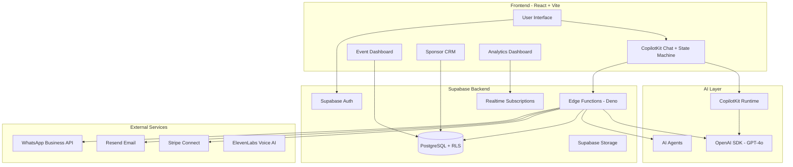

# 01 - Master Plan V2: AI-Powered Business Event Management

## 🎯 Vision

An AI-powered business event management platform where organizers interact with CopilotKit state machines and OpenAI agents to create, customize, and manage events - from concept to execution, including sponsors, marketing, and WhatsApp automation.

## 🏗️ System Architecture



## 📦 Technology Stack

### Core Infrastructure
- **Database:** Supabase PostgreSQL 15 with Row-Level Security
- **Authentication:** Supabase Auth (email, Google SSO, magic links)
- **File Storage:** Supabase Storage (event images, documents, QR codes)
- **Real-Time:** Supabase Realtime (live ticket sales, analytics)
- **Edge Functions:** Supabase Edge Functions (Deno runtime)

### AI & Automation
- **AI Framework:** CopilotKit React SDK + State Machine
- **AI Models:** OpenAI SDK (GPT-4o, GPT-4o-mini)
- **AI Agents:** OpenAI Agents for complex reasoning tasks
- **Voice AI:** ElevenLabs Conversational AI (optional)

### Frontend
- **Framework:** React 18 + TypeScript 5.3
- **Build Tool:** Vite 5.0
- **UI Library:** shadcn/ui + Radix UI
- **Styling:** Tailwind CSS 3.4
- **State Management:** Zustand + React Query
- **Forms:** React Hook Form + Zod validation

### Communications
- **WhatsApp:** WhatsApp Business Cloud API (direct integration)
- **Email:** Resend API
- **SMS:** Twilio (optional backup)

### Payments
- **Payment Processing:** Stripe Connect
- **Tax Compliance:** Canadian GST/PST/HST support

## 🎪 Core Features

### 1. AI Event Wizard (CopilotKit State Machine)

**User Experience:**
- Conversational event creation via chat interface
- State machine guides through planning stages
- AI suggests venues, sponsors, pricing
- Auto-save and resume capability

**States:**
```
Basics → Venue → Ticketing → Sponsors → Marketing → Review → Publish
```

**Implementation:**
```typescript
import { useCopilotAction, useCopilotReadable } from "@copilotkit/react-core";
import { CopilotKit, CopilotSidebar } from "@copilotkit/react-ui";

// Event wizard with CopilotKit state machine
const EventWizard = () => {
  const [state, setState] = useState<EventWizardState>({
    step: "basics",
    eventData: {}
  });

  // Make state readable by AI
  useCopilotReadable({
    description: "Current event planning state",
    value: state
  });

  // Define AI actions
  useCopilotAction({
    name: "createEvent",
    description: "Create a new event with basic details",
    parameters: [/* ... */],
    handler: async (params) => {
      // Save to Supabase
      const { data } = await supabase.from("events").insert(params);
      setState(prev => ({ ...prev, step: "venue" }));
      return `Event created! Let's find the perfect venue.`;
    }
  });

  return (
    <CopilotKit runtimeUrl="/api/copilotkit">
      <CopilotSidebar>
        {/* Event wizard UI */}
      </CopilotSidebar>
    </CopilotKit>
  );
};
```

### 2. Venue Search & Booking

**Features:**
- AI-powered venue recommendations
- Real-time availability calendar
- Capacity and amenity matching
- Multi-space booking
- Contract generation
- E-signature integration

**Database:**
```sql
CREATE TABLE venues (
  id UUID PRIMARY KEY,
  name TEXT NOT NULL,
  capacity INTEGER,
  amenities TEXT[],
  pricing JSONB,
  availability_calendar JSONB
);

CREATE TABLE venue_bookings (
  id UUID PRIMARY KEY,
  event_id UUID REFERENCES events(id),
  venue_id UUID REFERENCES venues(id),
  start_datetime TIMESTAMPTZ,
  end_datetime TIMESTAMPTZ,
  status TEXT DEFAULT 'pending'
);
```

### 3. Sponsor Lead Generation & CRM

**Features:**
- AI-powered sponsor matching (10K+ company database)
- Automated outreach sequences
- Deal pipeline visualization
- Proposal generation
- Contract management
- ROI tracking

**Workflow:**
```
Lead Identification → Enrichment → Scoring → Outreach → Proposal → Negotiation → Contract → Execution
```

**Implementation:**
```typescript
// OpenAI Agent for sponsor matching
const matchSponsors = async (eventDetails) => {
  const response = await openai.chat.completions.create({
    model: "gpt-4o",
    messages: [
      {
        role: "system",
        content: "You match events with relevant sponsors based on audience, industry, and budget."
      },
      {
        role: "user",
        content: `Find sponsors for: ${JSON.stringify(eventDetails)}`
      }
    ],
    tools: [
      {
        type: "function",
        function: {
          name: "query_sponsors",
          description: "Search sponsor database",
          parameters: {/* ... */}
        }
      }
    ]
  });

  return response.choices[0].message.tool_calls;
};
```

### 4. WhatsApp Business Automation

**Use Cases:**
- Event reminders (T-7 days, T-24h, T-1h)
- QR ticket delivery
- Check-in confirmations
- Customer service bot
- VIP concierge
- Post-event surveys
- Sponsor lead notifications

**Message Flow:**
```
Event Created → Template Approval → Queue Messages → Rate Limiting → Send via WhatsApp API → Track Delivery
```

**Implementation:**
```sql
CREATE TABLE whatsapp_templates (
  id UUID PRIMARY KEY,
  template_name TEXT UNIQUE,
  category TEXT, -- TRANSACTIONAL, MARKETING, UTILITY
  body_text TEXT,
  variables TEXT[],
  status TEXT DEFAULT 'pending' -- pending, approved, rejected
);

CREATE TABLE whatsapp_messages (
  id UUID PRIMARY KEY,
  event_id UUID REFERENCES events(id),
  recipient_phone TEXT,
  template_name TEXT,
  variables JSONB,
  scheduled_for TIMESTAMPTZ,
  sent_at TIMESTAMPTZ,
  status TEXT -- queued, sent, delivered, read, failed
);
```

### 5. Marketing Activations

**Features:**
- AI landing page generator
- Social media content creation (LinkedIn, Instagram, Twitter, Facebook)
- Email campaign builder
- Content calendar
- Multi-channel publishing
- Campaign analytics

**AI Content Generation:**
```typescript
const generateMarketingCampaign = async (event) => {
  const response = await openai.chat.completions.create({
    model: "gpt-4o",
    messages: [
      {
        role: "system",
        content: "You create comprehensive marketing campaigns for events."
      },
      {
        role: "user",
        content: `Create 6-week social media campaign for: ${event.name}`
      }
    ]
  });

  // Returns 18 posts with scheduling, hashtags, and CTAs
  return parseCampaignResponse(response);
};
```

### 6. Event CRM

**Features:**
- Contact management (organizers, sponsors, vendors, attendees)
- Deal pipeline with drag-and-drop
- Activity tracking (emails, calls, meetings)
- Task automation
- Email sync (Gmail/Outlook)
- AI-powered next-best-action recommendations
- Revenue forecasting

**CRM Workflow:**
```
Lead Capture → Enrichment → Scoring → Nurture → Opportunity → Proposal → Won/Lost → Post-Event Analysis
```

### 7. Real-Time Analytics

**Dashboards:**
- Ticket sales (real-time)
- Revenue tracking
- Attendee demographics
- Marketing performance
- Sponsor engagement
- WhatsApp delivery rates
- Website conversions

**Implementation:**
```typescript
// Supabase Realtime for live updates
const channel = supabase
  .channel("event-updates")
  .on("postgres_changes", {
    event: "INSERT",
    schema: "public",
    table: "orders",
    filter: `event_id=eq.${eventId}`
  }, (payload) => {
    toast.success("New ticket sold! 🎉");
    queryClient.invalidateQueries(["event-metrics"]);
  })
  .subscribe();
```

## 🗄️ Database Schema (30+ Tables)

### Core Tables
```sql
-- User Management
CREATE TABLE profiles (id UUID PRIMARY KEY, full_name TEXT, email TEXT, role TEXT);
CREATE TABLE user_roles (user_id UUID, role TEXT, permissions JSONB);

-- Events
CREATE TABLE events (id UUID PRIMARY KEY, name TEXT, start_date TIMESTAMPTZ, capacity INTEGER, organizer_id UUID);
CREATE TABLE event_templates (id UUID, template_name TEXT, default_settings JSONB);

-- Venues
CREATE TABLE venues (id UUID, name TEXT, capacity INTEGER, amenities TEXT[], pricing JSONB);
CREATE TABLE venue_bookings (id UUID, event_id UUID, venue_id UUID, start_datetime TIMESTAMPTZ);

-- Ticketing
CREATE TABLE tickets (id UUID, event_id UUID, tier_name TEXT, price NUMERIC, quantity INTEGER);
CREATE TABLE orders (id UUID, event_id UUID, user_id UUID, total_amount NUMERIC, status TEXT);
CREATE TABLE attendees (id UUID, order_id UUID, qr_code TEXT, attendee_info JSONB);

-- Sponsors & CRM
CREATE TABLE sponsors (id UUID, company_name TEXT, industry TEXT, contact_info JSONB);
CREATE TABLE sponsorship_packages (id UUID, event_id UUID, tier_name TEXT, price NUMERIC);
CREATE TABLE sponsorship_deals (id UUID, sponsor_id UUID, status TEXT, amount NUMERIC, probability INTEGER);
CREATE TABLE crm_contacts (id UUID, type TEXT, company_name TEXT, health_score INTEGER);
CREATE TABLE crm_activities (id UUID, contact_id UUID, activity_type TEXT, description TEXT);

-- Marketing
CREATE TABLE marketing_campaigns (id UUID, event_id UUID, campaign_type TEXT, channels TEXT[]);
CREATE TABLE social_posts (id UUID, campaign_id UUID, platform TEXT, content TEXT, scheduled_for TIMESTAMPTZ);
CREATE TABLE email_campaigns (id UUID, campaign_id UUID, subject TEXT, recipient_list JSONB);
CREATE TABLE landing_pages (id UUID, event_id UUID, slug TEXT, custom_html TEXT);

-- Communications
CREATE TABLE whatsapp_templates (id UUID, template_name TEXT, body_text TEXT, status TEXT);
CREATE TABLE whatsapp_messages (id UUID, recipient_phone TEXT, template_name TEXT, status TEXT);
CREATE TABLE whatsapp_conversations (id UUID, phone_number TEXT, conversation_history JSONB);

-- Analytics
CREATE TABLE event_metrics (id UUID, event_id UUID, metrics JSONB, recorded_at TIMESTAMPTZ);
CREATE TABLE campaign_analytics (id UUID, campaign_id UUID, platform TEXT, stats JSONB);
```

## 🔐 Security (Row-Level Security)

```sql
-- Users can only see their own events
CREATE POLICY "users_own_events" ON events FOR ALL USING (organizer_id = auth.uid());

-- Attendees can see their own tickets
CREATE POLICY "attendees_own_tickets" ON attendees FOR SELECT USING (
  order_id IN (SELECT id FROM orders WHERE user_id = auth.uid())
);

-- Sponsors can see their own deals
CREATE POLICY "sponsors_own_deals" ON sponsorship_deals FOR SELECT USING (
  sponsor_id IN (SELECT sponsor_id FROM sponsor_users WHERE user_id = auth.uid())
);

-- Public events are visible to all
CREATE POLICY "public_events" ON events FOR SELECT USING (
  visibility = 'public' AND published = true
);
```

## 🚀 Implementation Phases

### Phase 1: Foundation (Weeks 1-2)
✅ Supabase project setup
✅ Database schema (30+ tables)
✅ RLS policies
✅ React app scaffold
✅ shadcn/ui setup
✅ Authentication flows

### Phase 2: AI Event Wizard (Weeks 3-4)
🔄 CopilotKit integration
🔄 OpenAI SDK setup
🔄 Event wizard state machine
🔄 AI actions (create, search, recommend)
🔄 Form validation

### Phase 3: Venues & Ticketing (Weeks 5-6)
⏳ Venue database and search
⏳ Booking system
⏳ Ticket configuration
⏳ Stripe integration
⏳ Order processing

### Phase 4: Sponsors & CRM (Weeks 7-8)
⏳ Sponsor database (10K companies)
⏳ AI matching engine
⏳ CRM pipeline UI
⏳ Deal management
⏳ Email integration

### Phase 5: Marketing & WhatsApp (Weeks 9-10)
⏳ Landing page generator
⏳ Social media scheduler
⏳ Email campaigns (Resend)
⏳ WhatsApp Business API
⏳ Automated messaging

### Phase 6: Analytics & Launch (Weeks 11-12)
⏳ Real-time dashboards
⏳ Analytics views
⏳ Performance optimization
⏳ Security audit
⏳ Production deployment

**Timeline:** 12 weeks to MVP launch

## 📊 Success Metrics

| Metric | Target | Timeline |
|--------|--------|----------|
| **Active Events** | 150+ | Month 6 |
| **Event Creation Time** | <10 min | Launch |
| **Sponsor Match Rate** | 60%+ | Month 3 |
| **WhatsApp Open Rate** | 95%+ | Month 1 |
| **CRM Conversion** | 25%+ | Month 6 |
| **Platform Revenue** | $250K MRR | Month 6 |
| **User Satisfaction (NPS)** | 50+ | Month 3 |

## 🎯 Target Market

### Primary Segments
1. **Corporate Event Planners** - Team building, product launches, conferences
2. **Marketing Agencies** - Brand activations, sponsorship campaigns
3. **Event Production Companies** - Galas, fundraisers, festivals

### Geographic Focus
- **Phase 1:** Toronto, Vancouver, Montreal
- **Phase 2:** Major North American cities
- **Phase 3:** International expansion

## 💰 Business Model

### Revenue Streams
1. **Subscription Plans:**
   - Starter: $99/month (5 events)
   - Growth: $299/month (20 events)
   - Pro: $999/month (unlimited)

2. **Transaction Fees:**
   - 3% platform fee on ticket sales
   - 10-15% commission on sponsor deals

3. **Premium Features:**
   - WhatsApp automation: $49/month
   - AI voice assistant: $99/month
   - White-label: Custom pricing

### Cost Structure
- Supabase: $25-100/month
- OpenAI API: $200-800/month
- WhatsApp Business: $0-200/month (usage-based)
- Stripe fees: 2.9% + $0.30 per transaction
- Resend: $10-100/month

## 🔗 API & Integrations

### Public API Endpoints
```
POST /api/events - Create event
GET /api/events/:id - Get event details
POST /api/events/:id/register - Register attendee
POST /api/sponsors/match - AI sponsor matching
POST /api/marketing/generate - AI content generation
```

### Webhooks
- `event.created` - New event published
- `ticket.sold` - Ticket purchased
- `sponsor.signed` - Sponsor contract signed
- `campaign.completed` - Marketing campaign finished

### Third-Party Integrations
- Stripe Connect (payments)
- WhatsApp Business API (messaging)
- Resend (transactional email)
- ElevenLabs (voice AI - optional)
- Google Calendar (event sync)
- Zapier (workflow automation - optional)

## 📚 Documentation & Resources

### Developer Resources
- **Supabase Docs:** https://supabase.com/docs
- **CopilotKit Docs:** https://docs.copilotkit.ai
- **OpenAI SDK:** https://platform.openai.com/docs
- **WhatsApp API:** https://developers.facebook.com/docs/whatsapp

### Example Projects
- CopilotKit State Machine: https://docs.copilotkit.ai/direct-to-llm/cookbook/state-machine
- OpenAI Agents: https://openai.github.io/openai-agents-python/

## ✅ Next Steps

1. **Week 1-2:** Complete Supabase setup and database schema
2. **Week 3-4:** Implement CopilotKit event wizard
3. **Week 5-6:** Build venue search and ticketing system
4. **Week 7-8:** Develop sponsor CRM and matching
5. **Week 9-10:** Integrate WhatsApp and marketing automation
6. **Week 11-12:** Launch analytics dashboard and production deployment

---

**Document Status:** ✅ Ready for Development
**Last Updated:** October 2025
**Version:** 2.0
