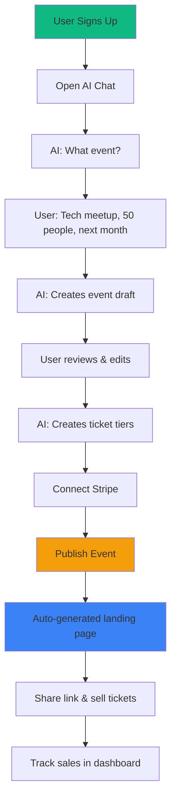

# EventOS MVP - Product Requirements Document

**Version:** MVP 1.0
**Target Launch:** 4 weeks
**Focus:** AI-Powered Event Creation + Ticketing
**Status:** Ready for Development

---

## 🎯 MVP Vision

**One-Liner:** Create and sell tickets for professional events in 5 minutes using AI conversation.

**Core Value Proposition:**
- **For:** Event organizers (corporate, community, business)
- **Who need:** A fast, simple way to launch ticketed events
- **Our product:** AI-powered event platform that creates events through conversation
- **That provides:** Event creation, ticketing, payments, and attendee management in one place
- **Unlike:** Complex event platforms that take hours to set up
- **Our approach:** Conversational AI creates everything in minutes

---

## 📊 MVP Scope: What's In, What's Out

### ✅ INCLUDED (Core Features)

| Feature | Why MVP-Critical | Week |
|---------|------------------|------|
| **AI Event Wizard** | Core differentiation - AI conversation creates events | 1-2 |
| **Basic Ticketing** | Revenue generation - must sell tickets | 2 |
| **Payment Processing** | Revenue generation - Stripe checkout | 2 |
| **Landing Pages** | Public event discovery and registration | 3 |
| **Email Notifications** | Essential communication - confirmations, tickets | 3 |
| **Basic Dashboard** | Organizer needs to see sales and attendees | 4 |

### ❌ EXCLUDED (Post-MVP)

| Feature | Why Not MVP | Add When |
|---------|-------------|----------|
| CRM System | Complex, not core to launching events | v1.1 (Month 2) |
| Sponsor Matching | Nice-to-have, not revenue-critical | v1.2 (Month 3) |
| WhatsApp Automation | Adds complexity, email sufficient for MVP | v1.2 (Month 3) |
| Marketing Campaigns | Can do manually at launch | v1.3 (Month 4) |
| Venue Database | Users can enter manually | v2.0 (Month 6) |
| Advanced Analytics | Basic metrics sufficient | v1.1 (Month 2) |
| Mobile App | Web-first, mobile-responsive | v2.0 (Month 6) |

---

## 🏗️ MVP Technical Architecture

```
┌─────────────────────────────────────┐
│         Frontend (React)            │
│  - AI Chat Interface (CopilotKit)   │
│  - Event Form                       │
│  - Landing Page                     │
│  - Dashboard                        │
└─────────────────────────────────────┘
                  ↓
┌─────────────────────────────────────┐
│       Supabase Backend              │
│  - PostgreSQL (5 core tables)       │
│  - Auth (email only)                │
│  - Storage (event images)           │
│  - Edge Functions (3 functions)     │
└─────────────────────────────────────┘
                  ↓
┌─────────────────────────────────────┐
│      External Services              │
│  - OpenAI (GPT-4o-mini - cheaper)   │
│  - Stripe (payments)                │
│  - Resend (email)                   │
└─────────────────────────────────────┘
```

---

## 🎨 MVP User Flow



---

## 💎 MVP Feature Specifications

### Feature 1: AI Event Creation (CopilotKit)

**User Story:**
```
As an event organizer
I want to create an event by chatting with AI
So that I can launch events in under 5 minutes
```

**Conversation Flow:**
```
AI: Hi! I'll help you create an event. What type of event are you planning?

User: A tech networking meetup

AI: Great! Let me gather some details:
- Event name?
- Date and time?
- How many attendees?
- Location (venue name and city)?

User: "Tech Leaders Meetup" on March 15 at 6pm, 100 people, WeWork Toronto

AI: Perfect! Here's your event:

📅 Tech Leaders Meetup
📍 WeWork Toronto
👥 100 attendees
🗓️ March 15, 2026 at 6:00 PM

I've created:
✓ Event page with description
✓ 3 ticket tiers (Early Bird $25, Regular $35, VIP $50)
✓ Registration form

Would you like to edit anything or publish now?
```

**Technical Implementation:**

```typescript
// src/hooks/useEventWizard.ts
import { useCopilotAction, useCopilotReadable } from "@copilotkit/react-core";

export function useEventWizard() {
  const [event, setEvent] = useState<Partial<Event>>({});

  useCopilotReadable({
    description: "Current event being created",
    value: event
  });

  useCopilotAction({
    name: "createEvent",
    description: "Create an event with AI-gathered information",
    parameters: [
      { name: "name", type: "string", required: true },
      { name: "date", type: "string", required: true },
      { name: "location", type: "string", required: true },
      { name: "capacity", type: "number", required: true },
      { name: "description", type: "string", required: false }
    ],
    handler: async (params) => {
      const { data, error } = await supabase
        .from("events")
        .insert({
          name: params.name,
          start_date: params.date,
          location: params.location,
          capacity: params.capacity,
          description: params.description || "",
          organizer_id: user.id,
          status: "draft"
        })
        .select()
        .single();

      if (error) throw error;

      // AI auto-creates ticket tiers
      const tickets = [
        { name: "Early Bird", price: 25, quantity: 30 },
        { name: "Regular", price: 35, quantity: 50 },
        { name: "VIP", price: 50, quantity: 20 }
      ];

      await supabase.from("tickets").insert(
        tickets.map(t => ({ ...t, event_id: data.id }))
      );

      setEvent(data);

      return `Event "${params.name}" created! Review and publish when ready.`;
    }
  });

  return { event, setEvent };
}
```

**Acceptance Criteria:**
- [ ] Create event in <3 AI messages
- [ ] Auto-generate description if not provided
- [ ] Auto-create 3 ticket tiers
- [ ] Save draft every 10 seconds
- [ ] Event created in <30 seconds total

---

### Feature 2: Basic Ticketing System

**Database Schema:**

```sql
-- Core tables only (MVP)
CREATE TABLE events (
  id UUID PRIMARY KEY DEFAULT gen_random_uuid(),
  organizer_id UUID NOT NULL REFERENCES auth.users(id),
  name TEXT NOT NULL,
  slug TEXT UNIQUE NOT NULL, -- URL-friendly: tech-leaders-meetup-mar-2026
  description TEXT,
  start_date TIMESTAMPTZ NOT NULL,
  location TEXT NOT NULL, -- Simple text for MVP
  capacity INTEGER NOT NULL,
  status TEXT DEFAULT 'draft', -- draft, published, completed, cancelled
  cover_image_url TEXT,
  created_at TIMESTAMPTZ DEFAULT NOW(),
  updated_at TIMESTAMPTZ DEFAULT NOW()
);

CREATE TABLE tickets (
  id UUID PRIMARY KEY DEFAULT gen_random_uuid(),
  event_id UUID NOT NULL REFERENCES events(id) ON DELETE CASCADE,
  name TEXT NOT NULL, -- "Early Bird", "Regular", "VIP"
  description TEXT,
  price NUMERIC NOT NULL CHECK (price >= 0),
  quantity INTEGER NOT NULL CHECK (quantity > 0),
  sold INTEGER DEFAULT 0,
  created_at TIMESTAMPTZ DEFAULT NOW()
);

CREATE TABLE orders (
  id UUID PRIMARY KEY DEFAULT gen_random_uuid(),
  event_id UUID NOT NULL REFERENCES events(id) ON DELETE CASCADE,
  user_email TEXT NOT NULL,
  user_name TEXT NOT NULL,
  user_phone TEXT,
  total_amount NUMERIC NOT NULL,
  stripe_payment_intent_id TEXT,
  status TEXT DEFAULT 'pending', -- pending, completed, failed, refunded
  created_at TIMESTAMPTZ DEFAULT NOW()
);

CREATE TABLE attendees (
  id UUID PRIMARY KEY DEFAULT gen_random_uuid(),
  order_id UUID NOT NULL REFERENCES orders(id) ON DELETE CASCADE,
  event_id UUID NOT NULL REFERENCES events(id) ON DELETE CASCADE,
  ticket_id UUID NOT NULL REFERENCES tickets(id),
  attendee_name TEXT NOT NULL,
  attendee_email TEXT NOT NULL,
  qr_code TEXT UNIQUE NOT NULL, -- For check-in
  checked_in BOOLEAN DEFAULT false,
  checked_in_at TIMESTAMPTZ,
  created_at TIMESTAMPTZ DEFAULT NOW()
);

CREATE TABLE event_settings (
  event_id UUID PRIMARY KEY REFERENCES events(id) ON DELETE CASCADE,
  require_approval BOOLEAN DEFAULT false,
  collect_phone BOOLEAN DEFAULT false,
  max_tickets_per_order INTEGER DEFAULT 10,
  sales_end_date TIMESTAMPTZ,
  custom_fields JSONB DEFAULT '[]',
  created_at TIMESTAMPTZ DEFAULT NOW()
);

-- Row-Level Security
ALTER TABLE events ENABLE ROW LEVEL SECURITY;
ALTER TABLE tickets ENABLE ROW LEVEL SECURITY;
ALTER TABLE orders ENABLE ROW LEVEL SECURITY;
ALTER TABLE attendees ENABLE ROW LEVEL SECURITY;

-- Organizers can CRUD their own events
CREATE POLICY "organizers_own_events" ON events
  FOR ALL USING (organizer_id = auth.uid());

-- Public can view published events
CREATE POLICY "public_view_published" ON events
  FOR SELECT USING (status = 'published');

-- Public can view tickets for published events
CREATE POLICY "public_view_tickets" ON tickets
  FOR SELECT USING (
    event_id IN (SELECT id FROM events WHERE status = 'published')
  );

-- Users can view their own orders
CREATE POLICY "users_own_orders" ON orders
  FOR SELECT USING (user_email = auth.jwt()->>'email');
```

---

### Feature 3: Stripe Payment Integration

**Payment Flow:**

```typescript
// src/pages/EventCheckout.tsx
export function EventCheckout() {
  const { eventId } = useParams();
  const [selectedTickets, setSelectedTickets] = useState<Record<string, number>>({});

  const handleCheckout = async () => {
    // 1. Create order in database
    const { data: order } = await supabase
      .from("orders")
      .insert({
        event_id: eventId,
        user_email: user.email,
        user_name: user.name,
        total_amount: calculateTotal(selectedTickets),
        status: "pending"
      })
      .select()
      .single();

    // 2. Create Stripe checkout session
    const { data: session } = await supabase.functions.invoke("create-checkout-session", {
      body: {
        orderId: order.id,
        tickets: selectedTickets,
        successUrl: `${window.location.origin}/order-success?order_id=${order.id}`,
        cancelUrl: window.location.href
      }
    });

    // 3. Redirect to Stripe
    window.location.href = session.url;
  };

  return (
    <div>
      <h1>Select Tickets</h1>
      {tickets.map(ticket => (
        <TicketSelector
          key={ticket.id}
          ticket={ticket}
          quantity={selectedTickets[ticket.id] || 0}
          onChange={(qty) => setSelectedTickets({ ...selectedTickets, [ticket.id]: qty })}
        />
      ))}
      <Button onClick={handleCheckout}>
        Checkout - ${calculateTotal(selectedTickets)}
      </Button>
    </div>
  );
}
```

**Edge Function: Stripe Checkout**

```typescript
// supabase/functions/create-checkout-session/index.ts
import { serve } from "https://deno.land/std@0.168.0/http/server.ts";
import Stripe from "https://esm.sh/stripe@14";

const stripe = new Stripe(Deno.env.get("STRIPE_SECRET_KEY")!);

serve(async (req) => {
  const { orderId, tickets, successUrl, cancelUrl } = await req.json();

  // Get order and ticket details
  const { data: order } = await supabase
    .from("orders")
    .select(`
      *,
      event:events(name),
      tickets:tickets!inner(*)
    `)
    .eq("id", orderId)
    .single();

  // Create line items
  const lineItems = Object.entries(tickets).map(([ticketId, quantity]) => {
    const ticket = order.tickets.find(t => t.id === ticketId);
    return {
      price_data: {
        currency: "usd",
        product_data: {
          name: `${order.event.name} - ${ticket.name}`,
          description: ticket.description
        },
        unit_amount: Math.round(ticket.price * 100) // Convert to cents
      },
      quantity: Number(quantity)
    };
  });

  // Create Stripe Checkout Session
  const session = await stripe.checkout.sessions.create({
    payment_method_types: ["card"],
    line_items: lineItems,
    mode: "payment",
    success_url: successUrl,
    cancel_url: cancelUrl,
    metadata: {
      order_id: orderId
    }
  });

  return new Response(JSON.stringify({ url: session.url }), {
    headers: { "Content-Type": "application/json" }
  });
});
```

**Webhook Handler:**

```typescript
// supabase/functions/stripe-webhook/index.ts
serve(async (req) => {
  const signature = req.headers.get("stripe-signature")!;
  const body = await req.text();

  const event = stripe.webhooks.constructEvent(
    body,
    signature,
    Deno.env.get("STRIPE_WEBHOOK_SECRET")!
  );

  if (event.type === "checkout.session.completed") {
    const session = event.data.object;
    const orderId = session.metadata.order_id;

    // 1. Update order status
    await supabase
      .from("orders")
      .update({
        status: "completed",
        stripe_payment_intent_id: session.payment_intent
      })
      .eq("id", orderId);

    // 2. Create attendee records
    const { data: order } = await supabase
      .from("orders")
      .select("*, tickets:tickets(*)")
      .eq("id", orderId)
      .single();

    // 3. Generate QR codes and send tickets via email
    await supabase.functions.invoke("send-tickets", {
      body: { orderId }
    });
  }

  return new Response(JSON.stringify({ received: true }));
});
```

---

### Feature 4: Auto-Generated Landing Pages

**Simple Template (No Complex Generator for MVP):**

```typescript
// src/pages/PublicEvent.tsx
export function PublicEventPage() {
  const { slug } = useParams();
  const { data: event } = useQuery({
    queryKey: ["event", slug],
    queryFn: async () => {
      const { data } = await supabase
        .from("events")
        .select(`
          *,
          tickets(*)
        `)
        .eq("slug", slug)
        .eq("status", "published")
        .single();
      return data;
    }
  });

  return (
    <div className="max-w-4xl mx-auto p-8">
      {/* Hero Section */}
      <div className="mb-8">
        {event.cover_image_url && (
          
        )}
        <h1 className="text-4xl font-bold mb-4">{event.name}</h1>
        <div className="flex gap-6 text-gray-600">
          <div className="flex items-center gap-2">
            <Calendar className="w-5 h-5" />
            {new Date(event.start_date).toLocaleDateString("en-US", {
              weekday: "long",
              year: "numeric",
              month: "long",
              day: "numeric",
              hour: "numeric",
              minute: "2-digit"
            })}
          </div>
          <div className="flex items-center gap-2">
            <MapPin className="w-5 h-5" />
            {event.location}
          </div>
          <div className="flex items-center gap-2">
            <Users className="w-5 h-5" />
            {event.capacity} attendees
          </div>
        </div>
      </div>

      {/* Description */}
      <div className="prose prose-lg mb-12">
        <p>{event.description}</p>
      </div>

      {/* Tickets */}
      <div className="bg-gray-50 rounded-lg p-8">
        <h2 className="text-2xl font-bold mb-6">Get Tickets</h2>
        <div className="grid gap-4">
          {event.tickets.map(ticket => (
            <TicketCard
              key={ticket.id}
              ticket={ticket}
              onSelect={() => navigate(`/checkout/${event.id}?ticket=${ticket.id}`)}
            />
          ))}
        </div>
      </div>

      {/* Share */}
      <div className="mt-8 flex gap-4">
        <Button onClick={() => shareOnTwitter(event)}>
          <Twitter className="w-4 h-4 mr-2" /> Share
        </Button>
        <Button variant="outline" onClick={() => copyLink()}>
          <Link className="w-4 h-4 mr-2" /> Copy Link
        </Button>
      </div>
    </div>
  );
}
```

---

### Feature 5: Email Notifications (Resend)

**Edge Function:**

```typescript
// supabase/functions/send-tickets/index.ts
import { Resend } from "https://esm.sh/resend@2";

const resend = new Resend(Deno.env.get("RESEND_API_KEY"));

serve(async (req) => {
  const { orderId } = await req.json();

  // Get order details
  const { data: order } = await supabase
    .from("orders")
    .select(`
      *,
      event:events(*),
      attendees(*)
    `)
    .eq("id", orderId)
    .single();

  // Send email to each attendee
  for (const attendee of order.attendees) {
    await resend.emails.send({
      from: "EventOS <tickets@eventos.com>",
      to: attendee.attendee_email,
      subject: `Your ticket for ${order.event.name}`,
      html: `
        <h2>You're going to ${order.event.name}! 🎉</h2>
        <p>Hi ${attendee.attendee_name},</p>
        <p>Your ticket is confirmed for <strong>${order.event.name}</strong></p>

        <div style="background: #f3f4f6; padding: 20px; border-radius: 8px; margin: 20px 0;">
          <p><strong>📅 Date:</strong> ${new Date(order.event.start_date).toLocaleDateString()}</p>
          <p><strong>📍 Location:</strong> ${order.event.location}</p>
          <p><strong>🎟️ Order ID:</strong> ${order.id}</p>
        </div>

        <p>Show this QR code at check-in:</p>
        

        <p>See you there!</p>
      `
    });
  }

  return new Response(JSON.stringify({ sent: order.attendees.length }));
});
```

---

### Feature 6: Basic Organizer Dashboard

**Simple Metrics (MVP):**

```typescript
// src/pages/OrganizerDashboard.tsx
export function OrganizerDashboard() {
  const { data: events } = useQuery({
    queryKey: ["my-events"],
    queryFn: async () => {
      const { data } = await supabase
        .from("events")
        .select(`
          *,
          tickets(id, sold, quantity),
          orders(total_amount)
        `)
        .eq("organizer_id", user.id)
        .order("created_at", { ascending: false });
      return data;
    }
  });

  return (
    <div className="p-8">
      <div className="flex justify-between items-center mb-8">
        <h1 className="text-3xl font-bold">My Events</h1>
        <Button onClick={() => navigate("/create-event")}>
          <Plus className="w-4 h-4 mr-2" />
          Create Event
        </Button>
      </div>

      <div className="grid gap-6">
        {events?.map(event => (
          <EventCard key={event.id}>
            <div className="flex justify-between">
              <div>
                <h3 className="text-xl font-semibold">{event.name}</h3>
                <p className="text-gray-600">{event.location}</p>
                <p className="text-sm text-gray-500">
                  {new Date(event.start_date).toLocaleDateString()}
                </p>
              </div>

              <div className="text-right">
                <div className="text-3xl font-bold text-green-600">
                  ${event.orders.reduce((sum, o) => sum + o.total_amount, 0)}
                </div>
                <div className="text-sm text-gray-600">
                  {event.tickets.reduce((sum, t) => sum + t.sold, 0)} /
                  {event.tickets.reduce((sum, t) => sum + t.quantity, 0)} tickets sold
                </div>
                <Badge variant={event.status === "published" ? "success" : "secondary"}>
                  {event.status}
                </Badge>
              </div>
            </div>

            <div className="flex gap-2 mt-4">
              <Button variant="outline" size="sm" onClick={() => navigate(`/event/${event.slug}`)}>
                View Page
              </Button>
              <Button variant="outline" size="sm" onClick={() => navigate(`/event/${event.id}/edit`)}>
                Edit
              </Button>
              <Button variant="outline" size="sm" onClick={() => navigate(`/event/${event.id}/attendees`)}>
                Attendees ({event.tickets.reduce((sum, t) => sum + t.sold, 0)})
              </Button>
            </div>
          </EventCard>
        ))}
      </div>
    </div>
  );
}
```

---

## 📅 MVP Development Timeline

### Week 1: Foundation + AI Wizard
**Days 1-2:**
- [ ] Supabase project setup
- [ ] Database schema (5 tables)
- [ ] RLS policies
- [ ] Auth setup (email only)

**Days 3-5:**
- [ ] CopilotKit integration
- [ ] AI event creation chat
- [ ] Event form (fallback if AI fails)
- [ ] Basic event CRUD

**Days 6-7:**
- [ ] OpenAI SDK setup
- [ ] Edge function: CopilotKit runtime
- [ ] Test AI conversation flow

### Week 2: Ticketing + Payments
**Days 1-2:**
- [ ] Ticket configuration UI
- [ ] Shopping cart/checkout page
- [ ] Stripe Connect setup

**Days 3-4:**
- [ ] Edge function: create-checkout-session
- [ ] Edge function: stripe-webhook
- [ ] Order creation and processing

**Days 5-7:**
- [ ] QR code generation
- [ ] Attendee records creation
- [ ] Test payment flow end-to-end

### Week 3: Landing Pages + Email
**Days 1-3:**
- [ ] Public event landing page
- [ ] Event discovery page (list all)
- [ ] Share functionality

**Days 4-5:**
- [ ] Resend integration
- [ ] Email templates (ticket confirmation)
- [ ] Edge function: send-tickets

**Days 6-7:**
- [ ] Email trigger on purchase
- [ ] Test email delivery
- [ ] Email styling and branding

### Week 4: Dashboard + Polish
**Days 1-3:**
- [ ] Organizer dashboard
- [ ] Event analytics (sales, attendees)
- [ ] Attendee list view

**Days 4-5:**
- [ ] UI/UX polish
- [ ] Mobile responsiveness
- [ ] Error handling and validation

**Days 6-7:**
- [ ] End-to-end testing
- [ ] Bug fixes
- [ ] Production deployment
- [ ] 🚀 **MVP LAUNCH**

---

## 🎯 MVP Success Metrics

### Week 1 Post-Launch
- **Goal:** 10 events created
- **Metric:** Time to create event <5 minutes
- **Target:** 80% completion rate

### Month 1 Post-Launch
- **Goal:** 50 events created
- **Revenue:** $5,000 in ticket sales (3% platform fee = $150)
- **Users:** 100 organizers signed up
- **Retention:** 30% create 2+ events

### Validation Criteria (Go/No-Go for v1.1)
✅ **GO if:**
- 40+ events created in Month 1
- 20%+ of users create multiple events
- Average event creation time <8 minutes
- Positive user feedback (NPS >30)

❌ **NO-GO if:**
- <20 events created
- High abandonment rate (>60%)
- Users complain about lack of features

---

## 💰 MVP Costs

### Development (4 weeks)
- Developer time: 160 hours @ $75/hr = **$12,000**
- Design: 20 hours @ $60/hr = **$1,200**
- **Total Dev Cost: $13,200**

### Monthly Operational Costs
| Service | Cost | Notes |
|---------|------|-------|
| Supabase Pro | $25 | Unlimited API requests |
| OpenAI API | $50-150 | GPT-4o-mini (cheaper) |
| Stripe | 2.9% + $0.30 | Per transaction |
| Resend | $20 | 50K emails/month |
| Domain + Hosting | $15 | Vercel/Netlify free tier |
| **Total** | **$110-210/month** |

### Break-Even Analysis
- **Revenue model:** 3% platform fee
- **Break-even:** $3,700/month in ticket sales = $111 revenue
- **Target:** $10,000/month in sales = $300 revenue by Month 2

---

## 🚀 Post-MVP Roadmap

### v1.1 (Month 2) - Analytics & Retention
- [ ] Advanced dashboard (charts, trends)
- [ ] Email reminders to attendees
- [ ] Event templates (recurring events)
- [ ] Export attendee list (CSV)

### v1.2 (Month 3) - Growth Features
- [ ] WhatsApp notifications
- [ ] Basic sponsor system
- [ ] Social media integration
- [ ] Referral program

### v1.3 (Month 4) - Revenue Expansion
- [ ] Premium plans ($49/month, $199/month)
- [ ] White-label landing pages
- [ ] Custom domains
- [ ] Team collaboration

### v2.0 (Month 6) - Platform Maturity
- [ ] Full CRM system
- [ ] Venue database
- [ ] Marketing automation
- [ ] Mobile apps (iOS/Android)

---

## ⚠️ MVP Risks & Mitigation

| Risk | Impact | Probability | Mitigation |
|------|--------|-------------|------------|
| **AI creates poor events** | High | Medium | Provide manual edit option, improve prompts |
| **Stripe integration fails** | Critical | Low | Thorough testing, fallback to manual checkout |
| **Users don't understand AI chat** | High | Medium | Add tutorial, video demo, skip to form option |
| **No users at launch** | Critical | Medium | Pre-launch waitlist, Reddit/Product Hunt launch |
| **Email deliverability issues** | Medium | Low | Use Resend (high reputation), test before launch |

---

## 📋 Launch Checklist

### Pre-Launch (Week 4)
- [ ] Create demo event
- [ ] Record demo video (2 min)
- [ ] Write launch blog post
- [ ] Set up social media accounts
- [ ] Build waitlist landing page
- [ ] Collect 100+ waitlist signups

### Launch Day
- [ ] Deploy to production (Vercel/Netlify)
- [ ] Post on Product Hunt
- [ ] Post on Reddit (r/SideProject, r/startups)
- [ ] Email waitlist
- [ ] Tweet announcement
- [ ] LinkedIn post

### Post-Launch (Week 1)
- [ ] Monitor errors (Sentry)
- [ ] Collect user feedback
- [ ] Fix critical bugs
- [ ] Personal outreach to first 20 users
- [ ] Iterate based on feedback

---

## 🎓 MVP Learning Goals

**Questions to Answer:**
1. Do users prefer AI conversation or traditional forms?
2. What % of users complete event creation?
3. What's the average time to create an event?
4. What features do users ask for most?
5. What's the ideal pricing model?

**Data to Collect:**
- Event creation funnel (drop-off points)
- AI conversation length (# messages)
- User feedback (surveys after event creation)
- Support ticket themes
- Ticket sales conversion rate

---

## ✅ Definition of Done (MVP)

**User can:**
- [x] Sign up with email
- [x] Create event via AI chat in <5 minutes
- [x] Configure 1-5 ticket tiers
- [x] Get auto-generated landing page
- [x] Share event link
- [x] Accept payments via Stripe
- [x] Receive email confirmation
- [x] View sales dashboard
- [x] See attendee list
- [x] Download QR codes

**System must:**
- [x] Handle 100 concurrent users
- [x] Process payments securely (PCI compliant via Stripe)
- [x] Send emails reliably (>95% delivery)
- [x] Generate unique QR codes
- [x] Store data securely (RLS enabled)
- [x] Load pages in <2 seconds
- [x] Work on mobile (responsive)

---

**Status:** ✅ Ready to Build
**Next Step:** Begin Week 1 - Foundation + AI Wizard
**Launch Target:** 4 weeks from start
**First Revenue Target:** Week 5 (1 week post-launch)

---

## 📞 Support & Resources

**Tech Stack Docs:**
- Supabase: https://supabase.com/docs
- CopilotKit: https://docs.copilotkit.ai
- OpenAI: https://platform.openai.com/docs
- Stripe: https://stripe.com/docs
- Resend: https://resend.com/docs

**Inspiration:**
- Luma (luma.lu) - Event discovery
- Eventbrite - Ticketing platform
- Partiful - Simple event creation

**Community:**
- Supabase Discord
- r/SideProject
- Indie Hackers

---

**Document Owner:** Product Team
**Last Updated:** October 2025
**Version:** MVP 1.0 - Lean & Mean 🚀
