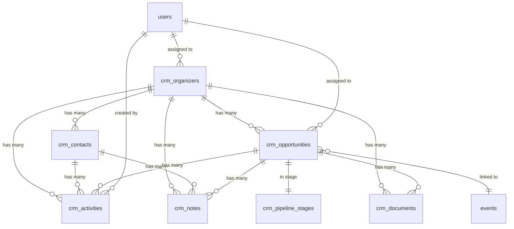

# EventOS CRM - Database Schema

**Version:** 1.0  
**Date:** October 2025  
**Status:** Design Phase

---

## 📋 Overview

Complete database schema for EventOS CRM system including tables, relationships, RLS policies, and indexes for optimal performance.

---

## 🗄️ Core Tables

### 1. crm_organizers (Client Companies)

```sql
-- Main organizer/client company table
CREATE TABLE crm_organizers (
  id UUID PRIMARY KEY DEFAULT gen_random_uuid(),
  company_name TEXT NOT NULL,
  industry TEXT,
  company_size TEXT CHECK (company_size IN ('startup', 'small', 'medium', 'large', 'enterprise')),
  website TEXT,
  status TEXT DEFAULT 'active' CHECK (status IN ('active', 'inactive', 'prospect', 'archived')),
  lead_source TEXT CHECK (lead_source IN ('referral', 'inbound', 'outbound', 'event', 'marketing', 'partner')),
  
  -- Contact info
  primary_email TEXT,
  primary_phone TEXT,
  address JSONB DEFAULT '{}', -- {street, city, province, postal_code, country}
  
  -- Business metrics
  annual_events INTEGER DEFAULT 0,
  total_revenue DECIMAL(12,2) DEFAULT 0,
  lifetime_value DECIMAL(12,2) DEFAULT 0,
  
  -- AI-powered insights
  engagement_score INTEGER DEFAULT 50 CHECK (engagement_score BETWEEN 0 AND 100),
  health_score INTEGER DEFAULT 50 CHECK (health_score BETWEEN 0 AND 100),
  churn_risk TEXT DEFAULT 'low' CHECK (churn_risk IN ('low', 'medium', 'high')),
  
  -- Event history
  event_history JSONB DEFAULT '[]', -- [{event_id, event_date, revenue, satisfaction}]
  tags TEXT[] DEFAULT '{}',
  
  -- Ownership
  assigned_to UUID REFERENCES auth.users(id),
  created_by UUID REFERENCES auth.users(id),
  
  -- Timestamps
  created_at TIMESTAMPTZ DEFAULT NOW(),
  updated_at TIMESTAMPTZ DEFAULT NOW(),
  last_activity_at TIMESTAMPTZ DEFAULT NOW()
);

-- Enable RLS
ALTER TABLE crm_organizers ENABLE ROW LEVEL SECURITY;

-- Indexes for performance
CREATE INDEX idx_organizers_status ON crm_organizers(status);
CREATE INDEX idx_organizers_assigned ON crm_organizers(assigned_to);
CREATE INDEX idx_organizers_industry ON crm_organizers(industry);
CREATE INDEX idx_organizers_engagement ON crm_organizers(engagement_score);
CREATE INDEX idx_organizers_search ON crm_organizers USING gin(to_tsvector('english', company_name));

-- Updated timestamp trigger
CREATE TRIGGER update_organizers_updated_at
  BEFORE UPDATE ON crm_organizers
  FOR EACH ROW
  EXECUTE FUNCTION update_updated_at_column();
```

### 2. crm_contacts (People at Organizations)

```sql
-- Individual contacts at client companies
CREATE TABLE crm_contacts (
  id UUID PRIMARY KEY DEFAULT gen_random_uuid(),
  organizer_id UUID NOT NULL REFERENCES crm_organizers(id) ON DELETE CASCADE,
  
  -- Personal info
  full_name TEXT NOT NULL,
  title TEXT,
  department TEXT,
  
  -- Contact details
  email TEXT NOT NULL,
  phone TEXT,
  mobile TEXT,
  linkedin_url TEXT,
  
  -- Relationship
  is_primary BOOLEAN DEFAULT false,
  is_decision_maker BOOLEAN DEFAULT false,
  vip_status BOOLEAN DEFAULT false,
  influence_level TEXT CHECK (influence_level IN ('low', 'medium', 'high')),
  
  -- Preferences
  communication_preference TEXT DEFAULT 'email' CHECK (communication_preference IN ('email', 'phone', 'whatsapp', 'any')),
  timezone TEXT DEFAULT 'America/Toronto',
  language TEXT DEFAULT 'en',
  
  -- Engagement
  last_contact_date TIMESTAMPTZ,
  engagement_score INTEGER DEFAULT 50 CHECK (engagement_score BETWEEN 0 AND 100),
  
  -- Metadata
  notes TEXT,
  tags TEXT[] DEFAULT '{}',
  
  created_at TIMESTAMPTZ DEFAULT NOW(),
  updated_at TIMESTAMPTZ DEFAULT NOW()
);

-- Enable RLS
ALTER TABLE crm_contacts ENABLE ROW LEVEL SECURITY;

-- Indexes
CREATE INDEX idx_contacts_organizer ON crm_contacts(organizer_id);
CREATE INDEX idx_contacts_email ON crm_contacts(email);
CREATE INDEX idx_contacts_primary ON crm_contacts(is_primary) WHERE is_primary = true;
CREATE INDEX idx_contacts_vip ON crm_contacts(vip_status) WHERE vip_status = true;

-- Ensure only one primary contact per organizer
CREATE UNIQUE INDEX idx_contacts_one_primary 
  ON crm_contacts(organizer_id) 
  WHERE is_primary = true;

-- Updated timestamp trigger
CREATE TRIGGER update_contacts_updated_at
  BEFORE UPDATE ON crm_contacts
  FOR EACH ROW
  EXECUTE FUNCTION update_updated_at_column();
```

### 3. crm_pipeline_stages

```sql
-- Pipeline stages for opportunity management
CREATE TABLE crm_pipeline_stages (
  id UUID PRIMARY KEY DEFAULT gen_random_uuid(),
  name TEXT NOT NULL,
  description TEXT,
  order_index INTEGER NOT NULL,
  color TEXT DEFAULT '#3b82f6',
  
  -- Stage characteristics
  is_active BOOLEAN DEFAULT true,
  is_closed BOOLEAN DEFAULT false, -- won or lost
  is_won BOOLEAN DEFAULT false,
  
  -- Automation
  auto_actions JSONB DEFAULT '[]', -- [{action: 'send_email', template: 'welcome'}]
  
  -- Probability for forecasting
  default_probability INTEGER DEFAULT 50 CHECK (default_probability BETWEEN 0 AND 100),
  
  created_at TIMESTAMPTZ DEFAULT NOW(),
  updated_at TIMESTAMPTZ DEFAULT NOW()
);

-- Enable RLS
ALTER TABLE crm_pipeline_stages ENABLE ROW LEVEL SECURITY;

-- Default stages
INSERT INTO crm_pipeline_stages (name, order_index, default_probability, color) VALUES
  ('Lead', 1, 10, '#6b7280'),
  ('Qualified', 2, 25, '#3b82f6'),
  ('Proposal', 3, 50, '#8b5cf6'),
  ('Negotiation', 4, 75, '#f59e0b'),
  ('Won', 5, 100, '#10b981'),
  ('Lost', 6, 0, '#ef4444');

-- Index
CREATE UNIQUE INDEX idx_stages_order ON crm_pipeline_stages(order_index);
```

### 4. crm_opportunities (Event Deals)

```sql
-- Sales opportunities linked to events
CREATE TABLE crm_opportunities (
  id UUID PRIMARY KEY DEFAULT gen_random_uuid(),
  organizer_id UUID NOT NULL REFERENCES crm_organizers(id) ON DELETE CASCADE,
  event_id UUID REFERENCES events(id) ON DELETE SET NULL,
  stage_id UUID NOT NULL REFERENCES crm_pipeline_stages(id),
  
  -- Opportunity details
  name TEXT NOT NULL,
  description TEXT,
  
  -- Financial
  value DECIMAL(12,2) NOT NULL,
  currency TEXT DEFAULT 'CAD',
  probability INTEGER DEFAULT 50 CHECK (probability BETWEEN 0 AND 100),
  expected_revenue DECIMAL(12,2) GENERATED ALWAYS AS (value * probability / 100) STORED,
  
  -- Dates
  expected_close_date DATE,
  actual_close_date DATE,
  
  -- Status
  status TEXT DEFAULT 'open' CHECK (status IN ('open', 'won', 'lost', 'abandoned')),
  loss_reason TEXT,
  
  -- Ownership
  assigned_to UUID REFERENCES auth.users(id),
  
  -- AI insights
  ai_score INTEGER DEFAULT 50 CHECK (ai_score BETWEEN 0 AND 100),
  ai_insights JSONB DEFAULT '{}', -- {next_action, risk_factors, recommendations}
  
  created_at TIMESTAMPTZ DEFAULT NOW(),
  updated_at TIMESTAMPTZ DEFAULT NOW(),
  last_stage_change_at TIMESTAMPTZ DEFAULT NOW()
);

-- Enable RLS
ALTER TABLE crm_opportunities ENABLE ROW LEVEL SECURITY;

-- Indexes
CREATE INDEX idx_opportunities_organizer ON crm_opportunities(organizer_id);
CREATE INDEX idx_opportunities_event ON crm_opportunities(event_id);
CREATE INDEX idx_opportunities_stage ON crm_opportunities(stage_id);
CREATE INDEX idx_opportunities_status ON crm_opportunities(status);
CREATE INDEX idx_opportunities_assigned ON crm_opportunities(assigned_to);
CREATE INDEX idx_opportunities_close_date ON crm_opportunities(expected_close_date);

-- Updated timestamp trigger
CREATE TRIGGER update_opportunities_updated_at
  BEFORE UPDATE ON crm_opportunities
  FOR EACH ROW
  EXECUTE FUNCTION update_updated_at_column();
```

### 5. crm_activities

```sql
-- Activity tracking for all interactions
CREATE TABLE crm_activities (
  id UUID PRIMARY KEY DEFAULT gen_random_uuid(),
  organizer_id UUID REFERENCES crm_organizers(id) ON DELETE CASCADE,
  contact_id UUID REFERENCES crm_contacts(id) ON DELETE CASCADE,
  opportunity_id UUID REFERENCES crm_opportunities(id) ON DELETE CASCADE,
  event_id UUID REFERENCES events(id) ON DELETE SET NULL,
  
  -- Activity details
  type TEXT NOT NULL CHECK (type IN ('call', 'email', 'meeting', 'note', 'task', 'event')),
  subject TEXT NOT NULL,
  description TEXT,
  
  -- Timing
  activity_date TIMESTAMPTZ DEFAULT NOW(),
  duration_minutes INTEGER,
  
  -- Task fields
  is_task BOOLEAN DEFAULT false,
  task_status TEXT CHECK (task_status IN ('pending', 'completed', 'cancelled')),
  due_date TIMESTAMPTZ,
  
  -- Relations
  user_id UUID NOT NULL REFERENCES auth.users(id),
  
  -- Metadata
  metadata JSONB DEFAULT '{}', -- {email_id, calendar_event_id, etc}
  
  created_at TIMESTAMPTZ DEFAULT NOW(),
  updated_at TIMESTAMPTZ DEFAULT NOW()
);

-- Enable RLS
ALTER TABLE crm_activities ENABLE ROW LEVEL SECURITY;

-- Indexes
CREATE INDEX idx_activities_organizer ON crm_activities(organizer_id);
CREATE INDEX idx_activities_contact ON crm_activities(contact_id);
CREATE INDEX idx_activities_opportunity ON crm_activities(opportunity_id);
CREATE INDEX idx_activities_type ON crm_activities(type);
CREATE INDEX idx_activities_user ON crm_activities(user_id);
CREATE INDEX idx_activities_date ON crm_activities(activity_date DESC);
CREATE INDEX idx_activities_tasks ON crm_activities(is_task, task_status) WHERE is_task = true;
```

### 6. crm_notes

```sql
-- Rich notes for organizers, contacts, opportunities
CREATE TABLE crm_notes (
  id UUID PRIMARY KEY DEFAULT gen_random_uuid(),
  organizer_id UUID REFERENCES crm_organizers(id) ON DELETE CASCADE,
  contact_id UUID REFERENCES crm_contacts(id) ON DELETE CASCADE,
  opportunity_id UUID REFERENCES crm_opportunities(id) ON DELETE CASCADE,
  
  -- Note content
  title TEXT,
  content TEXT NOT NULL,
  
  -- Categorization
  is_pinned BOOLEAN DEFAULT false,
  tags TEXT[] DEFAULT '{}',
  
  -- Ownership
  created_by UUID NOT NULL REFERENCES auth.users(id),
  
  created_at TIMESTAMPTZ DEFAULT NOW(),
  updated_at TIMESTAMPTZ DEFAULT NOW()
);

-- Enable RLS
ALTER TABLE crm_notes ENABLE ROW LEVEL SECURITY;

-- Indexes
CREATE INDEX idx_notes_organizer ON crm_notes(organizer_id);
CREATE INDEX idx_notes_contact ON crm_notes(contact_id);
CREATE INDEX idx_notes_opportunity ON crm_notes(opportunity_id);
CREATE INDEX idx_notes_pinned ON crm_notes(is_pinned) WHERE is_pinned = true;
CREATE INDEX idx_notes_search ON crm_notes USING gin(to_tsvector('english', content));
```

### 7. crm_documents

```sql
-- Document management for contracts, proposals, etc.
CREATE TABLE crm_documents (
  id UUID PRIMARY KEY DEFAULT gen_random_uuid(),
  organizer_id UUID REFERENCES crm_organizers(id) ON DELETE CASCADE,
  opportunity_id UUID REFERENCES crm_opportunities(id) ON DELETE CASCADE,
  
  -- File details
  file_name TEXT NOT NULL,
  file_type TEXT NOT NULL,
  file_size BIGINT NOT NULL,
  storage_path TEXT NOT NULL, -- path in storage bucket
  
  -- Categorization
  document_type TEXT CHECK (document_type IN ('contract', 'proposal', 'invoice', 'presentation', 'other')),
  version INTEGER DEFAULT 1,
  
  -- Status
  is_signed BOOLEAN DEFAULT false,
  signed_at TIMESTAMPTZ,
  signed_by UUID REFERENCES auth.users(id),
  
  -- Metadata
  uploaded_by UUID NOT NULL REFERENCES auth.users(id),
  
  created_at TIMESTAMPTZ DEFAULT NOW()
);

-- Enable RLS
ALTER TABLE crm_documents ENABLE ROW LEVEL SECURITY;

-- Indexes
CREATE INDEX idx_documents_organizer ON crm_documents(organizer_id);
CREATE INDEX idx_documents_opportunity ON crm_documents(opportunity_id);
CREATE INDEX idx_documents_type ON crm_documents(document_type);
```

### 8. crm_email_templates

```sql
-- Email templates for automated communications
CREATE TABLE crm_email_templates (
  id UUID PRIMARY KEY DEFAULT gen_random_uuid(),
  name TEXT NOT NULL,
  description TEXT,
  
  -- Email content
  subject TEXT NOT NULL,
  body_html TEXT NOT NULL,
  body_text TEXT,
  
  -- Categorization
  category TEXT CHECK (category IN ('welcome', 'follow_up', 'proposal', 'reminder', 'thank_you', 'other')),
  
  -- Template variables available: {{company_name}}, {{contact_name}}, {{event_name}}, etc.
  variables JSONB DEFAULT '[]', -- [{name: 'company_name', description: 'Client company name'}]
  
  -- Status
  is_active BOOLEAN DEFAULT true,
  
  created_by UUID REFERENCES auth.users(id),
  created_at TIMESTAMPTZ DEFAULT NOW(),
  updated_at TIMESTAMPTZ DEFAULT NOW()
);

-- Enable RLS
ALTER TABLE crm_email_templates ENABLE ROW LEVEL SECURITY;

-- Index
CREATE INDEX idx_templates_category ON crm_email_templates(category);
CREATE INDEX idx_templates_active ON crm_email_templates(is_active) WHERE is_active = true;
```

---

## 🔒 Row-Level Security Policies

### crm_organizers Policies

```sql
-- Sales team can view assigned organizers
CREATE POLICY "Sales view assigned organizers"
  ON crm_organizers FOR SELECT
  USING (assigned_to = auth.uid());

-- Sales team can update assigned organizers
CREATE POLICY "Sales update assigned organizers"
  ON crm_organizers FOR UPDATE
  USING (assigned_to = auth.uid());

-- Sales team can insert new organizers
CREATE POLICY "Sales create organizers"
  ON crm_organizers FOR INSERT
  WITH CHECK (assigned_to = auth.uid());

-- Admins can view all organizers
CREATE POLICY "Admins view all organizers"
  ON crm_organizers FOR SELECT
  USING (has_role(auth.uid(), 'admin'));

-- Admins can manage all organizers
CREATE POLICY "Admins manage all organizers"
  ON crm_organizers FOR ALL
  USING (has_role(auth.uid(), 'admin'));
```

### crm_contacts Policies

```sql
-- View contacts for accessible organizers
CREATE POLICY "View contacts for accessible organizers"
  ON crm_contacts FOR SELECT
  USING (
    EXISTS (
      SELECT 1 FROM crm_organizers
      WHERE crm_organizers.id = crm_contacts.organizer_id
      AND (crm_organizers.assigned_to = auth.uid() OR has_role(auth.uid(), 'admin'))
    )
  );

-- Manage contacts for assigned organizers
CREATE POLICY "Manage contacts for assigned organizers"
  ON crm_contacts FOR ALL
  USING (
    EXISTS (
      SELECT 1 FROM crm_organizers
      WHERE crm_organizers.id = crm_contacts.organizer_id
      AND (crm_organizers.assigned_to = auth.uid() OR has_role(auth.uid(), 'admin'))
    )
  );
```

### crm_opportunities Policies

```sql
-- View assigned opportunities
CREATE POLICY "View assigned opportunities"
  ON crm_opportunities FOR SELECT
  USING (assigned_to = auth.uid() OR has_role(auth.uid(), 'admin'));

-- Manage assigned opportunities
CREATE POLICY "Manage assigned opportunities"
  ON crm_opportunities FOR ALL
  USING (assigned_to = auth.uid() OR has_role(auth.uid(), 'admin'));
```

### crm_activities Policies

```sql
-- View own activities and team activities for accessible organizers
CREATE POLICY "View accessible activities"
  ON crm_activities FOR SELECT
  USING (
    user_id = auth.uid() OR
    has_role(auth.uid(), 'admin') OR
    EXISTS (
      SELECT 1 FROM crm_organizers
      WHERE crm_organizers.id = crm_activities.organizer_id
      AND crm_organizers.assigned_to = auth.uid()
    )
  );

-- Create own activities
CREATE POLICY "Create own activities"
  ON crm_activities FOR INSERT
  WITH CHECK (user_id = auth.uid());

-- Update own activities
CREATE POLICY "Update own activities"
  ON crm_activities FOR UPDATE
  USING (user_id = auth.uid() OR has_role(auth.uid(), 'admin'));
```

### crm_pipeline_stages Policies

```sql
-- Everyone can view pipeline stages
CREATE POLICY "View pipeline stages"
  ON crm_pipeline_stages FOR SELECT
  USING (true);

-- Only admins can manage stages
CREATE POLICY "Admins manage stages"
  ON crm_pipeline_stages FOR ALL
  USING (has_role(auth.uid(), 'admin'));
```

---

## 🔗 Relationships Diagram



---

## 📊 Database Functions

### Update Organizer Engagement Score

```sql
CREATE OR REPLACE FUNCTION calculate_organizer_engagement()
RETURNS TRIGGER AS $$
DECLARE
  recent_activities INTEGER;
  days_since_activity INTEGER;
  new_score INTEGER;
BEGIN
  -- Count activities in last 30 days
  SELECT COUNT(*) INTO recent_activities
  FROM crm_activities
  WHERE organizer_id = NEW.id
  AND activity_date > NOW() - INTERVAL '30 days';
  
  -- Days since last activity
  SELECT EXTRACT(DAY FROM NOW() - MAX(activity_date)) INTO days_since_activity
  FROM crm_activities
  WHERE organizer_id = NEW.id;
  
  -- Calculate score (0-100)
  new_score := LEAST(100, recent_activities * 10);
  new_score := new_score - LEAST(50, days_since_activity * 2);
  new_score := GREATEST(0, new_score);
  
  NEW.engagement_score := new_score;
  RETURN NEW;
END;
$$ LANGUAGE plpgsql;

CREATE TRIGGER update_organizer_engagement
  BEFORE UPDATE ON crm_organizers
  FOR EACH ROW
  EXECUTE FUNCTION calculate_organizer_engagement();
```

### Auto-update Opportunity Expected Revenue

```sql
CREATE OR REPLACE FUNCTION update_opportunity_revenue()
RETURNS TRIGGER AS $$
BEGIN
  NEW.expected_revenue := (NEW.value * NEW.probability / 100);
  RETURN NEW;
END;
$$ LANGUAGE plpgsql;

CREATE TRIGGER calculate_opportunity_revenue
  BEFORE INSERT OR UPDATE ON crm_opportunities
  FOR EACH ROW
  EXECUTE FUNCTION update_opportunity_revenue();
```

---

## 🚀 Migration Script

```sql
-- Run this to create all CRM tables

BEGIN;

-- Tables created above...
-- (Include all CREATE TABLE statements)

-- RLS policies created above...
-- (Include all RLS policies)

-- Functions and triggers...
-- (Include all functions)

COMMIT;
```

---

## 📝 Notes

**Performance Considerations:**
- All foreign keys have indexes
- Full-text search indexes on searchable text fields
- Partial indexes for boolean filters
- GIN indexes for JSONB and array columns

**Data Integrity:**
- Cascade deletes for dependent records
- Check constraints for valid values
- Unique constraints where appropriate
- Generated columns for calculated fields

**Security:**
- RLS enabled on all tables
- Policies enforce data isolation
- Admin override for management tasks
- Audit trail via timestamps

---

**Last Updated:** October 2025  
**Next Steps:** Implement in Lovable Cloud using migration tool
