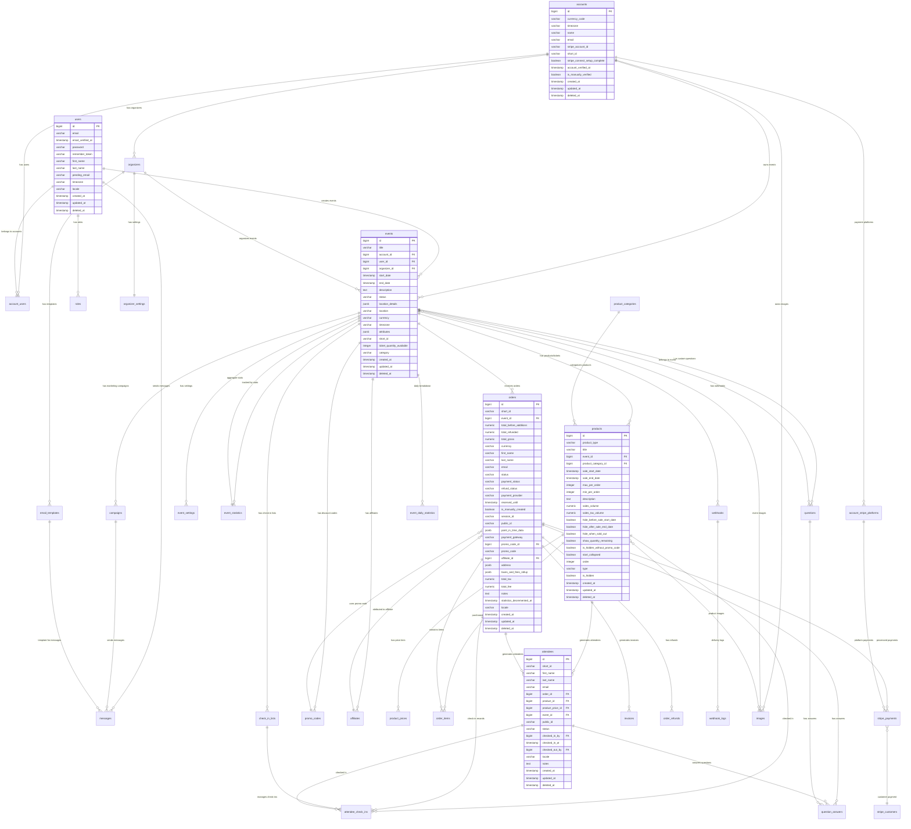
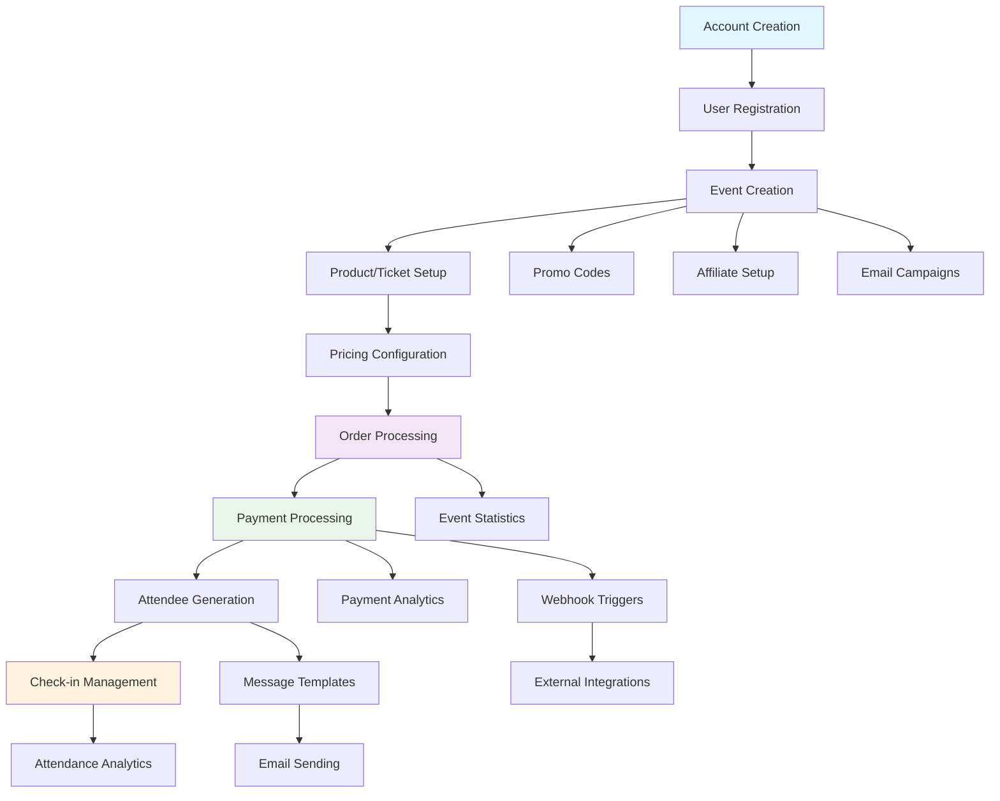
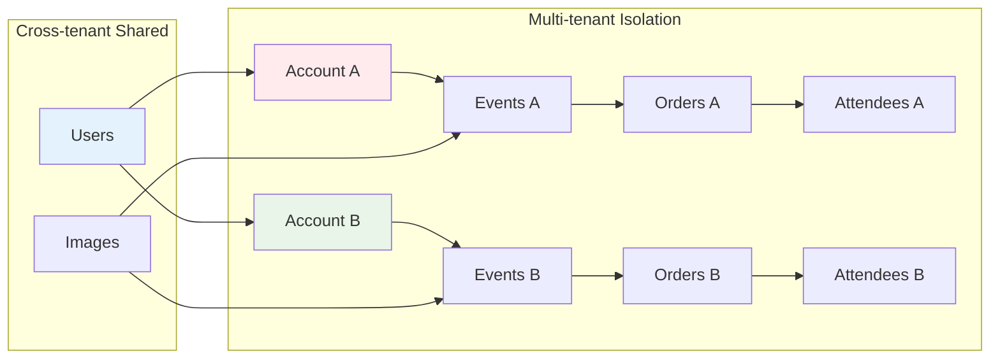

# 🎯 Hi.Events Database Schema Diagram

## Core Architecture Overview

## Business Flow Diagram

## Data Access Patterns

## Key Relationships Summary

### 1. **Multi-tenant Architecture**
- `accounts` → `events` (1:many)
- `accounts` → `account_users` (1:many)
- `users` → `account_users` (1:many)

### 2. **Event Management Flow**
- `events` → `products` → `product_prices` (1:many:many)
- `events` → `orders` → `order_items` (1:many:many)
- `orders` → `attendees` (1:many)

### 3. **Payment Processing**
- `orders` → `stripe_payments` (1:1)
- `stripe_payments` → `stripe_customers` (many:1)
- `orders` → `invoices` (1:1)

### 4. **Marketing & Analytics**
- `events` → `campaigns` → `messages` (1:many:many)
- `events` → `event_statistics` (1:1)
- `events` → `promo_codes` (1:many)

### 5. **Check-in & Attendance**
- `events` → `check_in_lists` → `attendee_check_ins` (1:many:many)
- `attendees` → `attendee_check_ins` (1:many)

This schema supports a comprehensive event management platform with multi-tenancy, complex product structures, payment processing, marketing automation, and detailed analytics! 🚀
