# 🗺️ EventOS Master Entity Relationship Diagram

**Database Evolution:** Phase 0 → Phase 3
**Total Tables:** 48 (13 existing + 35 new)
**Version:** 1.0
**Last Updated:** 2025-01-17

---

## 📊 Complete Database Architecture

This document provides the complete entity relationship diagram for EventOS across all implementation phases, showing how tables relate to each other and evolve from MVP to advanced AI-powered platform.

---

## 🎨 ERD Legend

### Table Categories by Phase

| **Phase** | **Color Code** | **Table Count** | **Features** |
|-----------|---------------|----------------|--------------|
| **Phase 0 (Current)** | 🟦 Blue | 13 tables | Core MVP + Event Wizard |
| **Phase 1 (Months 1-3)** | 🟩 Green | 9 tables | Content AI, Marketing, Analytics, Chatbot |
| **Phase 2 (Months 4-6)** | 🟨 Yellow | 12 tables | Personalization, Networking, Sponsors |
| **Phase 3 (Months 7-12)** | 🟥 Red | 14 tables | Computer Vision, Voice AI, Predictive, Orchestration |

### Relationship Types
- **One-to-Many:** →
- **Many-to-Many:** ↔
- **One-to-One:** ═

---

## 📐 High-Level Architecture Diagram

```mermaid
graph TB
    subgraph "Phase 0: Core Platform"
        Events[🟦 Events]
        Users[🟦 Users/Auth]
        Orders[🟦 Orders]
        Attendees[🟦 Attendees]
        Tickets[🟦 Tickets]
        Payments[🟦 Payments]
        Venues[🟦 Venues]
        TicketTiers[🟦 Ticket Tiers]
        Sessions[🟦 Event Sessions]
        Bookings[🟦 Venue Bookings]
        Marketing[🟦 Marketing Campaigns]
        EmailTemplates[🟦 Email Templates]
        Dashboards[🟦 Event Dashboards]
    end

    subgraph "Phase 1: Core AI"
        AIContent[🟩 AI Generated Content]
        Templates[🟩 Content Templates]
        GenHistory[🟩 Generation History]
        Engagements[🟩 Attendee Engagements]
        DashboardSnapshots[🟩 Dashboard Metrics Snapshots]
        ChatLogs[🟩 Chatbot Logs]
        FAQ[🟩 FAQ Library]
        Knowledge[🟩 Knowledge Base Articles]
        PredictiveModels[🟩 Predictive Models]
    end

    subgraph "Phase 2: Personalization & Networking"
        AttendeePrefs[🟨 Attendee Preferences]
        SessionEmbeddings[🟨 Session Embeddings]
        AttendeeEmbeddings[🟨 Attendee Embeddings]
        RecommendHistory[🟨 Recommendation History]
        InteractionEvents[🟨 Interaction Events]
        NetworkingPrefs[🟨 Networking Preferences]
        Matches[🟨 Matches]
        Meetings[🟨 Meetings]
        ConnectionGoals[🟨 Connection Goals]
        Sponsors[🟨 Sponsors]
        Proposals[🟨 Sponsor Proposals]
        LeadScores[🟨 Sponsor Lead Scores]
    end

    subgraph "Phase 3: Advanced AI"
        FacialData[🟥 Facial Recognition Data]
        CheckInLogs[🟥 Check-in Logs]
        CrowdAnalytics[🟥 Crowd Analytics]
        Transcripts[🟥 Session Transcripts]
        TranslationCache[🟥 Translation Cache]
        SentimentScores[🟥 Sentiment Scores]
        Predictions[🟥 Predictions]
        Insights[🟥 Automated Insights]
        AgentMemory[🟥 Agent Memory]
        AgentTasks[🟥 Agent Tasks]
    end

    Events --> Orders
    Events --> Attendees
    Events --> Tickets
    Events --> Sessions
    Events --> AIContent
    Events --> Engagements
    Events --> Matches
    Events --> Sponsors
    Events --> CrowdAnalytics
    Events --> Transcripts

    Attendees --> AttendeePrefs
    Attendees --> AttendeeEmbeddings
    Attendees --> NetworkingPrefs
    Attendees --> FacialData
    Attendees --> SentimentScores

    Sessions --> SessionEmbeddings
    Sessions --> Transcripts

    Users -.-> Events
    Users -.-> Orders
    Users -.-> Attendees
```

---

## 🔷 Phase 0: Core Platform (13 Tables)

### Core Tables

### Event Wizard Tables

---

## 🟩 Phase 1: Core AI Features (9 Tables)

### Content AI & Marketing

### Analytics & Engagement

### Chatbot & Support

---

## 🟨 Phase 2: Personalization & Networking (12 Tables)

### Personalization Engine

### Networking & Matchmaking

### Sponsor Management

---

## 🟥 Phase 3: Advanced AI (14 Tables)

### Computer Vision & Onsite Intelligence

### Voice AI & Translation

### Sentiment & Emotion Analysis

### Predictive Analytics & AI Orchestration

---

## 🔗 Cross-Phase Relationships

### Key Integration Points

---

## 📊 Database Statistics

### Table Count by Phase

| **Phase** | **Tables** | **Cumulative** | **% of Total** |
|-----------|-----------|---------------|----------------|
| Phase 0 (Current) | 13 | 13 | 27% |
| Phase 1 (AI Core) | +9 | 22 | 46% |
| Phase 2 (Personalization) | +12 | 34 | 71% |
| Phase 3 (Advanced AI) | +14 | 48 | 100% |

### Estimated Database Size

| **Metric** | **Phase 0** | **Phase 1** | **Phase 2** | **Phase 3** |
|------------|------------|------------|------------|------------|
| **Tables** | 13 | 22 | 34 | 48 |
| **Indexes** | 84 | ~130 | ~200 | ~250 |
| **Functions** | 20 | ~35 | ~50 | ~60 |
| **Triggers** | 21 | ~30 | ~40 | ~50 |
| **RLS Policies** | 54 | ~79 | ~114 | ~159 |
| **Rows/Month** | 100K | 250K | 500K | 1M+ |
| **Storage Growth** | 500 MB | 1.2 GB | 2.5 GB | 5+ GB |

---

## 🔐 Security Architecture

### RLS Policy Coverage

Every table has Row Level Security policies ensuring:

1. **Multi-tenant Isolation:** Users only see their own events
2. **Role-based Access:** Different permissions for organizers, attendees, admins
3. **Data Privacy:** Personal data only accessible to authorized users
4. **Biometric Protection:** Facial recognition data heavily restricted
5. **Audit Trail:** All sensitive access logged

### Sensitive Data Tables

| **Table** | **Sensitivity** | **Protection** |
|-----------|----------------|----------------|
| **facial_recognition_data** | CRITICAL | Encrypted, consent required, auto-expire |
| **sponsor_lead_scores** | HIGH | Sponsor-only access, attendee anonymized |
| **attendee_embeddings** | HIGH | Never exposed to frontend, server-only |
| **agent_memory** | MEDIUM | System access only, no user exposure |
| **sentiment_scores** | MEDIUM | Aggregated only, no individual tracking |

---

## 📈 Performance Optimization Strategy

### Indexing Strategy

| **Table Type** | **Index Type** | **Purpose** |
|---------------|---------------|------------|
| **Core Tables** | B-tree on foreign keys | Fast joins |
| **Embedding Tables** | IVFFlat vector indexes | Fast similarity search |
| **Time-series Tables** | BRIN on timestamps | Efficient range queries |
| **JSON Tables** | GIN on JSONB columns | Fast JSON queries |
| **Text Search** | GIN on tsvector | Full-text search |

### Partitioning Strategy (Future)

Tables that will benefit from partitioning:

- **check_in_logs:** Partition by event_id
- **attendee_engagements:** Partition by timestamp (monthly)
- **chatbot_logs:** Partition by timestamp (monthly)
- **sentiment_scores:** Partition by timestamp (weekly during events)

---

## 🎯 Migration Path

### Phase 0 → Phase 1

**New Tables:** 9
**Modified Tables:** 3 (marketing_campaigns, email_templates, event_dashboards)
**New Indexes:** ~46
**Estimated Downtime:** 0 minutes (all additive)

### Phase 1 → Phase 2

**New Tables:** 12
**Modified Tables:** 2 (attendees, orders)
**New Indexes:** ~70
**New Extensions:** pgvector
**Estimated Downtime:** 5 minutes (for pgvector installation)

### Phase 2 → Phase 3

**New Tables:** 14
**Modified Tables:** 0
**New Indexes:** ~50
**Estimated Downtime:** 0 minutes (all additive)

---

## 📝 Database Maintenance

### Recommended Practices

| **Task** | **Frequency** | **Purpose** |
|----------|--------------|------------|
| **VACUUM ANALYZE** | Daily | Reclaim space, update statistics |
| **Reindex** | Weekly | Maintain index performance |
| **Backup** | Hourly incremental, Daily full | Disaster recovery |
| **Monitor Query Performance** | Continuous | Identify slow queries |
| **Update Statistics** | After bulk operations | Query planner accuracy |
| **Archive Old Data** | Monthly | Keep database size manageable |

---

## 🎉 Conclusion

This master ERD represents the complete evolution of EventOS from a solid MVP platform to a comprehensive AI-powered event ecosystem. The database architecture is designed for:

✅ **Scalability:** Handles millions of rows efficiently
✅ **Security:** Multi-layer RLS and encryption
✅ **Performance:** Optimized indexes and queries
✅ **Flexibility:** JSONB for evolving requirements
✅ **AI-Ready:** Vector embeddings and ML integration
✅ **Compliance:** Privacy-first design with consent management

**The foundation is rock-solid. The future is intelligent. The architecture is ready.**

---

**Document Version:** 1.0
**Last Updated:** 2025-01-17
**Status:** ✅ Complete
**Previous:** [04-ADVANCED_IMPLEMENTATION_STRATEGY.md](./04-ADVANCED_IMPLEMENTATION_STRATEGY.md)
**Next:** [06-FLOW_DIAGRAMS.md](./06-FLOW_DIAGRAMS.md)
