# 🔄 EventOS Flow Diagrams & System Charts

**Purpose:** Visual representation of user journeys, data flows, and system interactions
**Version:** 1.0
**Last Updated:** 2025-01-17

---

## 📋 Table of Contents

1. [User Journey Flows](#user-journey-flows)
2. [Data Flow Diagrams](#data-flow-diagrams)
3. [Automation Workflows](#automation-workflows)
4. [AI Agent Interactions](#ai-agent-interactions)
5. [System Architecture](#system-architecture)
6. [Integration Flows](#integration-flows)

---

## 👤 User Journey Flows

### 1. Event Organizer Journey: Create Event with AI

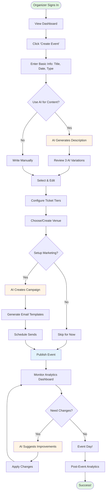

### 2. Attendee Journey: Discover & Register

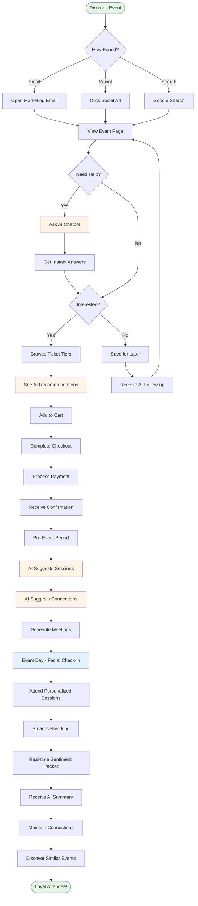

### 3. Sponsor Journey: Maximize ROI

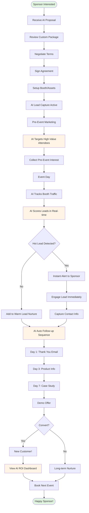

---

## 📊 Data Flow Diagrams

### 1. Content Generation Data Flow

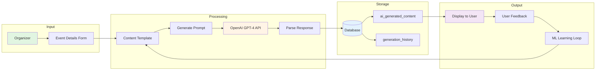

### 2. Real-time Analytics Data Flow

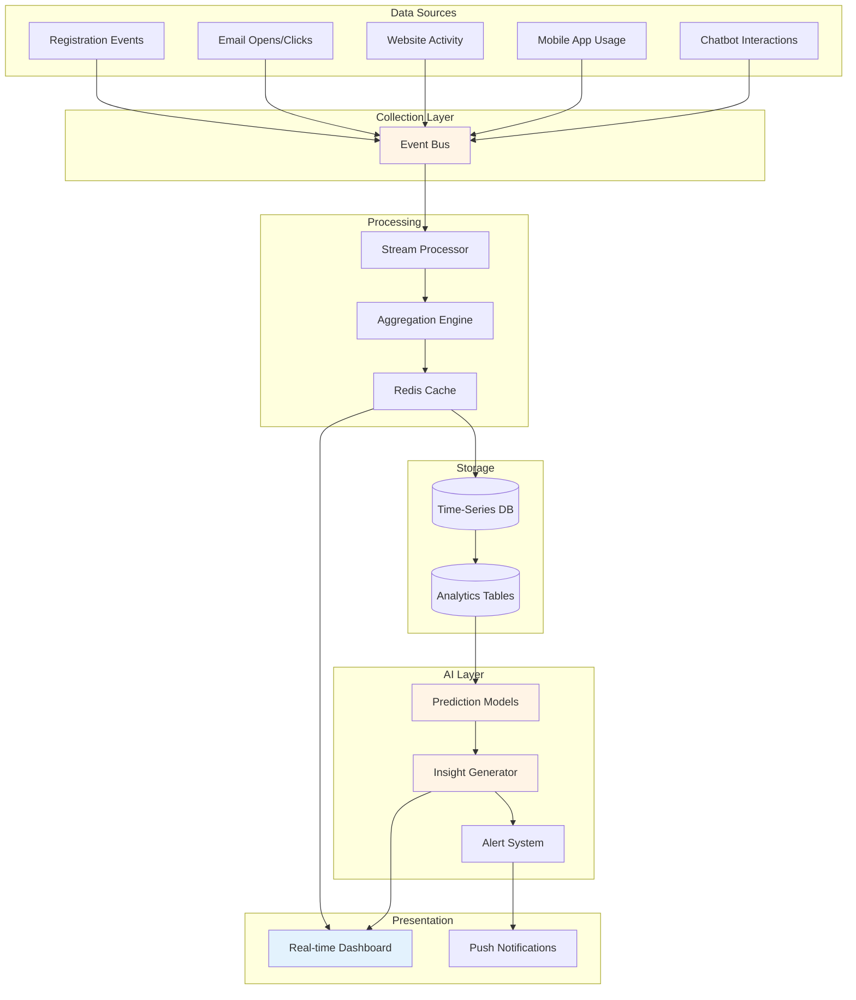

### 3. Personalization Engine Data Flow

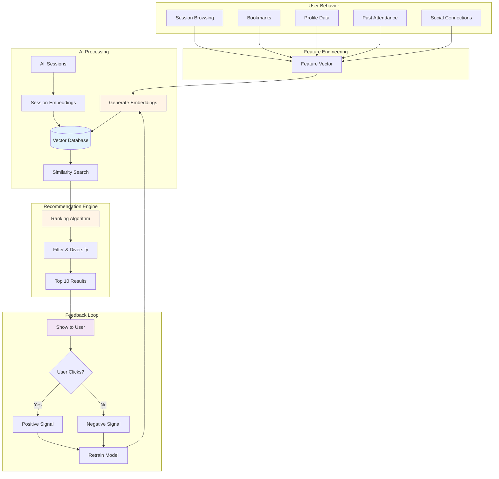

---

## 🤖 Automation Workflows

### 1. Marketing Campaign Automation

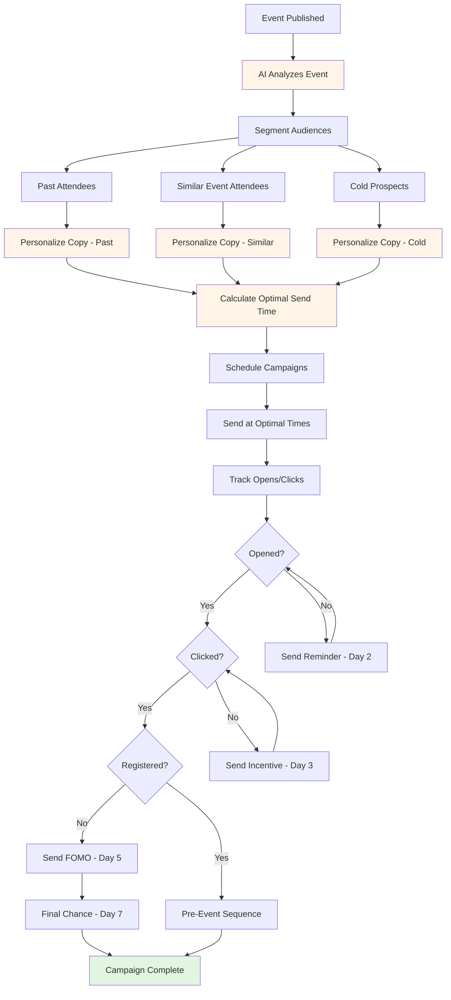

### 2. Attendee Support Automation

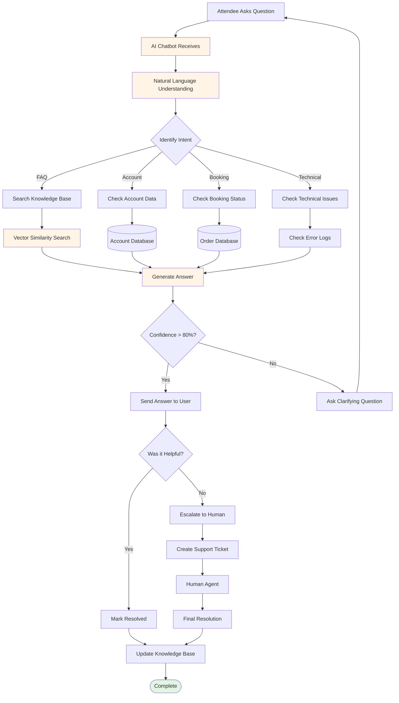

### 3. Sponsor Lead Automation

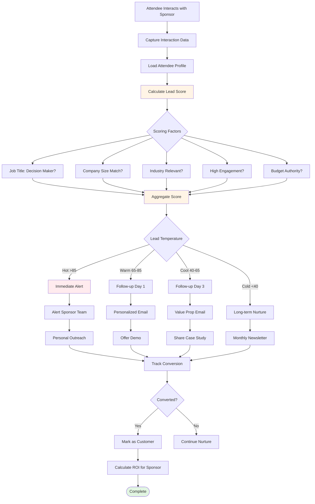

---

## 🤖 AI Agent Interactions

### Multi-Agent Collaboration Example

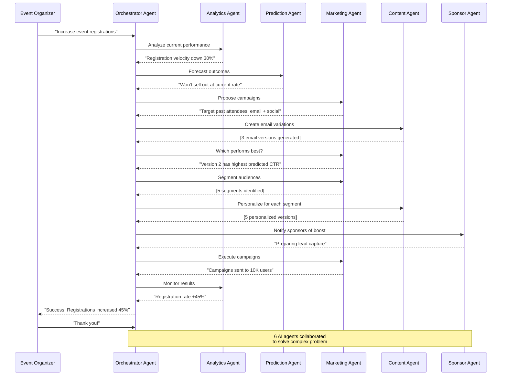

---

## 🏗️ System Architecture

### High-Level System Architecture

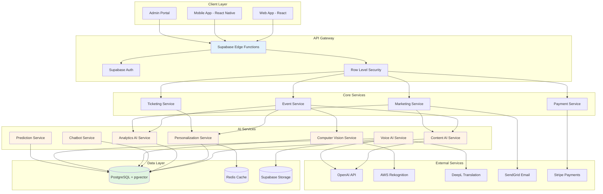

### Microservices Communication Pattern

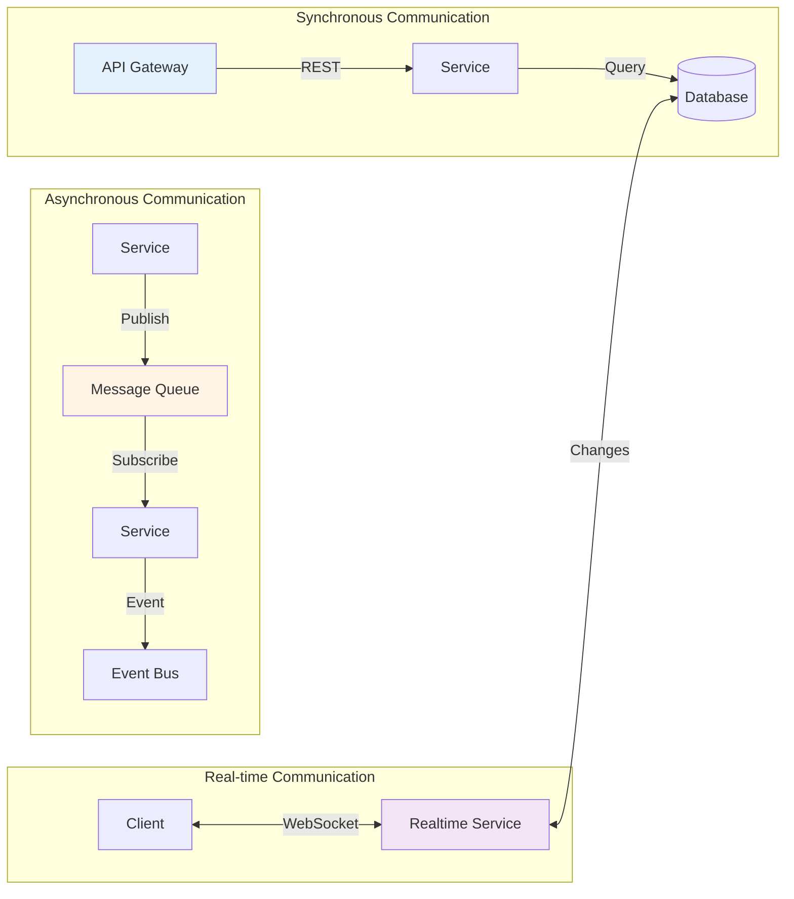

---

## 🔌 Integration Flows

### 1. OpenAI Integration Flow

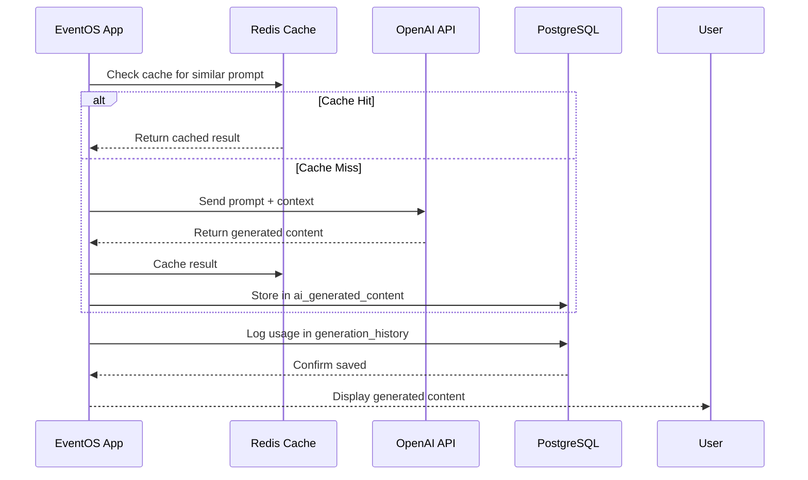

### 2. Payment Processing Flow

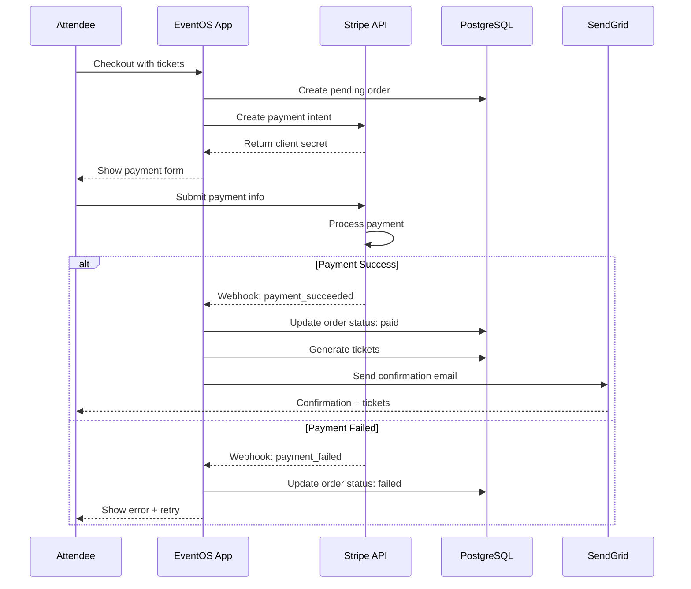

### 3. Facial Recognition Check-in Flow

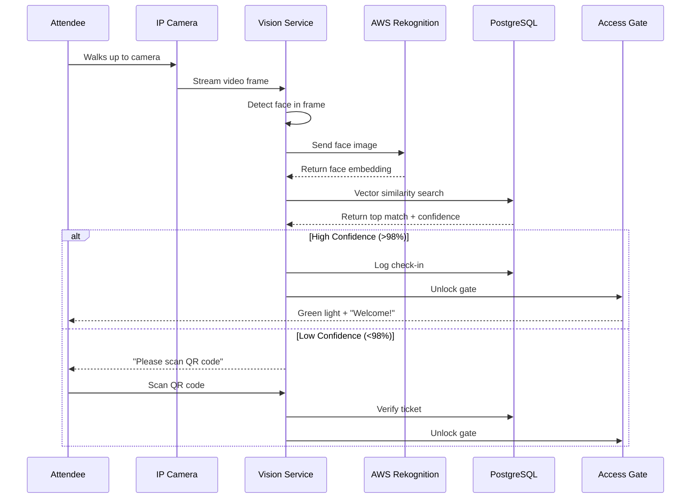

---

## 📈 Performance Monitoring Flow

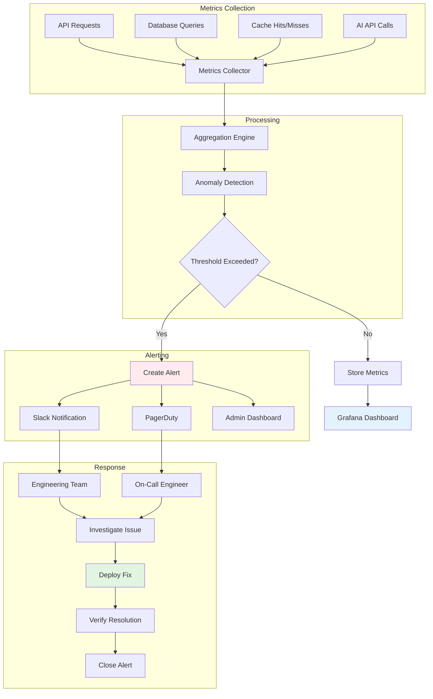

---

## 🎯 Implementation Sequence

### Phase Rollout Sequence

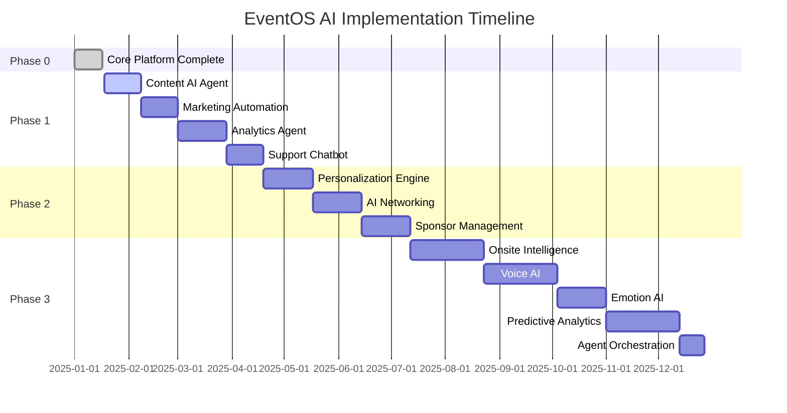

---

## 🎉 Conclusion

These flow diagrams illustrate:

✅ **User Journeys:** How different users interact with EventOS
✅ **Data Flows:** How data moves through the system
✅ **Automation:** How AI agents automate complex workflows
✅ **Architecture:** How services are structured and communicate
✅ **Integrations:** How external services are integrated
✅ **Monitoring:** How system health is maintained

**Every journey is designed for simplicity. Every flow is optimized for performance. Every agent is coordinated for intelligence.**

---

**Document Version:** 1.0
**Last Updated:** 2025-01-17
**Status:** ✅ Complete
**Previous:** [05-MASTER_ERD_DIAGRAM.md](./05-MASTER_ERD_DIAGRAM.md)

---

## 📚 Complete Planning Suite

Congratulations! You've completed all planning documents:

1. ✅ [01-MASTER_PLAN_OVERVIEW.md](./01-MASTER_PLAN_OVERVIEW.md) - Strategic overview
2. ✅ [02-CORE_IMPLEMENTATION_STRATEGY.md](./02-CORE_IMPLEMENTATION_STRATEGY.md) - Phase 1 details
3. ✅ [03-INTERMEDIATE_IMPLEMENTATION_STRATEGY.md](./03-INTERMEDIATE_IMPLEMENTATION_STRATEGY.md) - Phase 2 details
4. ✅ [04-ADVANCED_IMPLEMENTATION_STRATEGY.md](./04-ADVANCED_IMPLEMENTATION_STRATEGY.md) - Phase 3 details
5. ✅ [05-MASTER_ERD_DIAGRAM.md](./05-MASTER_ERD_DIAGRAM.md) - Database architecture
6. ✅ [06-FLOW_DIAGRAMS.md](./06-FLOW_DIAGRAMS.md) - System flows and interactions

**Your EventOS AI transformation is fully planned and ready for implementation!** 🚀
